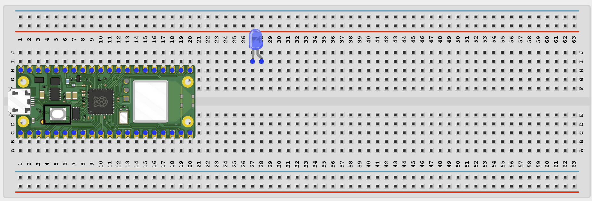
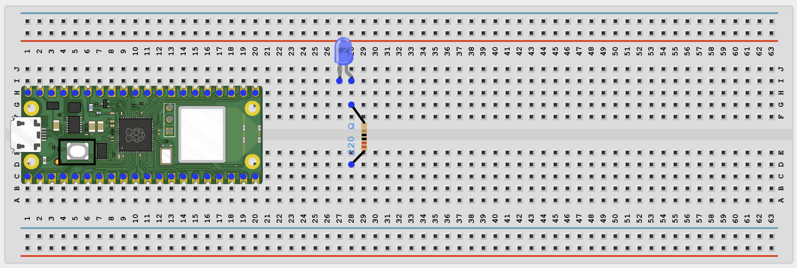
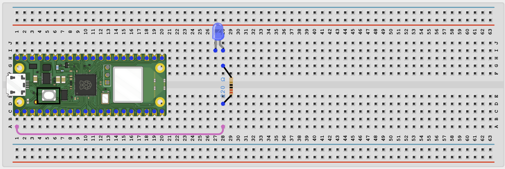
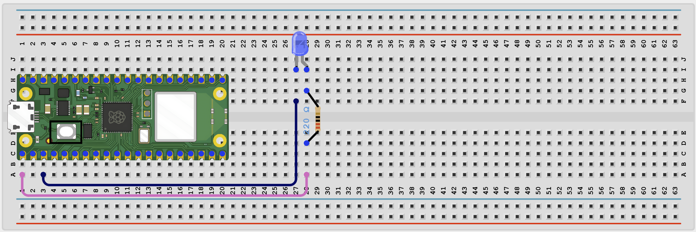

# Web Led Brightness Controller

# Overview

Build a web-controlled LED dimmer using PWM and the Pico 2 W.

This project demonstrates controlling brightness from a browser by converting percentage values into PWM duty cycles.

The final result should open a web page where a slider and preset buttons change the LED brightness.

# Required Components

|  |  |  |  |
| --- | --- | --- | --- |
|  Raspberry Pi Pico 2 W |  LED |  220Ω resistor |  Breadboard |
|  Jumper wires | 2.4 GHz Wi-Fi network | Phone or computer browser |  |

# Circuit Connections

| Component Pin | Connects To | Pico GPIO / Physical Pin Number | Notes |
| --- | --- | --- | --- |
| LED anode (+) | 220Ω resistor then GPIO 0 | GPIO 0 / physical pin 1 | PWM output |
| LED cathode (-) | GND | Physical pin 38 |  |

# Step-by-Step Assembly

### Step 1: Place the Raspberry Pi Pico 2W

Place the Raspberry Pi Pico 2W on the breadboard so it sits across the center gap.
Keep the USB port facing outward so you can easily connect it to your computer.

### Step 2: Place the LED

Place the LED on the breadboard with its two legs in different rows.

The long leg is the anode (+).

The short leg is the cathode (-).

### Step 3: Add the 220Ω Resistor

Connect the LED long leg to one end of the 220Ω resistor.

The resistor protects the LED and the Pico GPIO pin.

### Step 4: Connect the LED to GPIO 0

Connect the free end of the 220Ω resistor to GPIO 0.

This pin controls the LED brightness from the web page.

### Step 5: Connect the LED Short Leg to GND

Connect the LED short leg to GND.

## Wiring Check

✓ Pico 2W is placed correctly across the breadboard center gap

✓ LED long leg connects through a 220Ω resistor to GPIO 0

✓ LED short leg connects to GND

✓ No loose jumper wires

## Beginner Note

PWM changes LED brightness by switching the LED on and off very quickly.

# Testing Individual Components

Before running the full project, test each part separately. This makes it easier to find wiring or code problems.

## LED PWM test

Check that the LED can dim before adding Wi-Fi code.

| from machine import PWM, Pin
import time
led = PWM(Pin(0))
led.freq(1000)
for duty in (0, 16000, 32000, 48000, 65535, 0):
    led.duty_u16(duty)
    time.sleep(0.7) |
| --- |

Expected test result: The LED should step through several brightness levels.

## Wi-Fi connection test

Check that the Pico connects to Wi-Fi and prints its IP address.

| import network
import time
SSID = 'YOUR_WIFI_NAME'
PASSWORD = 'YOUR_WIFI_PASSWORD'
wlan = network.WLAN(network.STA_IF)
wlan.active(True)
wlan.connect(SSID, PASSWORD)
for _ in range(15):
    if wlan.isconnected():
        break
    print('Connecting...')
    time.sleep(1)
print('Connected:', wlan.isconnected())
if wlan.isconnected():
    print('IP address:', wlan.ifconfig()[0]) |
| --- |

Expected test result: The Shell should show Connected: True and print an IP address.

# Full Project Code

Upload and run this code after the individual tests work correctly.

| import network
import socket
import time
from machine import Pin, PWM

SSID = 'YOUR_WIFI_NAME'
PASSWORD = 'YOUR_WIFI_PASSWORD'

led = PWM(Pin(0))
led.freq(1000)
brightness = 50

def set_brightness(percent):
    percent = max(0, min(100, percent))
    duty = int((percent / 100) * 65535)
    led.duty_u16(duty)
    return percent

brightness = set_brightness(brightness)

wlan = network.WLAN(network.STA_IF)
wlan.active(True)
wlan.connect(SSID, PASSWORD)

print('Connecting to Wi-Fi...')
for _ in range(15):
    if wlan.isconnected():
        break
    time.sleep(1)

if not wlan.isconnected():
    raise RuntimeError('Wi-Fi connection failed')

ip_address = wlan.ifconfig()[0]
print('Connected. Open http://{} in your browser'.format(ip_address))

def web_page(level):
    return '''<!DOCTYPE html>
<html>
<head><meta name='viewport' content='width=device-width, initial-scale=1'><title>LED Brightness</title></head>
<body style='font-family:Arial;text-align:center;padding:40px'>
    <h1>Web LED Brightness</h1>
    
Brightness: LEVEL_TEXT%

    <form>
        <input type='range' name='bright' min='0' max='100' value='LEVEL_TEXT' onchange='this.form.submit()' style='width:80%'>
    </form>
    
Quick presets:

    <a href='/?bright=0'><button>0%</button></a>
    <a href='/?bright=25'><button>25%</button></a>
    <a href='/?bright=50'><button>50%</button></a>
    <a href='/?bright=75'><button>75%</button></a>
    <a href='/?bright=100'><button>100%</button></a>
</body>
</html>'''.replace('LEVEL_TEXT', str(level))

address = socket.getaddrinfo('0.0.0.0', 80)[0][-1]
server = socket.socket()
server.bind(address)
server.listen(1)

while True:
    client, client_address = server.accept()
    print('Client connected from', client_address)
    request = client.recv(1024).decode()

    if 'bright=' in request:
        try:
            start = request.find('bright=') + 7
            end = request.find(' ', start)
            brightness = set_brightness(int(request[start:end].split('&')[0]))
            print('Brightness set to', brightness, '%')
        except ValueError:
            pass

    response = web_page(brightness)
    client.send('HTTP/1.1 200 OK\r\nContent-Type: text/html\r\nConnection: close\r\n\r\n'.encode())
    client.sendall(response.encode())
    client.close() |
| --- |

# How the Code Works

| Code Section | What It Does | Why It Matters |
| --- | --- | --- |
| PWM setup | Creates a PWM output on GPIO 0 | PWM is what makes brightness control possible |
| set_brightness() | Converts a percentage into a 16-bit PWM duty value | The LED uses duty cycle, not percent directly |
| Slider value in URL | Reads the bright value from the browser request | This is how the web page sends the chosen brightness |
| Preset buttons | Send common brightness values quickly | These are easy shortcuts for beginners to test |

# Expected Result

After entering your Wi-Fi details and running the code, the Shell should print an IP address. Opening that address in a browser should show a slider and preset buttons. Moving the slider or using the buttons should change the LED brightness.

# Troubleshooting

| Problem | Possible Cause | Solution |
| --- | --- | --- |
| LED does not change brightness | LED wiring is wrong or PWM output is not set | Run the LED PWM test first and recheck GPIO 0 wiring |
| LED flickers | PWM frequency is too low or wiring is loose | Keep the PWM frequency at 1000 Hz and recheck the connections |
| Slider does nothing | The bright value is not being parsed correctly | Watch the Shell for brightness messages and recheck the URL parsing code |

# Next Project

Project 46: Cloud Timer Switch
