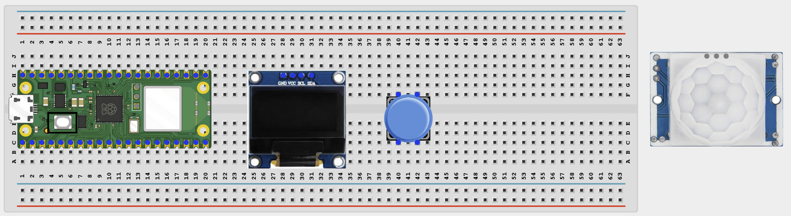
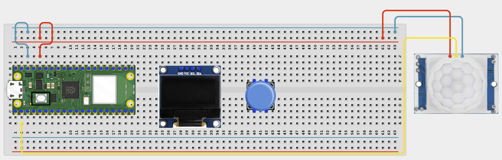
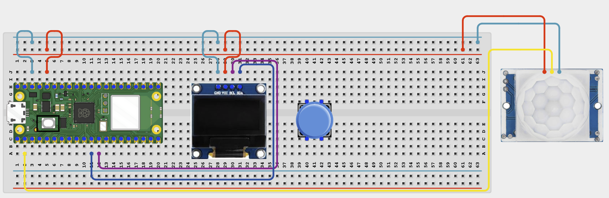
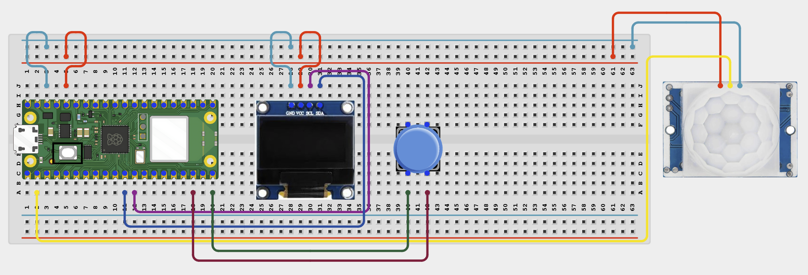

# Project 1.10.2

## Web Motion Counter

# Overview

Build a motion counter that shows the count on both an OLED display and a local web page.

This project demonstrates edge detection, counting events, and showing the same result in two interfaces.

The final result should count each new motion event once, show the count on the OLED, and allow reset from a button or the browser.

# Required Components

|  |  |  |  |
| --- | --- | --- | --- |
| <br>Raspberry Pi Pico 2 W | PIR motion sensor | <br>SH1106 OLED display | <br>Push button |
| <br>Breadboard | <br>Jumper wires | 2.4 GHz Wi-Fi network | Phone or computer browser |


# Circuit Connections

| Component Pin | Connects To | Pico GPIO / Physical Pin Number | Notes |
| --- | --- | --- | --- |
| PIR VCC | 3.3V or module-safe supply | Physical pin 36 | Start with 3.3V if your module supports it |
| PIR GND | GND | Physical pin 38 |  |
| PIR OUT | GPIO 1 | GPIO 1 / physical pin 2 | 3.3V logic only |
| OLED VCC | 3.3V | Physical pin 36 |  |
| OLED GND | GND | Physical pin 38 |  |
| OLED SDA | GPIO 8 | GPIO 8 / physical pin 11 | I2C0 SDA |
| OLED SCL | GPIO 9 | GPIO 9 / physical pin 12 | I2C0 SCL |
| Reset button leg 1 | GPIO 15 | GPIO 15 / physical pin 20 | Use internal pull-up |
| Reset button opposite leg | GND | Physical pin 38 |  |

# Step-by-Step Assembly

### Step 1: Place the Raspberry Pi Pico 2W

Place the Raspberry Pi Pico 2W on the breadboard so it sits across the center gap.
Keep the USB port facing outward so you can easily connect it to your computer.


### Step 2: Place the PIR Sensor, OLED, and Reset Button

Place the PIR sensor so the white dome faces the area you want to test.

Place the SH1106 OLED display module on the breadboard.

Place the reset push button across the breadboard center gap.

Identify PIR VCC, OUT, and GND before wiring.



### Step 3: Connect PIR Power and Signal

Connect PIR VCC to 3.3V if your module supports it.

Connect PIR GND to GND.

Connect PIR OUT to GPIO 1.



### Step 4: Connect OLED Power and I2C

Connect OLED VCC to 3.3V.

Connect OLED GND to GND.

Connect OLED SDA to GPIO 8.

Connect OLED SCL to GPIO 9.



### Step 5: Connect the Reset Button

Connect one reset button leg to GPIO 15.

Connect the opposite reset button leg to GND.



## Wiring Check

✓ Pico 2W is placed correctly across the breadboard center gap

✓ PIR VCC connects to 3.3V or a module-safe supply

✓ PIR GND connects to GND

✓ PIR OUT connects to GPIO 1

✓ OLED VCC connects to 3.3V

✓ OLED GND connects to GND

✓ OLED SDA connects to GPIO 8

✓ OLED SCL connects to GPIO 9

✓ Reset button connects to GPIO 15 and GND

✓ No loose jumper wires

## Beginner Note

PIR sensors need a warm-up time after power-on. Wait briefly before testing motion counts.

## Safety Note

The PIR OUT pin must be 3.3V safe before it connects to the Pico GPIO pin.

# Testing Individual Components

Before running the full project, test each part separately. This makes it easier to find wiring or code problems.

## PIR sensor test

Check that the PIR sensor detects motion before running the full counter project.

```python
from machine import Pin
import time
pir = Pin(1, Pin.IN)
print('Wait 15 seconds for PIR warm-up')
time.sleep(15)
while True:
    print('Motion' if pir.value() else 'No motion')
    time.sleep(0.5)
```

Expected test result: The Shell should print Motion when movement is detected after the warm-up period.

## Reset button test

Check that the reset button reads correctly.

```python
from machine import Pin
import time
button = Pin(15, Pin.IN, Pin.PULL_UP)
while True:
    print('Pressed' if button.value() == 0 else 'Released')
    time.sleep(0.2)
```

Expected test result: The Shell should change between Released and Pressed.

## OLED text test

Check that the OLED driver works.

```python
from machine import I2C, Pin
import sh1106
i2c = I2C(0, sda=Pin(8), scl=Pin(9), freq=400000)
oled = sh1106.SH1106_I2C(128, 64, i2c)
oled.fill(0)
oled.text('Motion Counter', 4, 28, 1)
oled.show()
```

Expected test result: The OLED should show Motion Counter.

## Wi-Fi connection test

Check that the Pico connects to Wi-Fi and prints its IP address.

```python
import network
import time
SSID = 'YOUR_WIFI_NAME'
PASSWORD = 'YOUR_WIFI_PASSWORD'
wlan = network.WLAN(network.STA_IF)
wlan.active(True)
wlan.connect(SSID, PASSWORD)
for _ in range(15):
    if wlan.isconnected():
        break
    print('Connecting...')
    time.sleep(1)
print('Connected:', wlan.isconnected())
if wlan.isconnected():
    print('IP address:', wlan.ifconfig()[0])
```

Expected test result: The Shell should show Connected: True and print an IP address.

# Full Project Code

Upload and run this code after the individual tests work correctly.

```python
import network
import socket
import time
from machine import I2C, Pin
import sh1106

SSID = 'YOUR_WIFI_NAME'
PASSWORD = 'YOUR_WIFI_PASSWORD'

pir = Pin(1, Pin.IN)
reset_btn = Pin(15, Pin.IN, Pin.PULL_UP)
motion_count = 0
last_pir_state = 0

i2c = I2C(0, sda=Pin(8), scl=Pin(9), freq=400000)
oled = sh1106.SH1106_I2C(128, 64, i2c)

wlan = network.WLAN(network.STA_IF)
wlan.active(True)
wlan.connect(SSID, PASSWORD)

print('Connecting to Wi-Fi...')
for _ in range(15):
    if wlan.isconnected():
        break
    time.sleep(1)

if not wlan.isconnected():
    raise RuntimeError('Wi-Fi connection failed')

ip_address = wlan.ifconfig()[0]
print('Connected. Open http://{} in your browser'.format(ip_address))
print('Wait 15 seconds for PIR warm-up')
time.sleep(15)


def update_oled(count):
    oled.fill(0)
    oled.text('Motion Counter', 4, 8, 1)
    oled.text('Count: {}'.format(count), 20, 32, 1)
    oled.show()


def web_page(count):
    return '''<!DOCTYPE html>
<html>
<head>
    <meta name='viewport' content='width=device-width, initial-scale=1'>
    <meta http-equiv='refresh' content='2'>
    <title>Motion Counter</title>
</head>
<body style='font-family:Arial;text-align:center;padding:40px'>
    <h1>Web Motion Counter</h1>
    <h2>{}</h2>
    <p><a href='/reset'><button>RESET</button></a></p>
</body>
</html>'''.format(count)


address = socket.getaddrinfo('0.0.0.0', 80)[0][-1]
server = socket.socket()
server.bind(address)
server.listen(1)
server.settimeout(0.2)

while True:
    current_pir = pir.value()
    if current_pir == 1 and last_pir_state == 0:
        motion_count += 1
        print('Motion detected! Count:', motion_count)
    last_pir_state = current_pir

    if reset_btn.value() == 0:
        motion_count = 0
        print('Counter reset by button')
        time.sleep(0.2)

    update_oled(motion_count)

    try:
        client, client_address = server.accept()
    except OSError:
        continue

    request = client.recv(1024).decode()
    if 'GET /reset' in request:
        motion_count = 0
        print('Counter reset from web')

    response = web_page(motion_count)
    client.send('HTTP/1.1 200 OK\r\nContent-Type: text/html\r\nConnection: close\r\n\r\n'.encode())
    client.sendall(response.encode())
    client.close()
```

# How the Code Works

| Code Section | What It Does | Why It Matters |
| --- | --- | --- |
| Edge detection | Counts only when the PIR signal changes from low to high | This prevents one motion period from being counted many times |
| Reset button | Lets the counter be cleared locally | Students can test the reset without opening the web page |
| OLED update | Shows the current motion count locally | The project is easy to read even without a browser |
| Web reset | Lets the count be cleared remotely from the page | This adds a second way to control the project |

# Expected Result

After entering your Wi-Fi details and running the code, the OLED and web page should show the motion count. Each new motion event should add 1 to the count. Pressing the reset button or the web RESET button should set the count back to zero.

# Troubleshooting

| Problem | Possible Cause | Solution |
| --- | --- | --- |
| Count rises too quickly | The PIR is retriggering or seeing too much movement | Reduce nearby motion and adjust your PIR module if possible |
| Count never changes | PIR output is not reaching the Pico | Check the OUT wire on GPIO 1 and wait for the warm-up time |
| RESET button does nothing | Wrong button wiring | Check that the button is between GPIO 15 and GND |
| Web page does not show updates | Browser is not refreshing or Wi-Fi is not connected | Check the IP address and watch the Shell output |
