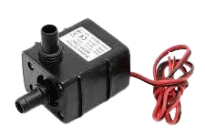
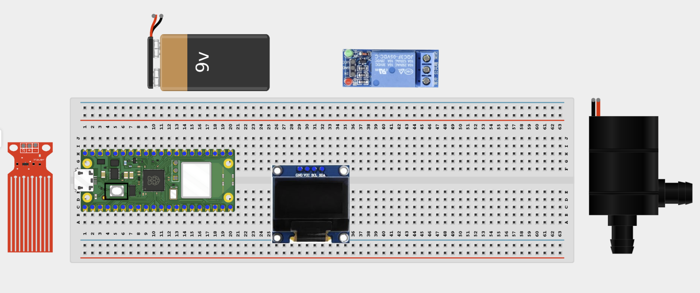
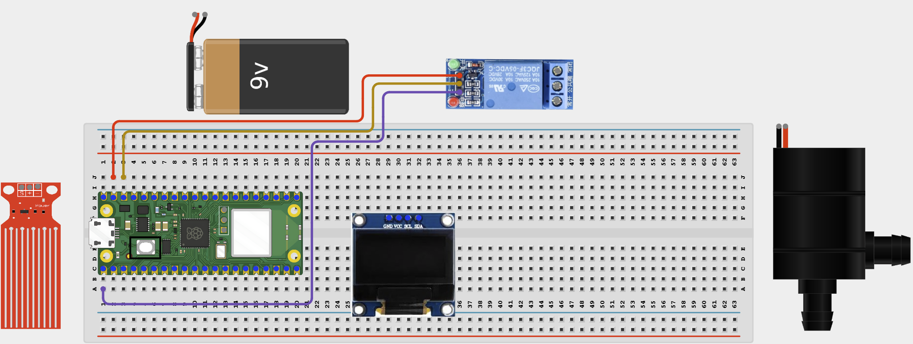
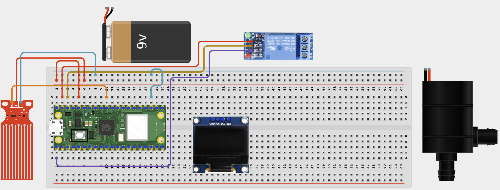
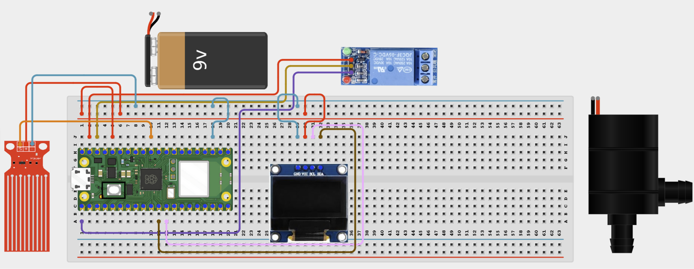
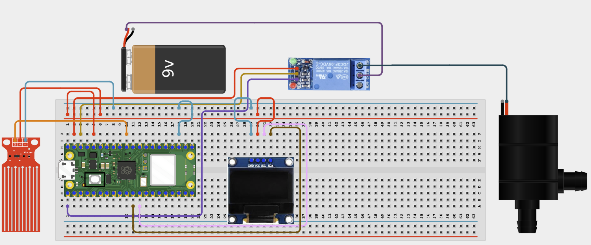
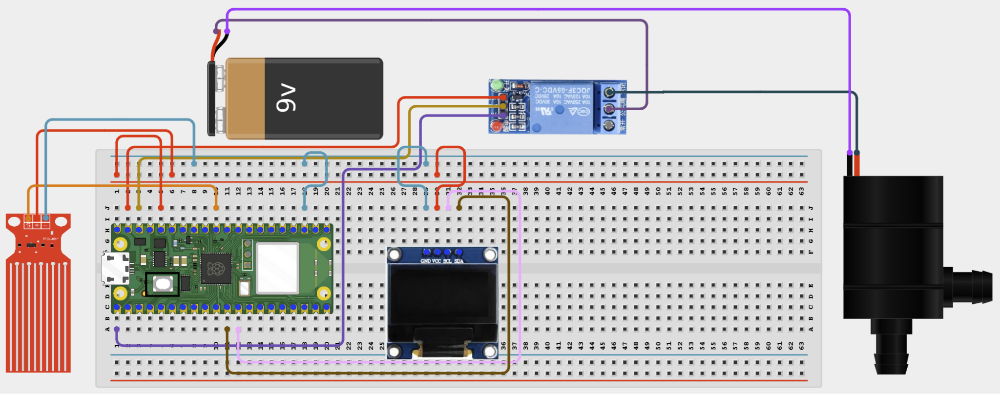

# Web Water Pump Controller

# Overview

Build a browser-controlled water pump with a water-level safety interlock.

This project demonstrates safe pump control with external power and a sensor that prevents the pump running when the water level is too low.

The final result should let you start or stop the pump from a browser while the safety logic turns it off automatically if the water level falls below the threshold.

# Required Components

|  |  |  |  |
| --- | --- | --- | --- |
|  Raspberry Pi Pico 2 W |  Small DC water pump |  1-channel relay module |  Water level sensor |
| 1N4007 diode |  SH1106 OLED display | External power supply |  Breadboard |
|  Jumper wires | 2.4 GHz Wi-Fi network | Phone or computer browser |  |

# Circuit Connections

| Component Pin | Connects To | Pico GPIO / Physical Pin Number | Notes |
| --- | --- | --- | --- |
| Relay VCC | 5V / VSYS | Physical pin 40 | Module power |
| Relay GND | GND | Physical pin 38 |  |
| Relay IN | GPIO 0 | GPIO 0 / physical pin 1 | Usually active-low |
| Water sensor VCC | 3.3V | Physical pin 36 |  |
| Water sensor GND | GND | Physical pin 38 |  |
| Water sensor AOUT | GPIO 26 | GPIO 26 / physical pin 31 | ADC input |
| OLED VCC | 3.3V | Physical pin 36 |  |
| OLED GND | GND | Physical pin 38 |  |
| OLED SDA | GPIO 8 | GPIO 8 / physical pin 11 | I2C0 SDA |
| OLED SCL | GPIO 9 | GPIO 9 / physical pin 12 | I2C0 SCL |
| External pump supply positive | Relay COM | Not a GPIO pin | Pump power input |
| Relay NO | Pump positive terminal | Not a GPIO pin | Power flows when relay is on |
| Pump negative terminal | External pump supply negative | Not a GPIO pin |  |

# Step-by-Step Assembly

### Step 1: Place the Raspberry Pi Pico 2W

Place the Raspberry Pi Pico 2W on the breadboard so it sits across the center gap.
Keep the USB port facing outward so you can easily connect it to your computer.

### Step 2: Place the Relay, Water Sensor, OLED, and Pump

Place the relay module on the breadboard or beside it where the pins are easy to reach.

Place the water level sensor so only the sensing area can touch water.

Place the SH1106 OLED display module on the breadboard.

Keep the pump and external pump supply separate from the Pico wiring.

### Step 3: Connect the Relay

Connect relay VCC to 5V / VSYS.

Connect relay GND to GND.

Connect relay IN to GPIO 0.

### Step 4: Connect the Water Sensor

Connect water sensor VCC to 3.3V.

Connect water sensor GND to GND.

Connect water sensor AOUT to GPIO 26.

### Step 5: Connect OLED Power and I2C

Connect OLED VCC to 3.3V.

Connect OLED GND to GND.

Connect OLED SDA to GPIO 8.

Connect OLED SCL to GPIO 9.

### Step 6: Wire Pump Power Through the Relay

Connect the external pump supply positive wire to relay COM.

Connect relay NO to the pump positive terminal.

Connect the pump negative terminal to the external pump supply negative wire.

### Step 7: Add the Flyback Diode

Connect pump negative terminal to external pump supply negative.

## Wiring Check

✓ Pico 2W is placed correctly across the breadboard center gap

✓ Relay VCC connects to 5V / VSYS

✓ Relay GND connects to GND

✓ Relay IN connects to GPIO 0

✓ Water sensor VCC connects to 3.3V

✓ Water sensor GND connects to GND

✓ Water sensor AOUT connects to GPIO 26

✓ OLED VCC connects to 3.3V

✓ OLED GND connects to GND

✓ OLED SDA connects to GPIO 8

✓ OLED SCL connects to GPIO 9

✓ External pump supply positive connects to relay COM

✓ Relay NO connects to pump positive terminal

✓ No loose jumper wires

## Safety Note

Do not power the pump directly from the Pico. Keep the Pico, breadboard, USB cable, and jumper wires dry and above the water container.

# Testing Individual Components

Before running the full project, test each part separately. This makes it easier to find wiring or code problems.

## Water level sensor test

Check that the sensor reading changes with water level.

| from machine import ADC, Pin
import time
adc = ADC(Pin(26))
while True:
    print(adc.read_u16())
    time.sleep(0.5) |
| --- |

Expected test result: The raw ADC value should change as the sensor gets wetter or drier.

## Relay click test

Check that the relay changes state before connecting the full pump system.

| from machine import Pin
import time
relay = Pin(0, Pin.OUT)
relay.value(1)
time.sleep(1)
relay.value(0)
time.sleep(1)
relay.value(1) |
| --- |

Expected test result: You should hear the relay click on and off.

## OLED text test

Check that the OLED driver works.

| from machine import I2C, Pin
import sh1106
i2c = I2C(0, sda=Pin(8), scl=Pin(9), freq=400000)
oled = sh1106.SH1106_I2C(128, 64, i2c)
oled.fill(0)
oled.text('Pump Monitor', 12, 28, 1)
oled.show() |
| --- |

Expected test result: The OLED should show Pump Monitor.

## Pump power test

Check the pump and external supply separately before the final build.

No code is needed for this test. Briefly connect the pump directly to the correct external supply to confirm it runs.

Expected test result: The pump should run briefly when connected directly to the correct external supply.

## Wi-Fi connection test

Check that the Pico connects to Wi-Fi and prints its IP address.

| import network
import time
SSID = 'YOUR_WIFI_NAME'
PASSWORD = 'YOUR_WIFI_PASSWORD'
wlan = network.WLAN(network.STA_IF)
wlan.active(True)
wlan.connect(SSID, PASSWORD)
for _ in range(15):
    if wlan.isconnected():
        break
    print('Connecting...')
    time.sleep(1)
print('Connected:', wlan.isconnected())
if wlan.isconnected():
    print('IP address:', wlan.ifconfig()[0]) |
| --- |

Expected test result: The Shell should show Connected: True and print an IP address.

# Full Project Code

Upload and run this code after the individual tests work correctly.

| import network
import socket
import time
from machine import ADC, I2C, Pin
import sh1106

SSID = 'YOUR_WIFI_NAME'
PASSWORD = 'YOUR_WIFI_PASSWORD'

relay = Pin(0, Pin.OUT)
relay.value(1)
adc = ADC(Pin(26))

DRY_VALUE = 2000
WET_VALUE = 50000
LOW_THRESHOLD = 20

pump_on = False
safety_triggered = False

i2c = I2C(0, sda=Pin(8), scl=Pin(9), freq=400000)
oled = sh1106.SH1106_I2C(128, 64, i2c)

def read_level_percent():
    raw = adc.read_u16()
    if raw <= DRY_VALUE:
        return raw, 0
    if raw >= WET_VALUE:
        return raw, 100
    percent = int((raw - DRY_VALUE) / (WET_VALUE - DRY_VALUE) * 100)
    return raw, percent

def apply_pump_state(is_on):
    relay.value(0 if is_on else 1)

def web_page(is_on, level_percent, safety_flag):
    status = 'ON' if is_on else 'OFF'
    safety_text = 'SAFETY STOP ACTIVE' if safety_flag else 'Safety OK'
    return '''<!DOCTYPE html>
<html>
<head>
    <meta name='viewport' content='width=device-width, initial-scale=1'>
    <meta http-equiv='refresh' content='2'>
    <title>Web Water Pump</title>
</head>
<body style='font-family:Arial;text-align:center;padding:30px'>
    <h1>Web Water Pump</h1>
    
Pump: {}

    
Water level: {}%

    
Low-level shutdown threshold: {}%

    
{}

    
<a href='/on'><button>ON</button></a> <a href='/off'><button>OFF</button></a>

</body>
</html>'''.format(status, level_percent, LOW_THRESHOLD, safety_text)

wlan = network.WLAN(network.STA_IF)
wlan.active(True)
wlan.connect(SSID, PASSWORD)

print('Connecting to Wi-Fi...')
for _ in range(15):
    if wlan.isconnected():
        break
    time.sleep(1)

if not wlan.isconnected():
    raise RuntimeError('Wi-Fi connection failed')

ip_address = wlan.ifconfig()[0]
print('Connected. Open http://{} in your browser'.format(ip_address))

address = socket.getaddrinfo('0.0.0.0', 80)[0][-1]
server = socket.socket()
server.bind(address)
server.listen(1)
server.settimeout(0.2)

while True:
    raw, level_percent = read_level_percent()

    if pump_on and level_percent < LOW_THRESHOLD:
        pump_on = False
        safety_triggered = True
        apply_pump_state(False)
        print('Safety stop: water level too low')

    oled.fill(0)
    oled.text('Water Pump', 18, 0, 1)
    oled.text('Level: {}%'.format(level_percent), 16, 20, 1)
    oled.text('Pump: {}'.format('ON' if pump_on else 'OFF'), 16, 40, 1)
    oled.text('SAFE' if not safety_triggered else 'SAFETY!', 26, 56, 1)
    oled.show()

    try:
        client, client_address = server.accept()
    except OSError:
        continue

    request = client.recv(1024).decode()
    if 'GET /on' in request:
        if level_percent >= LOW_THRESHOLD:
            pump_on = True
            safety_triggered = False
            apply_pump_state(True)
            print('Pump started from web')
        else:
            print('Pump start blocked: water too low')
    elif 'GET /off' in request:
        pump_on = False
        apply_pump_state(False)
        print('Pump stopped from web')

    response = web_page(pump_on, level_percent, safety_triggered)
    client.send('HTTP/1.1 200 OK\r\nContent-Type: text/html\r\nConnection: close\r\n\r\n'.encode())
    client.sendall(response.encode())
    client.close() |
| --- |

# How the Code Works

| Code Section | What It Does | Why It Matters |
| --- | --- | --- |
| read_level_percent() | Converts the water sensor reading into a percentage | The pump safety logic needs an easy-to-read level value |
| LOW_THRESHOLD | Sets the minimum safe water level | This prevents the pump running when the water is too low |
| safety_triggered | Stores whether a safety stop happened | The OLED and web page can explain why the pump is off |
| Web ON/OFF logic | Lets the browser control the pump when conditions are safe | The user gets remote control without removing the safety interlock |

# Expected Result

After entering your Wi-Fi details and running the code, the OLED and browser page should show the water level and pump state. Pressing ON in the browser should start the pump if the level is safe. If the level drops below the threshold, the pump should stop automatically and show a safety warning.

# Troubleshooting

| Problem | Possible Cause | Solution |
| --- | --- | --- |
| Pump will not start | Water level is below the threshold or wiring is wrong | Check the level reading on the OLED and recheck the relay and pump wiring |
| Level looks wrong | Calibration values do not match your sensor | Print raw ADC values and adjust DRY_VALUE and WET_VALUE |
| Pump never stops automatically | Threshold is too low or sensor does not change correctly | Raise LOW_THRESHOLD for testing and confirm sensor readings change |
| Water is too close to electronics | Unsafe setup | Move the Pico and breadboard to a higher, drier position |

# Next Project

Project 58: Rain Alert System
