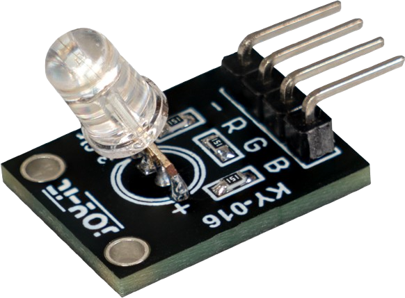

# Project 1.11.1

## IoT Alarm Clock

# Overview

Build an internet-synced alarm clock with an OLED display, an active buzzer, an RGB LED, and two buttons.

This project demonstrates time sync, time-based events, local visual feedback, and snooze or stop control.

The final result should show the current time and alarm time on the OLED, sound an alarm at the chosen time, and let the user snooze or stop it.

# Required Components

|  |  |  |  |
| --- | --- | --- | --- |
|  Raspberry Pi Pico 2 W |  SH1106 OLED display |  Active buzzer |  RGB LED (common cathode) |
|  Push buttons |  Breadboard |  Jumper wires | 2.4 GHz Wi-Fi network |

# Circuit Connections

| Component Pin | Connects To | Pico GPIO / Physical Pin Number | Notes |
| --- | --- | --- | --- |
| OLED VCC | 3.3V | Physical pin 36 |  |
| OLED GND | GND | Physical pin 38 |  |
| OLED SDA | GPIO 8 | GPIO 8 / physical pin 11 | I2C0 SDA |
| OLED SCL | GPIO 9 | GPIO 9 / physical pin 12 | I2C0 SCL |
| Buzzer positive (+) | GPIO 0 | GPIO 0 / physical pin 1 |  |
| Buzzer negative (-) | GND | Physical pin 38 |  |
| RGB LED red leg | GPIO 14 | GPIO 14 / physical pin 19 | Common cathode LED |
| RGB LED green leg | GPIO 15 | GPIO 15 / physical pin 20 | Common cathode LED |
| RGB LED blue leg | GPIO 16 | GPIO 16 / physical pin 21 | Common cathode LED |
| RGB LED common cathode | GND | Physical pin 38 | Common leg to GND |
| Snooze button leg 1 | GPIO 17 | GPIO 17 / physical pin 22 | Use internal pull-up |
| Snooze button opposite leg | GND | Physical pin 38 |  |
| Stop button leg 1 | GPIO 18 | GPIO 18 / physical pin 24 | Use internal pull-up |
| Stop button opposite leg | GND | Physical pin 38 |  |

# Step-by-Step Assembly

### Step 1: Place the Raspberry Pi Pico 2W

Place the Raspberry Pi Pico 2W on the breadboard so it sits across the center gap.
Keep the USB port facing outward so you can easily connect it to your computer.

### Step 2: Place the OLED, Buzzer, RGB LED, and Buttons

Place the SH1106 OLED display module on the breadboard.

Place the active buzzer on the breadboard and identify its positive (+) and negative (-) pins.

Place the common cathode RGB LED with each leg in a different breadboard row.

Place the Snooze and Stop buttons across the breadboard center gap.

### Step 3: Connect OLED Power and I2C

Connect OLED VCC to 3.3V.

Connect OLED GND to GND.

Connect OLED SDA to GPIO 8.

Connect OLED SCL to GPIO 9.

### Step 4: Connect the Buzzer

Connect the buzzer positive (+) pin to GPIO 0.

Connect the buzzer negative (-) pin to GND.

### Step 5: Connect the R, G, B LED Leg

Connect the RGB LED red leg to one end of a 220Ω resistor.

Connect the other end of that resistor to GPIO 14.

Connect the RGB LED green leg to one end of a 220Ω resistor.

Connect the other end of that resistor to GPIO 15.

Connect the RGB LED blue leg to one end of a 220Ω resistor.

Connect the other end of that resistor to GPIO 16.

### Step 8: Connect the RGB LED Common Cathode

Connect the RGB LED common cathode leg to GND.

A common cathode RGB LED uses GND as the shared leg.

### Step 9: Connect the Snooze Button

Connect one Snooze button leg to GPIO 17.

Connect the opposite Snooze button leg to GND.

## Wiring Check

✓ Pico 2W is placed correctly across the breadboard center gap

✓ OLED VCC connects to 3.3V

✓ OLED GND connects to GND

✓ OLED SDA connects to GPIO 8

✓ OLED SCL connects to GPIO 9

✓ Buzzer positive pin connects to GPIO 0

✓ Buzzer negative pin connects to GND

✓ RGB red leg connects through a 220Ω resistor to GPIO 14

✓ RGB green leg connects through a 220Ω resistor to GPIO 15

✓ RGB blue leg connects through a 220Ω resistor to GPIO 16

✓ RGB common cathode connects to GND

✓ Snooze button connects to GPIO 17 and GND

✓ Stop button connects to GPIO 18 and GND

✓ No loose jumper wires

## Beginner Note

This project uses a common cathode RGB LED. If your RGB LED is common anode, the wiring and code logic are different.

# Testing Individual Components

Before running the full project, test each part separately. This makes it easier to find wiring or code problems.

## OLED I2C scanner test

Check that the OLED appears on the I2C bus.

| from machine import I2C, Pin
i2c = I2C(0, sda=Pin(8), scl=Pin(9), freq=400000)
print([hex(addr) for addr in i2c.scan()]) |
| --- |

Expected test result: You should usually see the OLED address such as 0x3c.

## OLED text test

Check that the OLED driver works.

| from machine import I2C, Pin
import sh1106
i2c = I2C(0, sda=Pin(8), scl=Pin(9), freq=400000)
oled = sh1106.SH1106_I2C(128, 64, i2c)
oled.fill(0)
oled.text('Alarm Clock OK', 6, 28, 1)
oled.show() |
| --- |

Expected test result: The OLED should show Alarm Clock OK.

## RGB LED test

Check each color of the RGB LED separately.

| from machine import Pin
import time
red = Pin(14, Pin.OUT)
green = Pin(15, Pin.OUT)
blue = Pin(16, Pin.OUT)
for led in (red, green, blue):
    red.off()
    green.off()
    blue.off()
    led.on()
    time.sleep(1)
red.off()
green.off()
blue.off() |
| --- |

Expected test result: The RGB LED should show red, then green, then blue.

## Button test

Check that the snooze and stop buttons read correctly.

| from machine import Pin
import time
snooze = Pin(17, Pin.IN, Pin.PULL_UP)
stop = Pin(18, Pin.IN, Pin.PULL_UP)
while True:
    print('Snooze:', snooze.value(), 'Stop:', stop.value())
    time.sleep(0.2) |
| --- |

Expected test result: The printed values should change from 1 to 0 when each button is pressed.

## Buzzer test

Check that the buzzer sounds before running the full alarm clock code.

| from machine import Pin
import time
buzzer = Pin(0, Pin.OUT)
for _ in range(3):
    buzzer.on()
    time.sleep(0.1)
    buzzer.off()
    time.sleep(0.1) |
| --- |

Expected test result: The buzzer should make three short beeps.

## Wi-Fi and NTP test

Check that the Pico connects to Wi-Fi and can try time sync.

| import network
import ntptime
import time
SSID = 'YOUR_WIFI_NAME'
PASSWORD = 'YOUR_WIFI_PASSWORD'
wlan = network.WLAN(network.STA_IF)
wlan.active(True)
wlan.connect(SSID, PASSWORD)
for _ in range(15):
    if wlan.isconnected():
        break
    time.sleep(1)
print('Connected:', wlan.isconnected())
if wlan.isconnected():
    try:
        ntptime.settime()
        print('NTP sync OK')
        print(time.localtime())
    except Exception as error:
        print('NTP sync failed:', error) |
| --- |

Expected test result: The Shell should show Connected: True and either sync time successfully or print an NTP error message.

# Full Project Code

Upload and run this code after the individual tests work correctly.

| import network
import ntptime
import time
from machine import I2C, Pin
import sh1106

SSID = 'YOUR_WIFI_NAME'
PASSWORD = 'YOUR_WIFI_PASSWORD'

i2c = I2C(0, sda=Pin(8), scl=Pin(9), freq=400000)
oled = sh1106.SH1106_I2C(128, 64, i2c)

buzzer = Pin(0, Pin.OUT)
red = Pin(14, Pin.OUT)
green = Pin(15, Pin.OUT)
blue = Pin(16, Pin.OUT)
snooze_btn = Pin(17, Pin.IN, Pin.PULL_UP)
stop_btn = Pin(18, Pin.IN, Pin.PULL_UP)

TIMEZONE_OFFSET = 0  # Change this for your location
ALARM_HOUR = 7
ALARM_MINUTE = 0
SNOOZE_MINUTES = 5

alarm_ringing = False
snooze_target_minutes = None
last_trigger_signature = None
last_buzzer_toggle = time.ticks_ms()
buzzer_state = 0
last_snooze_state = 1
last_stop_state = 1

def local_time_parts():
    now = time.localtime()
    hour = (now[3] + TIMEZONE_OFFSET) % 24
    return now[0], now[1], now[2], hour, now[4], now[5]

def set_led(color_name):
    red.off()
    green.off()
    blue.off()
    if color_name == 'red':
        red.on()
    elif color_name == 'green':
        green.on()
    elif color_name == 'yellow':
        red.on()
        green.on()

def current_minutes_of_day():
    _, _, _, hour, minute, _ = local_time_parts()
    return hour * 60 + minute

wlan = network.WLAN(network.STA_IF)
wlan.active(True)
wlan.connect(SSID, PASSWORD)

print('Connecting to Wi-Fi...')
for _ in range(15):
    if wlan.isconnected():
        break
    time.sleep(1)

if not wlan.isconnected():
    raise RuntimeError('Wi-Fi connection failed')

try:
    ntptime.settime()
    print('Time synced with NTP')
except Exception as error:
    print('NTP sync failed:', error)

print('Alarm clock ready')

while True:
    year, month, day, hour, minute, second = local_time_parts()
    current_minutes = hour * 60 + minute
    current_signature = (year, month, day, hour, minute)

    target_minutes = snooze_target_minutes if snooze_target_minutes is not None else (ALARM_HOUR * 60 + ALARM_MINUTE)

    if not alarm_ringing and current_minutes == target_minutes and last_trigger_signature != current_signature:
        alarm_ringing = True
        last_trigger_signature = current_signature
        snooze_target_minutes = None
        print('Alarm started')

    current_snooze_state = snooze_btn.value()
    current_stop_state = stop_btn.value()

    if current_snooze_state == 0 and last_snooze_state == 1 and alarm_ringing:
        snooze_target_minutes = (current_minutes + SNOOZE_MINUTES) % 1440
        alarm_ringing = False
        buzzer.off()
        set_led('yellow')
        print('Alarm snoozed for', SNOOZE_MINUTES, 'minutes')
        time.sleep(0.2)

    if current_stop_state == 0 and last_stop_state == 1 and alarm_ringing:
        alarm_ringing = False
        snooze_target_minutes = None
        buzzer.off()
        set_led('green')
        print('Alarm stopped')
        time.sleep(0.2)

    last_snooze_state = current_snooze_state
    last_stop_state = current_stop_state

    if alarm_ringing:
        if time.ticks_diff(time.ticks_ms(), last_buzzer_toggle) >= 200:
            buzzer_state = 0 if buzzer_state else 1
            buzzer.value(buzzer_state)
            last_buzzer_toggle = time.ticks_ms()
            set_led('red' if buzzer_state else 'yellow')
    else:
        buzzer.off()
        if snooze_target_minutes is not None:
            set_led('yellow')
        else:
            set_led('green')

    oled.fill(0)
    oled.text('Alarm Clock', 18, 0, 1)
    oled.text('{:02d}:{:02d}:{:02d}'.format(hour, minute, second), 16, 18, 1)
    oled.text('Alarm {:02d}:{:02d}'.format(ALARM_HOUR, ALARM_MINUTE), 10, 36, 1)
    oled.text('RINGING' if alarm_ringing else 'READY', 30, 52, 1)
    oled.show()

    time.sleep(0.1) |
| --- |

# How the Code Works

| Code Section | What It Does | Why It Matters |
| --- | --- | --- |
| NTP sync | Sets the Pico time from an internet time server | An alarm clock needs real time, not only time since boot |
| set_led() | Changes the RGB LED to show READY, SNOOZE, or RINGING states | This gives quick visual feedback |
| Alarm trigger logic | Checks when the current time matches the alarm or snooze time | This decides when the buzzer should start |
| Snooze and stop buttons | Let the user delay or silence the alarm | These make the alarm behave more like a real clock |

# Expected Result

After entering your Wi-Fi details and running the code, the OLED should show the current time and alarm time. At the alarm time, the buzzer should sound and the RGB LED should change state. Pressing Snooze should delay the alarm. Pressing Stop should silence it.

# Troubleshooting

| Problem | Possible Cause | Solution |
| --- | --- | --- |
| Alarm never rings | Time is not synced or the alarm time does not match your local time | Check NTP sync and adjust TIMEZONE_OFFSET |
| RGB LED shows wrong colors | The LED type or wiring is different | Confirm you have a common cathode RGB LED and each color leg has its own resistor |
| Buttons do nothing | Wrong GPIO pins or button wiring | Recheck the snooze and stop buttons on GPIO 17 and GPIO 18 |
| Buzzer is silent | Buzzer polarity or type is wrong | Confirm you are using an active buzzer and check the wiring |

