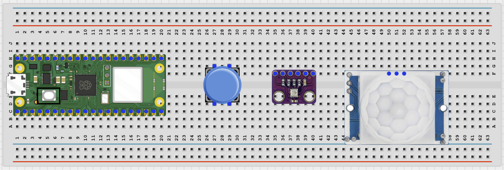
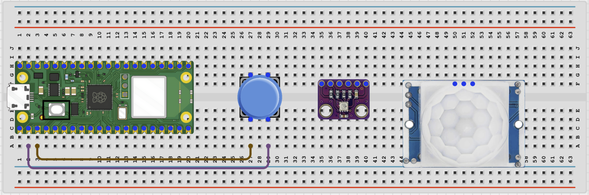
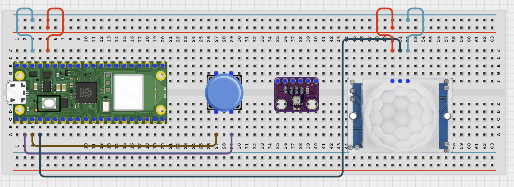
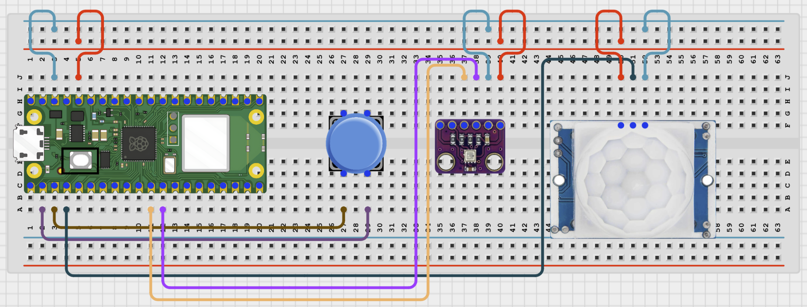

# IOT Home Status Board

# Overview

Build a home-status dashboard that combines a door sensor, PIR motion sensor, and BME280 temperature and humidity readings.

This project demonstrates how different kinds of inputs can be shown together on one local browser page.

The final result should show door state, motion state, temperature, and humidity on one dashboard that refreshes automatically.

# Required Components

|  |  |  |  |
| --- | --- | --- | --- |
|  Raspberry Pi Pico 2 W |  push button | PIR motion sensor |  BME280 module |
|  Breadboard |  Jumper wires | 2.4 GHz Wi-Fi network | Phone or computer browser |

# Circuit Connections

| Component Pin | Connects To | Pico GPIO / Physical Pin Number | Notes |
| --- | --- | --- | --- |
| Door sensor leg 1 | GPIO 1 | GPIO 1 / physical pin 2 | Use internal pull-up in code |
| Door sensor leg 2 | GND | Physical pin 38 |  |
| PIR VCC | 3.3V or module-safe supply | Physical pin 36 | Use 3.3V if your module supports it |
| PIR GND | GND | Physical pin 38 |  |
| PIR OUT | GPIO 2 | GPIO 2 / physical pin 4 | 3.3V logic only |
| BME280 VCC | 3.3V | Physical pin 36 |  |
| BME280 GND | GND | Physical pin 38 |  |
| BME280 SDA | GPIO 8 | GPIO 8 / physical pin 11 | I2C0 SDA |
| BME280 SCL | GPIO 9 | GPIO 9 / physical pin 12 | I2C0 SCL |

# Step-by-Step Assembly

### Step 1: Place the Raspberry Pi Pico 2W

Place the Raspberry Pi Pico 2W on the breadboard so it sits across the center gap.
Keep the USB port facing outward so you can easily connect it to your computer.

### Step 2: Place the Push Button, PIR Sensor, and BME280

Place the magnetic reed switch or push button on the breadboard.

Place the PIR sensor so the white dome faces the test area.

Place the BME280 module on the breadboard.

Identify the PIR and BME280 pin labels before wiring.

### Step 3: Connect the Push Button

Connect one door sensor leg to GPIO 1.

Connect the other door sensor leg to GND.

### Step 4: Connect the PIR Sensor

Connect PIR VCC to 3.3V if your module supports it.

Connect PIR GND to GND.

Connect PIR OUT to GPIO 2.

### Step 5: Connect the BME280

Connect BME280 VCC to 3.3V.

Connect BME280 GND to GND.

Connect BME280 SDA to GPIO 8.

Connect BME280 SCL to GPIO 9.

## Wiring Check

✓ Pico 2W is placed correctly across the breadboard center gap

✓ Door sensor connects to GPIO 1 and GND

✓ PIR VCC connects to 3.3V or a module-safe supply

✓ PIR GND connects to GND

✓ PIR OUT connects to GPIO 2

✓ BME280 VCC connects to 3.3V

✓ BME280 GND connects to GND

✓ BME280 SDA connects to GPIO 8

✓ BME280 SCL connects to GPIO 9

✓ No loose jumper wires

## Beginner Note

A reed switch behaves like a simple button: it opens or closes depending on the nearby magnet.

## Safety Note

The PIR OUT pin must be 3.3V safe before it connects to the Pico GPIO pin.

# Testing Individual Components

Before running the full project, test each part separately. This makes it easier to find wiring or code problems.

## Door sensor test

Check that the door input changes between open and closed states.

| from machine import Pin
import time
door = Pin(1, Pin.IN, Pin.PULL_UP)
while True:
    print('OPEN' if door.value() else 'CLOSED')
    time.sleep(0.2) |
| --- |

Expected test result: The Shell should change between OPEN and CLOSED when the door switch changes state.

## PIR test

Check that the PIR sensor detects motion.

| from machine import Pin
import time
pir = Pin(2, Pin.IN)
print('Wait 15 seconds for PIR warm-up')
time.sleep(15)
while True:
    print('Motion' if pir.value() else 'Clear')
    time.sleep(0.5) |
| --- |

Expected test result: The Shell should print Motion when movement is detected after the warm-up period.

## BME280 test

Check that the BME280 returns temperature and humidity values.

| from machine import I2C, Pin
import BME280
i2c = I2C(0, sda=Pin(8), scl=Pin(9), freq=400000)
try:
    bme = BME280.BME280(i2c=i2c, address=0x76)
except OSError:
    bme = BME280.BME280(i2c=i2c, address=0x77)
print('Temperature:', bme.temperature)
print('Humidity:', bme.humidity) |
| --- |

Expected test result: The Shell should print temperature and humidity values.

## Wi-Fi connection test

Check that the Pico connects to Wi-Fi and prints its IP address.

| import network
import time
SSID = 'YOUR_WIFI_NAME'
PASSWORD = 'YOUR_WIFI_PASSWORD'
wlan = network.WLAN(network.STA_IF)
wlan.active(True)
wlan.connect(SSID, PASSWORD)
for _ in range(15):
    if wlan.isconnected():
        break
    print('Connecting...')
    time.sleep(1)
print('Connected:', wlan.isconnected())
if wlan.isconnected():
    print('IP address:', wlan.ifconfig()[0]) |
| --- |

Expected test result: The Shell should show Connected: True and print an IP address.

# Full Project Code

Upload and run this code after the individual tests work correctly.

| import network
import socket
import time
from machine import I2C, Pin
import BME280

SSID = 'YOUR_WIFI_NAME'
PASSWORD = 'YOUR_WIFI_PASSWORD'

door = Pin(1, Pin.IN, Pin.PULL_UP)
pir = Pin(2, Pin.IN)

i2c = I2C(0, sda=Pin(8), scl=Pin(9), freq=400000)
try:
    bme = BME280.BME280(i2c=i2c, address=0x76)
except OSError:
    bme = BME280.BME280(i2c=i2c, address=0x77)

def web_page():
    door_state = 'OPEN' if door.value() else 'CLOSED'
    motion_state = 'MOTION!' if pir.value() else 'Clear'
    temp = str(bme.temperature)
    hum = str(bme.humidity)
    return '''<!DOCTYPE html>
<html>
<head>
    <meta name='viewport' content='width=device-width, initial-scale=1'>
    <meta http-equiv='refresh' content='3'>
    <title>IoT Home Status Board</title>
</head>
<body style='font-family:Arial;text-align:center;padding:30px'>
    <h1>IoT Home Status Board</h1>
    
Door: {}

    
Motion: {}

    
Temperature: {}

    
Humidity: {}

</body>
</html>'''.format(door_state, motion_state, temp, hum)

wlan = network.WLAN(network.STA_IF)
wlan.active(True)
wlan.connect(SSID, PASSWORD)

print('Connecting to Wi-Fi...')
for _ in range(15):
    if wlan.isconnected():
        break
    time.sleep(1)

if not wlan.isconnected():
    raise RuntimeError('Wi-Fi connection failed')

ip_address = wlan.ifconfig()[0]
print('Connected. Open http://{} in your browser'.format(ip_address))

address = socket.getaddrinfo('0.0.0.0', 80)[0][-1]
server = socket.socket()
server.bind(address)
server.listen(1)

while True:
    client, client_address = server.accept()
    client.recv(1024)
    response = web_page()
    client.send('HTTP/1.1 200 OK\r\nContent-Type: text/html\r\nConnection: close\r\n\r\n'.encode())
    client.sendall(response.encode())
    client.close() |
| --- |

# How the Code Works

| Code Section | What It Does | Why It Matters |
| --- | --- | --- |
| Door input | Reads whether the door switch is open or closed | This provides one simple home-status signal |
| PIR motion input | Reads whether motion is currently detected | This adds a second kind of home-status event |
| BME280 sensor | Provides live temperature and humidity values | This adds environmental information to the same dashboard |
| web_page() | Combines all sensor values into one simple browser page | Students can see several different inputs in one place |

# Expected Result

After entering your Wi-Fi details and running the code, the browser page should show door state, motion state, temperature, and humidity. Opening or closing the door sensor, moving in front of the PIR, or changing the air around the BME280 should update the page.

# Troubleshooting

| Problem | Possible Cause | Solution |
| --- | --- | --- |
| Door state looks backward | The switch logic is opposite of what you expected | Reverse the OPEN/CLOSED text logic if your hardware uses the opposite state |
| PIR always shows motion | Sensor is warming up or too sensitive | Wait longer and reduce nearby movement or adjust the sensor |
| No BME280 data | Wrong I2C pins or address | Use GPIO 8/9 and test 0x76 or 0x77 |

# Next Project

Project 67: Wi-Fi Heartbeat Logger
