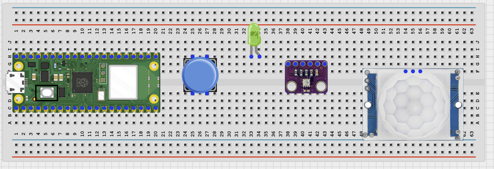
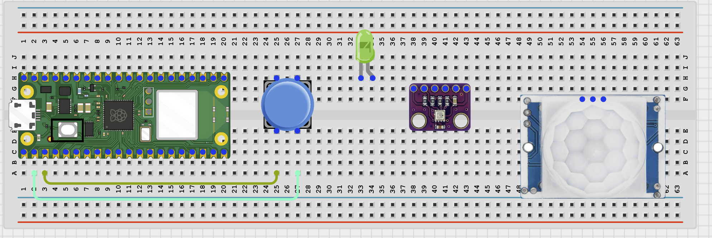
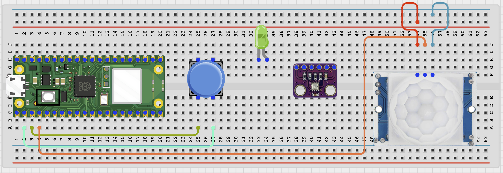
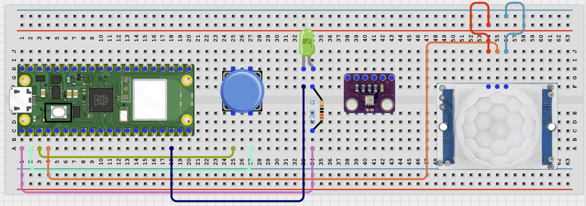
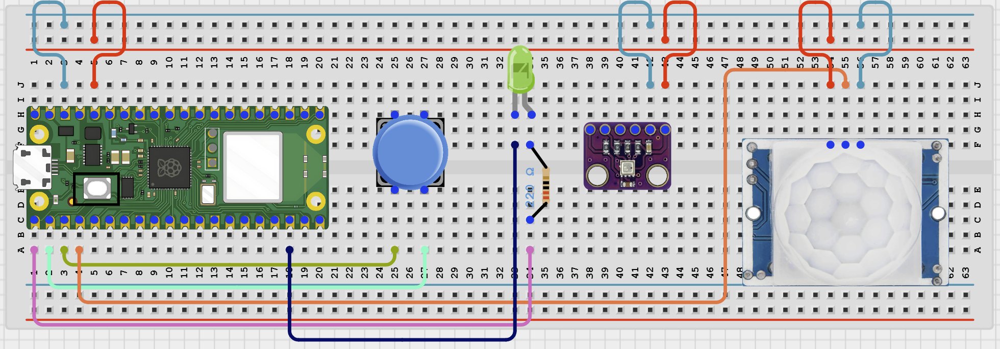

# IOT Classroom Demo Board

# Overview

Build a classroom demo board that combines a button, PIR sensor, LED, and BME280 sensor on one browser page.

This project demonstrates the full sense-process-act idea in one simple system.

The final result should show live button, motion, LED, and temperature and humidity information, and let the browser control the LED.

# Required Components

|  |  |  |  |
| --- | --- | --- | --- |
|  Raspberry Pi Pico 2 W |  Push button | PIR motion sensor |  LED |
|  220Ω resistor |  BME280 module |  Breadboard |  Jumper wires |
| 2.4 GHz Wi-Fi network | Phone or computer browser |  |  |

# Circuit Connections

| Component Pin | Connects To | Pico GPIO / Physical Pin Number | Notes |
| --- | --- | --- | --- |
| Button leg 1 | GPIO 1 | GPIO 1 / physical pin 2 | Use internal pull-up in code |
| Button opposite leg | GND | Physical pin 38 |  |
| PIR VCC | 3.3V or module-safe supply | Physical pin 36 | Use 3.3V if your module supports it |
| PIR GND | GND | Physical pin 38 |  |
| PIR OUT | GPIO 2 | GPIO 2 / physical pin 4 | 3.3V logic only |
| LED anode (+) | 220Ω resistor then GPIO 0 | GPIO 0 / physical pin 1 |  |
| LED cathode (-) | GND | Physical pin 38 |  |
| BME280 VCC | 3.3V | Physical pin 36 |  |
| BME280 GND | GND | Physical pin 38 |  |
| BME280 SDA | GPIO 8 | GPIO 8 / physical pin 11 | I2C0 SDA |
| BME280 SCL | GPIO 9 | GPIO 9 / physical pin 12 | I2C0 SCL |

# Step-by-Step Assembly

### Step 1: Place the Raspberry Pi Pico 2W

Place the Raspberry Pi Pico 2W on the breadboard so it sits across the center gap.
Keep the USB port facing outward so you can easily connect it to your computer.

### Step 2: Place the Button, PIR Sensor, LED, and BME280

Place the push button across the breadboard center gap.

Place the PIR sensor so it faces the test area.

Place the LED with its two legs in different breadboard rows.

Place the BME280 module on the breadboard.

### Step 3: Connect the Button

Connect one button leg to GPIO 1.

Connect the opposite button leg to GND.

### Step 4: Connect the PIR Sensor

Connect PIR VCC to 3.3V if your module supports it.

Connect PIR GND to GND.

Connect PIR OUT to GPIO 2.

### Step 5: Connect the LED

Connect the LED long leg to one end of a 220Ω resistor.

Connect the other end of the resistor to GPIO 0.

Connect the LED short leg to GND.

### Step 6: Connect the BME280

Connect BME280 VCC to 3.3V.

Connect BME280 GND to GND.

Connect BME280 SDA to GPIO 8.

Connect BME280 SCL to GPIO 9.

## Wiring Check

✓ Pico 2W is placed correctly across the breadboard center gap

✓ Push button connects to GPIO 1 and GND

✓ PIR VCC connects to 3.3V or a module-safe supply

✓ PIR GND connects to GND

✓ PIR OUT connects to GPIO 2

✓ LED long leg connects through a 220Ω resistor to GPIO 0

✓ LED short leg connects to GND

✓ BME280 VCC connects to 3.3V

✓ BME280 GND connects to GND

✓ BME280 SDA connects to GPIO 8

✓ BME280 SCL connects to GPIO 9

✓ No loose jumper wires

## Safety Note

The PIR OUT pin must be 3.3V safe before it connects to the Pico GPIO pin.

# Testing Individual Components

Before running the full project, test each part separately. This makes it easier to find wiring or code problems.

## Button test

Check that the button reads correctly.

| from machine import Pin
import time
button = Pin(1, Pin.IN, Pin.PULL_UP)
while True:
    print('Pressed' if button.value() == 0 else 'Released')
    time.sleep(0.2) |
| --- |

Expected test result: The Shell should change between Released and Pressed.

## PIR test

Check that the PIR sensor detects motion.

| from machine import Pin
import time
pir = Pin(2, Pin.IN)
print('Wait 15 seconds for PIR warm-up')
time.sleep(15)
while True:
    print('Motion' if pir.value() else 'Clear')
    time.sleep(0.5) |
| --- |

Expected test result: The Shell should print Motion when movement is detected.

## LED test

Check that the LED works before using browser control.

| from machine import Pin
import time
led = Pin(0, Pin.OUT)
led.on()
time.sleep(1)
led.off() |
| --- |

Expected test result: The LED should turn on briefly and then turn off.

## BME280 test

Check that the BME280 returns values.

| from machine import I2C, Pin
import BME280
i2c = I2C(0, sda=Pin(8), scl=Pin(9), freq=400000)
try:
    bme = BME280.BME280(i2c=i2c, address=0x76)
except OSError:
    bme = BME280.BME280(i2c=i2c, address=0x77)
print('Temperature:', bme.temperature)
print('Humidity:', bme.humidity) |
| --- |

Expected test result: The Shell should print temperature and humidity values.

## Wi-Fi connection test

Check that the Pico connects to Wi-Fi and prints its IP address.

| import network
import time
SSID = 'YOUR_WIFI_NAME'
PASSWORD = 'YOUR_WIFI_PASSWORD'
wlan = network.WLAN(network.STA_IF)
wlan.active(True)
wlan.connect(SSID, PASSWORD)
for _ in range(15):
    if wlan.isconnected():
        break
    print('Connecting...')
    time.sleep(1)
print('Connected:', wlan.isconnected())
if wlan.isconnected():
    print('IP address:', wlan.ifconfig()[0]) |
| --- |

Expected test result: The Shell should show Connected: True and print an IP address.

# Full Project Code

Upload and run this code after the individual tests work correctly.

| import network
import socket
import time
from machine import I2C, Pin
import BME280

SSID = 'YOUR_WIFI_NAME'
PASSWORD = 'YOUR_WIFI_PASSWORD'

button = Pin(1, Pin.IN, Pin.PULL_UP)
pir = Pin(2, Pin.IN)
led = Pin(0, Pin.OUT)

i2c = I2C(0, sda=Pin(8), scl=Pin(9), freq=400000)
try:
    bme = BME280.BME280(i2c=i2c, address=0x76)
except OSError:
    bme = BME280.BME280(i2c=i2c, address=0x77)

def web_page():
    button_state = 'PRESSED' if button.value() == 0 else 'Released'
    motion_state = 'MOTION!' if pir.value() else 'Clear'
    led_state = 'ON' if led.value() else 'OFF'
    temp = str(bme.temperature)
    hum = str(bme.humidity)
    return '''<!DOCTYPE html>
<html>
<head>
    <meta name='viewport' content='width=device-width, initial-scale=1'>
    <meta http-equiv='refresh' content='2'>
    <title>IoT Classroom Demo Board</title>
</head>
<body style='font-family:Arial;text-align:center;padding:30px'>
    <h1>IoT Classroom Demo Board</h1>
    
Button: {}

    
PIR Motion: {}

    
LED: {}

    
Temperature: {}

    
Humidity: {}

    
<a href='/led?state=ON'><button>LED ON</button></a> <a href='/led?state=OFF'><button>LED OFF</button></a>

</body>
</html>'''.format(button_state, motion_state, led_state, temp, hum)

wlan = network.WLAN(network.STA_IF)
wlan.active(True)
wlan.connect(SSID, PASSWORD)

print('Connecting to Wi-Fi...')
for _ in range(15):
    if wlan.isconnected():
        break
    time.sleep(1)

if not wlan.isconnected():
    raise RuntimeError('Wi-Fi connection failed')

ip_address = wlan.ifconfig()[0]
print('Connected. Open http://{} in your browser'.format(ip_address))

address = socket.getaddrinfo('0.0.0.0', 80)[0][-1]
server = socket.socket()
server.bind(address)
server.listen(1)

while True:
    client, client_address = server.accept()
    request = client.recv(1024).decode()
    if 'led?state=ON' in request:
        led.value(1)
    elif 'led?state=OFF' in request:
        led.value(0)

    response = web_page()
    client.send('HTTP/1.1 200 OK\r\nContent-Type: text/html\r\nConnection: close\r\n\r\n'.encode())
    client.sendall(response.encode())
    client.close() |
| --- |

# How the Code Works

| Code Section | What It Does | Why It Matters |
| --- | --- | --- |
| Digital inputs | Read the button and PIR sensor states | These show two common beginner input types |
| BME280 sensor | Adds temperature and humidity to the same dashboard | The project demonstrates mixed sensor types together |
| LED browser control | Lets the user turn the LED on or off from the page | This adds an output to the demo board |
| Unified dashboard | Shows button, motion, LED, and sensor data in one place | This makes the board useful for classroom demonstrations |

# Expected Result

After entering your Wi-Fi details and running the code, the browser page should show the button state, PIR motion state, LED state, temperature, and humidity. The browser LED buttons should turn the LED on and off.

# Troubleshooting

| Problem | Possible Cause | Solution |
| --- | --- | --- |
| One value never changes | That specific sensor or input is not wired correctly | Test each part separately first using the test sections |
| LED control does not work | The URL path or LED wiring is wrong | Recheck the /led?state=ON and OFF handling and LED wiring |
| PIR always reports motion | PIR is warming up or too sensitive | Wait longer or adjust the sensor placement |

# Next Project

Project 70: Wi-Fi Power Usage Simulator
