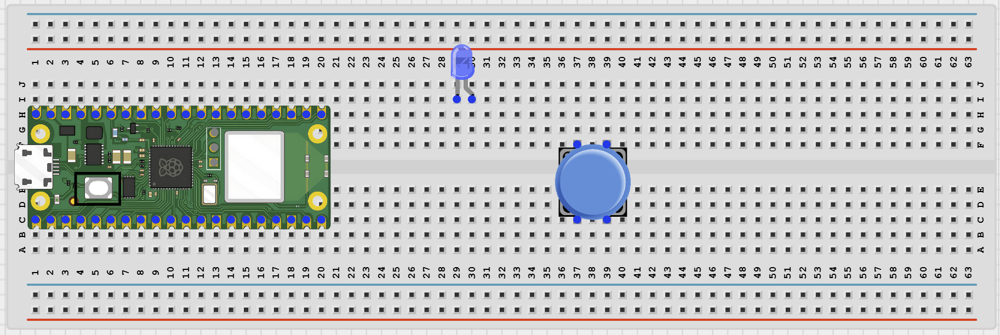
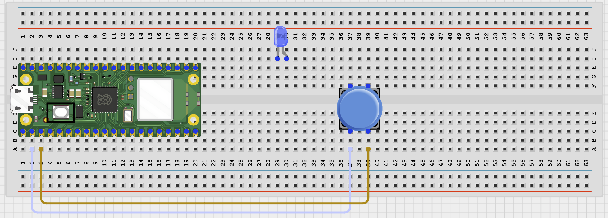
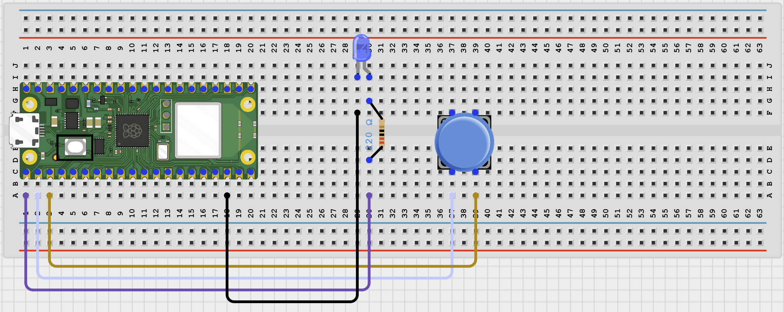

# STEMAIDE AFRICA

# Project 65: Wi-Fi Panic Button

**Beginner Embedded Systems Project Using Raspberry Pi Pico 2 W and MicroPython**


# Overview

Build a simple Wi-Fi panic button that latches an alert until it is reset from a browser page.

This project demonstrates button debouncing, latching logic, and a basic status page.

The final result should turn on an LED and show a PANIC state when the button is pressed, then stay active until the web RESET button is used.

# Required Components

|  |  |  |  |
| --- | --- | --- | --- |
| <br>Raspberry Pi Pico 2 W | <br>Push button | <br>LED | <br>220Ω resistor |
| <br>Breadboard | <br>Jumper wires | 2.4 GHz Wi-Fi network | Phone or browser |


# Circuit Connections

| Component Pin       | Connects To               | Pico GPIO / Physical Pin Number | Notes                        |
| ------------------- | ------------------------- | ------------------------------- | ---------------------------- |
| Button leg 1        | GPIO 1                    | GPIO 1 / physical pin 2         | Use internal pull-up in code |
| Button opposite leg | GND                       | Physical pin 38                 | —                            |
| LED anode (+)       | 220Ω resistor then GPIO 0 | GPIO 0 / physical pin 1         | Alert LED                    |
| LED cathode (-)     | GND                       | Physical pin 38                 | —                            |

# Step-by-Step Assembly

## Step 1: Place the Raspberry Pi Pico 2W

Place the Raspberry Pi Pico 2W on the breadboard so it sits across the center gap. Keep the USB port facing outward so you can easily connect it to your computer.


---

## Step 2: Place the Push Button and LED

Place the push button across the breadboard center gap.

Place the LED on the breadboard with its two legs in different rows.

The LED long leg is the anode (+), and the short leg is the cathode (-).



---

## Step 3: Connect the Push Button

Connect one button leg to GPIO 1.

Connect the opposite button leg to GND.



---

## Step 4: Connect the Alert LED

Connect the LED long leg to one end of a 220Ω resistor.

Connect the other end of the resistor to GPIO 0.

Connect the LED short leg to GND.



---

# Wiring Check

- ✓ Pico 2W is placed correctly across the breadboard center gap
- ✓ Push button sits across the breadboard center gap
- ✓ Button signal leg connects to GPIO 1
- ✓ Button opposite leg connects to GND
- ✓ LED long leg connects through a 220Ω resistor to GPIO 0
- ✓ LED short leg connects to GND
- ✓ No loose jumper wires

---

## Safety Note

This is an educational demo, not a certified emergency or security system.

Do not rely on it as your only emergency communication method.

---

# Testing Individual Components

Before running the full project, test each part separately. This makes it easier to find wiring or code problems.

## Button test

Check that the button reads correctly before adding panic logic.

```python
from machine import Pin
import time
button = Pin(1, Pin.IN, Pin.PULL_UP)
while True:
    print('Pressed' if button.value() == 0 else 'Released')
    time.sleep(0.2)
```

Expected test result: The Shell should change between Released and Pressed.

---

## LED test

Check that the alert LED works.

```python
from machine import Pin
import time
led = Pin(0, Pin.OUT)
led.on()
time.sleep(1)
led.off()
```

Expected test result: The LED should turn on briefly and then turn off.

---

## Wi-Fi connection test

Check that the Pico connects to Wi-Fi and prints its IP address.

```python
import network
import time
SSID = 'YOUR_WIFI_NAME'
PASSWORD = 'YOUR_WIFI_PASSWORD'
wlan = network.WLAN(network.STA_IF)
wlan.active(True)
wlan.connect(SSID, PASSWORD)
for _ in range(15):
    if wlan.isconnected():
        break
    print('Connecting...')
    time.sleep(1)
print('Connected:', wlan.isconnected())
if wlan.isconnected():
    print('IP address:', wlan.ifconfig()[0])
```

Expected test result: The Shell should show Connected: True and print an IP address.

---

# Full Project Code

Upload and run this code after the individual tests work correctly.

```python
import network
import socket
import time
from machine import Pin

SSID = 'YOUR_WIFI_NAME'
PASSWORD = 'YOUR_WIFI_PASSWORD'

button = Pin(1, Pin.IN, Pin.PULL_UP)
led = Pin(0, Pin.OUT)

panic_active = False
last_button_state = 1
last_press_ms = 0
DEBOUNCE_MS = 200


def web_page(active):
    status = 'PANIC ACTIVE' if active else 'NORMAL'
    return '''<!DOCTYPE html>
<html>
<head>
    <meta name='viewport' content='width=device-width, initial-scale=1'>
    <meta http-equiv='refresh' content='2'>
    <title>Wi-Fi Panic Button</title>
</head>
<body style='font-family:Arial;text-align:center;padding:30px'>
    <h1>Wi-Fi Panic Button</h1>
    <h2>{}</h2>
    <p><a href='/reset'><button>RESET</button></a></p>
    <p>Educational demo only.</p>
</body>
</html>'''.format(status)


wlan = network.WLAN(network.STA_IF)
wlan.active(True)
wlan.connect(SSID, PASSWORD)

print('Connecting to Wi-Fi...')
for _ in range(15):
    if wlan.isconnected():
        break
    time.sleep(1)

if not wlan.isconnected():
    raise RuntimeError('Wi-Fi connection failed')

ip_address = wlan.ifconfig()[0]
print('Connected. Open http://{} in your browser'.format(ip_address))

address = socket.getaddrinfo('0.0.0.0', 80)[0][-1]
server = socket.socket()
server.bind(address)
server.listen(1)
server.settimeout(0.1)

while True:
    current_state = button.value()
    now = time.ticks_ms()
    if current_state == 0 and last_button_state == 1 and time.ticks_diff(now, last_press_ms) > DEBOUNCE_MS:
        panic_active = True
        last_press_ms = now
        print('Panic button pressed')
    last_button_state = current_state

    led.value(1 if panic_active else 0)

    try:
        client, client_address = server.accept()
    except OSError:
        continue

    request = client.recv(1024).decode()
    if 'GET /reset' in request:
        panic_active = False
        print('Panic reset from web')

    response = web_page(panic_active)
    client.send('HTTP/1.1 200 OK\r\nContent-Type: text/html\r\nConnection: close\r\n\r\n'.encode())
    client.sendall(response.encode())
    client.close()
```

---

# How the Code Works

| Code Section    | What It Does                                       | Why It Matters                                               |
| --------------- | -------------------------------------------------- | ------------------------------------------------------------ |
| Debounce timing | Waits a short time between accepted button presses | This reduces false multiple triggers from one physical press |
| panic_active    | Stores whether the system is in panic mode         | The LED and web page both depend on this state               |
| Latched alert   | Keeps the panic state active until reset           | This makes sure the alert is not missed                      |
| Web RESET       | Lets the browser clear the panic state             | The system needs a deliberate way to leave panic mode        |

---

# Expected Result

After entering your Wi-Fi details and running the code, pressing the button should turn on the LED and set the browser page to PANIC ACTIVE. The alert should stay active until the browser RESET button is used.

---

# Troubleshooting

| Problem                        | Possible Cause                                             | Solution                                                  |
| ------------------------------ | ---------------------------------------------------------- | --------------------------------------------------------- |
| Panic mode triggers repeatedly | Debounce time is too short or the button is bouncing badly | Increase DEBOUNCE_MS slightly and press more cleanly      |
| LED never turns on             | LED wiring is wrong or the button is not triggering        | Run the separate button and LED tests first               |
| RESET does not work            | Browser request is not reaching the Pico                   | Check the IP address and watch the Shell for web activity |

# Next Project

Project 66: IoT Home Status Board
