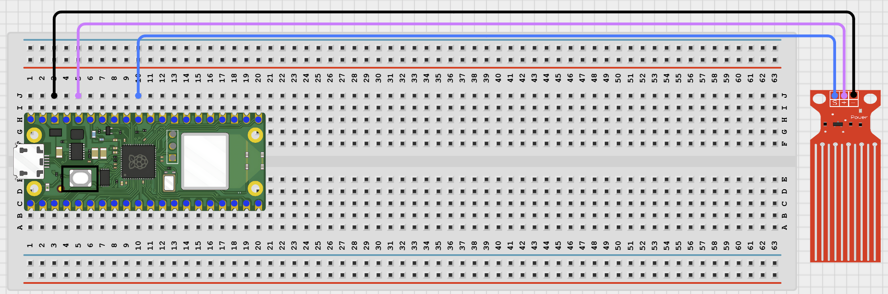

# Project 68: Online Tank Level Chart

**Beginner Embedded Systems Project Using Raspberry Pi Pico 2 W and MicroPython**

## Pico 2 W Diagram


---

## Overview

Build a water tank monitor that shows current tank level and a short recent history chart on a local web page.

This project demonstrates ADC calibration and a simple browser-based bar chart.

The final result should show the current level as a percentage, a visual tank graphic, and a recent history display.

## Required Components

|  |  |  |  |
| --- | --- | --- | --- |
| <br>Raspberry Pi Pico 2 W | <br>Water level sensor | <br>Breadboard | <br>Jumper wires |
| Water container | 2.4 GHz Wi-Fi network | Phone or computer browser |  |


## Circuit Connections

| Component Pin     | Connects To | Pico GPIO / Physical Pin Number | Notes     |
| ----------------- | ----------- | ------------------------------- | --------- |
| Water sensor VCC  | 3.3V        | Physical pin 36                 |           |
| Water sensor GND  | GND         | Physical pin 38                 |           |
| Water sensor AOUT | GPIO 26     | GPIO 26 / physical pin 31       | ADC input |

## Step-by-Step Assembly

### Step 1: Place the Raspberry Pi Pico 2 W


### Step 2: Place the Water Level Sensor

Keep the Pico, breadboard, USB cable, and jumper wires away from the water container.


### Step 3: Connect Water Sensor VCC

Connect water sensor VCC to 3.3V.


### Step 4: Connect Water Sensor GND

Connect water sensor GND to GND.



### Step 5: Connect Water Sensor Signal

Connect water sensor AOUT to GPIO 26.


---

## Testing Individual Components

### Water Level ADC Test

```python
from machine import ADC, Pin
import time

adc = ADC(Pin(26))

while True:
    print(adc.read_u16())
    time.sleep(0.5)
```

---

## Full Project Code

```python
import network
import socket
import time
from machine import ADC, Pin

SSID = 'YOUR_WIFI_NAME'
PASSWORD = 'YOUR_WIFI_PASSWORD'

adc = ADC(Pin(26))
DRY = 2000
WET = 55000
history = []
MAX_HISTORY = 15

def get_level():
    raw = adc.read_u16()
    if raw >= WET:
        return raw, 100
    if raw <= DRY:
        return raw, 0
    return raw, int((raw - DRY) / (WET - DRY) * 100)

def web_page(level, hist):
    bars = ''
    for value in hist:
        bars += '<div style="background:#4fc3f7;width:{}%;height:24px;margin:3px 0;">{}%</div>'.format(value, value)
    return '''<!DOCTYPE html>
<html>
<head>
    <meta name='viewport' content='width=device-width, initial-scale=1'>
    <meta http-equiv='refresh' content='3'>
    <title>Tank Level Chart</title>
</head>
<body style='font-family:Arial;padding:20px'>
    <h1 style='text-align:center'>Online Tank Level Chart</h1>
    <h2 style='text-align:center'>{}%</h2>
    <div style='height:200px;width:100px;border:3px solid #333;border-radius:0 0 18px 18px;margin:20px auto;position:relative;overflow:hidden;background:#f5f5f5;'>
        <div style='position:absolute;bottom:0;width:100%;height:{}%;background:#4fc3f7'></div>
    </div>
    <h3>Recent History</h3>
    {}
</body>
</html>'''.format(level, level, bars)

wlan = network.WLAN(network.STA_IF)
wlan.active(True)
wlan.connect(SSID, PASSWORD)

print('Connecting to Wi-Fi...')
for _ in range(15):
    if wlan.isconnected():
        break
    time.sleep(1)

if not wlan.isconnected():
    raise RuntimeError('Wi-Fi connection failed')

ip_address = wlan.ifconfig()[0]
print('Connected. Open http://{} in your browser'.format(ip_address))

address = socket.getaddrinfo('0.0.0.0', 80)[0][-1]
server = socket.socket()
server.bind(address)
server.listen(1)

while True:
    client, client_address = server.accept()
    client.recv(1024)
    raw, level = get_level()
    history.append(level)
    if len(history) > MAX_HISTORY:
        history.pop(0)
    response = web_page(level, history)
    client.send('HTTP/1.1 200 OK\r\nContent-Type: text/html\r\nConnection: close\r\n\r\n'.encode())
    client.sendall(response.encode())
    client.close()
```

---

## How the Code Works

| Code Section | What It Does | Why It Matters |
| --- | --- | --- |
| Calibration values | Store dry and wet sensor readings | Converts raw values into percentage |
| `get_level()` | Converts ADC reading into tank level | Browser chart uses percentage |
| `history` list | Stores recent tank levels | Shows recent changes |
| Bar chart HTML | Builds a visual history | Makes changes easier to see |

---

## Expected Result

The browser page shows current tank level, a tank fill graphic, and recent history bars. Changing the water level updates the display.

---

## Troubleshooting

| Problem | Possible Cause | Solution |
| --- | --- | --- |
| Always shows 0% or 100% | Calibration values do not match sensor | Print raw values and adjust `DRY` and `WET` |
| History never changes | Level reading stays the same | Change the water level and wait for refreshes |
| Water is too near electronics | Unsafe workspace setup | Move Pico and breadboard farther from container |

## Next Project

Project 69: IoT Classroom Demo Board

---

## Source Text Preserved From DOCX

The following source text from the original Word document is preserved here because it was not already present verbatim in the cleaned MkDocs version.

- | Project Story Beginner Extension Project: This project is more advanced than the earlier beginner projects. Complete the basic projects first before attempting this one. |
- | Raspberry Pi Pico 2 W | 1 | Main controller board with Wi-Fi | Use MicroPython |
- | Water level sensor | 1 | Analog level sensor | Use the analog output pin |
- | Water container | 1 | Test container | Keep it away from the Pico and breadboard |
- | Phone or computer browser | 1 | Used to open the web page | Must be on the same network |
- Before starting this project, make sure you have completed the foundational sections at the beginning of the manual:
- - Software Installation and Setup.
- - Safety Guidelines.
- - Breadboard Basics.
- - Reading Circuit Diagrams.
- ## Project-Specific Setup Notes
- - Use a 2.4 GHz Wi-Fi network because Pico W / Pico 2 W projects usually do not connect to 5 GHz-only networks
- - Replace the SSID and PASSWORD placeholders in the code with your own Wi-Fi details before running
- - Do not save real Wi-Fi passwords in shared class files or screenshots
- | Project-Specific Safety Note Keep the water container and wet sensor area away from the Pico and USB cable. Power the sensor from 3.3V for Pico-safe ADC reading. Wet only the sensor or tank probe area used for measurement, not the electronics. |
- Place the Raspberry Pi Pico 2W on the breadboard so it sits across the center gap.
- Keep the USB port facing outward so you can easily connect it to your computer.
- Place the water level sensor so only the sensing area can touch water.
- Identify VCC, GND, and AOUT before wiring.
- ### Step 3: Connect the Water Sensor VCC
- ### Step 4: Connect the Water Sensor GND
- ### Step 5: Connect the Water Sensor Signal Pin
- GPIO 26 is the ADC input used by this project.
- ## Wiring Check
- ✓ Pico 2W is placed correctly across the breadboard center gap
- ✓ Water sensor VCC connects to 3.3V
- ✓ Water sensor GND connects to GND
- ✓ Water sensor AOUT connects to GPIO 26
- ✓ No loose jumper wires
- Water should touch only the sensor probe area. Keep the Pico, breadboard, USB cable, and jumper wires dry.
- Before running the full project, test each part separately. This makes it easier to find wiring or code problems.
- Check that the analog reading changes with water level.
- Expected test result: The raw ADC value should change when the sensor is dry, partly wet, and more fully wet.
- ## Wi-Fi connection test
- Check that the Pico connects to Wi-Fi and prints its IP address.
- print('Connected:', wlan.isconnected())
- print('IP address:', wlan.ifconfig()[0]) |
- Expected test result: The Shell should show Connected: True and print an IP address.
- Upload and run this code after the individual tests work correctly.
- | Calibration values | Store dry and wet sensor readings | The water level percentage depends on these limits |
- | get_level() | Converts the raw ADC reading into a percentage | The browser chart uses the percentage, not the raw value |
- | history list | Stores recent tank levels | This makes the project more than a single live number |
- | Bar chart HTML | Builds a simple visual history in the browser | Students can see level changes more clearly |
- After entering your Wi-Fi details and running the code, the browser page should show the current tank level as a percentage, a visual tank fill graphic, and a recent history chart. Changing the water level should update the display.
- | Always shows 0% or 100% | Calibration values do not match your sensor | Print raw ADC values and adjust DRY and WET |
- | History never changes | The level reading stays the same or the page has not refreshed enough | Change the water level and wait for a few refreshes |
- | Water is too near electronics | Unsafe workspace setup | Move the Pico and breadboard farther from the container |
- - Add a LOW, MEDIUM, or FULL text label
- - Add a future buzzer alert when the tank level gets very low
- - Add a second page later that shows only the latest value in larger text
- 1. Why are calibration values important in this kind of sensor project?
- 2. Why is a history chart more useful than only a single current value?
- 3. Where could an online tank level chart be useful?
- Save the file to your computer as:
- If you want the program to run automatically when the Pico powers on, save the final version to the Pico as:
