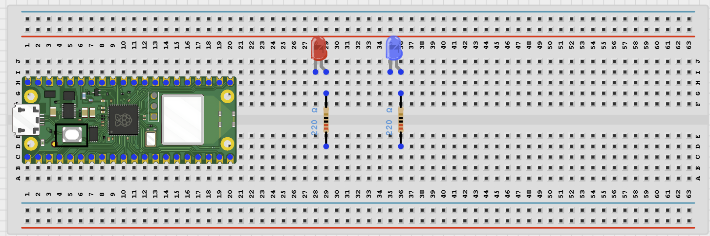
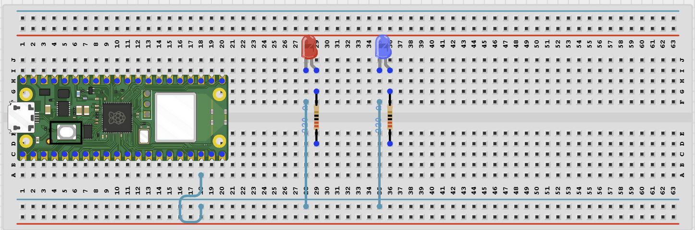
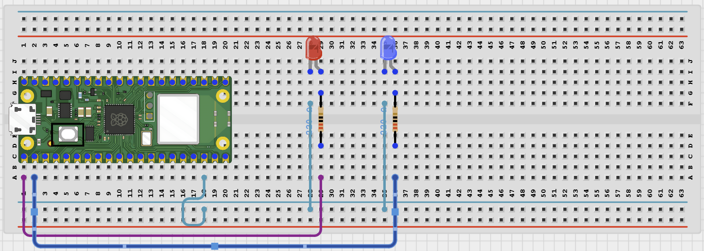

# Project 1.12.15

## Bluetooth Direction Signal Controller

# Project 1.12.15: Bluetooth Direction Signal Controller

**Beginner Embedded Systems Project Using Raspberry Pi Pico 2 W and MicroPython**


# Overview

Build a Bluetooth direction signal controller that turns a forward LED, a backward LED, or both off.

This project demonstrates how two safe GPIO outputs can represent direction commands.

The final result should let a phone send forward, backward, and stop commands to two LED indicators.

# Required Components

|  |  |  |  |
| --- | --- | --- | --- |
| <br>Raspberry Pi Pico 2 W | <br>LEDs | <br>220 ohm resistors | <br>Breadboard |
| <br>Jumper wires | <br>Phone with BLE app |  |  |


# Circuit Connections

| Component Pin             | Connects To                                     | Pico GPIO / Physical Pin Number | Notes                              |
| ------------------------- | ----------------------------------------------- | ------------------------------- | ---------------------------------- |
| GPIO 0                    | 220 ohm resistor then forward LED positive leg  | GPIO 0 / physical pin 1         | Forward signal output              |
| Forward LED negative leg  | GND                                             | Physical pin 38                 | Completes the forward LED circuit  |
| GPIO 1                    | 220 ohm resistor then backward LED positive leg | GPIO 1 / physical pin 2         | Backward signal output             |
| Backward LED negative leg | GND                                             | Physical pin 38                 | Completes the backward LED circuit |

# Step-by-Step Assembly

## Step 1: Place the Raspberry Pi Pico 2 W

Place the Raspberry Pi Pico 2 W on the breadboard so it sits across the center gap.

Keep the USB port facing outward so you can easily connect it to your computer.


---

## Step 2: Place the Direction LEDs and Resistors

Place one LED for the forward signal and one LED for the backward signal.

Place one 220 ohm resistor in series with each LED.

Identify the positive and negative leg of each LED before wiring.

Do not connect an LED directly to a GPIO pin without its resistor.



---

## Step 3: Connect the LED Grounds

Connect the negative leg of each LED to GND.

Use the Pico GND rail as the common return path.

This common ground lets both LED circuits complete safely.



---

## Step 4: Connect the Direction Signal Pins

Connect GPIO 0 through a 220 ohm resistor to the forward LED positive leg.

Connect GPIO 1 through a 220 ohm resistor to the backward LED positive leg.



---

## Wiring Check

- - Pico 2 W is placed correctly across the breadboard center gap
- - GPIO 0 connects through a 220 ohm resistor to the forward LED
- - Forward LED negative leg connects to GND
- - GPIO 1 connects through a 220 ohm resistor to the backward LED
- - Backward LED negative leg connects to GND
- - Each LED has its own resistor
- - No loose jumper wires

### Safety Note

Do not connect an LED directly to a GPIO pin without a resistor. Keep the circuit low-current and disconnect USB before changing wires.

---

# Testing Individual Components

Before running the full project, test each part separately. This makes it easier to find wiring or code problems.

## Direction LED Test

Check that the two LEDs can show forward, backward, and stop before adding Bluetooth code.

```python
from machine import Pin
import time

forward_led = Pin(0, Pin.OUT)
backward_led = Pin(1, Pin.OUT)

def stop_signals():
    forward_led.off()
    backward_led.off()

def forward():
    forward_led.on()
    backward_led.off()

def backward():
    forward_led.off()
    backward_led.on()

forward()
time.sleep(1)
stop_signals()
time.sleep(1)
backward()
time.sleep(1)
stop_signals()
```

**Expected test result:** The forward LED should turn on, both LEDs should turn off, the backward LED should turn on, and both LEDs should turn off again.

---

## BLE Advertising Test

Check that the Pico advertises as a BLE device your phone can see.

```python
import bluetooth
import time
from ble_uart import BLEUART

ble = bluetooth.BLE()
ble.active(True)

uart = BLEUART(ble, name='Pico-DirLED')

print('Scan for Pico-DirLED in your BLE app')

while True:
    time.sleep(1)
```

**Expected test result:** Your phone BLE app should find a device named **Pico-DirLED**.

---

# Full Project Code

Upload and run this code after the individual tests work correctly.

```python
from machine import Pin
import bluetooth
import time
from ble_uart import BLEUART

forward_led = Pin(0, Pin.OUT)
backward_led = Pin(1, Pin.OUT)

ble = bluetooth.BLE()
ble.active(True)
uart = BLEUART(ble, name='Pico-DirLED')

current_state = 'STOP'


def stop_signals():
    global current_state
    forward_led.off()
    backward_led.off()
    current_state = 'STOP'


def forward():
    global current_state
    forward_led.on()
    backward_led.off()
    current_state = 'FORWARD'


def backward():
    global current_state
    forward_led.off()
    backward_led.on()
    current_state = 'BACKWARD'


def on_rx(data):
    command = data.decode('utf-8').strip().lower()
    print('Received command:', command)

    if command == 'forward':
        forward()
        uart.write(b'Forward LED on\n')
    elif command == 'backward':
        backward()
        uart.write(b'Backward LED on\n')
    elif command == 'stop':
        stop_signals()
        uart.write(b'Direction LEDs off\n')
    elif command == 'status':
        uart.write(('Signal state: {}
'.format(current_state)).encode())
    elif command == 'help':
        uart.write(b'Commands: forward, backward, stop, status, help\n')
    else:
        uart.write(b'Unknown command. Send help.\n')


uart.on_rx(on_rx)
stop_signals()

print('Bluetooth direction signal controller ready')
print('Send forward, backward, stop, status, or help')

while True:
    time.sleep(0.1)
```

---

# How the Code Works

| Code Section                          | What It Does                                         | Why It Matters                                    |
| ------------------------------------- | ---------------------------------------------------- | ------------------------------------------------- |
| forward_led and backward_led outputs  | Control the two LED direction signals                | The two outputs show the selected direction state |
| forward(), backward(), stop_signals() | Group the signal actions into simple functions       | This keeps the main command code easy to read     |
| current_state variable                | Stores the latest direction signal                   | The phone can ask for status at any time          |
| Bluetooth command handler             | Changes the direction signal based on phone commands | This is the main wireless control feature         |

---

# Expected Result

After running the code, your phone BLE app should find `Pico-DirLED`. Sending `forward` should turn on the forward LED. Sending `backward` should turn on the backward LED. Sending `stop` should turn both LEDs off, and `status` should report the current signal state.

---

# Troubleshooting

| Problem                             | Possible Cause                                                                 | Solution                                                                                               |
| ----------------------------------- | ------------------------------------------------------------------------------ | ------------------------------------------------------------------------------------------------------ |
| An LED does not turn on             | LED polarity is reversed, the resistor path is open, or the GPIO wire is wrong | Flip the LED direction and recheck GPIO 0 or GPIO 1                                                    |
| Both LEDs turn on at the wrong time | The LED wires may be crossed or the code was edited incorrectly                | Rerun the direction LED test and confirm each LED uses the correct GPIO pin                            |
| Phone cannot find Pico-DirLED       | BLE helper files are missing or Bluetooth is not active                        | Check that `ble_uart.py` and `ble_advertising.py` are saved on the Pico and rerun the advertising test |

