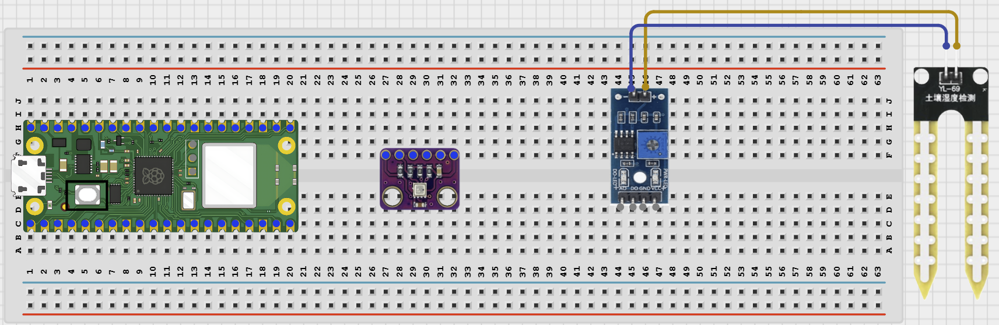
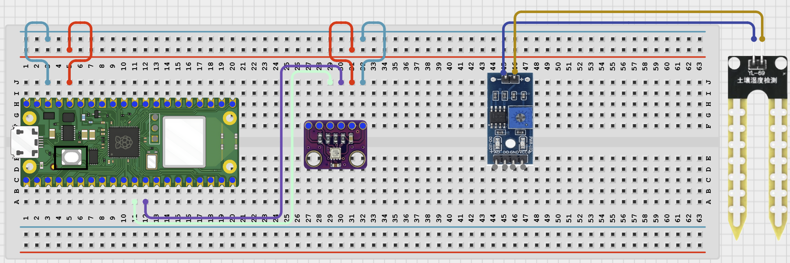
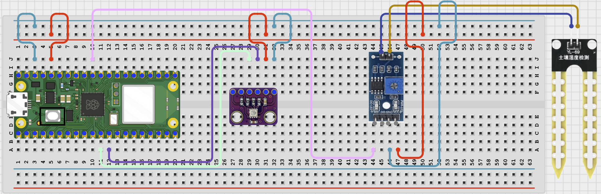

# Project 1.12.16

## Bluetooth Greenhouse Monitor

# Project 1.12.16: Bluetooth Greenhouse Monitor

**Beginner Embedded Systems Project Using Raspberry Pi Pico 2 W and MicroPython**


# Overview

Build a Bluetooth greenhouse monitor that measures temperature, humidity, and soil moisture.

This project demonstrates combining I2C and analog sensors in one wireless monitoring project.

The final result should let a phone request the current greenhouse readings and receive a simple dry or okay soil status.

# Required Components

|  |  |  |  |
| --- | --- | --- | --- |
| <br>Raspberry Pi Pico 2 W | <br>BME280 sensor module | <br>Soil moisture sensor | <br>Breadboard |
| <br>Jumper wires | <br>Phone with BLE app |  |  |


# Circuit Connections

| Component Pin    | Connects To | Pico GPIO / Physical Pin Number | Notes         |
| ---------------- | ----------- | ------------------------------- | ------------- |
| BME280 VIN / VCC | 3.3V        | Physical pin 36                 | Use 3.3V      |
| BME280 GND       | GND         | Physical pin 38                 | Common ground |
| BME280 SDA       | GPIO 8      | GPIO 8 / physical pin 11        | I2C0 SDA      |
| BME280 SCL       | GPIO 9      | GPIO 9 / physical pin 12        | I2C0 SCL      |
| Soil sensor VCC  | 3.3V        | Physical pin 36                 | Use 3.3V      |
| Soil sensor GND  | GND         | Physical pin 38                 | Common ground |
| Soil sensor AOUT | GPIO 26     | GPIO 26 / physical pin 31       | ADC input     |

# Step-by-Step Assembly

## Step 1: Place the Raspberry Pi Pico 2 W

Place the Raspberry Pi Pico 2 W on the breadboard so it sits across the center gap.

Keep the USB port facing outward so you can easily connect it to your computer.


---

## Step 2: Place the BME280 and Soil Moisture Sensor

Place the BME280 module on the breadboard.

Place the soil moisture sensor module on the breadboard, or position it so the probe can be inserted into soil.

Identify VCC, GND, SDA, and SCL on the BME280.

Identify VCC, GND, and AOUT on the soil sensor.



---

## Step 3: Connect the BME280

Connect BME280 VIN / VCC to 3.3V.

Connect BME280 GND to GND.

Connect BME280 SDA to GPIO 8.

Connect BME280 SCL to GPIO 9.



---

## Step 4: Connect the Soil Moisture Sensor

Connect soil sensor VCC to 3.3V.

Connect soil sensor GND to GND.

Connect soil sensor AOUT to GPIO 26.



---

## Wiring Check

- - Pico 2 W is placed correctly across the breadboard center gap
- - BME280 VIN / VCC connects to 3.3V
- - BME280 GND connects to GND
- - BME280 SDA connects to GPIO 8
- - BME280 SCL connects to GPIO 9
- - Soil moisture sensor VCC connects to 3.3V
- - Soil moisture sensor GND connects to GND
- - Soil moisture sensor AOUT connects to GPIO 26
- - No loose jumper wires

### Beginner Note

The BME280 uses I2C pins, while the soil sensor uses an ADC pin. Check these two wiring groups separately.

### Safety Note

Do not pour water onto the Pico or breadboard. Keep the Pico away from wet soil and water during testing.

---

# Testing Individual Components

Before running the full project, test each part separately. This makes it easier to find wiring or code problems.

## I2C Scanner Test

Check that the Pico can detect the BME280 sensor on the I2C bus.

```python
from machine import Pin, I2C

i2c = I2C(0, sda=Pin(8), scl=Pin(9), freq=100000)
print('I2C devices:', i2c.scan())
```

**Expected test result:** The Shell should print at least one I2C address, often 118 or 119 for a BME280 module.

---

## BME280 Sensor Test

Check that temperature and humidity readings can be read before adding Bluetooth code.

```python
from machine import Pin, I2C
import time
import BME280

i2c = I2C(0, sda=Pin(8), scl=Pin(9), freq=100000)
bme = BME280.BME280(i2c=i2c)

while True:
    print('Temp:', bme.temperature, 'Humidity:', bme.humidity)
    time.sleep(1)
```

**Expected test result:** The Shell should print changing temperature and humidity readings.

---

## Soil Moisture ADC Test

Check that the soil sensor reading changes between dry and wet conditions.

```python
from machine import ADC, Pin
import time

soil = ADC(Pin(26))

while True:
    print('Raw soil value:', soil.read_u16())
    time.sleep(0.5)
```

**Expected test result:** The raw value should change when the sensor moves between dry and wet conditions.

---

## BLE Advertising Test

Check that the Pico advertises as a BLE device your phone can see.

```python
import bluetooth
import time
from ble_uart import BLEUART

ble = bluetooth.BLE()
ble.active(True)

uart = BLEUART(ble, name='Pico-Greenhouse')
print('Scan for Pico-Greenhouse in your BLE app')

while True:
    time.sleep(1)
```

**Expected test result:** Your phone BLE app should find a device named **Pico-Greenhouse**.

---

# Full Project Code

Upload and run this code after the individual tests work correctly.

```python
from machine import Pin, I2C, ADC
import bluetooth
import time
import BME280
from ble_uart import BLEUART


i2c = I2C(0, sda=Pin(8), scl=Pin(9), freq=100000)
bme = BME280.BME280(i2c=i2c)
soil = ADC(Pin(26))

ble = bluetooth.BLE()
ble.active(True)
uart = BLEUART(ble, name='Pico-Greenhouse')


def get_soil_percent():
    raw = soil.read_u16()
    return 100 - int((raw * 100) / 65535)


def soil_status(percent):
    if percent < 30:
        return 'DRY'
    return 'OK'


def greenhouse_report():
    moisture = get_soil_percent()
    return [
        'Temperature: {}'.format(bme.temperature),
        'Humidity: {}'.format(bme.humidity),
        'Pressure: {}'.format(bme.pressure),
        'Soil moisture: {}%'.format(moisture),
        'Soil status: {}'.format(soil_status(moisture)),
    ]


def on_rx(data):
    command = data.decode('utf-8').strip().lower()
    print('Received command:', command)

    if command in ('read', 'status', 'greenhouse'):
        for line in greenhouse_report():
            uart.write((line + '\n').encode())
    elif command == 'help':
        uart.write(b'Commands: read, status, greenhouse, help\n')
    else:
        uart.write(b'Unknown command. Send help.\n')


uart.on_rx(on_rx)

print('Bluetooth greenhouse monitor ready')
print('Send read, status, greenhouse, or help from the BLE app')

while True:
    time.sleep(1)
```

---

# How the Code Works

| Code Section             | What It Does                                            | Why It Matters                                        |
| ------------------------ | ------------------------------------------------------- | ----------------------------------------------------- |
| I2C setup                | Creates the I2C bus for the BME280 sensor               | The Pico needs the correct pins to talk to the sensor |
| ADC soil reading         | Reads the soil sensor and converts it into a percentage | This adds plant or soil information to the monitor    |
| greenhouse_report()      | Groups all sensor readings into one easy report         | This keeps the Bluetooth reply organized              |
| Bluetooth status command | Sends all current greenhouse readings to the phone      | Students can request a full sensor summary            |

---

# Expected Result

After running the code, your phone BLE app should find `Pico-Greenhouse`. Sending `read`, `status`, or `greenhouse` should return temperature, humidity, pressure, soil moisture percentage, and a soil status such as DRY or OK.

---

# Troubleshooting

| Problem                      | Possible Cause                                                              | Solution                                             |
| ---------------------------- | --------------------------------------------------------------------------- | ---------------------------------------------------- |
| No I2C device is found       | SDA and SCL are reversed or the BME280 is not powered                       | Check GPIO 8, GPIO 9, 3.3V, and GND wiring           |
| Import error for BME280      | The BME280.py file is missing from the Pico                                 | Save BME280.py to the Pico root folder and try again |
| Soil reading does not change | The analog output is not on GPIO 26 or the probe is not changing conditions | Check the ADC wiring and test dry and wet conditions |

