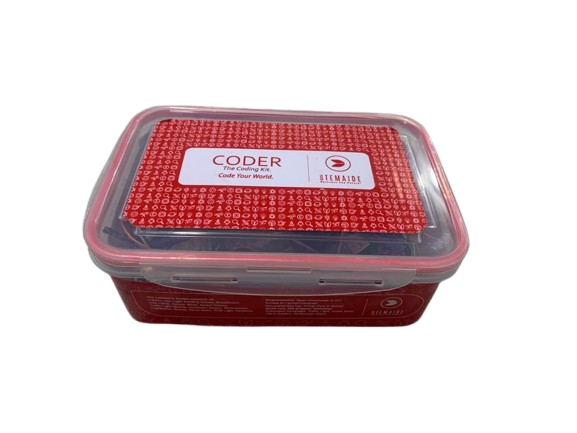

# Project 1.12.17

## Bluetooth Water Level Display

# Project 1.12.17: Bluetooth Water Level Display

**Beginner Embedded Systems Project Using Raspberry Pi Pico 2 W and MicroPython**


# Overview

Build a Bluetooth water level display that sends an estimated tank level to your phone.

This project demonstrates how an analog level sensor can be converted into a simple percentage reading.

The final result should let a phone request the current water level percentage and see whether the level is low or okay.

# Required Components

|  |  |  |  |
| --- | --- | --- | --- |
| <br>Raspberry Pi Pico 2 W | <br>Water level sensor | <br>Breadboard | <br>Jumper wires |
| <br>Phone with BLE app |  |  |  |


# Circuit Connections

| Component Pin     | Connects To | Pico GPIO / Physical Pin Number | Notes                         |
| ----------------- | ----------- | ------------------------------- | ----------------------------- |
| Water sensor VCC  | 3.3V        | Physical pin 36                 | Use 3.3V for ADC-safe testing |
| Water sensor GND  | GND         | Physical pin 38                 | Common ground                 |
| Water sensor AOUT | GPIO 26     | GPIO 26 / physical pin 31       | ADC input                     |

# Step-by-Step Assembly

## Step 1: Place the Raspberry Pi Pico 2 W

Place the Raspberry Pi Pico 2 W on the breadboard so it sits across the center gap.

Keep the USB port facing outward so you can easily connect it to your computer.


---

## Step 2: Place the Water Level Sensor

Place the water level sensor so only the sensing area can touch water.

Keep the Pico, breadboard, USB cable, and jumper wires away from the water container.

Identify VCC, GND, and AOUT before wiring.


---

## Step 3: Connect the Water Sensor Power

Connect water sensor VCC to 3.3V.

Connect water sensor GND to GND.


---

## Step 4: Connect the Water Sensor Signal Pin

Connect water sensor AOUT to GPIO 26.

GPIO 26 is the ADC input used by this project.


---

## Wiring Check

- - Pico 2 W is placed correctly across the breadboard center gap
- - Water sensor VCC connects to 3.3V
- - Water sensor GND connects to GND
- - Water sensor AOUT connects to GPIO 26
- - No loose jumper wires

### Safety Note

Water should touch only the sensor probe area. Keep the Pico, breadboard, USB cable, and jumper wires dry.

---

# Testing Individual Components

Before running the full project, test each part separately. This makes it easier to find wiring or code problems.

## Water Level ADC Test

Check that the analog reading changes as the sensor touches more or less water.

```python
from machine import ADC, Pin
import time

water = ADC(Pin(26))

while True:
    print('Raw water level value:', water.read_u16())
    time.sleep(0.5)
```

**Expected test result:** The printed value should change as the sensor moves between lower and higher water contact.

---

## BLE Advertising Test

Check that the Pico advertises as a BLE device your phone can see.

```python
import bluetooth
import time
from ble_uart import BLEUART

ble = bluetooth.BLE()
ble.active(True)

uart = BLEUART(ble, name='Pico-Tank')
print('Scan for Pico-Tank in your BLE app')

while True:
    time.sleep(1)
```

**Expected test result:** Your phone BLE app should find a device named **Pico-Tank**.

---

# Full Project Code

Upload and run this code after the individual tests work correctly.

```python
from machine import ADC, Pin
import bluetooth
import time
from ble_uart import BLEUART


water = ADC(Pin(26))

ble = bluetooth.BLE()
ble.active(True)
uart = BLEUART(ble, name='Pico-Tank')


def get_water_level_percent():
    return int((water.read_u16() * 100) / 65535)


def water_status(percent):
    if percent < 30:
        return 'LOW'
    return 'OK'


def on_rx(data):
    command = data.decode('utf-8').strip().lower()
    print('Received command:', command)

    level = get_water_level_percent()
    status = water_status(level)

    if command in ('read', 'status', 'water'):
        uart.write(('Water level: {}%
'.format(level)).encode())
        uart.write(('Tank status: {}
'.format(status)).encode())
    elif command == 'help':
        uart.write(b'Commands: read, status, water, help\n')
    else:
        uart.write(b'Unknown command. Send help.\n')


uart.on_rx(on_rx)

last_status = water_status(get_water_level_percent())
print('Bluetooth water level display ready')
print('Send read, status, water, or help from the BLE app')

while True:
    level = get_water_level_percent()
    current_status = water_status(level)
    if current_status != last_status:
        uart.write(('Tank status changed: {} ({}%)
'.format(current_status, level)).encode())
        print('Tank status changed:', current_status, level)
        last_status = current_status
    time.sleep(1)
```

---

# How the Code Works

| Code Section        | What It Does                                                        | Why It Matters                                      |
| ------------------- | ------------------------------------------------------------------- | --------------------------------------------------- |
| ADC water reading   | Reads the analog water level sensor and converts it to a percentage | This turns the raw reading into an easy level value |
| water_status()      | Labels the tank as LOW or OK                                        | Students can quickly understand the result          |
| Bluetooth reply     | Sends the current level and status to the phone when asked          | The phone becomes the display                       |
| Status change check | Sends an update when the level crosses the low threshold            | This adds a simple automatic warning                |

---

# Expected Result

After running the code, your phone BLE app should find `Pico-Tank`. Sending `read`, `status`, or `water` should return the current water level percentage and a tank status such as LOW or OK. If the level crosses the threshold, the Pico should also send an update message.

---

# Troubleshooting

| Problem                     | Possible Cause                                                          | Solution                                                                                               |
| --------------------------- | ----------------------------------------------------------------------- | ------------------------------------------------------------------------------------------------------ |
| Water level never changes   | Sensor wiring is wrong or the sensor is not changing contact with water | Check AOUT on GPIO 26 and test different water levels carefully                                        |
| Phone cannot find Pico-Tank | BLE helper files are missing or Bluetooth is not active                 | Check that `ble_uart.py` and `ble_advertising.py` are saved on the Pico and rerun the advertising test |
| Percentage seems inaccurate | Different water sensors need calibration                                | Treat the value as an estimate and adjust the low threshold after testing your own sensor              |

