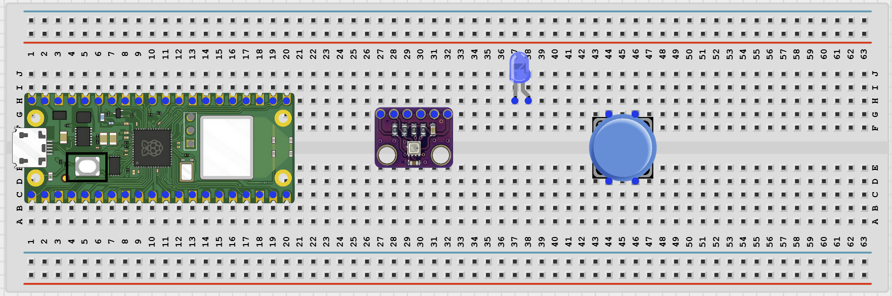
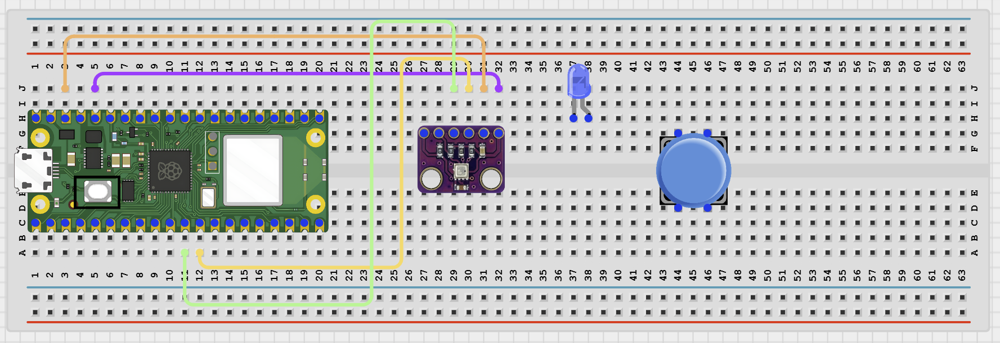
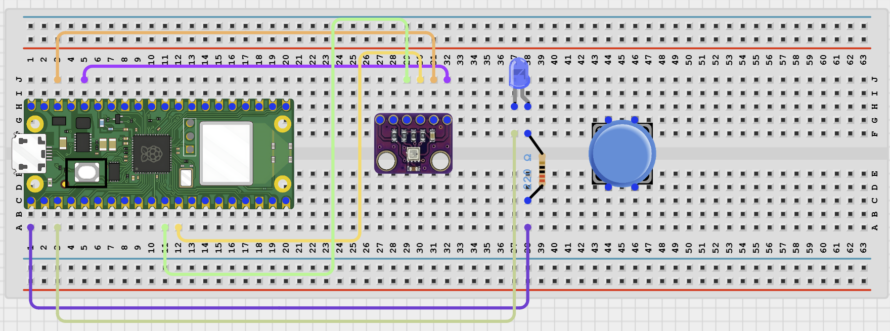
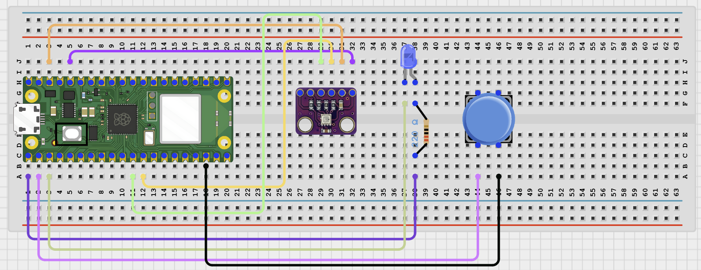

# Project 1.12.18

## Bluetooth Classroom Demo Kit

# Project 1.12.18: Bluetooth Classroom Demo Kit

**Beginner Embedded Systems Project Using Raspberry Pi Pico 2 W and MicroPython**


# Overview

Build a Bluetooth classroom demo kit that combines an LED, a push button, and a BME280 sensor in one project.

This project demonstrates how one Pico can collect several simple inputs and outputs and send the results to a phone.

The final result should let a phone request temperature, humidity, button state, and LED state from the Pico.

# Required Components

|  |  |  |  |
| --- | --- | --- | --- |
| <br>Raspberry Pi Pico 2 W | <br>BME280 sensor module | <br>LED | <br>220Ω resistor |
| <br>Push button | <br>Breadboard | <br>Jumper wires | <br>Phone with BLE app |


# Circuit Connections

| Component Pin          | Connects To               | Pico GPIO / Physical Pin Number | Notes                         |
| ---------------------- | ------------------------- | ------------------------------- | ----------------------------- |
| BME280 VIN / VCC       | 3.3V                      | Physical pin 36                 | Use 3.3V                      |
| BME280 GND             | GND                       | Physical pin 38                 | Common ground                 |
| BME280 SDA             | GPIO 8                    | GPIO 8 / physical pin 11        | I2C0 SDA                      |
| BME280 SCL             | GPIO 9                    | GPIO 9 / physical pin 12        | I2C0 SCL                      |
| LED anode (+)          | 220Ω resistor then GPIO 0 | GPIO 0 / physical pin 1         | LED long leg                  |
| LED cathode (-)        | GND                       | Physical pin 38                 | LED short leg                 |
| Push button one side   | GPIO 1                    | GPIO 1 / physical pin 2         | Uses internal pull-up         |
| Push button other side | GND                       | Physical pin 38                 | Button reads low when pressed |

# Step-by-Step Assembly

## Step 1: Place the Raspberry Pi Pico 2 W

Place the Raspberry Pi Pico 2 W on the breadboard so it sits across the center gap.

Keep the USB port facing outward so you can easily connect it to your computer.


---

## Step 2: Place the BME280, LED, and Push Button

Place the BME280 module on the breadboard.

Place the LED on the breadboard with its two legs in different rows.

Place the push button across the breadboard center gap.

Identify BME280 VIN / VCC, GND, SDA, and SCL before wiring.



---

## Step 3: Connect the BME280

Connect BME280 VIN / VCC to 3.3V.

Connect BME280 GND to GND.

Connect BME280 SDA to GPIO 8.

Connect BME280 SCL to GPIO 9.



---

## Step 4: Connect the LED

Connect the LED long leg to one end of a 220Ω resistor.

Connect the other end of the resistor to GPIO 0.

Connect the LED short leg to GND.



---

## Step 5: Connect the Push Button

Connect one button side to GPIO 1.

Connect the other button side to GND.

The code uses the Pico internal pull-up resistor.



---

## Wiring Check

- - Pico 2 W is placed correctly across the breadboard center gap
- - BME280 VIN / VCC connects to 3.3V
- - BME280 GND connects to GND
- - BME280 SDA connects to GPIO 8
- - BME280 SCL connects to GPIO 9
- - LED long leg connects through a 220Ω resistor to GPIO 0
- - LED short leg connects to GND
- - Push button sits across the breadboard center gap
- - Push button connects to GPIO 1 and GND
- - No loose jumper wires

---

# Testing Individual Components

Before running the full project, test each part separately. This makes it easier to find wiring or code problems.

## I2C Scanner Test

Check that the Pico can detect the BME280 sensor on the I2C bus.

```python
from machine import Pin, I2C

i2c = I2C(0, sda=Pin(8), scl=Pin(9), freq=100000)
print('I2C devices:', i2c.scan())
```

**Expected test result:** The Shell should print at least one I2C address, often 118 or 119 for a BME280 module.

---

## BME280 Sensor Test

Check that temperature and humidity readings can be read.

```python
from machine import Pin, I2C
import time
import BME280

i2c = I2C(0, sda=Pin(8), scl=Pin(9), freq=100000)
bme = BME280.BME280(i2c=i2c)

while True:
    print('Temp:', bme.temperature, 'Humidity:', bme.humidity)
    time.sleep(1)
```

**Expected test result:** The Shell should print changing temperature and humidity readings.

---

## LED Test

Check that the LED wiring works before combining all parts.

```python
from machine import Pin
import time

led = Pin(0, Pin.OUT)
for _ in range(3):
    led.on()
    time.sleep(0.4)
    led.off()
    time.sleep(0.4)
```

**Expected test result:** The LED should blink three times.

---

## Button Test

Check that the button changes state when pressed.

```python
from machine import Pin
import time

button = Pin(1, Pin.IN, Pin.PULL_UP)

while True:
    print('Pressed' if button.value() == 0 else 'Not pressed')
    time.sleep(0.2)
```

**Expected test result:** The Shell should show `Not pressed` normally and `Pressed` when you hold the button down.

---

## BLE Advertising Test

Check that the Pico advertises as a BLE device your phone can see.

```python
import bluetooth
import time
from ble_uart import BLEUART

ble = bluetooth.BLE()
ble.active(True)

uart = BLEUART(ble, name='Pico-Classroom')
print('Scan for Pico-Classroom in your BLE app')

while True:
    time.sleep(1)
```

**Expected test result:** Your phone BLE app should find a device named **Pico-Classroom**.

---

# Full Project Code

Upload and run this code after the individual tests work correctly.

```python
from machine import Pin, I2C
import bluetooth
import time
import BME280
from ble_uart import BLEUART


i2c = I2C(0, sda=Pin(8), scl=Pin(9), freq=100000)
bme = BME280.BME280(i2c=i2c)
led = Pin(0, Pin.OUT)
button = Pin(1, Pin.IN, Pin.PULL_UP)

ble = bluetooth.BLE()
ble.active(True)
uart = BLEUART(ble, name='Pico-Classroom')

last_button = button.value()


def button_state_text():
    return 'Pressed' if button.value() == 0 else 'Not pressed'


def led_state_text():
    return 'ON' if led.value() else 'OFF'


def send_report():
    uart.write(('Temperature: {}
'.format(bme.temperature)).encode())
    uart.write(('Humidity: {}
'.format(bme.humidity)).encode())
    uart.write(('Pressure: {}
'.format(bme.pressure)).encode())
    uart.write(('Button: {}
'.format(button_state_text())).encode())
    uart.write(('LED: {}
'.format(led_state_text())).encode())


def on_rx(data):
    command = data.decode('utf-8').strip().lower()
    print('Received command:', command)

    if command in ('status', 'read'):
        send_report()
    elif command == 'led on':
        led.on()
        uart.write(b'LED ON\n')
    elif command == 'led off':
        led.off()
        uart.write(b'LED OFF\n')
    elif command == 'help':
        uart.write(b'Commands: status, read, led on, led off, help\n')
    else:
        uart.write(b'Unknown command. Send help.\n')


uart.on_rx(on_rx)
led.off()

print('Bluetooth classroom demo kit ready')
print('Send status, read, led on, led off, or help from the BLE app')

while True:
    current_button = button.value()
    if current_button != last_button:
        uart.write(('Button changed: {}
'.format(button_state_text())).encode())
        print('Button changed:', button_state_text())
        last_button = current_button
    time.sleep(0.1)
```

---

# How the Code Works

| Code Section         | What It Does                                           | Why It Matters                                     |
| -------------------- | ------------------------------------------------------ | -------------------------------------------------- |
| BME280 setup         | Reads temperature, humidity, and pressure from sensor  | This provides environmental data for the demo kit  |
| LED and button setup | Creates one output and one input for classroom testing | Students can see and press real hardware           |
| send_report()        | Sends a full summary to the phone                      | The phone gets all demo information in one request |
| Button change check  | Sends a message when the button state changes          | This shows live event reporting over Bluetooth     |

---

# Expected Result

After running the code, your phone BLE app should find `Pico-Classroom`. Sending `status` or `read` should return temperature, humidity, pressure, button state, and LED state. Pressing the button should send a button changed message, and sending `led on` or `led off` should control the LED.

---

# Troubleshooting

| Problem                                    | Possible Cause                                          | Solution                                                                                               |
| ------------------------------------------ | ------------------------------------------------------- | ------------------------------------------------------------------------------------------------------ |
| No I2C device is found                     | SDA and SCL are reversed or the BME280 is not powered   | Check GPIO 8, GPIO 9, 3.3V, and GND wiring                                                             |
| Button always reads pressed or not pressed | The button is wired incorrectly on the breadboard       | Reconnect one side to GPIO 1 and the other side to GND                                                 |
| Phone cannot find Pico-Classroom           | BLE helper files are missing or Bluetooth is not active | Check that `ble_uart.py` and `ble_advertising.py` are saved on the Pico and rerun the advertising test |

