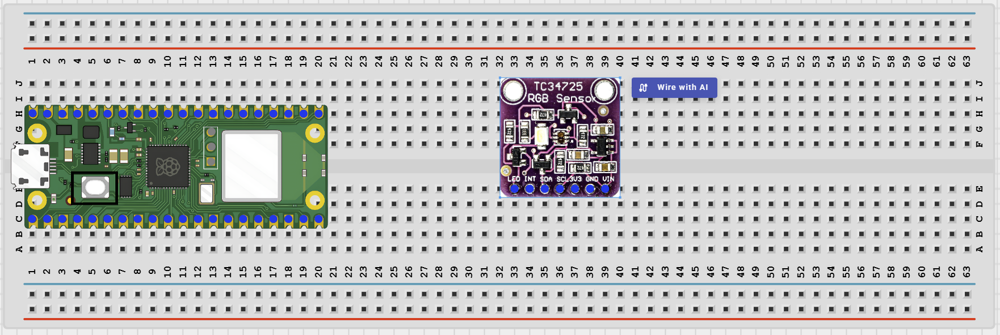
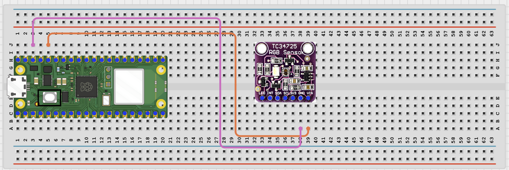
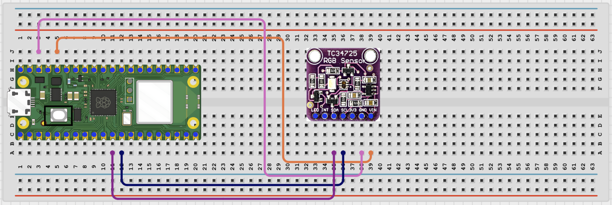

# Project 1.12.20

## Bluetooth Color Detection System

# Project 1.12.20: Bluetooth Color Detection System

**Beginner Embedded Systems Project Using Raspberry Pi Pico 2 W and MicroPython**


# Overview

Build a Bluetooth color detector that reads a TCS34725 color sensor and sends a simple color result to your phone.

This project demonstrates reading red, green, blue, and clear light values from an I2C sensor.

The final result should let a phone request the current detected color along with the raw sensor values.

# Required Components

|  |  |  |  |
| --- | --- | --- | --- |
| <br>Raspberry Pi Pico 2 W | <br>TCS34725 Color Sensor | <br>Jumper Wires | <br>Breadboard |
| <br>Phone with BLE App |  |  |  |


# Circuit Connections

| Component Pin      | Connects To | Pico GPIO / Physical Pin Number | Notes         |
| ------------------ | ----------- | ------------------------------- | ------------- |
| TCS34725 VIN / VCC | 3.3V        | Physical Pin 36                 | Use 3.3V      |
| TCS34725 GND       | GND         | Physical Pin 38                 | Common ground |
| TCS34725 SDA       | GPIO 8      | GPIO 8 / Physical Pin 11        | I2C0 SDA      |
| TCS34725 SCL       | GPIO 9      | GPIO 9 / Physical Pin 12        | I2C0 SCL      |

# Step-by-Step Assembly

## Step 1: Place the Raspberry Pi Pico 2 W

Place the Raspberry Pi Pico 2 W on the breadboard so it sits across the center gap.

Keep the USB port facing outward so you can easily connect it to your computer.


---

## Step 2: Place the TCS34725 Module

Place the TCS34725 module on the breadboard.

Identify:

- VIN / VCC
- GND
- SDA
- SCL

before wiring.

Check the printed labels because module pin order may vary.



---

## Step 3: Connect TCS34725 Power

Connect:

- TCS34725 VIN / VCC -> 3.3V
- TCS34725 GND -> GND



---

## Step 4: Connect TCS34725 I2C Pins

Connect:

- TCS34725 SDA -> GPIO 8
- TCS34725 SCL -> GPIO 9



---

## Wiring Check

- - Pico 2W is placed correctly across the breadboard center gap
- - TCS34725 VIN / VCC connects to 3.3V
- - TCS34725 GND connects to GND
- - TCS34725 SDA connects to GPIO 8
- - TCS34725 SCL connects to GPIO 9
- - No loose jumper wires

### Beginner Note

> Color readings can change with room lighting. Test under steady light and hold colored objects close to the sensor.

---

# Testing Individual Components

Before running the full project, test each part separately. This makes it easier to find wiring or code problems.

## I2C Scanner Test

Check that the Pico can detect the color sensor on the I2C bus.

```python
from machine import Pin, I2C

i2c = I2C(0, sda=Pin(8), scl=Pin(9), freq=400000)

print('I2C devices:', i2c.scan())
```

### Expected Test Result

The Shell should print at least one I2C address. A TCS34725 module is often found at address **0x29**.

---

## Color Sensor Raw Test

Check that the sensor can return raw red, green, blue, and clear values.

```python
from machine import Pin, I2C
import time
import tcs34725

i2c = I2C(0, sda=Pin(8), scl=Pin(9), freq=400000)

sensor = tcs34725.TCS34725(i2c)
sensor.gain(4)

while True:
    r, g, b, c = sensor.read(True)

    print('R:', r,
          'G:', g,
          'B:', b,
          'C:', c)

    time.sleep(0.5)
```

### Expected Test Result

The raw values should change when you place different colored objects in front of the sensor.

---

## BLE Advertising Test

Check that the Pico advertises as a BLE device your phone can see.

```python
import bluetooth
import time
from ble_uart import BLEUART

ble = bluetooth.BLE()
ble.active(True)

uart = BLEUART(ble, name='Pico-Color')

print('Scan for Pico-Color in your BLE app')

while True:
    time.sleep(1)
```

### Expected Test Result

Your phone BLE app should find a device named **Pico-Color**.

---

# Full Project Code

```python
from machine import Pin, I2C
import bluetooth
import time
import tcs34725
from ble_uart import BLEUART

i2c = I2C(0, sda=Pin(8), scl=Pin(9), freq=400000)

sensor = tcs34725.TCS34725(i2c)
sensor.gain(4)

ble = bluetooth.BLE()
ble.active(True)

uart = BLEUART(ble, name='Pico-Color')


def detect_color(r, g, b, clear):

    if clear < 100:
        return 'Too dark'

    if r > g * 1.2 and r > b * 1.2:
        return 'Red'

    if g > r * 1.2 and g > b * 1.2:
        return 'Green'

    if b > r * 1.2 and b > g * 1.2:
        return 'Blue'

    if r > 200 and g > 200 and b < 150:
        return 'Yellow'

    return 'Mixed'


def read_color_report():
    r, g, b, c = sensor.read(True)

    color_name = detect_color(r, g, b, c)

    return color_name, r, g, b, c


def on_rx(data):

    command = data.decode('utf-8').strip().lower()

    print('Received command:', command)

    if command in ('read', 'status', 'color'):

        color_name, r, g, b, c = read_color_report()

        uart.write(('Color: {}\n'.format(color_name)).encode())
        uart.write(('R:{} G:{} B:{} C:{}\n'.format(r, g, b, c)).encode())

    elif command == 'help':
        uart.write(b'Commands: read, status, color, help\n')

    else:
        uart.write(b'Unknown command. Send help.\n')


uart.on_rx(on_rx)

print('Bluetooth color detector ready')
print('Place a colored object near the sensor and send read, status, color, or help')

while True:
    time.sleep(0.1)
```

---

# How the Code Works

| Code Section             | What It Does                                         | Why It Matters                                                |
| ------------------------ | ---------------------------------------------------- | ------------------------------------------------------------- |
| I2C color sensor setup   | Starts the TCS34725 sensor on the I2C bus            | The Pico needs the driver and correct pins to read color data |
| `detect_color()`         | Converts raw sensor values into a simple color label | Makes the results easier for beginners to understand          |
| `read_color_report()`    | Reads the sensor and packages one full report        | Keeps the Bluetooth code cleaner and easier to follow         |
| Bluetooth status command | Sends the detected color and raw values to the phone | Students can compare the label with the sensor numbers        |

---

# Expected Result

After running the code, your phone BLE app should find **Pico-Color**.

Sending:

- `read`
- `status`
- `color`

should return:

- A simple color label such as:
  - Red
  - Green
  - Blue
  - Yellow
  - Mixed
  - Too dark

and the raw sensor values.

---

# Troubleshooting

| Problem                     | Possible Cause                                                 | Solution                                                        |
| --------------------------- | -------------------------------------------------------------- | --------------------------------------------------------------- |
| No I2C device is found      | SDA and SCL are reversed or the sensor is not powered          | Check GPIO 8, GPIO 9, 3.3V, and GND wiring                      |
| Import error for `tcs34725` | The `tcs34725.py` file is missing from the Pico                | Save `tcs34725.py` to the Pico root folder and try again        |
| Detected color seems wrong  | Lighting conditions are changing or the object is too far away | Test under steady light and hold the object close to the sensor |

