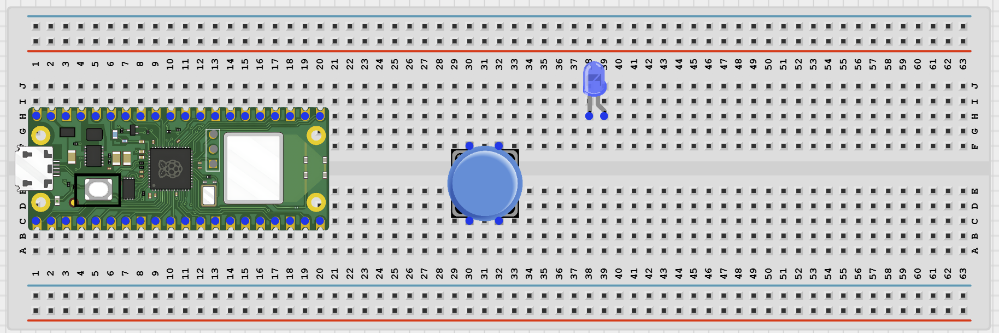
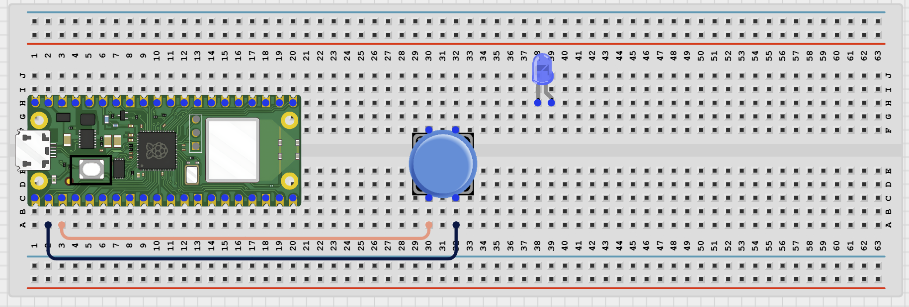
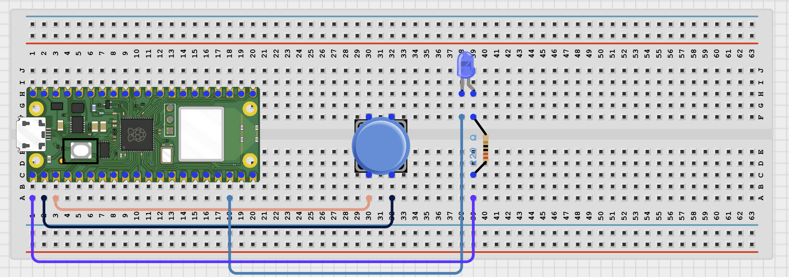

# Project 1.12.22

## Bluetooth Emergency Alert

# Project 1.12.22: Bluetooth Emergency Alert

**Beginner Embedded Systems Project Using Raspberry Pi Pico 2 W and MicroPython**


# Overview

Build a Bluetooth emergency alert button that sends a warning message when pressed.

This project demonstrates how a simple button can trigger an important wireless message.

The final result should let a phone connect to the Pico and receive an emergency alert when the button is pressed.

# Required Components

|  |  |  |  |
| --- | --- | --- | --- |
| <br>Raspberry Pi Pico 2 W | <br>Push Button | <br>LED | <br>220Ω Resistor |
| <br>Breadboard | <br>Jumper Wires | <br>Phone with BLE App |  |


# Circuit Connections

| Component Pin          | Connects To               | Pico GPIO / Physical Pin Number | Notes                         |
| ---------------------- | ------------------------- | ------------------------------- | ----------------------------- |
| Push button one side   | GPIO 1                    | GPIO 1 / Physical Pin 2         | Uses internal pull-up         |
| Push button other side | GND                       | Physical Pin 38                 | Button reads LOW when pressed |
| LED anode (+)          | 220Ω resistor then GPIO 0 | GPIO 0 / Physical Pin 1         | LED long leg                  |
| LED cathode (-)        | GND                       | Physical Pin 38                 | LED short leg                 |

# Step-by-Step Assembly

## Step 1: Place the Raspberry Pi Pico 2 W

Place the Raspberry Pi Pico 2 W on the breadboard so it sits across the center gap.

Keep the USB port facing outward so you can easily connect it to your computer.


---

## Step 2: Place the Push Button and LED

Place the push button across the breadboard center gap.

Place the LED on the breadboard with its two legs in different rows.

The LED long leg is the anode (+), and the short leg is the cathode (-).



---

## Step 3: Connect the Push Button

Connect:

- One side of the push button -> GPIO 1
- Other side of the push button -> GND



---

## Step 4: Connect the Alert LED

Connect:

- LED long leg -> 220Ω resistor -> GPIO 0
- LED short leg -> GND



---

## Wiring Check

- - Pico 2W is placed correctly across the breadboard center gap
- - Push button sits across the breadboard center gap
- - Push button connects to GPIO 1 and GND
- - LED long leg connects through a 220Ω resistor to GPIO 0
- - LED short leg connects to GND
- - No loose jumper wires

### Safety Note

> This is a classroom learning project, not a certified emergency system. The wireless alert works only when the phone is connected nearby.

---

# Testing Individual Components

Before running the full project, test each part separately. This makes it easier to find wiring or code problems.

## Button Test

Check that the button changes state when pressed.

```python
from machine import Pin
import time

button = Pin(1, Pin.IN, Pin.PULL_UP)

while True:
    print('Pressed' if button.value() == 0 else 'Not pressed')
    time.sleep(0.2)
```

### Expected Test Result

The Shell should show **Not pressed** normally and **Pressed** when you hold the button down.

---

## LED Test

Check that the LED wiring works before combining it with Bluetooth.

```python
from machine import Pin
import time

led = Pin(0, Pin.OUT)

for _ in range(3):
    led.on()
    time.sleep(0.4)
    led.off()
    time.sleep(0.4)
```

### Expected Test Result

The LED should blink three times.

---

## BLE Advertising Test

Check that the Pico advertises as a BLE device your phone can see.

```python
import bluetooth
import time
from ble_uart import BLEUART

ble = bluetooth.BLE()
ble.active(True)

uart = BLEUART(ble, name='Pico-Alert')

print('Scan for Pico-Alert in your BLE app')

while True:
    time.sleep(1)
```

### Expected Test Result

Your phone BLE app should find a device named **Pico-Alert**.

---

# Full Project Code

```python
from machine import Pin
import bluetooth
import time
from ble_uart import BLEUART

button = Pin(1, Pin.IN, Pin.PULL_UP)
led = Pin(0, Pin.OUT)

ble = bluetooth.BLE()
ble.active(True)
uart = BLEUART(ble, name='Pico-Alert')

alert_sent = False


def on_rx(data):
    command = data.decode('utf-8').strip().lower()
    print('Received command:', command)

    if command == 'status':
        state = 'READY' if not alert_sent else 'ALERT SENT - RELEASE BUTTON TO RESET'
        uart.write(('Alert status: {}\n'.format(state)).encode())

    elif command == 'help':
        uart.write(b'Commands: status, help\n')

    else:
        uart.write(b'Unknown command. Send help.\n')


uart.on_rx(on_rx)

led.off()

print('Bluetooth emergency alert ready')
print('Press the button to send an alert')

while True:

    if button.value() == 0 and not alert_sent:

        led.on()
        uart.write(b'EMERGENCY ALERT!\n')
        print('Emergency alert sent')

        alert_sent = True

    elif button.value() == 1 and alert_sent:

        led.off()
        alert_sent = False

        uart.write(b'Alert reset. Ready again.\n')
        print('Alert reset')

    time.sleep(0.1)
```

---

# How the Code Works

| Code Section             | What It Does                                                | Why It Matters                             |
| ------------------------ | ----------------------------------------------------------- | ------------------------------------------ |
| Button input             | Reads the emergency button on GPIO 1                        | The project needs one clear trigger action |
| `alert_sent` variable    | Prevents the same button press from sending repeated alerts | One press produces one alert               |
| LED indicator            | Turns on when the alert is active and off when reset        | Provides local visual feedback             |
| Bluetooth alert messages | Sends alert and reset messages to the phone                 | The phone becomes the remote alert display |

---

# Expected Result

After running the code, your phone BLE app should find **Pico-Alert**.

Pressing the button should:

- Turn on the LED
- Send **EMERGENCY ALERT!** to the phone once

Releasing the button should:

- Turn off the LED
- Reset the alert system
- Send a ready message

---

# Troubleshooting

| Problem                          | Possible Cause                                      | Solution                                                             |
| -------------------------------- | --------------------------------------------------- | -------------------------------------------------------------------- |
| Pressing the button does nothing | Button wired incorrectly or not connected to GPIO 1 | Reconnect one side to GPIO 1 and the other side to GND               |
| LED does not turn on             | LED polarity reversed or resistor missing           | Check LED polarity, resistor, and GPIO 0 wiring                      |
| Phone cannot find Pico-Alert     | BLE helper files missing or Bluetooth inactive      | Verify helper files are installed and rerun the BLE advertising test |

