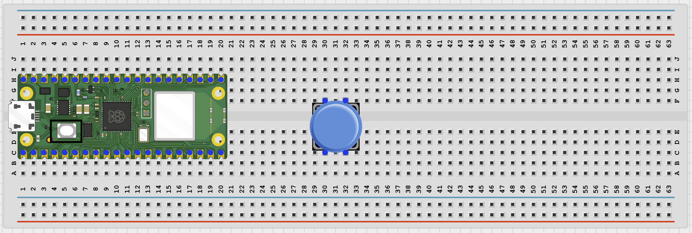
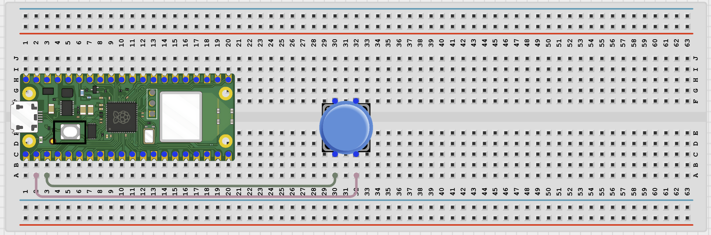

# Project 1.12.23

## Bluetooth Doorbell

# Project 1.12.23: Bluetooth Doorbell

**Beginner Embedded Systems Project Using Raspberry Pi Pico 2 W and MicroPython**


# Overview

Build a Bluetooth doorbell that sends a ring message to your phone when a button is pressed.

This project demonstrates how a simple button can trigger a wireless event message.

The final result should let a phone connect to the Pico and receive a **DOORBELL RINGING!** message each time the button is pressed.

# Required Components

|  |  |  |  |
| --- | --- | --- | --- |
| <br>Raspberry Pi Pico 2 W | <br>Push Button | <br>Breadboard | <br>Jumper Wires |
| <br>Phone with BLE App |  |  |  |


# Circuit Connections

| Component Pin          | Connects To      | Pico GPIO / Physical Pin Number | Notes                         |
| ---------------------- | ---------------- | ------------------------------- | ----------------------------- |
| Push button one side   | GPIO 1           | GPIO 1 / Physical Pin 2         | Uses internal pull-up         |
| Push button other side | GND              | Physical Pin 38                 | Button reads LOW when pressed |
| Pico onboard LED       | Built into board | `Pin('LED')` in code            | No extra wiring needed        |

# Step-by-Step Assembly

## Step 1: Place the Raspberry Pi Pico 2 W

Place the Raspberry Pi Pico 2 W on the breadboard so it sits across the center gap.

Keep the USB port facing outward so you can easily connect it to your computer.


---

## Step 2: Place the Push Button

Place the push button across the breadboard center gap.

This keeps the two sides of the button on separate breadboard rows.

This project uses the Pico onboard LED, so no external LED wiring is needed.



---

## Step 3: Connect the Button

Connect:

- One side of the push button -> GPIO 1
- Other side of the push button -> GND



---

## Wiring Check

- - Pico 2 W is placed correctly across the breadboard center gap
- - Push button sits across the breadboard center gap
- - Push button connects to GPIO 1 and GND
- - Pico onboard LED requires no external wiring
- - No loose jumper wires

---

# Testing Individual Components

Before running the full project, test each part separately. This makes it easier to find wiring or code problems.

## Button Test

Check that the button changes state when pressed.

```python
from machine import Pin
import time

button = Pin(1, Pin.IN, Pin.PULL_UP)

while True:
    print('Pressed' if button.value() == 0 else 'Not pressed')
    time.sleep(0.2)
```

### Expected Test Result

The Shell should show **Not pressed** normally and **Pressed** when you hold the button down.

---

## Onboard LED Test

Check that the Pico onboard LED can be controlled.

```python
from machine import Pin
import time

led = Pin('LED', Pin.OUT)

for _ in range(3):
    led.on()
    time.sleep(0.4)
    led.off()
    time.sleep(0.4)
```

### Expected Test Result

The onboard LED should blink three times.

---

## BLE Advertising Test

Check that the Pico advertises as a BLE device your phone can see.

```python
import bluetooth
import time
from ble_uart import BLEUART

ble = bluetooth.BLE()
ble.active(True)

uart = BLEUART(ble, name='Pico-Doorbell')

print('Scan for Pico-Doorbell in your BLE app')

while True:
    time.sleep(1)
```

### Expected Test Result

Your phone BLE app should find a device named **Pico-Doorbell**.

---

# Full Project Code

```python
from machine import Pin
import bluetooth
import time
from ble_uart import BLEUART

button = Pin(1, Pin.IN, Pin.PULL_UP)
led = Pin('LED', Pin.OUT)

ble = bluetooth.BLE()
ble.active(True)

uart = BLEUART(ble, name='Pico-Doorbell')

last_pressed = 1
ring_count = 0


def on_rx(data):
    command = data.decode('utf-8').strip().lower()

    print('Received command:', command)

    if command == 'status':
        uart.write(
            ('Doorbell rings: {}\n'.format(ring_count)).encode()
        )

    elif command == 'help':
        uart.write(
            b'Commands: status, help\n'
        )

    else:
        uart.write(
            b'Unknown command. Send help.\n'
        )


uart.on_rx(on_rx)

led.off()

print('Bluetooth doorbell ready')
print('Press the button to ring the doorbell')

while True:

    pressed = button.value()

    if pressed == 0 and last_pressed == 1:

        ring_count += 1

        led.on()

        uart.write(b'DOORBELL RINGING!\n')
        uart.write(
            ('Ring count: {}\n'.format(ring_count)).encode()
        )

        print('Doorbell ringing')

    elif pressed == 1:
        led.off()

    last_pressed = pressed

    time.sleep(0.05)
```

---

# How the Code Works

| Code Section            | What It Does                         | Why It Matters                                          |
| ----------------------- | ------------------------------------ | ------------------------------------------------------- |
| Button input            | Reads the doorbell button on GPIO 1  | The project needs a press event to trigger the ring     |
| `last_pressed` variable | Detects a new press only once        | Prevents one long press from sending many ring messages |
| `ring_count`            | Stores how many rings occurred       | The phone can request the current count                 |
| Onboard LED             | Turns on while the button is pressed | Provides local feedback as well as Bluetooth feedback   |

---

# Expected Result

After running the code, your phone BLE app should find **Pico-Doorbell**.

Pressing the button should:

- Send **DOORBELL RINGING!** to the phone
- Increment the ring counter
- Turn on the Pico onboard LED while pressed

Sending:

```text
status
```

should return the current ring count.

---

# Troubleshooting

| Problem                          | Possible Cause                                      | Solution                                                             |
| -------------------------------- | --------------------------------------------------- | -------------------------------------------------------------------- |
| Pressing the button does nothing | Button wired incorrectly or not connected to GPIO 1 | Reconnect one side to GPIO 1 and the other side to GND               |
| Doorbell sends too many messages | Button bounce or button held too long               | Keep the short delay and verify button wiring                        |
| Phone cannot find Pico-Doorbell  | BLE helper files missing or Bluetooth inactive      | Verify helper files are installed and rerun the BLE advertising test |

