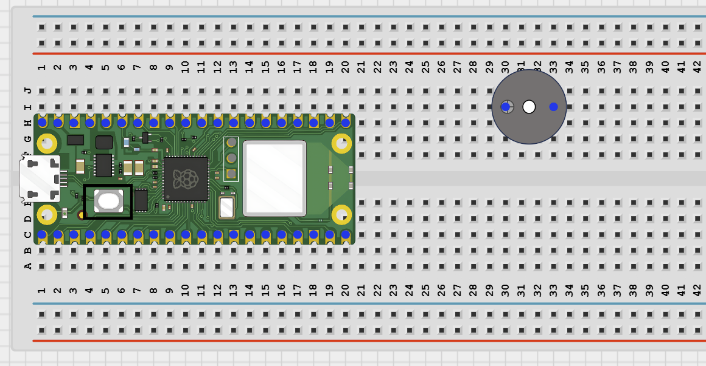
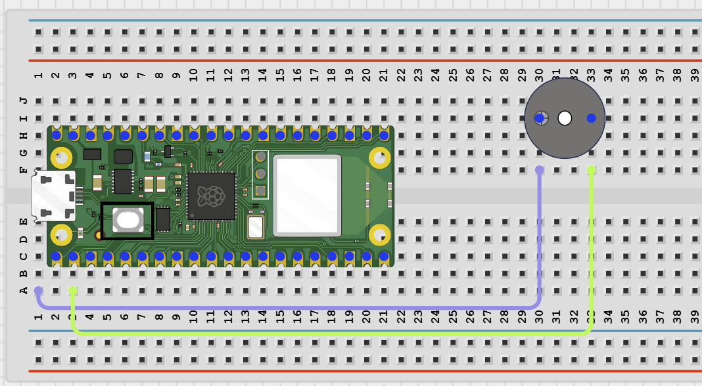

# Project 1.12.27

## Bluetooth Smart Buzzer

# Project 1.12.27: Bluetooth Smart Buzzer

**Beginner Embedded Systems Project Using Raspberry Pi Pico 2 W and MicroPython**


# Overview

Build a Bluetooth smart buzzer that can play different beep patterns from phone commands.

This project demonstrates how one output device can perform several behaviors using simple patterns.

The final result should let a phone choose from several buzzer patterns and hear the selected sound pattern.

# Required Components

|  |  |  |  |
| --- | --- | --- | --- |
| <br>Raspberry Pi Pico 2 W | <br>Active buzzer | <br>Breadboard | <br>Jumper wires |
| <br>Phone with BLE app |  |  |  |


# Circuit Connections

| Component Pin       | Connects To | Pico GPIO / Physical Pin Number | Notes                                      |
| ------------------- | ----------- | ------------------------------- | ------------------------------------------ |
| Buzzer positive (+) | GPIO 0      | GPIO 0 / Physical Pin 1         | Use a driver if buzzer current is too high |
| Buzzer negative (-) | GND         | Physical Pin 38                 | Common ground                              |

# Step-by-Step Assembly

## Step 1: Place the Raspberry Pi Pico 2 W

Place the Raspberry Pi Pico 2 W on the breadboard so it sits across the center gap.

Keep the USB port facing outward so you can easily connect it to your computer.


---

## Step 2: Place the Active Buzzer

Place the active buzzer on the breadboard.

Identify the positive (+) and negative (-) pins before wiring.

Use a small 3.3V-safe buzzer or a driver if your buzzer needs more current.



---

## Step 3: Connect the Buzzer

### Connect the Positive Pin

Connect the buzzer positive (+) pin to **GPIO 0**.

### Connect the Negative Pin

Connect the buzzer negative (-) pin to **GND**.



---

## Wiring Check

- - Pico 2 W is placed correctly across the breadboard center gap
- - Buzzer positive pin connects to GPIO 0
- - Buzzer negative pin connects to GND
- - No loose jumper wires

### Beginner Note

This project uses an **active buzzer**. A passive buzzer requires different code to generate tones.

---

# Testing Individual Components

Before running the full project, test each part separately. This makes it easier to find wiring or code problems.

## Buzzer Test

Check that the buzzer can sound before adding Bluetooth code.

```python
from machine import Pin
import time

buzzer = Pin(0, Pin.OUT)

buzzer.on()
time.sleep(0.3)
buzzer.off()
```

### Expected Test Result

The buzzer should sound briefly.

---

## BLE Advertising Test

Check that the Pico advertises as a BLE device your phone can see.

```python
import bluetooth
import time
from ble_uart import BLEUART

ble = bluetooth.BLE()
ble.active(True)

uart = BLEUART(ble, name='Pico-SmartBuzzer')

print('Scan for Pico-SmartBuzzer in your BLE app')

while True:
    time.sleep(1)
```

### Expected Test Result

Your phone BLE app should find a device named **Pico-SmartBuzzer**.

---

# Full Project Code

Upload and run this code after the individual tests work correctly.

```python
from machine import Pin
import bluetooth
import time
from ble_uart import BLEUART

buzzer = Pin(0, Pin.OUT)

ble = bluetooth.BLE()
ble.active(True)
uart = BLEUART(ble, name='Pico-SmartBuzzer')

patterns = {
    '1': [1, 0, 1, 0, 1, 0],
    '2': [1, 1, 0, 1, 1, 0],
    '3': [1, 1, 1, 0, 0, 0],
}

last_pattern = 'None'


def play_pattern(pattern_name):
    global last_pattern

    pattern = patterns[pattern_name]
    last_pattern = pattern_name

    for value in pattern:
        buzzer.value(1 if value else 0)
        time.sleep(0.2)

    buzzer.off()


def on_rx(data):
    command = data.decode('utf-8').strip().lower()
    print('Received command:', command)

    if command in patterns:
        uart.write(('Playing pattern {}\n'.format(command)).encode())
        play_pattern(command)

    elif command == 'status':
        uart.write(('Last pattern: {}\n'.format(last_pattern)).encode())

    elif command == 'help':
        uart.write(b'Commands: 1, 2, 3, status, help\n')

    else:
        uart.write(b'Unknown command. Send help.\n')


uart.on_rx(on_rx)

buzzer.off()

print('Bluetooth smart buzzer ready')
print('Send 1, 2, 3, status, or help from the BLE app')

while True:
    time.sleep(0.1)
```

---

# How the Code Works

| Code Section              | What It Does                                             | Why It Matters                                  |
| ------------------------- | -------------------------------------------------------- | ----------------------------------------------- |
| `patterns` dictionary     | Stores several beep patterns using simple 1 and 0 values | Makes it easy to add more buzzer patterns later |
| `play_pattern()`          | Loops through one chosen pattern and drives the buzzer   | Main sound behavior of the project              |
| `last_pattern` variable   | Remembers the most recent pattern used                   | Provides status feedback to the phone           |
| Bluetooth command handler | Chooses which pattern to play from phone commands        | Makes the buzzer wireless and interactive       |

---

# Expected Result

After running the code:

1. Your BLE app should find **Pico-SmartBuzzer**.
2. Sending `1`, `2`, or `3` should play different buzzer patterns.
3. Sending `status` should return the last pattern that was played.
4. Sending `help` should display available commands.

---

# Troubleshooting

| Problem                            | Possible Cause                                   | Solution                                                                                         |
| ---------------------------------- | ------------------------------------------------ | ------------------------------------------------------------------------------------------------ |
| Buzzer makes no sound              | Incorrect wiring or requires a driver transistor | Check polarity, run the buzzer test, and add a driver if needed                                  |
| Pattern sounds unclear             | Timing or buzzer characteristics differ          | Test with a simple pattern and adjust timing values                                              |
| Phone cannot find Pico-SmartBuzzer | Missing BLE helper files or Bluetooth disabled   | Verify `ble_uart.py` and `ble_advertising.py` are on the Pico and rerun the BLE advertising test |

