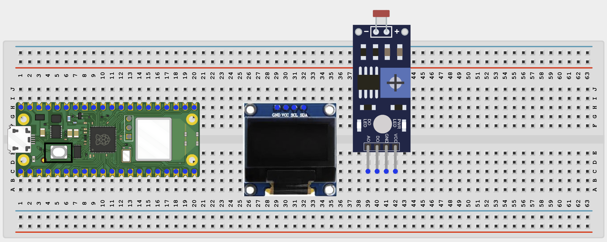
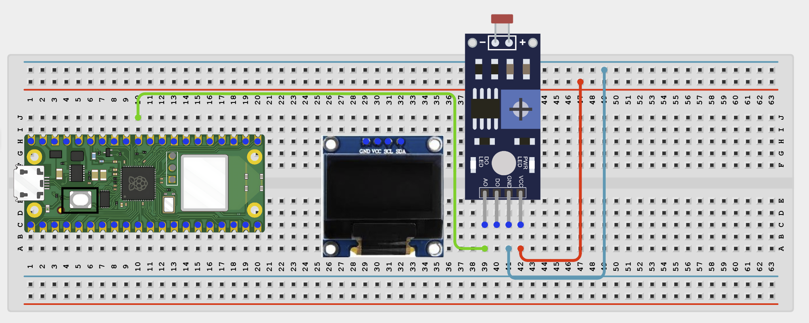
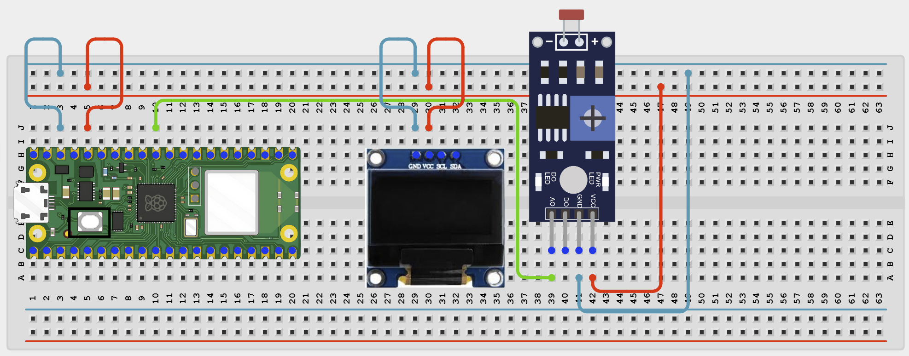
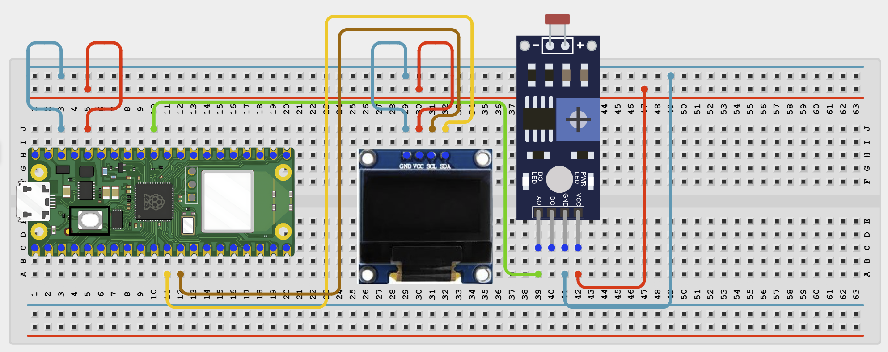

# Project 1.2.10
## Light Intensity Meter
# Overview

Build a light meter using an LDR voltage-divider circuit and an OLED display.

This project demonstrates analog light sensing, ADC readings, and OLED output with MicroPython.

The final result should show the raw LDR reading, a light percentage, and a clear light status on the OLED and in the Thonny Shell.

# Required Components

|  |  |  |  |
| --- | --- | --- | --- |
|  Raspberry Pi Pico 2 W |  LDR |  SH1106 OLED display |  Breadboard |
|  Jumper wires |  |  |  |

# Circuit Connections

| Component Pin | Connects To | Pico GPIO / Physical Pin Number | Notes |
| --- | --- | --- | --- |
| LDR leg 1 | 3.3V | Physical pin 36 | Top side of the voltage divider |
| LDR leg 2 | GPIO 26 / ADC0 | GPIO 26 / physical pin 31 | Signal row shared with the resistor |
| 10kΩ resistor one end | Same row as LDR leg 2 and GPIO 26 | GPIO 26 / physical pin 31 | Creates the voltage-divider signal point |
| 10kΩ resistor other end | GND | Physical pin 38 | Pull-down side of the voltage divider |
| OLED VCC | 3.3V | Physical pin 36 | Use a 3.3V-compatible module |
| OLED GND | GND | Physical pin 38 |  |
| OLED SDA | GPIO 8 | GPIO 8 / physical pin 11 | I2C data line for the OLED |
| OLED SCL | GPIO 9 | GPIO 9 / physical pin 12 | I2C clock line for the OLED |

# Step-by-Step Assembly

### Step 1: Place the Raspberry Pi Pico 2W

Place the Raspberry Pi Pico 2W on the breadboard so it sits across the center gap.

Keep the USB port facing outward so you can easily connect it to your computer.

### Step 2: Place the LDR, and OLED Display

Place the LDR on the breadboard where it can be exposed to room light.

Place the SH1106 OLED display module on the breadboard.

Identify VCC, GND, SDA, and SCL on the OLED display before wiring.

### Step 3: Build the LDR Voltage Divider

Connect LDR VCC to 3.3V.

Connect LDR A0 to GPIO 26 / ADC0.

Connect LDR GND to Pico GND

### Step 4: Connect OLED Power

Connect OLED VCC to 3.3V.

Connect OLED GND to GND.

### Step 5: Connect OLED I2C Pins

Connect OLED SDA to GPIO 8.

Connect OLED SCL to GPIO 9.

## Wiring Check

✓ Pico 2W is placed correctly across the breadboard center gap

✓ Pico 2W USB port faces outward

✓ LDR leg 1 connects to 3.3V

✓ LDR leg 2 connects to GPIO 26 / ADC0

✓ Other end of the 10kΩ resistor connects to GND

✓ OLED VCC connects to 3.3V

✓ OLED GND connects to GND

✓ OLED SDA connects to GPIO 8

✓ OLED SCL connects to GPIO 9

✓ No loose jumper wires are touching nearby rows

## Beginner Note

An LDR module detects light using a light-dependent resistor and an onboard resistor circuit. The Pico reads the module’s AO/AOUT pin through GPIO 26 as an analog value. The reading changes when the light level changes.

The LDR module gives a relative light level for this project, not an accurate lux measurement.

# Testing Individual Components

Before running the full project, test each part separately. This makes it easier to find wiring or code problems.

## LDR sensor test

Check that the Pico can read changing analog values from the LDR voltage divider.

| from machine import Pin, ADC
import time

ldr = ADC(Pin(26))

while True:
    raw = ldr.read_u16()
    print('LDR raw:', raw)
    time.sleep(1) |
| --- |

Expected test result: The raw value should change when you cover the LDR or expose it to more light.

## OLED I2C scanner test

Check that the OLED appears on the I2C bus. The LDR will not appear because it is connected to ADC, not I2C.

| from machine import Pin, I2C

i2c = I2C(0, sda=Pin(8), scl=Pin(9), freq=400000)
print([hex(addr) for addr in i2c.scan()]) |
| --- |

Expected test result: You should see the OLED address, commonly 0x3c. Do not expect an LDR address.

## OLED text test

Check that the OLED driver works.

| from machine import Pin, I2C
import sh1106

i2c = I2C(0, sda=Pin(8), scl=Pin(9), freq=400000)
display = sh1106.SH1106_I2C(128, 64, i2c)
display.fill(0)
display.text('OLED OK', 28, 28, 1)
display.show() |
| --- |

Expected test result: The OLED should show OLED OK.

# Full Project Code

After completing and checking the circuit connections, open Thonny IDE. Copy and paste the code below into a new file, or upload the project file to the Raspberry Pi Pico 2 W, then run it from Thonny.

| from machine import Pin, ADC, I2C
import sh1106
import time

ldr = ADC(Pin(26))
i2c = I2C(0, sda=Pin(8), scl=Pin(9), freq=400000)
display = sh1106.SH1106_I2C(128, 64, i2c)

print('LDR light meter ready')

def read_light_percent():
    raw = ldr.read_u16()
    percent = int((raw / 65535) * 100)
    return raw, percent

def light_status(percent):
    if percent < 30:
        return 'DARK'
    elif percent < 70:
        return 'NORMAL'
    else:
        return 'BRIGHT'

while True:
    raw, percent = read_light_percent()
    status = light_status(percent)

    display.fill(0)
    display.text('LDR Light Meter', 4, 8, 1)
    display.text('Raw: {}'.format(raw), 4, 28, 1)
    display.text('Light: {}%'.format(percent), 4, 40, 1)
    display.text(status, 4, 52, 1)
    display.show()

    print('Raw:', raw, '\| Light:', percent, '% \|', status)
    time.sleep(1) |
| --- |

# How the Code Works

| Code Section | What It Does | Why It Matters |
| --- | --- | --- |
| ADC(Pin(26)) | Sets GPIO 26 as an analog input | Lets the Pico read the LDR voltage-divider output |
| read_u16() | Reads the raw ADC value from the LDR circuit | Gives a changing number as the light level changes |
| read_light_percent() | Converts the raw ADC value into a percentage | Makes the reading easier to understand |
| light_status() | Classifies the percentage as DARK, NORMAL, or BRIGHT | Turns the reading into a clear status |
| OLED update | Shows raw value, percentage, and status on the display | Makes the project readable without watching the Shell |

# Expected Result

The OLED should show the raw LDR value, light percentage, and light status. The readings should change when the LDR is covered or exposed to light. The Thonny Shell should print the same data every second.

# Troubleshooting

| Problem | Possible Cause | Solution |
| --- | --- | --- |
| LDR value never changes | Voltage divider wiring is incorrect | Check that LDR leg 1 connects to 3.3V, LDR leg 2 shares a row with GPIO 26, and the 10kΩ resistor connects from that row to GND. |
| Value changes in reverse | LDR and resistor positions may be reversed | Swap the LDR and resistor positions in the divider, or adjust the code interpretation after testing. |
| OLED is blank | Missing sh1106.py or bad OLED wiring | Save sh1106.py to the Pico root folder and recheck OLED VCC, GND, SDA, and SCL. |
| Display works but light value does not change | GPIO 26 is not connected to the voltage-divider signal row | Check the jumper wire from GPIO 26 / ADC0 to the shared LDR and resistor row. |
