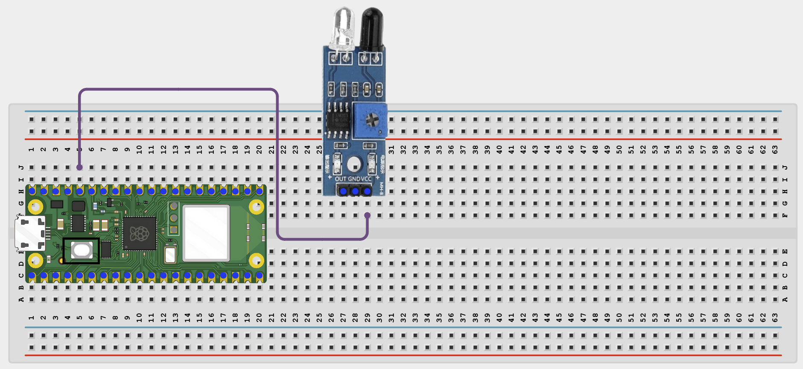
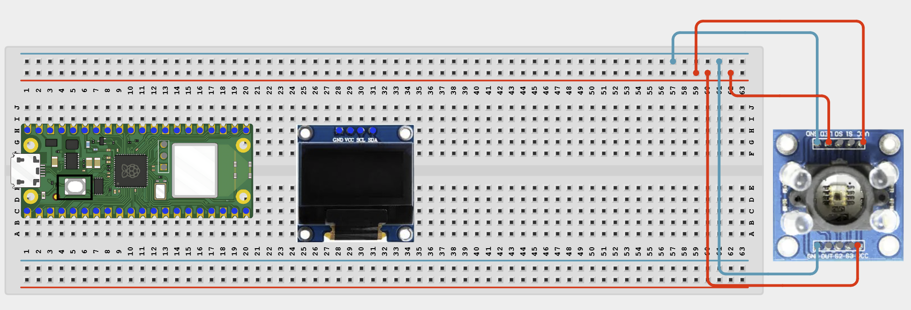
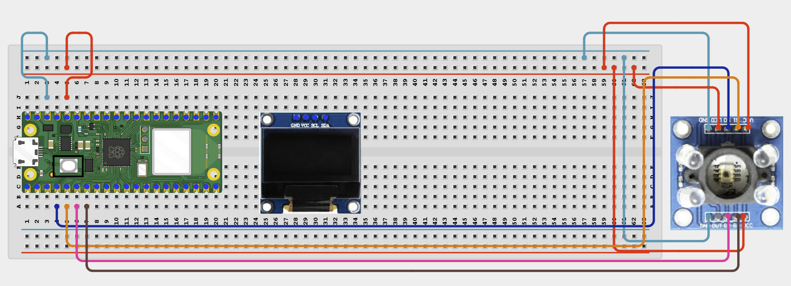
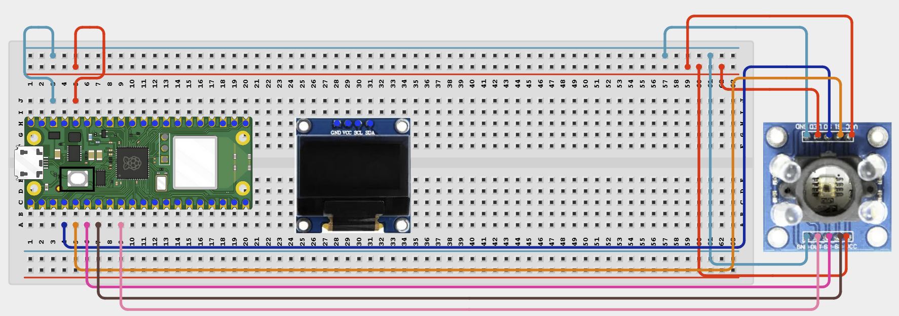
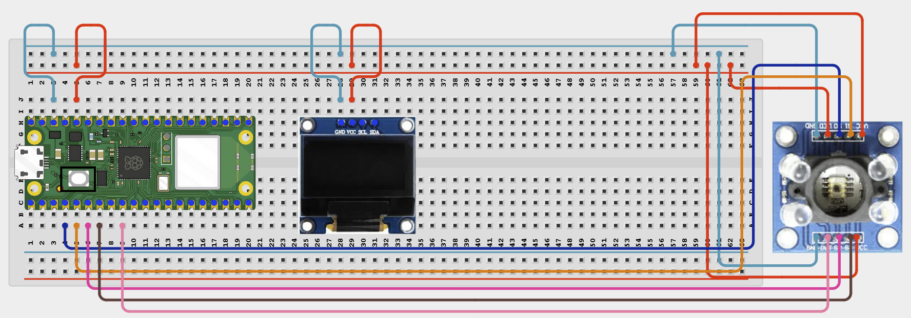
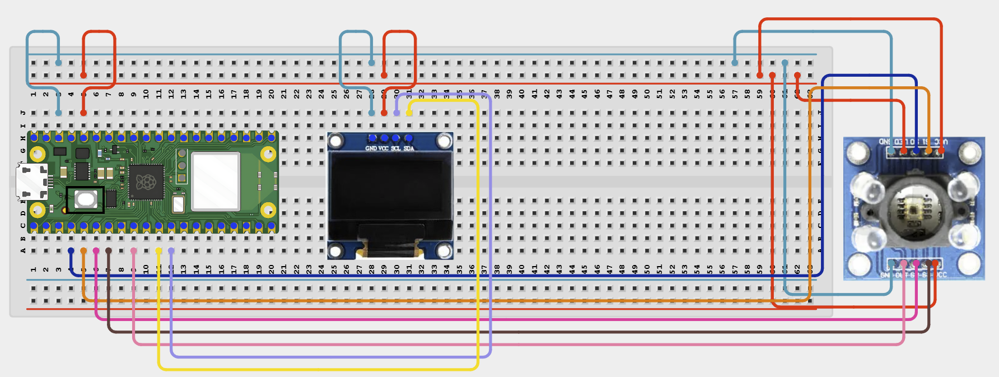

# Project 1.2.11
## Color Detection System
# Overview

Build a simple color-reading project using a REES52 GY-31 TCS230/TCS3200 color sensor module and an OLED display.

This project demonstrates how to read color intensity using a frequency-output color sensor. The Pico selects red, green, and blue filters using control pins, reads the sensor output frequency, and displays a simple detected color label on the OLED.

The final result should show raw red, green, and blue readings plus a simple detected color label.

# Required Components

|  |  |  |  |
| --- | --- | --- | --- |
|  Raspberry Pi Pico 2 W |  TCS3200 color sensor module |  SH1106 OLED display |  Breadboard |
|  Jumper wires | White paper or colored object |  |  |

# Circuit Connections

| Component Pin | Connects To | Pico GPIO / Physical Pin Number | Notes |
| --- | --- | --- | --- |
| TCS3200 VCC | 3.3V | Physical pin 36 | Check your module label |
| TCS3200 GND | GND | Physical pin 38 |  |
| TCS3200 LED | 3.3V | Physical pin 36 | Keeps onboard LEDs ON |
| TCS3200 S0 | GPIO 2 | physical pin 4 | Shared I2C data line |
| TCS3200 S1 | GPIO 3 | physical pin 5 | Shared I2C clock line |
| TCS3200 S2 | GPIO 4 | physical pin 6 |  |
| TCS3200 S3 | GPIO 5 | physical pin 7 |  |
| TCS3200 OUT | GPIO 6 | physical pin 9 |  |
| OLED VCC | 3.3V | Physical pin 36 |  |
| OLED GND | GND | Physical pin 38 |  |
| OLED SDA | GPIO 8 | GPIO 8 / physical pin 11 | Same SDA line as sensor |
| OLED SCL | GPIO 9 | GPIO 9 / physical pin 12 | Same SCL line as sensor |

# Step-by-Step Assembly

### Step 1: Place the Raspberry Pi Pico 2W

Place the Raspberry Pi Pico 2W on the breadboard so it sits across the center gap.

Keep the USB port facing outward so you can easily connect it to your computer.

### Step 2: Place the TCS3200 Color Sensor and OLED Display

Place the REES52 GY-31 TCS230/TCS3200 color sensor module on the breadboard or position it so it can face the colored object.

Place the SH1106 OLED display module on the breadboard.

Identify these pins on the TCS3200 module:

VCC, GND, S0, S1, S2, S3, OUT, and OE.

Identify these pins on the OLED display:

VCC, GND, SDA, and SCL.

Check the printed labels on both modules before wiring.

### Step 3: Connect TCS3200 Power

Connect TCS3200 VCC to 3.3V.

Connect TCS3200 GND to GND.

Connect TCS3200 LED to 3.3V to keep the onboard LEDs ON during testing.

### Step 4: Connect TCS3200 I2C Control Pins

Connect TCS3200 S0 to GPIO 2.

Connect TCS3200 S1 to GPIO 3.

Connect TCS3200 S2 to GPIO 4.

Connect TCS3200 S3 to GPIO 5.

### Step 5:  Connect TCS3200 Output Pin

Connect TCS3200 OUT to GPIO 6.

### Step 6: Connect OLED Power

Connect OLED VCC to 3.3V.

Connect OLED GND to GND.

### Step 7: Connect OLED I2C Pins

Connect OLED SDA to GPIO 8.

Connect OLED SCL to GPIO 9.

Both modules now share the same I2C bus.

## Wiring Check

✓ Pico 2W is placed correctly across the breadboard center gap

✓ Pico 2W USB port faces outward

✓ TCS3200 VCC connects to 3.3V

✓ TCS3200 GND connects to GND

✓ TCS3200 OE connects to GND

✓ TCS3200 S0 connects to GPIO 2

✓ TCS3200 S1 connects to GPIO 3

✓ TCS3200 S2 connects to GPIO 4

✓ TCS3200 S3 connects to GPIO 5

✓ TCS3200 OUT connects to GPIO 6

✓ OLED VCC connects to 3.3V

✓ OLED GND connects to GND

✓ OLED SDA connects to GPIO 8

✓ OLED SCL connects to GPIO 9

✓ No loose jumper wires are touching nearby rows

## Beginner Note

Hold the colored object close to the sensor during testing. Strong room lighting can affect the reading.

# Testing Individual Components

Before running the full project, test each part separately. This makes it easier to find wiring or code problems.

## I2C scanner test

Check that both the TCS34725 and the OLED appear on the I2C bus.

| from machine import Pin, I2C
i2c = I2C(0, sda=Pin(8), scl=Pin(9), freq=400000)
print([hex(addr) for addr in i2c.scan()]) |
| --- |

Expected test result: You should usually see the TCS34725 address 0x29 and the OLED address such as 0x3c.

## Color sensor raw test

Check that the sensor returns changing raw values.

| from machine import Pin, I2C
import tcs34725
import time
i2c = I2C(0, sda=Pin(8), scl=Pin(9), freq=400000)
sensor = tcs34725.TCS34725(i2c)
sensor.gain(4)
while True:
    r, g, b, c = sensor.read(True)
    print('R:', r, 'G:', g, 'B:', b, 'C:', c)
    time.sleep(0.5) |
| --- |

Expected test result: The values should change when you move different colors in front of the sensor.

## OLED text test

Check that the OLED driver works.

| from machine import Pin, I2C
import sh1106
i2c = I2C(0, sda=Pin(8), scl=Pin(9), freq=400000)
display = sh1106.SH1106_I2C(128, 64, i2c)
display.fill(0)
display.text('Color OLED OK', 12, 28, 1)
display.show() |
| --- |

Expected test result: The OLED should show Color OLED OK.

# Full Project Code

After completing and checking the circuit connections, open Thonny IDE. Copy and paste the code below into a new file, or upload the project file to the Raspberry Pi Pico 2 W, then run it from Thonny.

| from machine import Pin, I2C import sh1106 import time # TCS3200 pins S0 = Pin(2, Pin.OUT) S1 = Pin(3, Pin.OUT) S2 = Pin(4, Pin.OUT) S3 = Pin(5, Pin.OUT) OUT = Pin(6, Pin.IN) # OLED pins i2c = I2C(0, sda=Pin(8), scl=Pin(9), freq=400000) display = sh1106.SH1106_I2C(128, 64, i2c) # Set output frequency scaling to 20% S0.on() S1.off() print("TCS3200 color detector ready") def select_red(): S2.off() S3.off() def select_blue(): S2.off() S3.on() def select_clear(): S2.on() S3.off() def select_green(): S2.on() S3.on() def count_pulses(duration_ms=100): count = 0 start = time.ticks_ms() last_state = OUT.value() while time.ticks_diff(time.ticks_ms(), start) < duration_ms: current_state = OUT.value() if last_state == 0 and current_state == 1: count += 1 last_state = current_state return count def read_color(): select_red() time.sleep_ms(50) red = count_pulses() select_green() time.sleep_ms(50) green = count_pulses() select_blue() time.sleep_ms(50) blue = count_pulses() return red, green, blue def detect_color(red, green, blue): if red < 5 and green < 5 and blue < 5: return "Too Dark" if red > green * 1.2 and red > blue * 1.2: return "Red" if green > red * 1.2 and green > blue * 1.2: return "Green" if blue > red * 1.2 and blue > green * 1.2: return "Blue" if red > 20 and green > 20 and blue > 20: return "White/Mixed" return "Mixed" while True: red, green, blue = read_color() color_name = detect_color(red, green, blue) display.fill(0) display.text("Color Detect", 14, 0, 1) display.text("Color: " + color_name, 0, 16, 1) display.text("R:{} G:{}".format(red, green), 0, 34, 1) display.text("B:{}".format(blue), 0, 50, 1) display.show() print("Color:", color_name, "\| R:", red, "G:", green, "B:", blue) time.sleep(0.5) |
| --- |

# How the Code Works

| Code Section | What It Does | Why It Matters |
| --- | --- | --- |
| Code Section | Set the output frequency scaling | Makes the sensor output easier for the Pico to read |
| S2 and S3 | Select red, green, blue, or clear filter | Allows the Pico to measure each color channel |
| OUT pin | Sends pulse/frequency output to GPIO 6 | This is how the sensor gives color intensity information |
| count_pulses() | Counts output pulses for a short time | More pulses usually means stronger reflected color |
| read_color() | Reads red, green, and blue pulse values | These values are used to detect the dominant color |
| detect_color() | Compares red, green, and blue values | Gives a simple color label |
| OLED update | Shows the detected color and raw readings | Makes the project easier to test without only using the Shell |

# Expected Result

When you place colored objects near the TCS3200 sensor, the OLED and the Thonny Shell should show changing red, green, and blue pulse readings. The project should display a simple detected color label such as Red, Green, Blue, White/Mixed, Too Dark, or Mixed.

# Troubleshooting

| Problem | Possible Cause | Solution |
| --- | --- | --- |
| Sensor values do not change | OUT pin or control pins are wired incorrectly | Recheck S0, S1, S2, S3, OUT, VCC, and GND |
| All readings are very low | Object is too far away or room is too dark | Move the object closer and improve lighting |
| OLED works but sensor code fails | Missing or different tcs34725.py library | Use the expected library file name and verify the API matches the code |
| Color label seems wrong | The simple rules need calibration | Test with known colors and adjust the comparison values |
| OLED is blank | Missing sh1106.py or incorrect OLED wiring | Save sh1106.py to the Pico and check SDA/SCL wiring |
| Code runs but color does not detect well | Sensor angle or distance is poor | Hold the object close and steady in front of the sensor |
