# Project 1.2.12
## Multi-led Pattern Display
# Overview

Build an 8-LED pattern project with several lighting effects.

This project demonstrates multi-output control, loops, and creative timing patterns.

The final result should cycle through several LED patterns one after another.

# Required Components

|  |  |  |  |
| --- | --- | --- | --- |
|  Raspberry Pi Pico 2 W |  LEDs |  220Ω resistors |  Breadboard |
|  Jumper wires |  |  |  |

# Circuit Connections

| Component Pin | Connects To | Pico GPIO / Physical Pin Number | Notes |
| --- | --- | --- | --- |
| LED 1 anode (+) | 220Ω resistor then GPIO 0 | GPIO 0 / physical pin 1 |  |
| LED 2 anode (+) | 220Ω resistor then GPIO 1 | GPIO 1 / physical pin 2 |  |
| LED 3 anode (+) | 220Ω resistor then GPIO 2 | GPIO 2 / physical pin 4 |  |
| LED 4 anode (+) | 220Ω resistor then GPIO 3 | GPIO 3 / physical pin 5 |  |
| LED 5 anode (+) | 220Ω resistor then GPIO 4 | GPIO 4 / physical pin 6 |  |
| LED 6 anode (+) | 220Ω resistor then GPIO 5 | GPIO 5 / physical pin 7 |  |
| LED 7 anode (+) | 220Ω resistor then GPIO 6 | GPIO 6 / physical pin 9 |  |
| LED 8 anode (+) | 220Ω resistor then GPIO 7 | GPIO 7 / physical pin 10 |  |
| All LED cathodes (-) | GND | Physical pin 38 | Shared ground is fine |

# Step-by-Step Assembly

### Step 1: Place the Raspberry Pi Pico 2W

Place the Raspberry Pi Pico 2W on the breadboard so it sits across the center gap.
Keep the USB port facing outward so you can easily connect it to your computer.

### Step 2: Place the Eight LEDs

Place eight LEDs on the breadboard.

For each LED, the long leg is the anode (+) and the short leg is the cathode (-).

Put the two legs of each LED in different breadboard rows.

Leave enough space so each LED can have its own resistor.

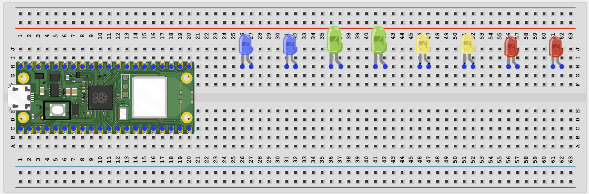

### Step 3: Add One 220Ω Resistor to Each LED

Connect one 220Ω resistor to the long leg of LED 1.

Repeat this for LED 2 through LED 8.

Each LED must have its own resistor.

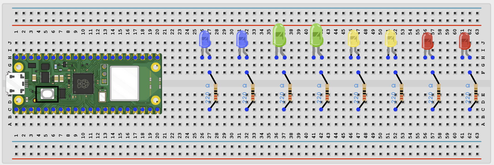

### Step 4: Connect LED 1 to GPIO 0

Connect the free end of LED 1's resistor to GPIO 0.

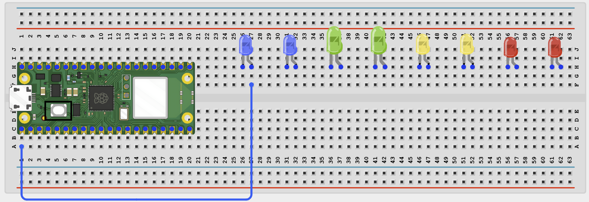

### Step 5: Connect LED 2 to GPIO 1

Connect the free end of LED 2's resistor to GPIO 1.

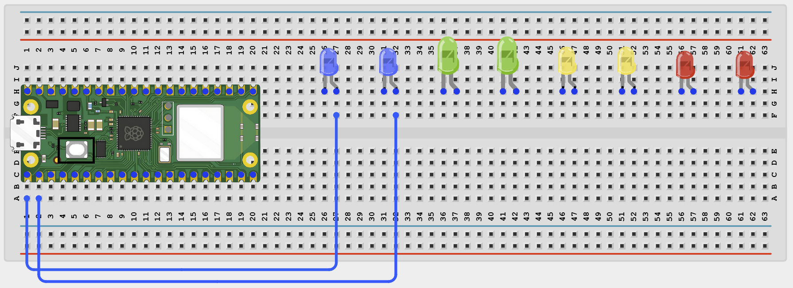

### Step 6: Connect LED 3 to GPIO 2

Connect the free end of LED 3's resistor to GPIO 2.

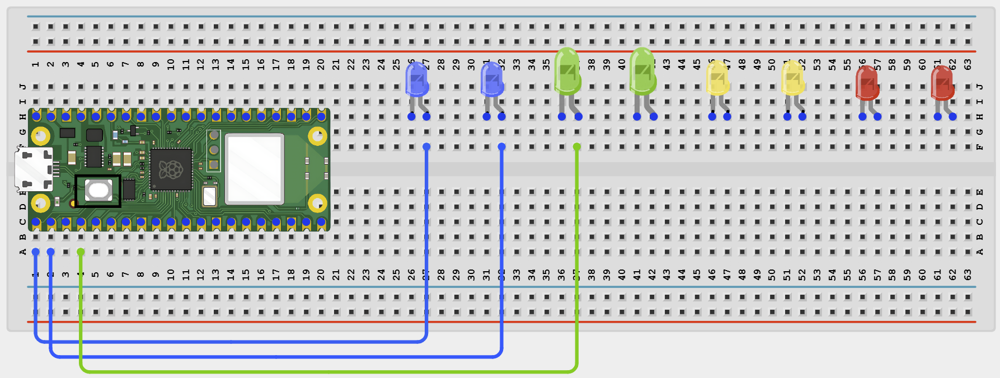

### Step 7: Connect LED 4 to GPIO 3

Connect the free end of LED 4's resistor to GPIO 3.

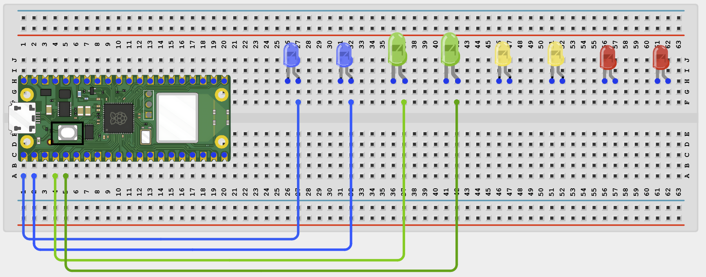

### Step 8: Connect LED 5 to GPIO 4

Connect the free end of LED 5's resistor to GPIO 4.

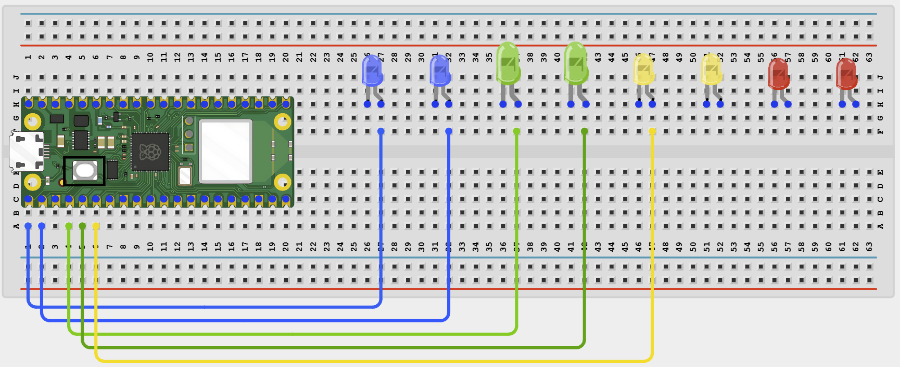

### Step 9: Connect LED 6 to GPIO 5

Connect the free end of LED 6's resistor to GPIO 5.

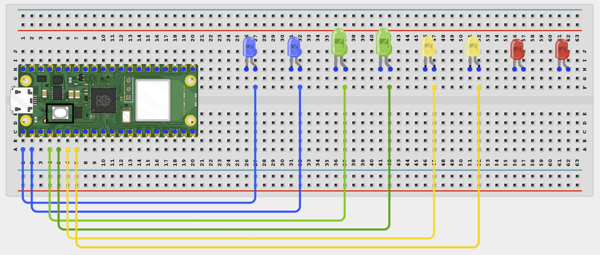

### Step 10: Connect LED 7 to GPIO 6

Connect the free end of LED 7's resistor to GPIO 6.

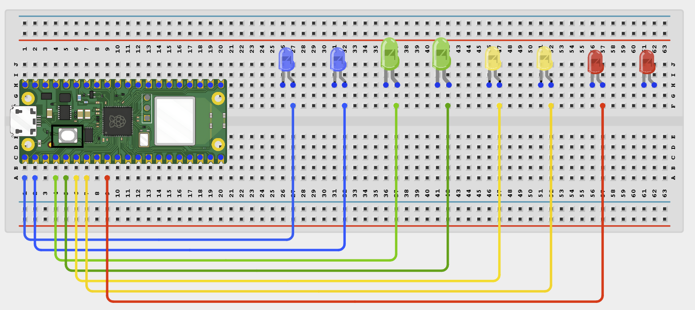

### Step 11: Connect LED 8 to GPIO 7

Connect the free end of LED 8's resistor to GPIO 7.

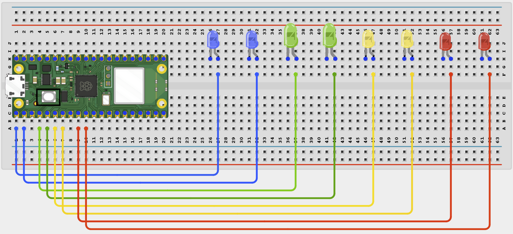

### Step 12: Connect All LED Short Legs to GND

Connect each LED short leg to GND.

You may connect the short legs to the breadboard ground rail, then connect that rail to a Pico GND pin.

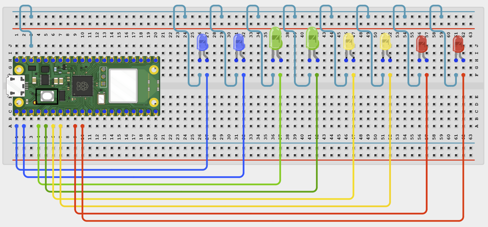

## Wiring Check

✓ Pico 2W is placed correctly across the breadboard center gap

✓ LED 1 long leg connects through a 220Ω resistor to GPIO 0

✓ LED 2 long leg connects through a 220Ω resistor to GPIO 1

✓ LED 3 long leg connects through a 220Ω resistor to GPIO 2

✓ LED 4 long leg connects through a 220Ω resistor to GPIO 3

✓ LED 5 long leg connects through a 220Ω resistor to GPIO 4

✓ LED 6 long leg connects through a 220Ω resistor to GPIO 5

✓ LED 7 long leg connects through a 220Ω resistor to GPIO 6

✓ LED 8 long leg connects through a 220Ω resistor to GPIO 7

✓ All LED short legs connect to GND

✓ No loose jumper wires

## Beginner Note

If one LED does not light, check that LED's polarity, resistor, and GPIO jumper before changing the code.

# Testing Individual Components

Before running the full project, test each part separately. This makes it easier to find wiring or code problems.

## Single LED test

Check that each LED works before running the full pattern program.

| from machine import Pin
import time
for pin_number in range(8):
    led = Pin(pin_number, Pin.OUT)
    led.on()
    print('Testing LED on GPIO', pin_number)
    time.sleep(0.5)
    led.off() |
| --- |

Expected test result: Each LED should light one at a time from GPIO 0 to GPIO 7.

# Full Project Code

After completing and checking the circuit connections, open Thonny IDE. Copy and paste the code below into a new file, or upload the project file to the Raspberry Pi Pico 2 W, then run it from Thonny.

| from machine import Pin
import time
import urandom

leds = [Pin(pin_number, Pin.OUT) for pin_number in range(8)]

def all_off():
    for led in leds:
        led.off()

def pattern_wave():
    for i in range(len(leds)):
        all_off()
        leds[i].on()
        time.sleep(0.1)
    all_off()

def pattern_chase():
    for i in range(len(leds)):
        all_off()
        leds[i].on()
        leds[(i + 1) % len(leds)].on()
        time.sleep(0.15)
    all_off()

def pattern_alternate():
    for _ in range(4):
        for i, led in enumerate(leds):
            led.value(i % 2)
        time.sleep(0.3)

        for i, led in enumerate(leds):
            led.value((i + 1) % 2)
        time.sleep(0.3)
    all_off()

def pattern_random():
    for _ in range(16):
        for led in leds:
            led.value(urandom.getrandbits(1))
        time.sleep(0.1)
    all_off()

patterns = [pattern_wave, pattern_chase, pattern_alternate, pattern_random]
pattern_index = 0

print('Multi LED pattern system ready')

while True:
    print('Playing pattern', pattern_index + 1)
    patterns[pattern_index]()
    pattern_index = (pattern_index + 1) % len(patterns)
    time.sleep(1) |
| --- |

# How the Code Works

| Code Section | What It Does | Why It Matters |
| --- | --- | --- |
| leds list | Creates a list of 8 LED output pins | This makes it easy to control many LEDs with loops |
| all_off() | Turns every LED off | This keeps each pattern clean |
| Pattern functions | Create different lighting effects | Breaking the code into functions makes it easier to read and extend |
| Main loop | Plays one pattern after another forever | This creates the full light show |

# Expected Result

All 8 LEDs should cycle through several patterns: a wave, a chase, an alternating pattern, and a random blink pattern.

# Troubleshooting

| Problem | Possible Cause | Solution |
| --- | --- | --- |
| One LED never lights | LED reversed or missing resistor | Reverse the LED or reconnect the resistor and GPIO wire |
| Wrong LED order | GPIO wires connected in the wrong sequence | Match each LED to the connection table |
| Random pattern causes confusion | Normal because the pattern is meant to be unpredictable | Comment out pattern_random() if you want only ordered patterns |
