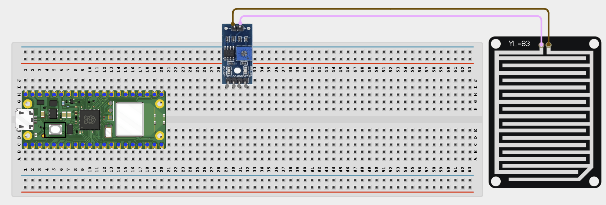
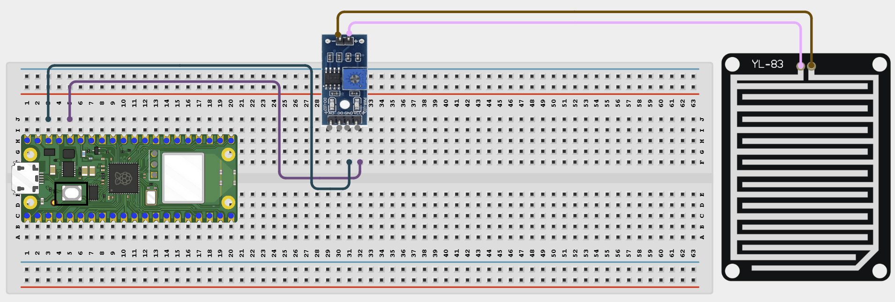
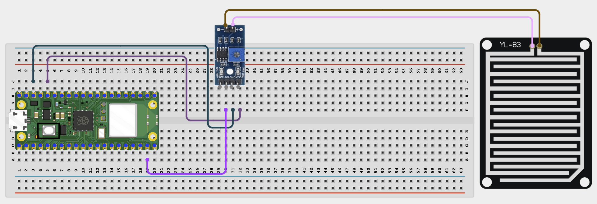

# Project 1.2.13
## Rain Status Webpage
# Overview

Build a rain detector that shows current rain status and event count on a web page.

This project demonstrates active-low digital sensing and counting state changes over time.

The final result should show whether the rain sensor is currently wet or dry and how many rain events have started since the code began running.

# Required Components

|  |  |  |  |
| --- | --- | --- | --- |
| <br>Raspberry Pi Pico 2 W | <br>Rain sensor module | <br>Breadboard | <br>Jumper wires |
| Water for testing | 2.4 GHz Wi-Fi network | Phone or computer browser |  |


# Circuit Connections

| Component Pin | Connects To | Pico GPIO / Physical Pin Number | Notes |
| --- | --- | --- | --- |
| Rain sensor VCC | 3.3V | Physical pin 36 |  |
| Rain sensor GND | GND | Physical pin 38 |  |
| Rain sensor DOUT | GPIO 14 | GPIO 14 / physical pin 19 | Digital input |

# Step-by-Step Assembly

### Step 1: Place the Raspberry Pi Pico 2W

Place the Raspberry Pi Pico 2W on the breadboard so it sits across the center gap.
Keep the USB port facing outward so you can easily connect it to your computer.


### Step 2: Place the Rain Sensor Module

Place the rain sensor module on the breadboard, or place the sensing plate beside the breadboard.

Identify VCC, GND, and DOUT before wiring.

Check the printed pin labels on your module.



### Step 3: Connect the Rain Sensor VCC

Connect rain sensor VCC to 3.3V.

Connect rain sensor GND to GND.



### Step 5: Connect the Rain Sensor DOUT Pin

Connect rain sensor DOUT to GPIO 14.

This digital input tells the Pico when rain or water is detected.



## Wiring Check

✓ Pico 2W is placed correctly across the breadboard center gap

✓ Rain sensor VCC connects to 3.3V

✓ Rain sensor GND connects to GND

✓ Rain sensor DOUT connects to GPIO 14

✓ No loose jumper wires

## Safety Note

Water should touch only the rain sensor plate. Keep the Pico, breadboard, USB cable, and jumper wires dry.

# Testing Individual Components

Before running the full project, test each part separately. This makes it easier to find wiring or code problems.

## Rain sensor digital test

Check whether the digital output changes between dry and wet conditions.

```python
from machine import Pin
import time
sensor = Pin(14, Pin.IN)
while True:
    print(sensor.value())
    time.sleep(0.2)
```

Expected test result: The printed value should change when the sensor pad becomes wet and then dry again.

## Wi-Fi connection test

Check that the Pico connects to Wi-Fi and prints its IP address.

```python
import network
import time
SSID = 'YOUR_WIFI_NAME'
PASSWORD = 'YOUR_WIFI_PASSWORD'
wlan = network.WLAN(network.STA_IF)
wlan.active(True)
wlan.connect(SSID, PASSWORD)
for _ in range(15):
    if wlan.isconnected():
        break
    print('Connecting...')
    time.sleep(1)
print('Connected:', wlan.isconnected())
if wlan.isconnected():
    print('IP address:', wlan.ifconfig()[0])
```

Expected test result: The Shell should show Connected: True and print an IP address.

# Full Project Code

Upload and run this code after the individual tests work correctly.

```python
import network
import socket
import time
from machine import Pin

SSID = 'YOUR_WIFI_NAME'
PASSWORD = 'YOUR_WIFI_PASSWORD'

rain_sensor = Pin(14, Pin.IN)
last_rain_state = False
rain_events = 0

wlan = network.WLAN(network.STA_IF)
wlan.active(True)
wlan.connect(SSID, PASSWORD)

print('Connecting to Wi-Fi...')
for _ in range(15):
    if wlan.isconnected():
        break
    time.sleep(1)

if not wlan.isconnected():
    raise RuntimeError('Wi-Fi connection failed')

ip_address = wlan.ifconfig()[0]
print('Connected. Open http://{} in your browser'.format(ip_address))

def web_page(is_raining, event_count):
    status = 'RAINING' if is_raining else 'Dry'
    color = '#2196F3' if is_raining else '#4CAF50'
    return """<!DOCTYPE html>
<html>
<head>
    <meta name='viewport' content='width=device-width, initial-scale=1'>
    <meta http-equiv='refresh' content='3'>
    <title>Rain Status Monitor</title>
</head>
<body style='font-family:Arial;text-align:center;padding:40px'>
    <h1>Rain Status Monitor</h1>
    <h2 style='color:STATUS_COLOR'>STATUS_TEXT</h2>
    <p>Rain events counted: EVENT_COUNT</p>
    <p>Page refreshes every 3 seconds</p>
</body>
</html>""".replace('STATUS_COLOR', color).replace('STATUS_TEXT', status).replace('EVENT_COUNT', str(event_count))

address = socket.getaddrinfo('0.0.0.0', 80)[0][-1]
server = socket.socket()
server.bind(address)
server.listen(1)
server.settimeout(0.2)

while True:
    is_raining = rain_sensor.value() == 0

    if is_raining and not last_rain_state:
        rain_events += 1
        print('Rain started! Event:', rain_events)

    last_rain_state = is_raining

    try:
        client, client_address = server.accept()
    except OSError:
        continue

    print('Client connected from', client_address)
    client.recv(1024)
    response = web_page(is_raining, rain_events)
    client.send('HTTP/1.1 200 OK\r\nContent-Type: text/html\r\nConnection: close\r\n\r\n'.encode())
    client.sendall(response.encode())
    client.close()
```

# How the Code Works

| Code Section | What It Does | Why It Matters |
| --- | --- | --- |
| Active-low read | Treats a low sensor output as rain detected | Many rain modules output low when wet |
| last_rain_state | Stores the previous wet/dry state | This allows the code to count only when rain starts |
| rain_events | Counts how many rain events have started | The page can show more than only the current state |
| web_page() | Builds the browser page with status and event count | This turns the sensor reading into a local monitoring page |

# Expected Result

After entering your Wi-Fi details and running the code, the Shell should print an IP address. Opening that address in a browser should show Dry at first. Wetting the sensor pad should change the page to RAINING and increase the rain event count when rain starts.

# Troubleshooting

| Problem | Possible Cause | Solution |
| --- | --- | --- |
| Always shows rain | Sensor sensitivity is too high or the plate is still wet | Dry the plate and adjust the module sensitivity if needed |
| Never detects rain | Sensor pad is not wet enough or wiring is wrong | Use a few drops of water and recheck the DOUT connection to GPIO 14 |
| Event count increases too often | Output is bouncing between wet and dry | Reduce sensitivity and make sure the pad has a clear wet or dry state |
