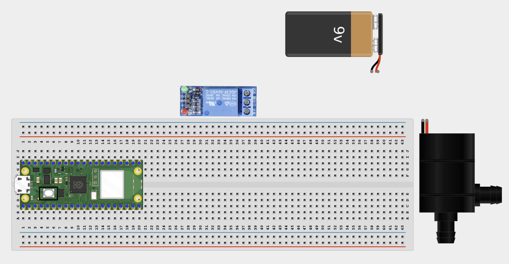
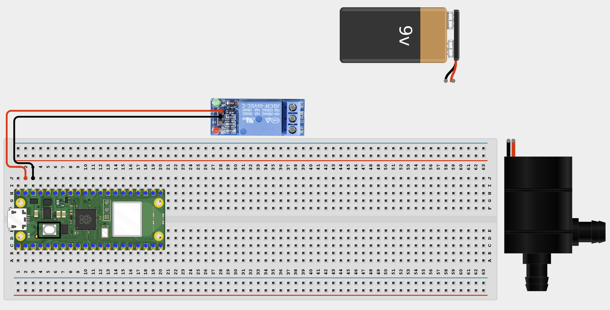
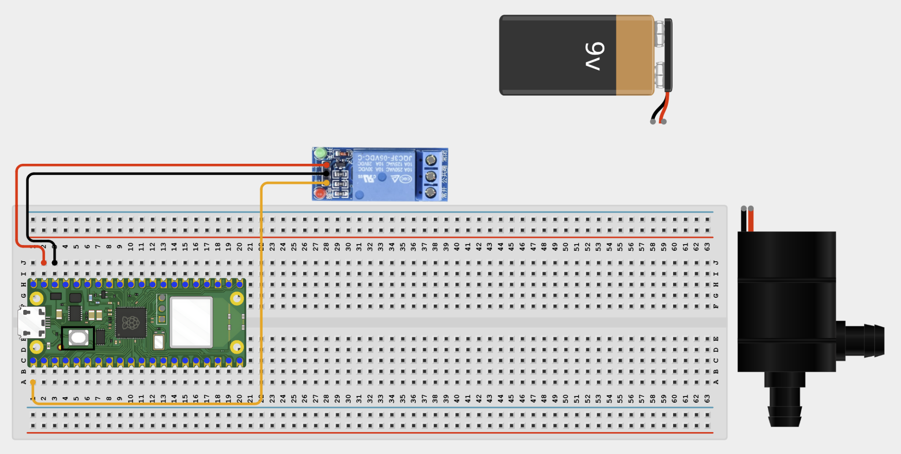
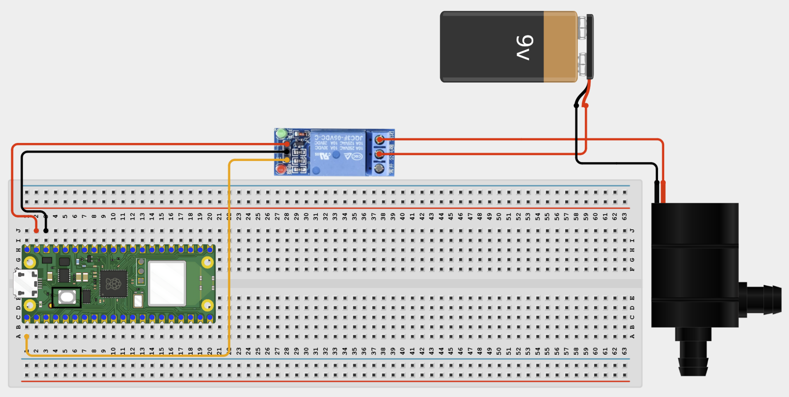

# Project 1.2.14
## Remote Irrigation Controller
# Overview

Build a browser-controlled irrigation project that runs a small pump for a chosen amount of time.

In this beginner version, control happens on your local Wi-Fi network instead of a public cloud service.

The final result should let you start or stop a timed watering session from a browser while keeping the pump on external power.

# Required Components

|  |  |  |  |
| --- | --- | --- | --- |
| <br>Raspberry Pi Pico 2 W | <br>1-channel relay module | <br>Small DC water pump | External power supply |
| <br>Breadboard | <br>Jumper wires | 2.4 GHz Wi-Fi network | Phone or computer browser |


# Circuit Connections

| Component Pin | Connects To | Pico GPIO / Physical Pin Number | Notes |
| --- | --- | --- | --- |
| Relay VCC | 5V / VSYS | Physical pin 40 | Module power |
| Relay GND | GND | Physical pin 38 |  |
| Relay IN | GPIO 0 | GPIO 0 / physical pin 1 | Usually active-low |
| External pump supply positive | Relay COM | Not a GPIO pin | Pump power input |
| Relay NO | Pump positive terminal | Not a GPIO pin | Power flows when relay is on |
| Pump negative terminal | External pump supply negative | Not a GPIO pin |  |

# Step-by-Step Assembly

### Step 1: Place the Raspberry Pi Pico 2W

Place the Raspberry Pi Pico 2W on the breadboard so it sits across the center gap.
Keep the USB port facing outward so you can easily connect it to your computer.


### Step 2: Place the Relay Module and Pump

Place the 1-channel relay module on the breadboard or beside it where the pins are easy to reach.

Keep the pump and external power supply separate from the Pico wiring.

Identify relay VCC, GND, IN, COM, and NO before wiring.



### Step 3: Connect Relay Power

Connect relay VCC to 5V / VSYS.

Connect relay GND to GND.



### Step 4: Connect the Relay IN Pin

Connect relay IN to GPIO 0.

This pin controls the relay from the web page.



### Step 5: Wire the Pump Power Through the Relay

Connect the external pump supply positive wire to relay COM.

Connect relay NO to the pump positive terminal.

Connect the pump negative terminal to the external pump supply negative wire.



### Step 6: Check the Pump Before Powering

Make sure the pump can run freely and that the external supply matches its voltage rating.

## Wiring Check

✓ Pico 2W is placed correctly across the breadboard center gap

✓ Relay VCC connects to 5V / VSYS

✓ Relay GND connects to GND

✓ Relay IN connects to GPIO 0

✓ External pump supply positive connects to relay COM

✓ Relay NO connects to pump positive terminal

✓ Pump negative terminal connects to external supply negative

✓ Diode stripe end connects to pump positive

✓ Diode non-striped end connects to pump negative

✓ No loose jumper wires

## Safety Note

Do not power the pump directly from the Pico. Use an external low-voltage supply, keep the wiring clear, and disconnect power before changing wires.

# Testing Individual Components

Before running the full project, test each part separately. This makes it easier to find wiring or code problems.

## Relay click test

Check that the relay changes state before connecting the pump to the final system.

```python
from machine import Pin
import time
relay = Pin(0, Pin.OUT)
relay.value(1)
time.sleep(1)
relay.value(0)
time.sleep(1)
relay.value(1)
```

Expected test result: You should hear the relay click on and off.

## Pump power test

Check the pump and external supply separately before the full web-control build.

No code is needed for this test. Briefly connect the pump directly to the correct external supply to confirm it runs.

Expected test result: The pump should run briefly when connected directly to the correct external supply.

## Wi-Fi connection test

Check that the Pico connects to Wi-Fi and prints its IP address.

```python
import network
import time
SSID = 'YOUR_WIFI_NAME'
PASSWORD = 'YOUR_WIFI_PASSWORD'
wlan = network.WLAN(network.STA_IF)
wlan.active(True)
wlan.connect(SSID, PASSWORD)
for _ in range(15):
    if wlan.isconnected():
        break
    print('Connecting...')
    time.sleep(1)
print('Connected:', wlan.isconnected())
if wlan.isconnected():
    print('IP address:', wlan.ifconfig()[0])
```

Expected test result: The Shell should show Connected: True and print an IP address.

# Full Project Code

Upload and run this code after the individual tests work correctly.

```python
import network
import socket
import time
from machine import Pin

SSID = 'YOUR_WIFI_NAME'
PASSWORD = 'YOUR_WIFI_PASSWORD'

relay = Pin(0, Pin.OUT)
relay.value(1)

pump_on = False
duration_seconds = 0
remaining_seconds = 0
start_ms = 0
watering_count = 0


def format_time(seconds):
    minutes = seconds // 60
    secs = seconds % 60
    return '{:02d}:{:02d}'.format(minutes, secs)


def start_watering(seconds):
    global pump_on, duration_seconds, remaining_seconds, start_ms, watering_count
    duration_seconds = max(1, min(3600, seconds))
    remaining_seconds = duration_seconds
    start_ms = time.ticks_ms()
    pump_on = True
    watering_count += 1
    relay.value(0)
    print('Irrigation started for', duration_seconds, 'seconds')


def stop_watering():
    global pump_on, remaining_seconds
    pump_on = False
    remaining_seconds = 0
    relay.value(1)
    print('Irrigation stopped')


def web_page(active, remaining, count):
    status = 'IRRIGATING' if active else 'OFF'
    return '''<!DOCTYPE html>
<html>
<head>
    <meta name='viewport' content='width=device-width, initial-scale=1'>
    <meta http-equiv='refresh' content='1'>
    <title>Remote Irrigation</title>
</head>
<body style='font-family:Arial;text-align:center;padding:40px'>
    <h1>Remote Irrigation Control</h1>
    <h2>Status: STATUS_TEXT</h2>
    <h2>Remaining: TIME_TEXT</h2>
    <p>Total watering sessions: COUNT_TEXT</p>
    <form>
        <input type='number' name='seconds' min='1' max='3600' placeholder='Seconds'>
        <button type='submit'>START</button>
    </form>
    <p>Quick presets:</p>
    <a href='/?seconds=5'><button>5 sec</button></a>
    <a href='/?seconds=10'><button>10 sec</button></a>
    <a href='/?seconds=30'><button>30 sec</button></a>
    <a href='/?seconds=60'><button>60 sec</button></a>
    <p><a href='/stop'><button>STOP</button></a></p>
    <p>Keep electronics dry and elevated.</p>
</body>
</html>'''.replace('STATUS_TEXT', status).replace('TIME_TEXT', format_time(remaining)).replace('COUNT_TEXT', str(count))


wlan = network.WLAN(network.STA_IF)
wlan.active(True)
wlan.connect(SSID, PASSWORD)

print('Connecting to Wi-Fi...')
for _ in range(15):
    if wlan.isconnected():
        break
    time.sleep(1)

if not wlan.isconnected():
    raise RuntimeError('Wi-Fi connection failed')

ip_address = wlan.ifconfig()[0]
print('Connected. Open http://{} in your browser'.format(ip_address))

address = socket.getaddrinfo('0.0.0.0', 80)[0][-1]
server = socket.socket()
server.bind(address)
server.listen(1)
server.settimeout(0.2)

while True:
    if pump_on:
        elapsed = time.ticks_diff(time.ticks_ms(), start_ms) // 1000
        remaining_seconds = max(0, duration_seconds - elapsed)
        if remaining_seconds == 0:
            stop_watering()

    try:
        client, client_address = server.accept()
    except OSError:
        continue

    print('Client connected from', client_address)
    request = client.recv(1024).decode()

    if 'GET /stop' in request:
        stop_watering()
    elif 'seconds=' in request:
        try:
            start = request.find('seconds=') + 8
            end = request.find(' ', start)
            value = int(request[start:end].split('&')[0])
            start_watering(value)
        except ValueError:
            pass

    response = web_page(pump_on, remaining_seconds, watering_count)
    client.send('HTTP/1.1 200 OK\r\nContent-Type: text/html\r\nConnection: close\r\n\r\n'.encode())
    client.sendall(response.encode())
    client.close()
```

# How the Code Works

| Code Section | What It Does | Why It Matters |
| --- | --- | --- |
| Pump state variables | Store whether watering is active, how much time remains, and how many sessions have run | The project needs these values to manage irrigation safely |
| start_watering() | Starts the timed pump session and turns the relay on | This is the main irrigation action from the browser |
| stop_watering() | Turns the relay off and clears the timer | This provides manual stop and safe auto-stop |
| Browser controls | Let the user choose a watering time or stop immediately | This makes remote irrigation simple and practical |

# Expected Result

After entering your Wi-Fi details and running the code, the Shell should print an IP address. Opening that address in a browser should show irrigation controls. Starting a watering session should turn the pump on through the relay and begin a countdown. Pressing STOP or reaching zero should turn the pump off.

# Troubleshooting

| Problem | Possible Cause | Solution |
| --- | --- | --- |
| Pump does not run | External pump supply missing or load wiring is wrong | Check the pump supply, relay COM, relay NO, and pump wires |
| Pump stays on | Relay logic is reversed or stop code is not reached | Check active-low behavior and verify stop_watering() runs |
| Countdown looks wrong | Duration parsing or timer math is incorrect | Use a short 5-second test and watch the Shell output |
| Water is near electronics | Unsafe workspace layout | Move the Pico and breadboard higher and farther from the water container |
