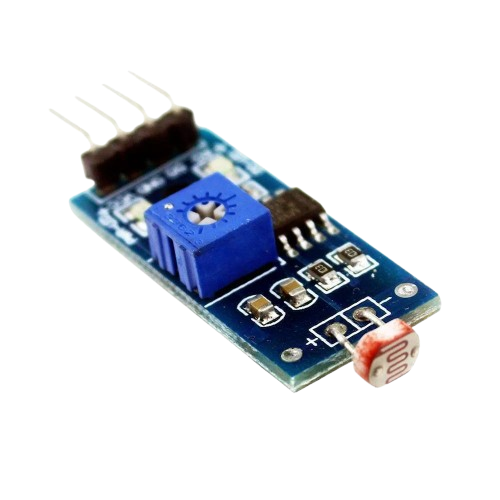
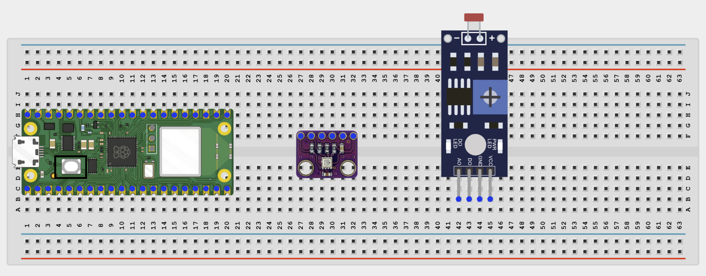
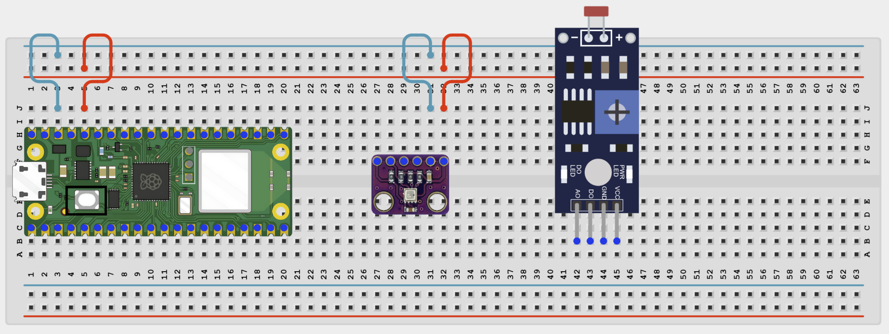
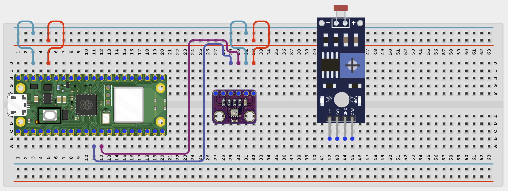
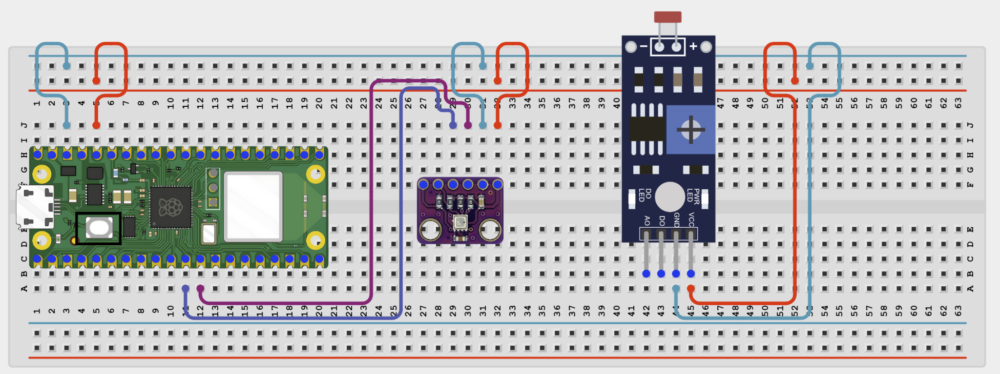
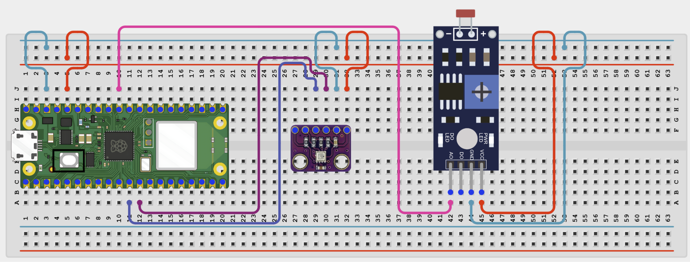

# Project 1.2.15
## Environmental Data Logger
# Overview

Build an environmental monitor that reads temperature, humidity, and light level and shows them on a web page.

In this beginner version, the page runs on your local Wi-Fi network and keeps a short recent history table.

The final result should show current readings plus a small recent log of environmental data.

# Required Components

|  |  |  |  |
| --- | --- | --- | --- |
| <br>Raspberry Pi Pico 2 W | <br>BME280 module | <br>LDR (light dependent resistor) | <br>Breadboard |
| <br>Jumper wires | 2.4 GHz Wi-Fi network | Phone or computer browser |  |


# Circuit Connections

| Component Pin | Connects To | Pico GPIO / Physical Pin Number | Notes |
| --- | --- | --- | --- |
| BME280 VCC | 3.3V | Physical pin 36 |  |
| BME280 GND | GND | Physical pin 38 |  |
| BME280 SDA | GPIO 8 | GPIO 8 / physical pin 11 | I2C0 SDA |
| BME280 SCL | GPIO 9 | GPIO 9 / physical pin 12 | I2C0 SCL |
| LDR leg 1 | 3.3V | Physical pin 36 | Top side of voltage divider |
| LDR leg 2 | GPIO 26 | GPIO 26 / physical pin 31 |  |
| LDR leg 3 | GND | Physical pin 38 |  |

# Step-by-Step Assembly

### Step 1: Place the Raspberry Pi Pico 2W

Place the Raspberry Pi Pico 2W on the breadboard so it sits across the center gap.
Keep the USB port facing outward so you can easily connect it to your computer.


### Step 2: Place Both the BME280 and  LDR Module

Place the BME280 module on the breadboard.
Place the LDR module on the breadboard.

Identify VCC, GND, SDA, and SCL of the BME280 before wiring.

Identify VCC, GND, and A0 of the LDR before wiring.

Check the printed pin labels on the module.



### Step 3: Connect BME280 Power

Connect BME280 VCC to 3.3V.

Connect BME280 GND to GND.



### Step 4: Connect BME280 I2C Pins

Connect BME280 SDA to GPIO 8.

Connect BME280 SCL to GPIO 9.



### Step 5: Connect the LDR to 3.3V

Connect one LDR VCC to 3.3V.

Connect the other LDR GND to GND.



### Step 7: Connect the LDR Signal Junction

Connect the other LDR A0 to GPIO 26.



## Wiring Check

✓ Pico 2W is placed correctly across the breadboard center gap

✓ BME280 VCC connects to 3.3V

✓ BME280 GND connects to GND

✓ BME280 SDA connects to GPIO 8

✓ BME280 SCL connects to GPIO 9

✓ One LDR leg connects to 3.3V

✓ Other LDR leg connects to GPIO 26

✓ One end of the 10kΩ resistor connects to the GPIO 26 signal row

✓ Other end of the 10kΩ resistor connects to GND

✓ No loose jumper wires

## Beginner Note

The BME280 uses I2C, while the LDR uses an analog voltage divider. Check both types of wiring separately.

# Testing Individual Components

Before running the full project, test each part separately. This makes it easier to find wiring or code problems.

## I2C scanner test

Check that the BME280 appears on the I2C bus.

```python
from machine import I2C, Pin
i2c = I2C(0, sda=Pin(8), scl=Pin(9), freq=400000)
print([hex(addr) for addr in i2c.scan()])
```

Expected test result: You should usually see the BME280 address 0x76 or 0x77.

## BME280 test

Check that the BME280 returns temperature and humidity values.

```python
from machine import I2C, Pin
import BME280
i2c = I2C(0, sda=Pin(8), scl=Pin(9), freq=400000)
try:
    bme = BME280.BME280(i2c=i2c, address=0x76)
except OSError:
    bme = BME280.BME280(i2c=i2c, address=0x77)
print('Temperature:', bme.temperature)
print('Humidity:', bme.humidity)
```

Expected test result: The Shell should print temperature and humidity values.

## LDR ADC test

Check that the light reading changes when the lighting changes.

```python
from machine import ADC, Pin
import time
adc = ADC(Pin(26))
while True:
    print(adc.read_u16())
    time.sleep(0.5)
```

Expected test result: The raw ADC value should change when you cover the LDR or shine more light on it.

## Wi-Fi connection test

Check that the Pico connects to Wi-Fi and prints its IP address.

```python
import network
import time
SSID = 'YOUR_WIFI_NAME'
PASSWORD = 'YOUR_WIFI_PASSWORD'
wlan = network.WLAN(network.STA_IF)
wlan.active(True)
wlan.connect(SSID, PASSWORD)
for _ in range(15):
    if wlan.isconnected():
        break
    print('Connecting...')
    time.sleep(1)
print('Connected:', wlan.isconnected())
if wlan.isconnected():
    print('IP address:', wlan.ifconfig()[0])
```

Expected test result: The Shell should show Connected: True and print an IP address.

# Full Project Code

Upload and run this code after the individual tests work correctly.

```python
import network
import socket
import time
from machine import I2C, Pin, ADC
import BME280

SSID = 'YOUR_WIFI_NAME'
PASSWORD = 'YOUR_WIFI_PASSWORD'

i2c = I2C(0, sda=Pin(8), scl=Pin(9), freq=400000)
try:
    bme = BME280.BME280(i2c=i2c, address=0x76)
except OSError:
    bme = BME280.BME280(i2c=i2c, address=0x77)

adc = ADC(Pin(26))
history = []


def read_environment():
    temp_text = str(bme.temperature)
    hum_text = str(bme.humidity)
    raw_light = adc.read_u16()
    light_percent = int((raw_light / 65535) * 100)
    return temp_text, hum_text, raw_light, light_percent


def web_page(temp_text, hum_text, raw_light, light_percent, log_rows):
    return '''<!DOCTYPE html>
<html>
<head>
    <meta name='viewport' content='width=device-width, initial-scale=1'>
    <meta http-equiv='refresh' content='5'>
    <title>Environmental Data Logger</title>
</head>
<body style='font-family:Arial;text-align:center;padding:30px'>
    <h1>Environmental Data Logger</h1>
    <p>Temperature: TEMP_TEXT</p>
    <p>Humidity: HUM_TEXT</p>
    <p>Light: LIGHT_TEXT% (raw ADC: RAW_TEXT)</p>
    <h3>Recent Log</h3>
    <table border='1' cellpadding='8' cellspacing='0' style='margin:0 auto'>
        <tr><th>#</th><th>Temp</th><th>Humidity</th><th>Light %</th></tr>
        LOG_ROWS
    </table>
    <p>Page refreshes every 5 seconds</p>
</body>
</html>'''.replace('TEMP_TEXT', temp_text).replace('HUM_TEXT', hum_text).replace('LIGHT_TEXT', str(light_percent)).replace('RAW_TEXT', str(raw_light)).replace('LOG_ROWS', log_rows)


wlan = network.WLAN(network.STA_IF)
wlan.active(True)
wlan.connect(SSID, PASSWORD)

print('Connecting to Wi-Fi...')
for _ in range(15):
    if wlan.isconnected():
        break
    time.sleep(1)

if not wlan.isconnected():
    raise RuntimeError('Wi-Fi connection failed')

ip_address = wlan.ifconfig()[0]
print('Connected. Open http://{} in your browser'.format(ip_address))

address = socket.getaddrinfo('0.0.0.0', 80)[0][-1]
server = socket.socket()
server.bind(address)
server.listen(1)

while True:
    client, client_address = server.accept()
    print('Client connected from', client_address)
    client.recv(1024)

    temp_text, hum_text, raw_light, light_percent = read_environment()
    history.append((temp_text, hum_text, light_percent))
    if len(history) > 5:
        history.pop(0)

    rows = ''
    for index, entry in enumerate(reversed(history), 1):
        rows += '<tr><td>{}</td><td>{}</td><td>{}</td><td>{}%</td></tr>'.format(index, entry[0], entry[1], entry[2])

    response = web_page(temp_text, hum_text, raw_light, light_percent, rows)
    client.send('HTTP/1.1 200 OK\r\nContent-Type: text/html\r\nConnection: close\r\n\r\n'.encode())
    client.sendall(response.encode())
    client.close()
```

# How the Code Works

| Code Section | What It Does | Why It Matters |
| --- | --- | --- |
| BME280 + LDR setup | Combines one I2C sensor and one ADC sensor in one project | This creates a simple multi-sensor monitor |
| read_environment() | Reads temperature, humidity, raw light, and light percentage | This gathers all the live environmental data |
| history list | Stores the last 5 sensor snapshots | This makes the project behave more like a simple data logger |
| web_page() | Builds a browser dashboard with current values and a recent log | Students can see both current and recent data in one place |

# Expected Result

After entering your Wi-Fi details and running the code, the Shell should print an IP address. Opening that address in a browser should show the current temperature, humidity, light level, and a small recent history table. Covering the LDR or changing the air around the BME280 should change the readings.

# Troubleshooting

| Problem | Possible Cause | Solution |
| --- | --- | --- |
| No BME280 values | Wrong address or wiring | Run the I2C scanner and test the BME280 separately |
| Light value never changes | LDR divider wiring is wrong | Check the 3.3V -> LDR -> GPIO 26 junction -> 10kΩ -> GND path |
| History table is empty | The page has not refreshed enough times yet | Refresh or wait for the auto-refresh to create more entries |
