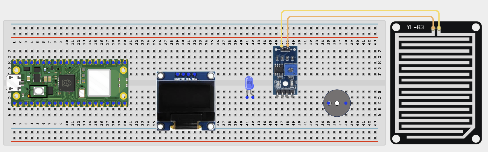
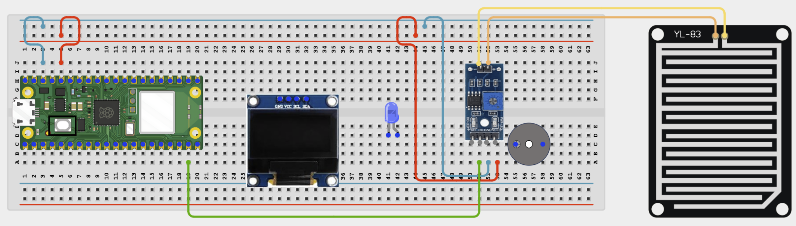
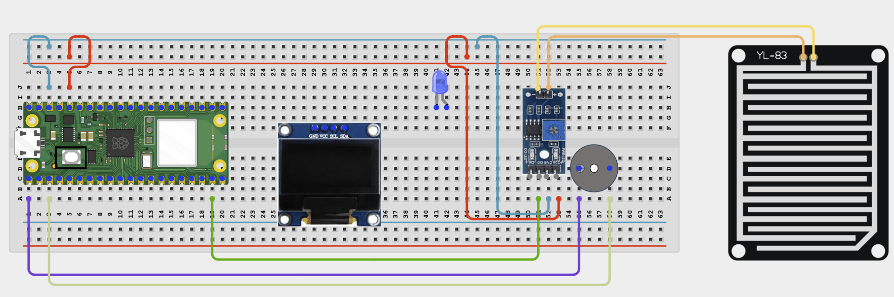
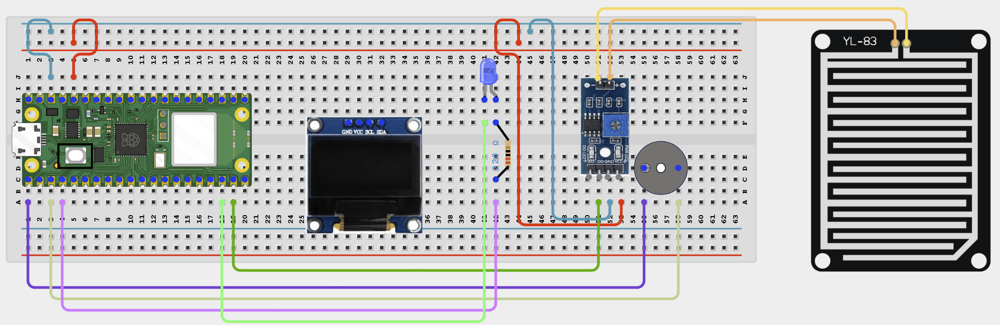
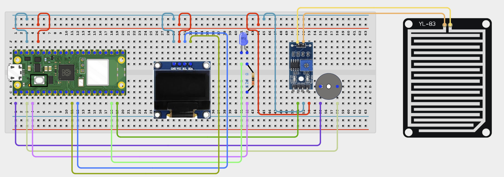

# Project 1.2.17
## Rain Alert System
# Overview

Build a rain alert system that gives buzzer, LED, OLED, and browser feedback when the rain sensor gets wet.

This project demonstrates active-low digital sensing and multiple alert outputs.

The final result should show DRY when the sensor is dry and switch to a rain alert with buzzer and LED when water is detected.

# Required Components

|  |  |  |  |
| --- | --- | --- | --- |
| <br>Raspberry Pi Pico 2 W | <br>Rain sensor module | <br>Active buzzer | <br>LED |
| <br>220Ω resistor | <br>SH1106 OLED display | <br>Breadboard | <br>Jumper wires |
| Water for testing | 2.4 GHz Wi-Fi network | Phone or computer browser |  |


# Circuit Connections

| Component Pin | Connects To | Pico GPIO / Physical Pin Number | Notes |
| --- | --- | --- | --- |
| Rain sensor VCC | 3.3V | Physical pin 36 |  |
| Rain sensor GND | GND | Physical pin 38 |  |
| Rain sensor DOUT | GPIO 14 | GPIO 14 / physical pin 19 | Digital input, often active-low |
| Buzzer positive (+) | GPIO 0 | GPIO 0 / physical pin 1 |  |
| Buzzer negative (-) | GND | Physical pin 38 |  |
| LED anode (+) | 220Ω resistor then GPIO 2 | GPIO 2 / physical pin 4 | Alert LED |
| LED cathode (-) | GND | Physical pin 38 |  |
| OLED VCC | 3.3V | Physical pin 36 |  |
| OLED GND | GND | Physical pin 38 |  |
| OLED SDA | GPIO 8 | GPIO 8 / physical pin 11 | I2C0 SDA |
| OLED SCL | GPIO 9 | GPIO 9 / physical pin 12 | I2C0 SCL |

# Step-by-Step Assembly

### Step 1: Place the Raspberry Pi Pico 2W

Place the Raspberry Pi Pico 2W on the breadboard so it sits across the center gap.
Keep the USB port facing outward so you can easily connect it to your computer.


### Step 2: Place the Rain sensor, Buzzer, LED, and OLED

Place the Rain sensor module on the breadboard or beside it where it can sense safely.

Place the active buzzer on the breadboard and identify its positive (+) and negative (-) pins.

Place the LED with its two legs in different breadboard rows.

Place the SH1106 OLED display module on the breadboard.

Identify VCC, GND, and DOUT on the sensor before wiring.



### Step 3: Connect the Rain sensor

Connect Rain sensor VCC to 3.3V.

Connect Rain sensor GND to GND.

Connect Rain sensor DOUT to GPIO 14.



### Step 4: Connect the Buzzer

Connect the buzzer positive (+) pin to GPIO 0.

Connect the buzzer negative (-) pin to GND.



### Step 5: Connect the LED

Connect the LED long leg to one end of a 220Ω resistor.

Connect the other end of the resistor to GPIO 2.

Connect the LED short leg to GND.



### Step 6: Connect OLED Power and I2C

Connect OLED VCC to 3.3V.

Connect OLED GND to GND.

Connect OLED SDA to GPIO 8.

Connect OLED SCL to GPIO 9.



## Wiring Check

✓ Pico 2W is placed correctly across the breadboard center gap

✓ Rain sensor VCC connects to 3.3V

✓ Rain sensor GND connects to GND

✓ Rain sensor DOUT connects to GPIO 14

✓ Buzzer positive pin connects to GPIO 0

✓ Buzzer negative pin connects to GND

✓ LED long leg connects through a 220Ω resistor to GPIO 2

✓ LED short leg connects to GND

✓ OLED VCC connects to 3.3V

✓ OLED GND connects to GND

✓ OLED SDA connects to GPIO 8

✓ OLED SCL connects to GPIO 9

✓ No loose jumper wires

## Beginner Note

Some rain sensors are active-low, so the signal may read LOW when water is detected.

## Safety Note

Water should touch only the sensor plate. Keep the Pico, breadboard, USB cable, and jumper wires dry.

# Testing Individual Components

Before running the full project, test each part separately. This makes it easier to find wiring or code problems.

## Rain sensor digital test

Check whether the digital output changes between dry and wet conditions.

```python
from machine import Pin
import time
sensor = Pin(14, Pin.IN)
while True:
    print(sensor.value())
    time.sleep(0.2)
```

Expected test result: The printed value should change when the sensor plate gets wet and then dry again.

## Buzzer and LED test

Check the alert outputs before combining them with the rain sensor.

```python
from machine import Pin
import time
buzzer = Pin(0, Pin.OUT)
led = Pin(2, Pin.OUT)
buzzer.on()
led.on()
time.sleep(0.5)
buzzer.off()
led.off()
```

Expected test result: The buzzer should sound and the LED should light briefly.

## OLED text test

Check that the OLED driver works.

```python
from machine import I2C, Pin
import sh1106
i2c = I2C(0, sda=Pin(8), scl=Pin(9), freq=400000)
oled = sh1106.SH1106_I2C(128, 64, i2c)
oled.fill(0)
oled.text('Rain Alert', 20, 28, 1)
oled.show()
```

Expected test result: The OLED should show Rain Alert.

## Wi-Fi connection test

Check that the Pico connects to Wi-Fi and prints its IP address.

```python
import network
import time
SSID = 'YOUR_WIFI_NAME'
PASSWORD = 'YOUR_WIFI_PASSWORD'
wlan = network.WLAN(network.STA_IF)
wlan.active(True)
wlan.connect(SSID, PASSWORD)
for _ in range(15):
    if wlan.isconnected():
        break
    print('Connecting...')
    time.sleep(1)
print('Connected:', wlan.isconnected())
if wlan.isconnected():
    print('IP address:', wlan.ifconfig()[0])
```

Expected test result: The Shell should show Connected: True and print an IP address.

# Full Project Code

Upload and run this code after the individual tests work correctly.

```python
import network
import socket
import time
from machine import I2C, Pin
import sh1106

SSID = 'YOUR_WIFI_NAME'
PASSWORD = 'YOUR_WIFI_PASSWORD'

rain = Pin(14, Pin.IN)
buzzer = Pin(0, Pin.OUT)
led = Pin(2, Pin.OUT)

i2c = I2C(0, sda=Pin(8), scl=Pin(9), freq=400000)
oled = sh1106.SH1106_I2C(128, 64, i2c)


def web_page(is_raining):
    status = 'RAINING!' if is_raining else 'DRY'
    return '''<!DOCTYPE html>
<html>
<head>
    <meta name='viewport' content='width=device-width, initial-scale=1'>
    <meta http-equiv='refresh' content='2'>
    <title>Rain Alert System</title>
</head>
<body style='font-family:Arial;text-align:center;padding:30px'>
    <h1>Rain Alert System</h1>
    <h2>{}</h2>
    <p>Wet the sensor plate to test the alert.</p>
</body>
</html>'''.format(status)


wlan = network.WLAN(network.STA_IF)
wlan.active(True)
wlan.connect(SSID, PASSWORD)

print('Connecting to Wi-Fi...')
for _ in range(15):
    if wlan.isconnected():
        break
    time.sleep(1)

if not wlan.isconnected():
    raise RuntimeError('Wi-Fi connection failed')

ip_address = wlan.ifconfig()[0]
print('Connected. Open http://{} in your browser'.format(ip_address))

address = socket.getaddrinfo('0.0.0.0', 80)[0][-1]
server = socket.socket()
server.bind(address)
server.listen(1)
server.settimeout(0.2)

while True:
    is_raining = rain.value() == 0

    buzzer.value(1 if is_raining else 0)
    led.value(1 if is_raining else 0)

    oled.fill(0)
    oled.text('Rain Alert', 20, 8, 1)
    oled.text('RAINING!' if is_raining else 'DRY', 28, 32, 1)
    oled.show()

    try:
        client, client_address = server.accept()
    except OSError:
        continue

    client.recv(1024)
    response = web_page(is_raining)
    client.send('HTTP/1.1 200 OK\r\nContent-Type: text/html\r\nConnection: close\r\n\r\n'.encode())
    client.sendall(response.encode())
    client.close()
```

# How the Code Works

| Code Section | What It Does | Why It Matters |
| --- | --- | --- |
| Active-low sensor read | Treats a low rain-sensor output as rain detected | Many rain modules output low when wet |
| Buzzer and LED alert | Turn on together when rain is detected | This gives both sound and visual warning |
| OLED status | Shows DRY or RAINING locally | Students can test the project without opening a browser |
| Web page | Shows the same current status remotely | This adds a second monitoring interface |

# Expected Result

After entering your Wi-Fi details and running the code, the OLED and browser page should show DRY at first. When the sensor plate gets wet, the buzzer should sound, the LED should turn on, and the displays should change to a rain alert.

# Troubleshooting

| Problem | Possible Cause | Solution |
| --- | --- | --- |
| Always shows rain | Sensor plate is still wet or sensitivity is too high | Dry the plate fully and adjust the module if needed |
| Never detects rain | Wrong wiring or not enough water on the plate | Check DOUT on GPIO 14 and use a few drops of water |
| Buzzer is silent | Buzzer type or wiring is wrong | Confirm you are using an active buzzer and check the polarity |
