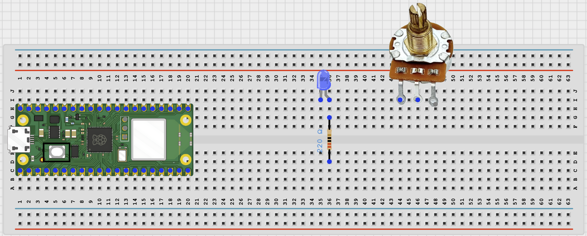
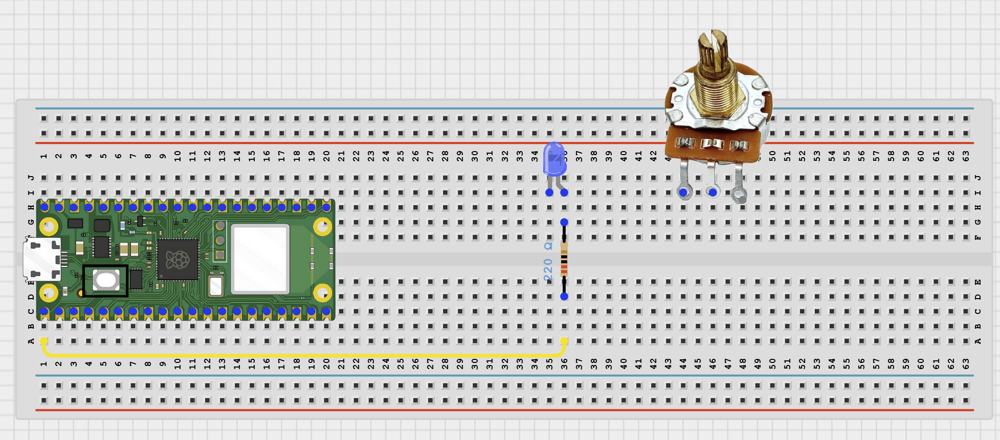
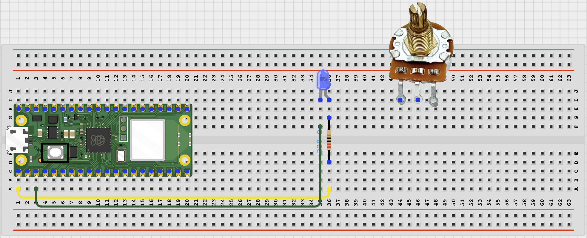
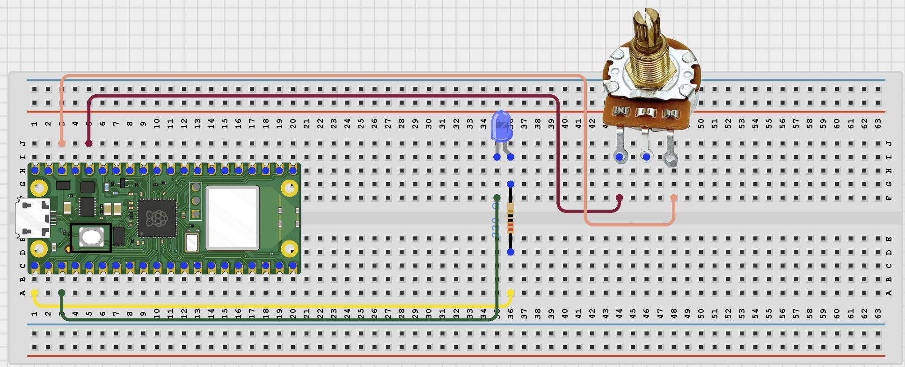
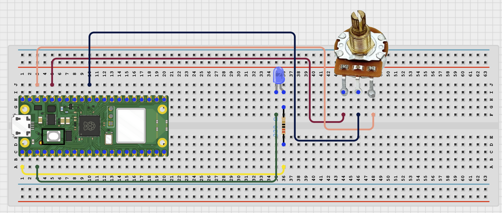

# Project 1.2.19
## Pwm Led Brightness Control
# Overview

Build a PWM LED project that changes LED brightness using a potentiometer.

This project demonstrates duty cycle, analog-style output, and brightness adjustment.

The final result should make an LED get brighter or dimmer as you turn the potentiometer.

# Required Components

|  |  |  |  |
| --- | --- | --- | --- |
|  Raspberry Pi Pico 2 W |  LED |  220 ohm resistor |  Potentiometer |
|  Breadboard |  Jumper wires | Computer with Thonny |  |

# Circuit Connections

| Component Pin | Connects To | Pico GPIO / Physical Pin Number | Notes |
| --- | --- | --- | --- |
| GPIO 0 | 220 ohm resistor then LED positive leg | GPIO 0 / physical pin 1 | PWM brightness signal |
| LED negative leg | GND | Physical pin 38 | Completes the LED circuit |
| Potentiometer outside pin 1 | 3.3V | Physical pin 36 | Top of the analog range |
| Potentiometer outside pin 2 | GND | Physical pin 38 | Bottom of the analog range |
| Potentiometer center pin | GPIO 26 / ADC0 | GPIO 26 / physical pin 31 | Analog input signal |

# Step-by-Step Assembly

### Step 1: Place the Raspberry Pi Pico 2W

Place the Raspberry Pi Pico 2W on the breadboard so it sits across the center gap.
Keep the USB port facing outward so you can easily connect it to your computer.

### Step 2: Place the LED, Resistor, and Potentiometer

Place the LED on the breadboard and identify its longer positive leg.

Place the 220 ohm resistor in series with the LED.

Place the potentiometer so its three pins are easy to connect.

Turn the potentiometer gently from one side to the other so you understand its movement before wiring.

### Step 3: Connect GPIO 0 to the LED

Connect GPIO 0 to one end of the 220 ohm resistor.

Connect the other end of the resistor to the LED positive leg.

### Step 4: Connect the LED to GND

Connect the LED negative leg to GND.

### Step 5: Connect the Potentiometer Power Pins

Connect one outside potentiometer pin to 3.3V.

Connect the other outside potentiometer pin to GND.

The two outside pins create a safe voltage range for the analog input.

### Step 6: Connect the Potentiometer Signal

Connect the center potentiometer pin to GPIO 26 / ADC0.

This signal wire lets the Pico read a changing value as you turn the knob.

### Step 7: Check the LED and Potentiometer

Make sure the LED has a resistor in series.

Make sure the potentiometer outside pins go to 3.3V and GND.

Make sure the potentiometer center pin goes to GPIO 26 / ADC0.

### Step 8: Check Before Powering

Make sure no LED leg or potentiometer wire is connected to the wrong power rail.

## Wiring Check

✓ Pico 2W is placed correctly across the breadboard center gap

✓ GPIO 0 connects through a 220 ohm resistor to the LED positive leg

✓ LED negative leg connects to GND

✓ Potentiometer center pin connects to GPIO 26 / ADC0

✓ Potentiometer outside pin connects to 3.3V

✓ Potentiometer other outside pin connects to GND

✓ LED positive leg receives GPIO 0 through the resistor

✓ Potentiometer turns smoothly without loose wires

✓ LED resistor is in series

✓ No LED leg is connected to 3.3V directly

✓ All jumper wires are firmly connected

✓ No loose jumper wires

## Safety Note

Do not connect an LED directly to a GPIO pin without a resistor. Keep the circuit on the Pico 3.3V logic side.

# Testing Individual Components

Before running the full project, test each part separately. This makes it easier to find wiring or code problems.

## PWM LED brightness test

Check that the LED changes brightness at different PWM levels.

| from machine import Pin, PWM
import time

led = PWM(Pin(0))
led.freq(1000)

for duty in (0, 15000, 30000, 50000, 65535, 0):
    led.duty_u16(duty)
    time.sleep(1) |
| --- |

Expected test result: The LED should step through dim, medium, bright, and then turn off.

## Potentiometer reading test

Check that the potentiometer produces changing analog readings.

| from machine import ADC
import time

pot = ADC(26)

while True:
    value = pot.read_u16()
    print('Potentiometer:', value)
    time.sleep(0.2) |
| --- |

Expected test result: The Shell should show values that change as you turn the knob.

## PWM and potentiometer test

Check that the potentiometer value can control the LED brightness.

| from machine import Pin, PWM, ADC
import time

led = PWM(Pin(0))
led.freq(1000)
pot = ADC(26)

while True:
    duty = pot.read_u16()
    led.duty_u16(duty)
    percent = int((duty / 65535) * 100)
    print('Brightness:', percent, '%')
    time.sleep(0.1) |
| --- |

Expected test result: Turning the knob should make the LED smoothly dimmer or brighter.

# Full Project Code

Upload and run this code after the individual tests work correctly.

| from machine import Pin, PWM, ADC
import time

led = PWM(Pin(0))
led.freq(1000)
pot = ADC(26)

while True:
    duty = pot.read_u16()
    led.duty_u16(duty)
    percent = int((duty / 65535) * 100)
    print('Brightness:', percent, '%')
    time.sleep(0.1) |
| --- |

# How the Code Works

| Code Section | What It Does | Why It Matters |
| --- | --- | --- |
| PWM LED setup | Creates a PWM output on GPIO 0 | PWM lets the LED appear dimmer or brighter |
| Potentiometer input | Reads a changing analog value on GPIO 26 / ADC0 | The knob becomes the brightness control |
| duty_u16() | Sends the potentiometer reading to the PWM output | The duty cycle controls the average LED power |
| Brightness percentage | Converts the reading into an easy 0-100% value | Students can connect the code value to what they see |

# Expected Result

After running the code, turn the potentiometer slowly. The LED should fade brighter and dimmer, and the Shell should print the brightness percentage. This shows how PWM can make a digital output act like an adjustable analog-style output.

# Troubleshooting

| Problem | Possible Cause | Solution |
| --- | --- | --- |
| LED does not turn on | LED polarity is reversed or the resistor path is open | Flip the LED direction and recheck the GPIO 0 resistor connection |
| Brightness does not change | Potentiometer signal wire is not on GPIO 26 / ADC0 | Move the center potentiometer wire to GPIO 26 / physical pin 31 |
| LED is always bright | The potentiometer outside pins may be connected incorrectly | Check that one outside pin goes to 3.3V and the other goes to GND |
| Readings jump around | A wire is loose or the knob is being turned too quickly | Press the jumper wires firmly and turn the knob slowly |
