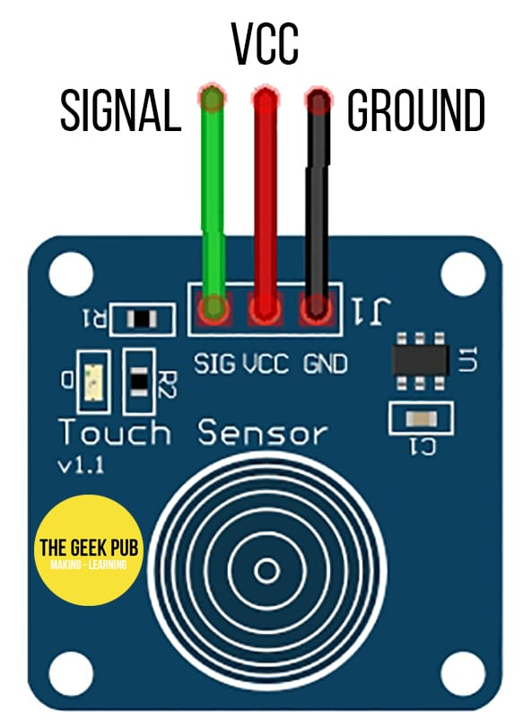
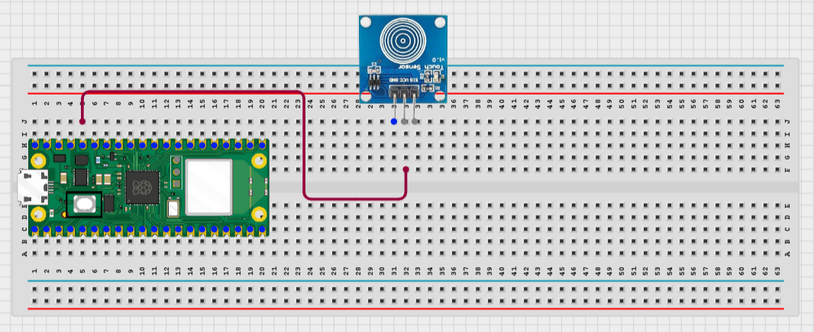
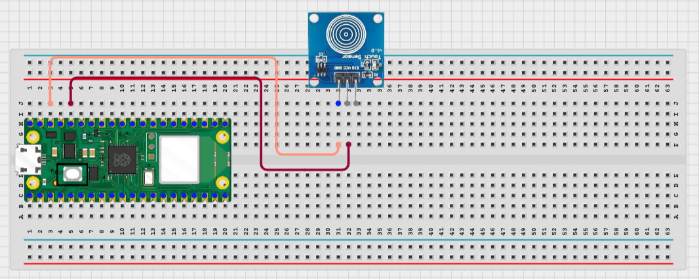
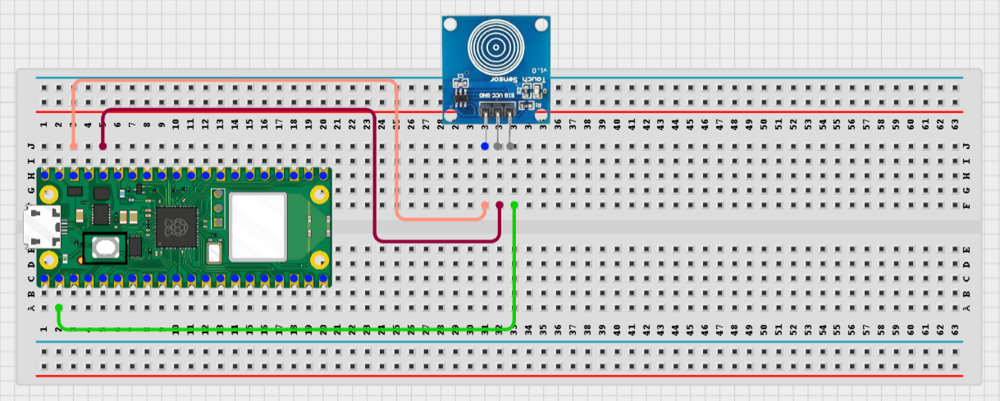
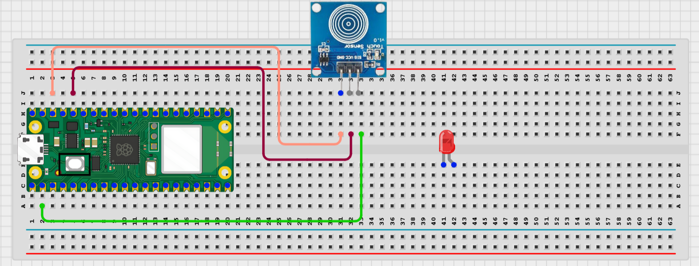
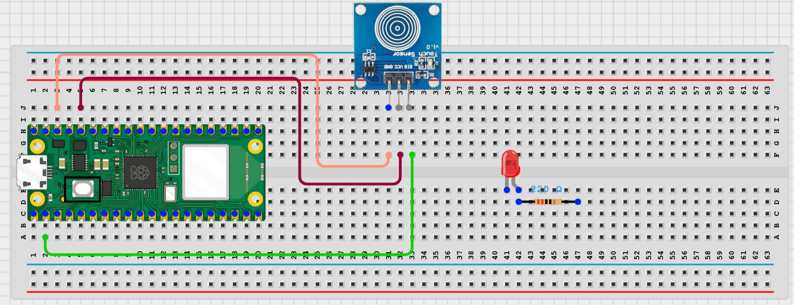
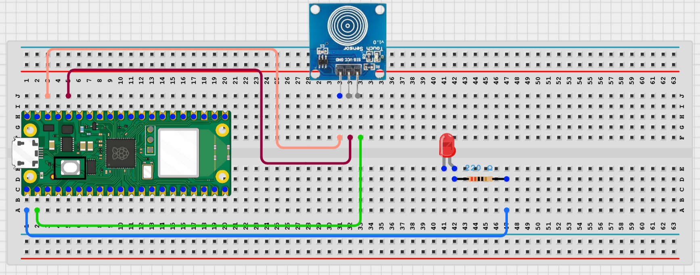
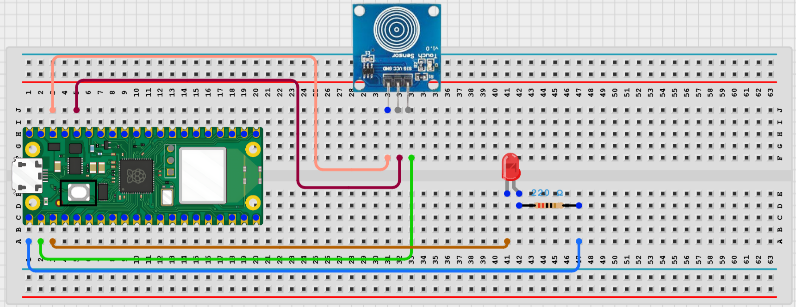

# Project 1.2.2
## Touch Sensor Led Switch

# Overview

Build a touch-controlled LED switch.

This project demonstrates capacitive touch input as an alternative to a button.

The final result is an LED that toggles on each touch.

# Required Components

|  |  |  |  |
| --- | --- | --- | --- |
|  Raspberry Pi Pico 2 W |  TTP223 touch sensor |  LED |  220Ω resistor |
|  Breadboard |  Jumper wires |  |  |

# Circuit Connections

| Component Pin | Connects To | Pico GPIO / Physical Pin Number | Notes |
| --- | --- | --- | --- |
| Touch sensor VCC | 3.3V | Physical pin 36 |  |
| Touch sensor GND | GND | Physical pin 38 |  |
| Touch sensor SIG | GPIO 1 | GPIO 1 / physical pin 2 | Digital output |
| LED anode (+) | 220Ω resistor then GPIO 0 | GPIO 0 / physical pin 1 |  |
| LED cathode (-) | GND | Physical pin 38 |  |

# Step-by-Step Assembly

### Step 1: Place the Raspberry Pi Pico 2W

Place the Raspberry Pi Pico 2W on the breadboard so it sits across the center gap.
Keep the USB port facing outward so you can easily connect it to your computer.

### Step 2: Place the Touch Sensor Module

Insert the touch sensor module onto the breadboard.

Most touch sensor modules have three pins:

VCC

GND

SIG / OUT

Check the labels on your module before wiring, because the pin order may be different depending on the sensor type.

### Step 3: Connect the Touch Sensor VCC Pin

Connect the VCC pin of the touch sensor module to 3.3V on the Raspberry Pi Pico 2W.

### Step 4: Connect the Touch Sensor GND Pin

Connect the GND pin of the touch sensor module to a GND pin on the Raspberry Pi Pico 2W.

### Step 5: Connect the Touch Sensor Signal Pin

Connect the SIG or OUT pin of the touch sensor module to GPIO 1 on the Raspberry Pi Pico 2W.

This pin sends a digital signal to the Pico when the sensor is touched.

### Step 6: Place the LED

Insert the LED onto the breadboard.

- Place the long leg (anode, +) in one row.

- Place the short leg (cathode, -) in a different row.

Do not place both LED legs in the same breadboard row.

### Step 7: Connect the LED Long Leg to the Resistor

Insert one end of the 220Ω resistor into the same row as the LED’s long leg.

### Step 8: Connect the Resistor to GPIO 0

Connect the other end of the 220Ω resistor to GPIO 0 on the Raspberry Pi Pico 2W.

### Step 9: Connect the LED Short Leg to GND

Connect the LED’s short leg to a GND pin on the Raspberry Pi Pico 2W.

## Wiring Check

Before running the code, confirm:

✓ Pico 2W is placed correctly across the breadboard center gap

✓ Touch sensor VCC connects to 3.3V

✓ Touch sensor GND connects to GND

✓ Touch sensor SIG/OUT connects to GPIO 1

✓ LED long leg connects to the 220Ω resistor

✓ Resistor connects to GPIO 0

✓ LED short leg connects to GND

✓ No loose jumper wires

## Beginner Note

The touch sensor sends a digital signal when it detects touch. Some modules output HIGH when touched, while others may behave differently depending on the board design. If the LED works opposite to what you expect, check the sensor output using a simple test code first.

# Testing Individual Components

Before running the full project, test each part separately. This makes it easier to find wiring or code problems.

## Touch sensor test

Check that the touch sensor changes state.

| from machine import Pin
import time
touch = Pin(1, Pin.IN)
while True:
    print(touch.value())
    time.sleep(0.2) |
| --- |

Expected test result: The printed value changes when you touch the sensor pad.

## LED test

Check the LED wiring first.

| from machine import Pin
import time
led = Pin(0, Pin.OUT)
led.on()
time.sleep(1)
led.off() |
| --- |

Expected test result: The LED turns on, then off.

# Full Project Code

After completing and checking the circuit connections, open Thonny IDE. Copy and paste the code below into a new file, or upload the project file to the Raspberry Pi Pico 2 W, then run it from Thonny.

| from machine import Pin
import time

led = Pin(0, Pin.OUT)
touch = Pin(1, Pin.IN)
led_state = 0
last_touch = 0

print('Touch LED switch ready')

while True:
    current_touch = touch.value()

    if current_touch == 1 and last_touch == 0:
        led_state = 0 if led_state else 1
        led.value(led_state)
        print('LED ON' if led_state else 'LED OFF')
        time.sleep(0.2)

    last_touch = current_touch
    time.sleep(0.02) |
| --- |

# How the Code Works

| Code Section | What It Does | Why It Matters |
| --- | --- | --- |
| Touch input | Reads the sensor output | The sensor acts like a touch button |
| last_touch | Stores the previous sensor state | Prevents repeated toggles from one touch |
| led_state | Stores the current LED state | Allows toggling |
| Debounce delay | Waits briefly after a touch | Improves reliability |

# Expected Result

Each touch changes the LED state. The Shell prints LED ON or LED OFF.

# Troubleshooting

| Problem | Possible Cause | Solution |
| --- | --- | --- |
| Touch never changes | Sensor not powered or wrong pin order | Check VCC, GND, and SIG labels |
| LED toggles many times | Touch held too long or noisy reading | Use the edge detection and debounce delay in the code |
| LED stays off | LED wiring problem | Test the LED separately first |
