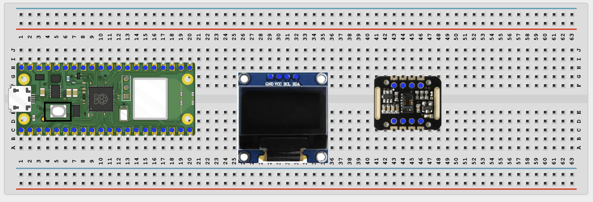
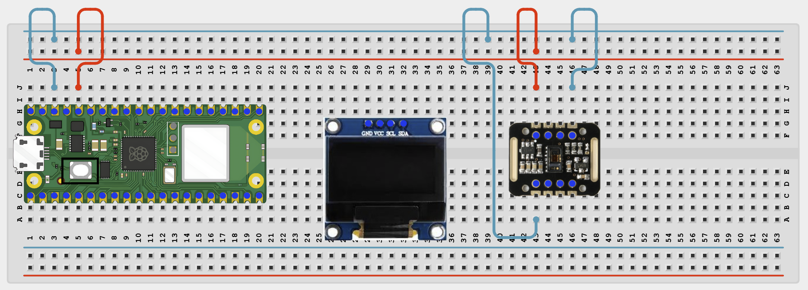
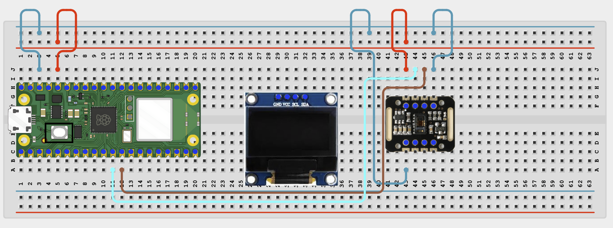
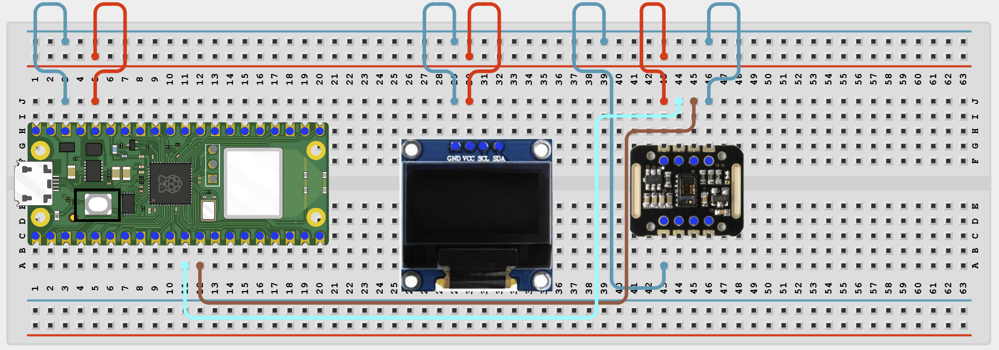
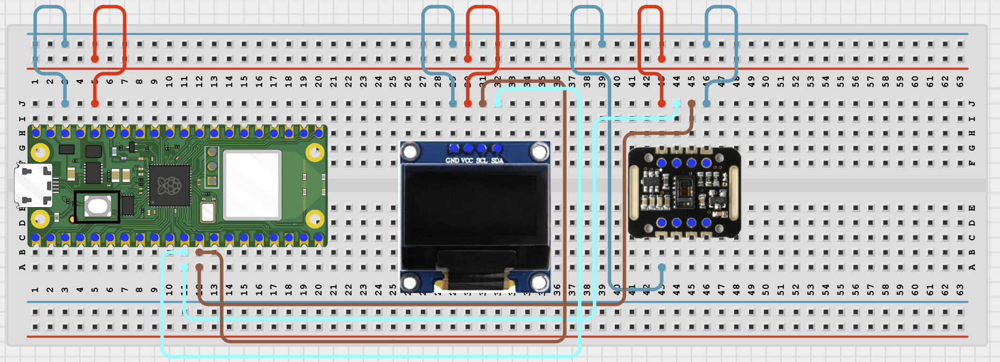

# Project 1.2.20
## Heart Rate Monitor
# Overview

Build a simple heart-rate display using a MAX30102 sensor and an OLED screen.

This project demonstrates biometric sensing and basic signal processing.

The final result should estimate a heart rate in BPM after you place a finger on the sensor and keep still.

# Required Components

|  |  |  |  |
| --- | --- | --- | --- |
|  Raspberry Pi Pico 2 W |  MAX30102 module |  SH1106 OLED display |  Breadboard |
|  Jumper wires |  |  |  |

# Circuit Connections

| Component Pin | Connects To | Pico GPIO / Physical Pin Number | Notes |
| --- | --- | --- | --- |
| MAX30102 VIN | 3.3V | Physical pin 36 | Check your module label |
| MAX30102 GND | GND | Physical pin 38 |  |
| MAX30102 SDA | GPIO 8 | GPIO 8 / physical pin 11 | Shared I2C data line |
| MAX30102 SCL | GPIO 9 | GPIO 9 / physical pin 12 | Shared I2C clock line |
| OLED VCC | 3.3V | Physical pin 36 |  |
| OLED GND | GND | Physical pin 38 |  |
| OLED SDA | GPIO 8 | GPIO 8 / physical pin 11 | Same SDA line as MAX30102 |
| OLED SCL | GPIO 9 | GPIO 9 / physical pin 12 | Same SCL line as MAX30102 |

# Step-by-Step Assembly

### Step 1: Place the Raspberry Pi Pico 2W

Place the Raspberry Pi Pico 2W on the breadboard so it sits across the center gap.
Keep the USB port facing outward so you can easily connect it to your computer.

### Step 2: Place the MAX30102 Module and OLED Display

Place the MAX30102 module on the breadboard.

Place the SH1106 OLED display module on the breadboard.

Identify VCC or VIN, GND, SDA, and SCL on the MAX30102 module.

Identify VCC, GND, SDA, and SCL on the OLED display.

Check the printed labels on both modules before wiring.

### Step 3: Connect MAX30102 Power

Connect MAX30102 VIN to 3.3V.

Connect MAX30102 GND to GND.

### Step 4: Connect MAX30102 I2C Pins

Connect MAX30102 SDA to GPIO 8.

Connect MAX30102 SCL to GPIO 9.

### Step 5: Connect OLED Power

Connect OLED VCC to 3.3V.

Connect OLED GND to GND.

### Step 6: Connect OLED I2C Pins

Connect OLED SDA to GPIO 8.

Connect OLED SCL to GPIO 9.

Both modules now share the same I2C bus.

## Wiring Check

✓ Pico 2W is placed correctly across the breadboard center gap

✓ MAX30102 VIN connects to 3.3V

✓ MAX30102 GND connects to GND

✓ MAX30102 SDA connects to GPIO 8

✓ MAX30102 SCL connects to GPIO 9

✓ OLED VCC connects to 3.3V

✓ OLED GND connects to GND

✓ OLED SDA connects to GPIO 8

✓ OLED SCL connects to GPIO 9

✓ No loose jumper wires

## Beginner Note

This project is for learning only. It should not be used for medical diagnosis or health decisions.

# Testing Individual Components

Before running the full project, test each part separately. This makes it easier to find wiring or code problems.

## I2C scanner test

Check that the OLED and MAX30102 both appear on the I2C bus.

| from machine import Pin, SoftI2C
i2c = SoftI2C(sda=Pin(8), scl=Pin(9), freq=400000)
print([hex(addr) for addr in i2c.scan()]) |
| --- |

Expected test result: You should usually see the MAX30102 address 0x57 and the OLED address such as 0x3c.

## OLED text test

Check that the OLED driver works.

| from machine import Pin, SoftI2C
import sh1106
i2c = SoftI2C(sda=Pin(8), scl=Pin(9), freq=400000)
display = sh1106.SH1106_I2C(128, 64, i2c)
display.fill(0)
display.text('Heart OLED OK', 10, 28, 1)
display.show() |
| --- |

Expected test result: The OLED should show Heart OLED OK.

## MAX30102 raw signal test

Check that the sensor returns changing raw values before calculating BPM.

| from machine import Pin, SoftI2C
from max30102 import MAX30102, MAX30105_PULSE_AMP_MEDIUM
import time
i2c = SoftI2C(sda=Pin(8), scl=Pin(9), freq=400000)
sensor = MAX30102(i2c=i2c)
sensor.setup_sensor()
sensor.set_sample_rate(400)
sensor.set_fifo_average(8)
sensor.set_active_leds_amplitude(MAX30105_PULSE_AMP_MEDIUM)
print('Place finger on sensor')
while True:
    sensor.check()
    if sensor.available():
        red_value = sensor.pop_red_from_storage()
        ir_value = sensor.pop_ir_from_storage()
        print(red_value, ir_value)
        time.sleep_ms(20) |
| --- |

Expected test result: The raw values should change when your finger is placed on the sensor and kept still.

# Full Project Code

Upload and run this code after the individual tests work correctly.

| from machine import Pin, SoftI2C
from utime import ticks_ms, ticks_diff
from max30102 import MAX30102, MAX30105_PULSE_AMP_MEDIUM
import sh1106
import time

class HeartRateMonitor:
    def __init__(self, window_size=150, smoothing_window=5):
        self.window_size = window_size
        self.smoothing_window = smoothing_window
        self.samples = []
        self.times = []
        self.filtered = []

    def add_sample(self, sample):
        now = ticks_ms()
        self.samples.append(sample)
        self.times.append(now)

        if len(self.samples) >= self.smoothing_window:
            avg = sum(self.samples[-self.smoothing_window:]) / self.smoothing_window
            self.filtered.append(avg)
        else:
            self.filtered.append(sample)

        if len(self.samples) > self.window_size:
            self.samples.pop(0)
            self.times.pop(0)
            self.filtered.pop(0)

    def calculate_bpm(self):
        if len(self.filtered) < 3:
            return None

        recent = self.filtered[-self.window_size:]
        minimum = min(recent)
        maximum = max(recent)
        threshold = minimum + (maximum - minimum) * 0.5

        peaks = []
        start_index = max(1, len(self.filtered) - self.window_size + 1)
        end_index = len(self.filtered) - 1

        for i in range(start_index, end_index):
            if self.filtered[i] > threshold and self.filtered[i - 1] < self.filtered[i] and self.filtered[i] > self.filtered[i + 1]:
                peaks.append(self.times[i])

        if len(peaks) < 2:
            return None

        intervals = []
        for i in range(1, len(peaks)):
            intervals.append(ticks_diff(peaks[i], peaks[i - 1]))

        average_interval = sum(intervals) / len(intervals)
        if average_interval <= 0:
            return None

        return 60000 / average_interval

i2c = SoftI2C(sda=Pin(8), scl=Pin(9), freq=400000)
display = sh1106.SH1106_I2C(128, 64, i2c)
sensor = MAX30102(i2c=i2c)

if sensor.i2c_address not in i2c.scan():
    raise OSError('MAX30102 not found on I2C bus')

sensor.setup_sensor()
sensor.set_sample_rate(400)
sensor.set_fifo_average(8)
sensor.set_active_leds_amplitude(MAX30105_PULSE_AMP_MEDIUM)

monitor = HeartRateMonitor(window_size=150, smoothing_window=5)
last_update = ticks_ms()

display.fill(0)
display.text('Heart Monitor', 12, 10, 1)
display.text('Place finger', 18, 34, 1)
display.show()

print('Heart rate monitor ready')
print('Place finger on sensor and keep still')

while True:
    sensor.check()

    if sensor.available():
        monitor.add_sample(sensor.pop_ir_from_storage())

    if ticks_diff(ticks_ms(), last_update) >= 2000:
        bpm = monitor.calculate_bpm()
        display.fill(0)
        display.text('Heart Monitor', 12, 8, 1)

        if bpm is None:
            display.text('Place finger', 18, 30, 1)
            display.text('and wait...', 20, 46, 1)
            print('Waiting for stable pulse...')
        else:
            bpm_text = str(int(bpm)) + ' BPM'
            display.text(bpm_text, 24, 34, 1)
            print('Heart Rate:', int(bpm), 'BPM')

        display.show()
        last_update = ticks_ms()

    time.sleep_ms(10) |
| --- |

# How the Code Works

| Code Section | What It Does | Why It Matters |
| --- | --- | --- |
| MAX30102 library setup | Creates the sensor object and configures it | The sensor must be configured before useful data can be collected |
| HeartRateMonitor class | Stores recent samples and looks for pulse peaks | This turns raw IR values into an estimated BPM |
| sensor.check() and sensor.available() | Pull new samples from the sensor FIFO | This keeps the incoming pulse data updated |
| 2-second update block | Calculates BPM and refreshes the OLED | Students get a simple reading without too much flicker |

# Expected Result

After you place a finger on the MAX30102 and keep still for a short time, the OLED should show an estimated BPM value. The Shell should print status messages and BPM updates.

# Troubleshooting

| Problem | Possible Cause | Solution |
| --- | --- | --- |
| No I2C devices found | SDA or SCL wiring is wrong | Recheck GPIO 8 and GPIO 9 and verify both modules have power |
| Sensor found but BPM never appears | Finger not steady or signal too weak | Place your finger gently and keep still for several seconds |
| Import error for max30102 | Library folder structure is wrong | Use lib/max30102/__init__.py and lib/max30102/circular_buffer.py exactly |
| Readings jump around | Normal movement noise or loose contact | Keep your finger still and improve sensor contact |
