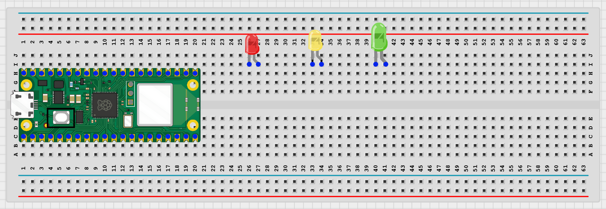
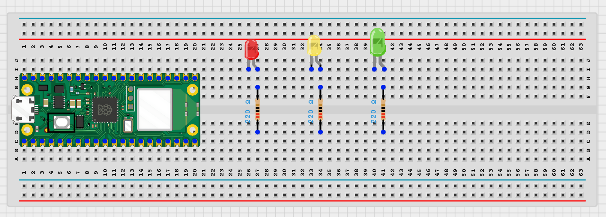
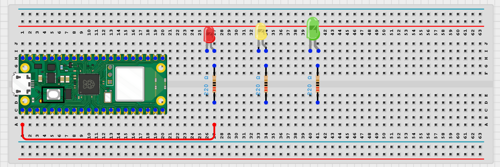
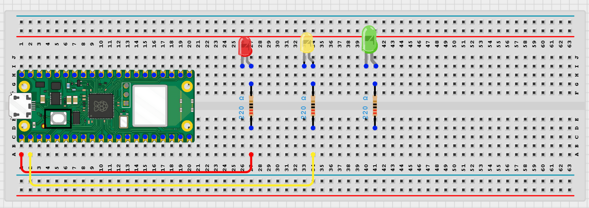
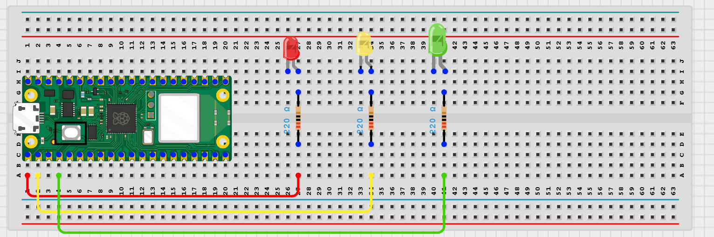
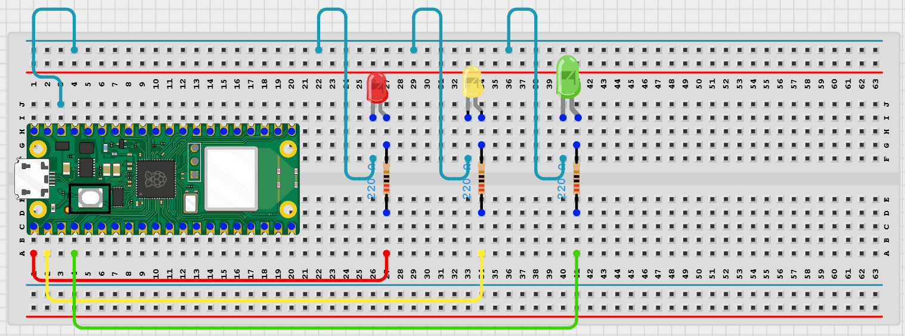

# Project 1.2.3

## Mini Traffic Light Controller

# Overview

Build a three-LED traffic light sequence.

This project demonstrates timed state changes and multi-output control.

The final result is a repeating red-yellow-green traffic pattern.

# Required Components

|                                                                                            |                                                                        |                                                                                                      |     |
| ------------------------------------------------------------------------------------------ | ---------------------------------------------------------------------- | ---------------------------------------------------------------------------------------------------- | --- |
|  Raspberry Pi Pico 2 W |  LEDs      |
|  220Ω resistors           |  Breadboard |  Jumper wires |     |

# Circuit Connections

| Component Pin        | Connects To               | Pico GPIO / Physical Pin Number | Notes                 |
| -------------------- | ------------------------- | ------------------------------- | --------------------- |
| Red LED anode (+)    | 220Ω resistor then GPIO 0 | GPIO 0 / physical pin 1         |                       |
| Yellow LED anode (+) | 220Ω resistor then GPIO 1 | GPIO 1 / physical pin 2         |                       |
| Green LED anode (+)  | 220Ω resistor then GPIO 2 | GPIO 2 / physical pin 4         |                       |
| All LED cathodes (-) | GND                       | Physical pin 38                 | Shared ground is fine |

# Step-by-Step Assembly

### Step 1: Place the Raspberry Pi Pico 2W

Place the Raspberry Pi Pico 2W on the breadboard so it sits across the center gap.
Keep the USB port facing outward so you can easily connect it to your computer.

### Step 2: Place the Three LEDs

Place the red, yellow, and green LEDs on the breadboard.

For each LED:

Long leg = Anode (+)

Short leg = Cathode (-)

Make sure each LED leg is placed in a different breadboard row.

### Step 3: Connect a Resistor to Each LED Long Leg

Connect one 220Ω resistor to the long leg of each LED.

You should have:

Red LED long leg → 220Ω resistor

Yellow LED long leg → 220Ω resistor

Green LED long leg → 220Ω resistor

Each LED needs its own resistor to protect it.

### Step 4: Connect the Red LED to GPIO 0

Connect the free end of the red LED resistor to GPIO 0 on the Raspberry Pi Pico 2W.

### Step 5: Connect the Yellow LED to GPIO 1

Connect the free end of the yellow LED resistor to GPIO 1 on the Raspberry Pi Pico 2W.

### Step 6: Connect the Green LED to GPIO 2

Connect the free end of the green LED resistor to GPIO 2 on the Raspberry Pi Pico 2W.

### Step 7: Connect All LED Short Legs to GND

Connect the short leg of each LED to GND.

You may connect all LED short legs to the breadboard ground rail, then connect the ground rail to a GND pin on the Pico.

## Wiring Check

Before running the code, confirm:

✓ Pico 2W is placed correctly across the breadboard center gap

✓ Red LED long leg connects through a 220Ω resistor to GPIO 0

✓ Yellow LED long leg connects through a 220Ω resistor to GPIO 1

✓ Green LED long leg connects through a 220Ω resistor to GPIO 2

✓ Red LED short leg connects to GND

✓ Yellow LED short leg connects to GND

✓ Green LED short leg connects to GND

✓ Each LED has its own resistor

✓ No LED legs are placed in the same breadboard row

✓ No loose jumper wires

## Beginner Note

Each LED must have its own resistor. Do not use one resistor for all three LEDs, because the LEDs may not share current evenly and one LED could become too bright or get damaged.

# Testing Individual Components

Before running the full project, test each part separately. This makes it easier to find wiring or code problems.

## LED test

Check each LED before running the full sequence.

| from machine import Pin
import time
leds = [Pin(0, Pin.OUT), Pin(1, Pin.OUT), Pin(2, Pin.OUT)]
for led in leds:
led.on()
time.sleep(1)
led.off() |
| --- |

Expected test result: Each LED turns on one at a time.

# Full Project Code

After completing and checking the circuit connections, open Thonny IDE. Copy and paste the code below into a new file, or upload the project file to the Raspberry Pi Pico 2 W, then run it from Thonny.

| from machine import Pin
import time

red = Pin(0, Pin.OUT)
yellow = Pin(1, Pin.OUT)
green = Pin(2, Pin.OUT)

def set_lights(r, y, g):
red.value(r)
yellow.value(y)
green.value(g)

print('Traffic light system ready')

while True:
set_lights(0, 0, 1)
print('GREEN - Go')
time.sleep(5)

    set_lights(0, 1, 0)
    print('YELLOW - Wait')
    time.sleep(2)

    set_lights(1, 0, 0)
    print('RED - Stop')
    time.sleep(5) |

| --- |

# How the Code Works

| Code Section   | What It Does                          | Why It Matters                     |
| -------------- | ------------------------------------- | ---------------------------------- |
| Pin setup      | Creates one output for each LED       | The project uses three outputs     |
| set_lights()   | Updates all light states together     | Makes the main loop easier to read |
| time.sleep()   | Controls how long each light stays on | Creates the traffic timing         |
| Print messages | Shows the active state in the Shell   | Helps students follow the sequence |

# Expected Result

The green LED turns on first, then yellow, then red. The pattern repeats continuously.

# Troubleshooting

| Problem                       | Possible Cause                         | Solution                                                 |
| ----------------------------- | -------------------------------------- | -------------------------------------------------------- |
| Wrong LED color lights        | Wires connected to the wrong GPIO pin  | Match each LED wire to the connection table              |
| One LED never turns on        | LED reversed or resistor not connected | Check that LED orientation and resistor path are correct |
| Timing feels too fast or slow | Delay values not adjusted              | Edit the time.sleep() values                             |
