# Project 1.2.4
## Pwm Dc Motor Speed Controller

# Overview

Build a variable-speed DC motor controller using PWM and a potentiometer.

This project demonstrates safe motor control with a transistor driver.

The final result is a motor that changes speed as you turn the potentiometer.

# Required Components

|  |  |  |  |
| --- | --- | --- | --- |
|  Raspberry Pi Pico 2 W |  Small DC motor | NPN transistor |  1kΩ resistor |
| 1N4007 diode | 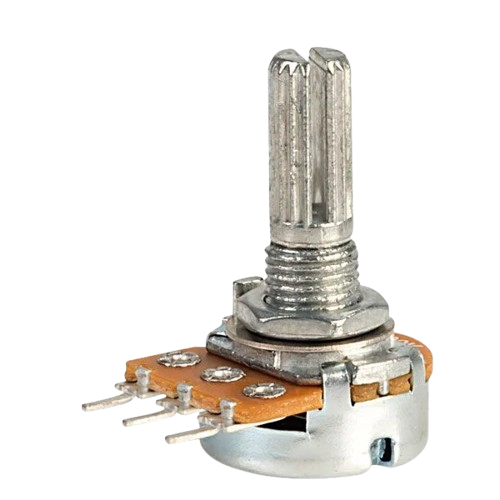 10kΩ potentiometer |  External motor supply |  Breadboard |
|  Jumper wires |  |  |  |

# Circuit Connections

| Component Pin | Connects To | Pico GPIO / Physical Pin Number | Notes |
| --- | --- | --- | --- |
| Potentiometer left pin | 3.3V | Physical pin 36 | Outer pin |
| Potentiometer middle pin | GPIO 26 | GPIO 26 / physical pin 31 | ADC input |
| Potentiometer right pin | GND | Physical pin 38 | Outer pin |
| GPIO 0 | 1kΩ resistor then transistor base | GPIO 0 / physical pin 1 | PWM control |
| Transistor emitter | GND | Physical pin 38 | Common ground |
| Transistor collector | Motor negative terminal | Not a GPIO pin | Switching side |
| Motor positive terminal | External motor supply positive | Not a GPIO pin | Motor power |
| External motor supply negative | GND | Not a GPIO pin | Common ground with Pico |
| Diode stripe end | Motor positive terminal | Not a GPIO pin | Across motor |
| Diode other end | Motor negative terminal | Not a GPIO pin | Across motor |

# Step-by-Step Assembly

### Step 1: Place the Raspberry Pi Pico 2W

Place the Raspberry Pi Pico 2W on the breadboard so it sits across the center gap.
Keep the USB port facing outward so you can easily connect it to your computer.

### Step 2: Place the Potentiometer

Insert the potentiometer onto the breadboard.

Make sure each of the three potentiometer pins sits on a separate breadboard row.

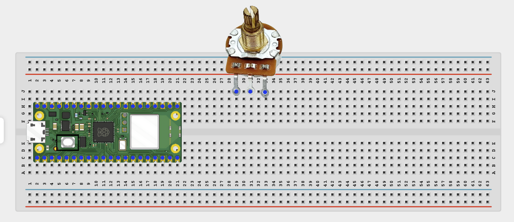

### Step 3: Connect the Potentiometer Outer Pins

Connect the two outer pins of the potentiometer:

One outer pin → 3.3V

Other outer pin → GND

The two outer pins provide the voltage range for the potentiometer.

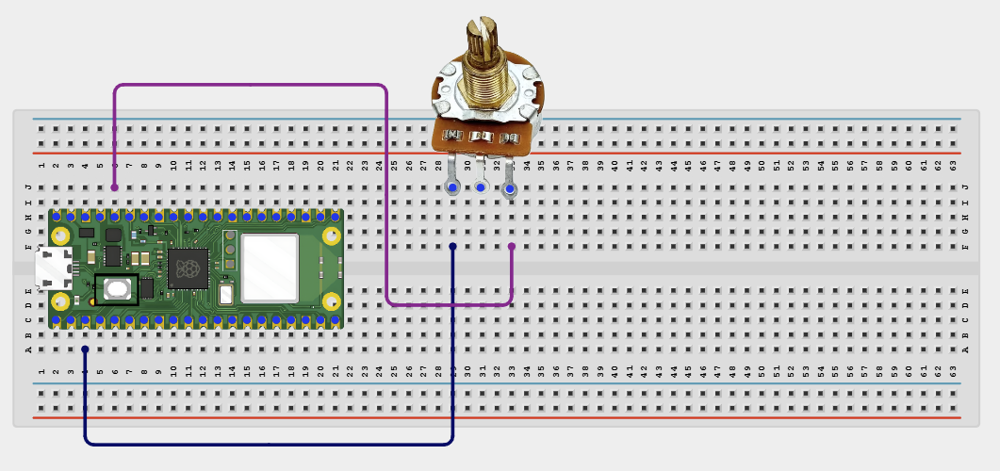

### Step 4: Connect the Potentiometer Middle Pin to GPIO 26

Connect the potentiometer middle pin to GPIO 26 (ADC0) on the Raspberry Pi Pico 2W.

The middle pin sends a changing analog voltage to the Pico as the knob is turned.

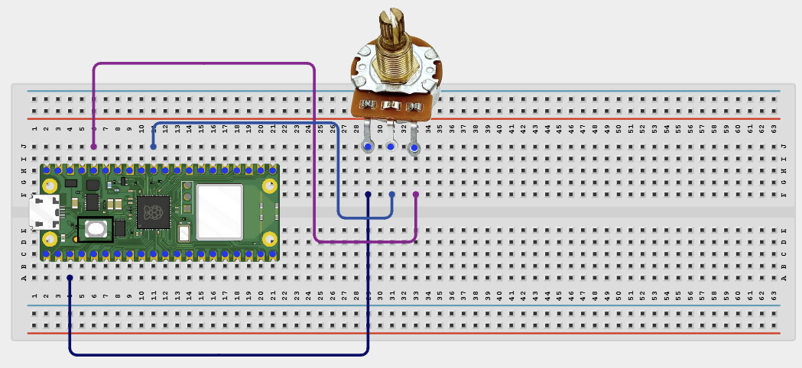

### Step 5: Place the Transistor

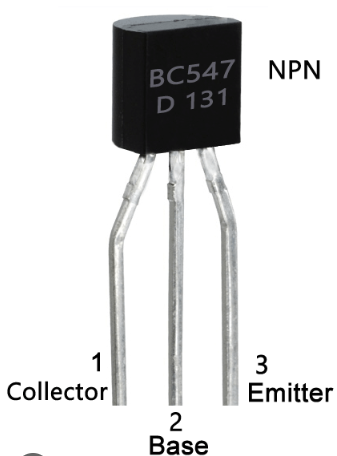
Place the transistor on the breadboard.

Identify the transistor pins before wiring:

Base

Collector

Emitter

Important: transistor pin order depends on the transistor model, so check the datasheet or the label guide for your exact transistor.

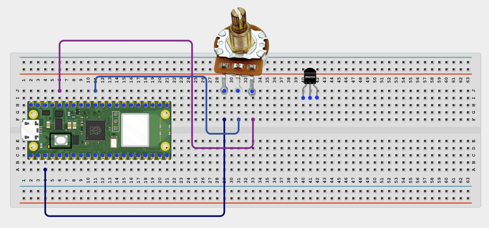

### Step 6: Connect GPIO 0 to the Transistor Base

Connect GPIO 0 to one end of the 1kΩ resistor.

Connect the other end of the 1kΩ resistor to the transistor base.

The resistor limits current from the Pico GPIO pin into the transistor base.

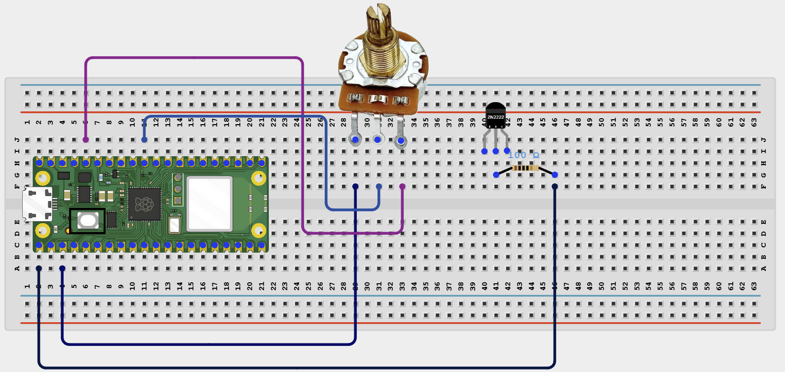

### Step 7: Connect the Transistor Emitter to GND

Connect the transistor emitter to GND.

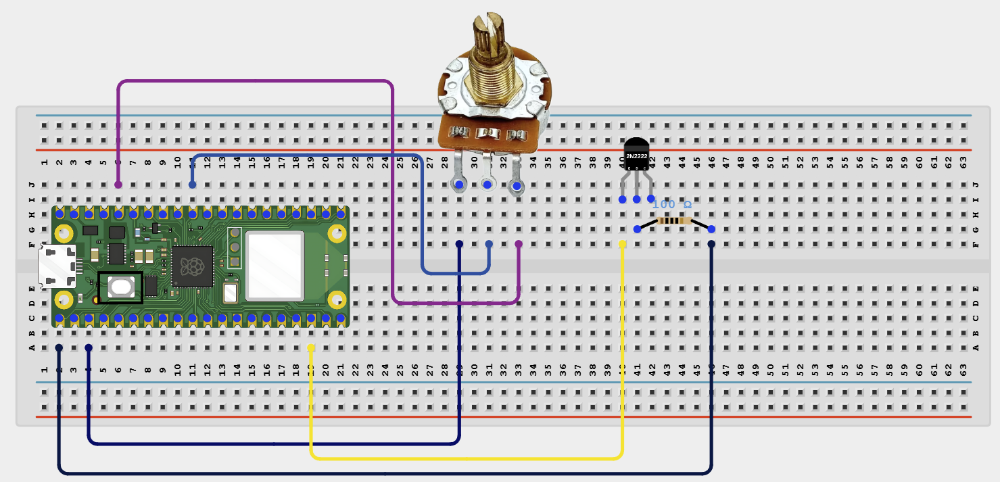

### Step 8: Connect the Transistor Collector to the Motor Negative Terminal

Connect the transistor collector to the motor’s negative terminal (-).

This lets the transistor switch the motor’s ground path ON and OFF.

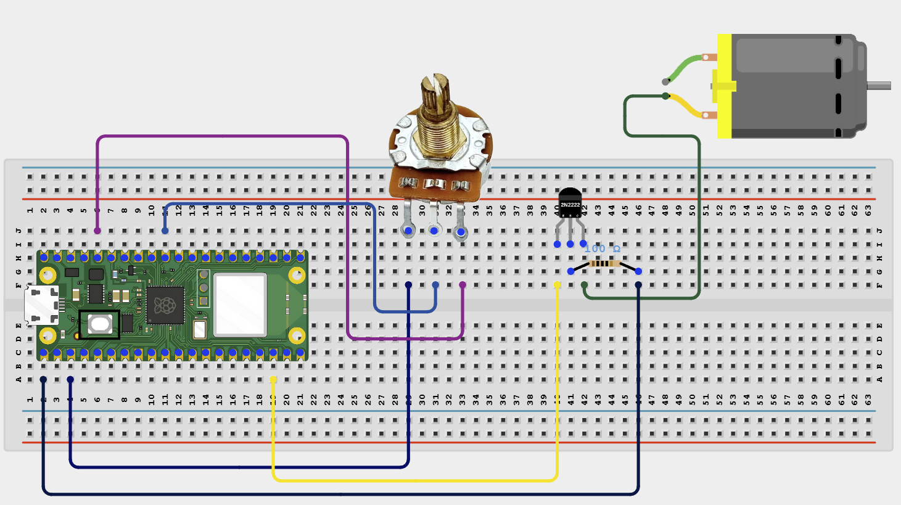

### Step 9: Connect the Motor Positive Terminal to External Motor Supply Positive

Connect the motor’s positive terminal (+) to the positive wire (+) of the external motor power supply.

Do not power the motor directly from the Raspberry Pi Pico GPIO pin. Pico GPIO pins cannot supply the current required by a DC motor; a transistor or motor driver is needed between the Pico and motor.

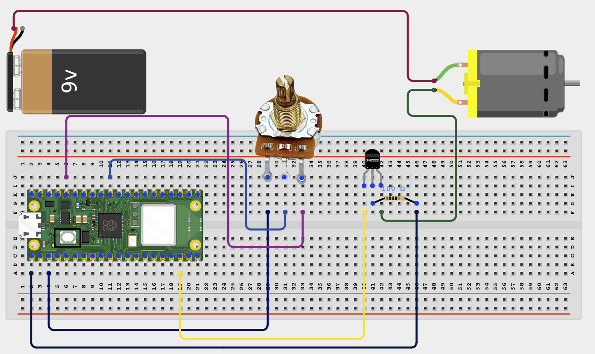

### Step 10: Connect External Motor Supply Negative to Pico GND

Connect the external motor supply negative wire (-) to Pico GND.

This creates a common ground so the Pico and transistor control circuit share the same reference voltage.

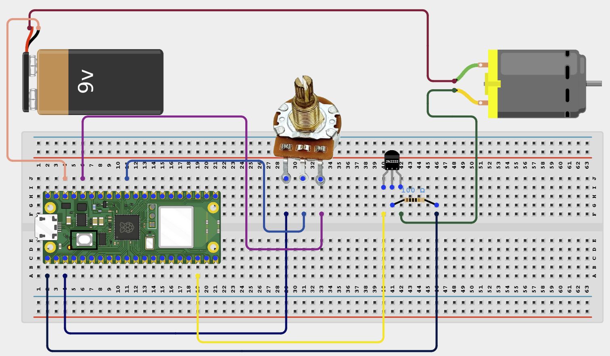

### Step 11: Place the Diode Across the Motor Terminals

Place the diode across the motor terminals.

Connect it like this:

Diode striped side / cathode → Motor positive terminal

Diode non-striped side / anode → Motor negative terminal

The diode helps protect the circuit from voltage spikes produced when the motor switches OFF.

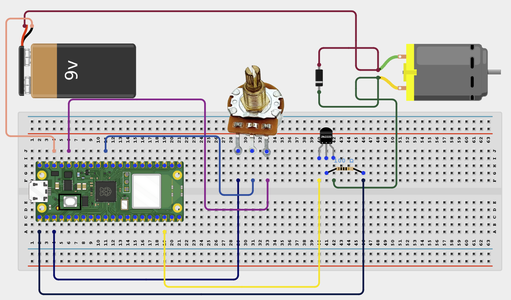

### Step 12: Check That the Motor Can Spin Freely

Before powering the circuit, make sure:

The motor shaft can rotate freely

No wire is touching the motor shaft

The motor is not blocked

The diode is connected in the correct direction

The external motor supply voltage matches the motor rating

## Wiring Check

✓ Pico 2W is placed correctly across the breadboard center gap

✓ Potentiometer outer pins connect to 3.3V and GND

✓ Potentiometer middle pin connects to GPIO 26 (ADC0)

✓ GPIO 0 connects to the transistor base through a 1kΩ resistor

✓ Transistor emitter connects to GND

✓ Transistor collector connects to motor negative terminal

✓ Motor positive terminal connects to external motor supply positive

✓ External motor supply negative connects to Pico GND

✓ Diode striped side connects to motor positive terminal

✓ Diode non-striped side connects to motor negative terminal

✓ Motor can spin freely before power is applied

✓ No loose jumper wires

## Safety Note

Use the transistor as a motor switch, not the Pico GPIO pin. The Pico should only control the transistor base signal. The motor must use an external supply that matches the motor’s voltage and current requirements.

# Testing Individual Components

Before running the full project, test each part separately. This makes it easier to find wiring or code problems.

## Potentiometer test

Check the ADC reading first.

| from machine import ADC, Pin
import time
pot = ADC(Pin(26))
while True:
    print(pot.read_u16())
    time.sleep(0.3) |
| --- |

Expected test result: The printed value changes when you turn the potentiometer.

## Motor driver test

Check that the transistor can switch the motor on and off.

| from machine import Pin, PWM
import time
motor = PWM(Pin(0))
motor.freq(1000)
motor.duty_u16(40000)
time.sleep(2)
motor.duty_u16(0) |
| --- |

Expected test result: The motor spins for about 2 seconds, then stops.

# Full Project Code

After completing and checking the circuit connections, open Thonny IDE. Copy and paste the code below into a new file, or upload the project file to the Raspberry Pi Pico 2 W, then run it from Thonny.

| from machine import PWM, ADC, Pin
import time

motor = PWM(Pin(0))
motor.freq(1000)
pot = ADC(Pin(26))

print('Motor speed control ready')

while True:
    speed = pot.read_u16()
    motor.duty_u16(speed)
    percent = int((speed / 65535) * 100)
    print('Speed:', percent, '%')
    time.sleep(0.1) |
| --- |

# How the Code Works

| Code Section | What It Does | Why It Matters |
| --- | --- | --- |
| PWM output | Creates a variable duty cycle on GPIO 0 | The transistor uses this to control motor speed |
| ADC input | Reads the potentiometer position | This becomes the speed command |
| duty_u16(speed) | Applies the new motor speed | More duty cycle means more average motor power |
| Percent print | Shows the estimated speed setting | Helps with testing and understanding |

# Expected Result

Turning the potentiometer changes the motor speed from stopped or slow to fast.

# Troubleshooting

| Problem | Possible Cause | Solution |
| --- | --- | --- |
| Motor does not spin | Transistor wired incorrectly or no external power | Check transistor pins and the external supply |
| Motor always runs at full speed | Potentiometer wiring problem | Reconnect the middle pin to GPIO 26 and outer pins to 3.3V/GND |
| Pico resets | Motor power noise or missing common ground | Check the diode and make sure grounds are connected correctly |
