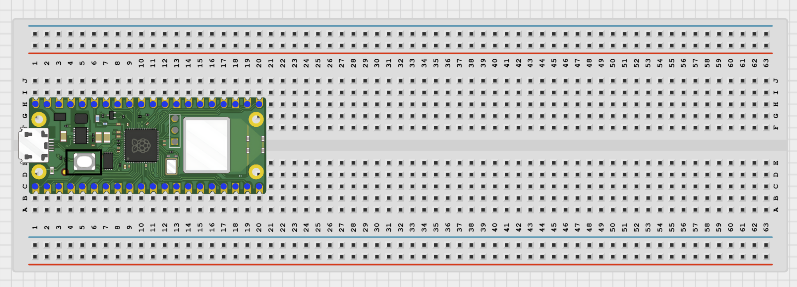
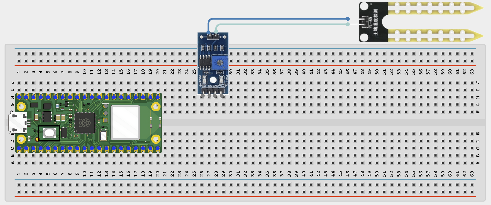
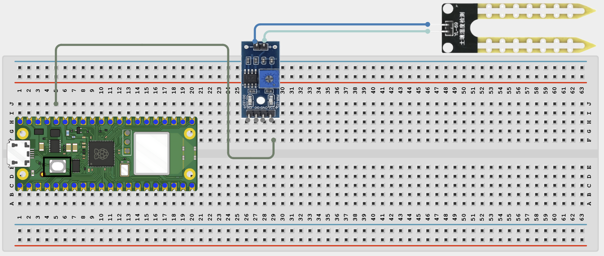
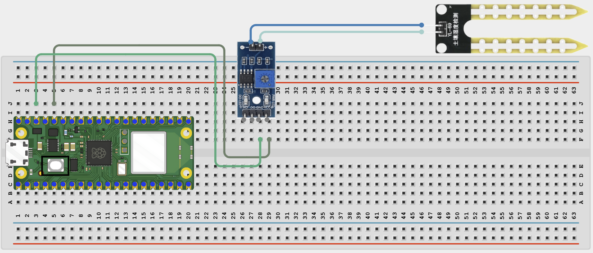
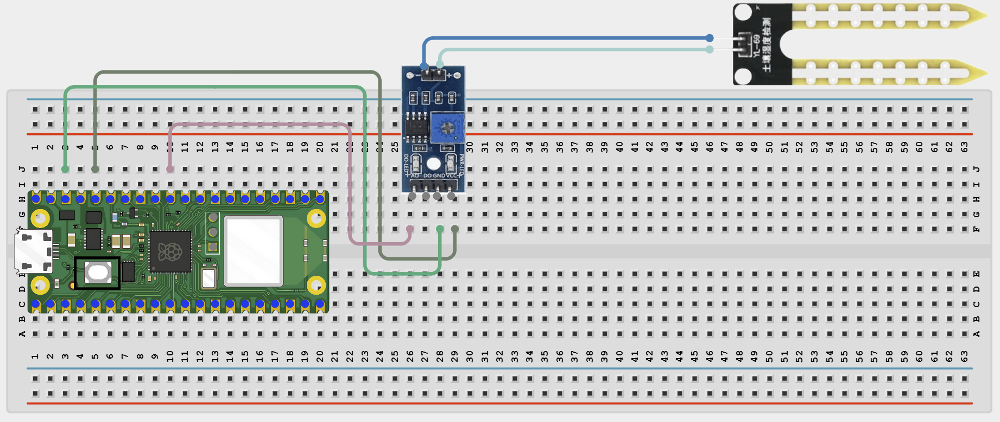
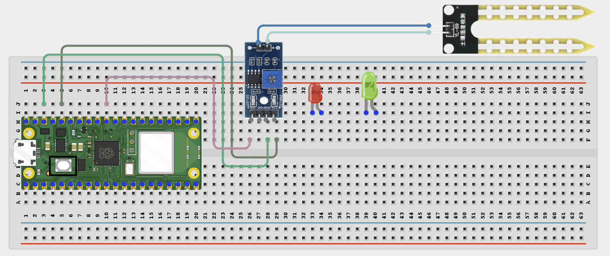
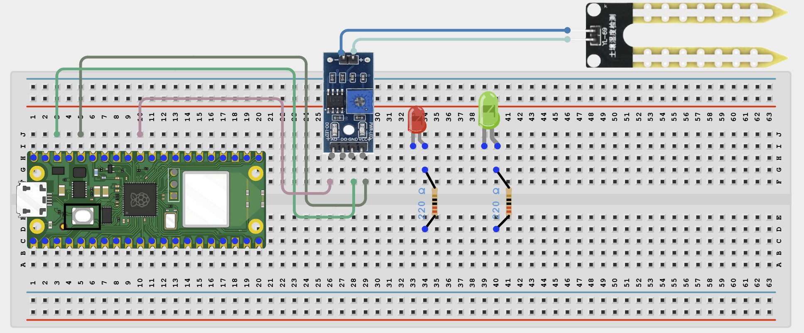
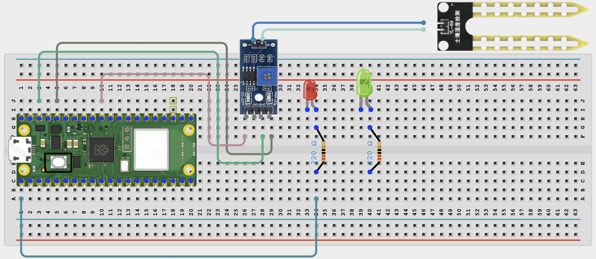
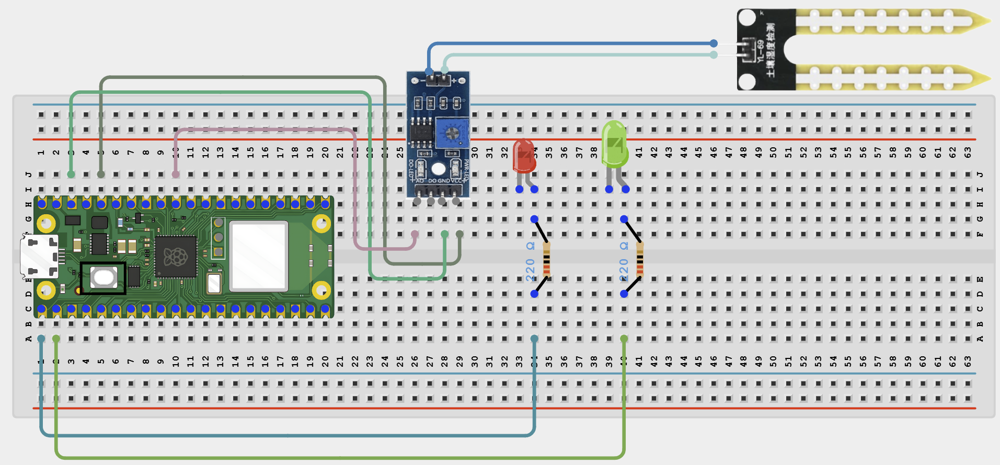
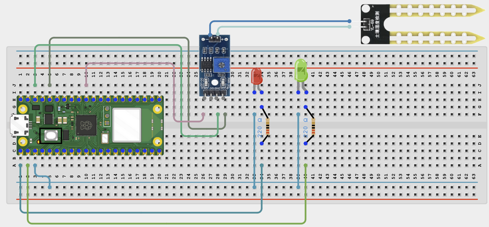

# Project 1.2.5

## Soil Moisture LED Indicator

# Overview

Build a simple plant moisture monitor with LEDs.

This project demonstrates analog sensing for plant care.

The final result is an LED indicator that shows when soil is dry or has enough moisture.

# Required Components

|                                                                                            |                                                                                                      |                                                                                                      |     |
| ------------------------------------------------------------------------------------------ | ---------------------------------------------------------------------------------------------------- | ---------------------------------------------------------------------------------------------------- | --- |
|  Raspberry Pi Pico 2 W |  Soil moisture sensor |  LED's                                   |
|  220Ω resistors           |  Breadboard                               |  Jumper wires |     |

# Circuit Connections

| Component Pin         | Connects To               | Pico GPIO / Physical Pin Number | Notes            |
| --------------------- | ------------------------- | ------------------------------- | ---------------- |
| Soil sensor VCC       | 3.3V                      | Physical pin 36                 |                  |
| Soil sensor GND       | GND                       | Physical pin 38                 |                  |
| Soil sensor AOUT      | GPIO 26                   | GPIO 26 / physical pin 31       | ADC input        |
| Red LED anode (+)     | 220Ω resistor then GPIO 0 | GPIO 0 / physical pin 1         | Dry indicator    |
| Green LED anode (+)   | 220Ω resistor then GPIO 1 | GPIO 1 / physical pin 2         | Wet/OK indicator |
| Both LED cathodes (-) | GND                       | Physical pin 38                 |                  |

# Step-by-Step Assembly

### Step 1: Place the Raspberry Pi Pico 2W

Place the Raspberry Pi Pico 2W on the breadboard so it sits across the center gap.
Keep the USB port facing outward so you can easily connect it to your computer.

### Step 2: Place the Soil Moisture Sensor

Place the soil moisture sensor module on the breadboard or position it so the probe can be inserted into soil.

Most soil moisture sensor modules have three main pins:

VCC

GND

AOUT / AO / Signal

Check the labels on your own module before wiring.

### Step 3: Connect the Soil Sensor VCC

Connect the soil sensor VCC pin to 3.3V on the Raspberry Pi Pico 2W.

### Step 4: Connect the Soil Sensor GND

Connect the soil sensor GND pin to a GND pin on the Raspberry Pi Pico 2W.

### Step 5: Connect the Soil Sensor AOUT to GPIO 26

Connect the soil sensor AOUT / AO / Signal pin to GPIO 26 (ADC0) on the Raspberry Pi Pico 2W.

GPIO 26 is an analog input pin, so it can read changing soil moisture values.

### Step 6: Place the Red and Green LEDs

Place the red LED and green LED on the breadboard.

For each LED:

Long leg = Anode (+)

Short leg = Cathode (-)

Make sure each LED leg is placed in a different breadboard row.

### Step 7: Connect a Resistor to Each LED Long Leg

Connect one 220Ω resistor to the long leg of each LED.

You should have:

Red LED long leg → 220Ω resistor

Green LED long leg → 220Ω resistor

Each LED needs its own resistor for protection.

### Step 8: Connect the Red LED to GPIO 0

Connect the free end of the red LED resistor to GPIO 0 on the Raspberry Pi Pico 2W.

### Step 9: Connect the Green LED to GPIO 1

Connect the free end of the green LED resistor to GPIO 1 on the Raspberry Pi Pico 2W.

### Step 10: Connect Both LED Short Legs to GND

Connect the short leg of both LEDs to GND.

You can connect both LED short legs to the breadboard ground rail, then connect the ground rail to a GND pin on the Pico.

## Wiring Check

Before running the code, confirm:

✓ Pico 2W is placed correctly across the breadboard center gap

✓ Soil sensor VCC connects to 3.3V

✓ Soil sensor GND connects to GND

✓ Soil sensor AOUT/AO/Signal connects to GPIO 26 (ADC0)

✓ Red LED long leg connects through a 220Ω resistor to GPIO 0

✓ Green LED long leg connects through a 220Ω resistor to GPIO 1

✓ Red LED short leg connects to GND

✓ Green LED short leg connects to GND

✓ Each LED has its own 220Ω resistor

✓ No loose jumper wires

## Beginner Note

The soil moisture sensor gives an analog reading. Test the sensor in dry soil and wet soil first so you can decide which reading should turn on the red LED and which reading should turn on the green LED.

For example:

Dry soil → Red LED ON

Wet soil → Green LED ON

## Safety Note

Do not pour water directly onto the breadboard or Pico. Only the soil sensor probe should go into the soil. Keep the Pico, USB cable, jumper wires, and breadboard electronics dry.

# Testing Individual Components

Before running the full project, test each part separately. This makes it easier to find wiring or code problems.

## Soil sensor test

Check that the moisture reading changes.

| from machine import ADC, Pin
import time
sensor = ADC(Pin(26))
while True:
print(sensor.read_u16())
time.sleep(0.5) |
| --- |

Expected test result: The reading changes between dry and wet conditions.

## LED test

Check each indicator LED first.

| from machine import Pin
import time
for pin in (0, 1):
led = Pin(pin, Pin.OUT)
led.on()
time.sleep(1)
led.off() |
| --- |

Expected test result: Each LED lights one at a time.

# Full Project Code

After completing and checking the circuit connections, open Thonny IDE. Copy and paste the code below into a new file, or upload the project file to the Raspberry Pi Pico 2 W, then run it from Thonny.

| from machine import Pin, ADC
import time

red = Pin(0, Pin.OUT)
green = Pin(1, Pin.OUT)
sensor = ADC(Pin(26))

print('Soil moisture indicator ready')

while True:
raw = sensor.read_u16()
moisture = 100 - int((raw / 65535) \* 100)
print('Moisture:', moisture, '%')

    if moisture < 30:
        red.on()
        green.off()
    else:
        red.off()
        green.on()

    time.sleep(0.5) |

| --- |

# How the Code Works

| Code Section        | What It Does                                                   | Why It Matters                                           |
| ------------------- | -------------------------------------------------------------- | -------------------------------------------------------- |
| ADC reading         | Reads the soil sensor                                          | This measures the moisture-related signal                |
| Inverted percentage | Converts the raw reading into a friendlier moisture percentage | Many simple soil probes read lower values in wetter soil |
| Threshold check     | Decides whether the soil is dry                                | Controls the indicator LEDs                              |
| Printed output      | Shows the current reading                                      | Helps students compare dry and wet values                |

# Expected Result

The red LED turns on when the soil is dry. The green LED turns on when the soil has enough moisture.

# Troubleshooting

| Problem                | Possible Cause                             | Solution                                                           |
| ---------------------- | ------------------------------------------ | ------------------------------------------------------------------ |
| Readings do not change | Probe not connected or poor sensor contact | Check the probe/module wiring and test with dry and wet conditions |
| Red LED always on      | Threshold too high or soil very dry        | Water the soil slightly or adjust the threshold                    |
| Green LED never lights | Sensor scaling differs                     | Print the readings and calibrate the threshold for your sensor     |
