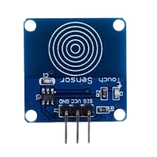
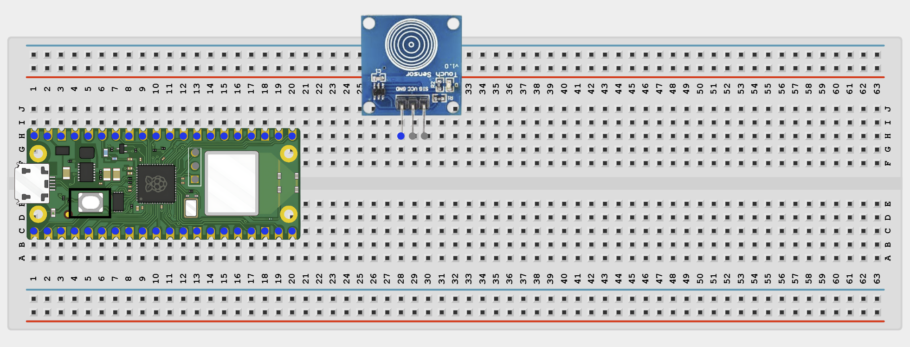
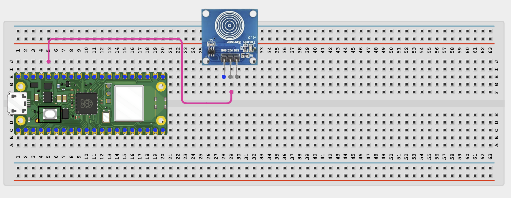
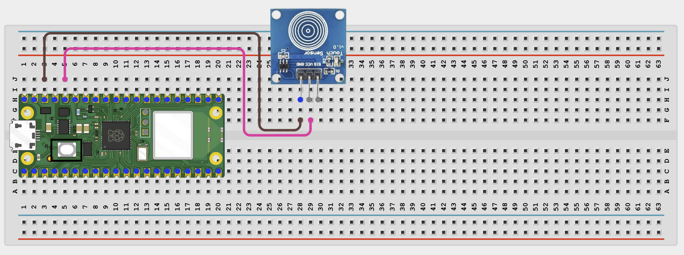
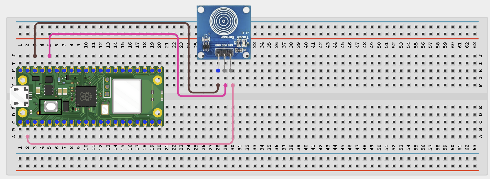
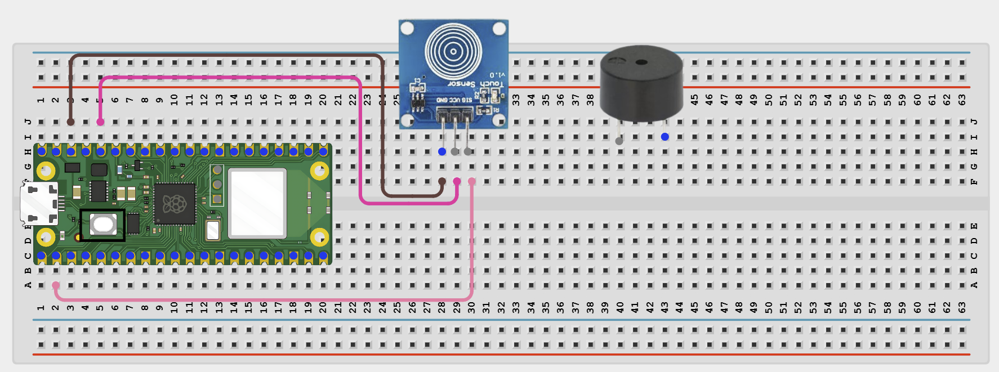
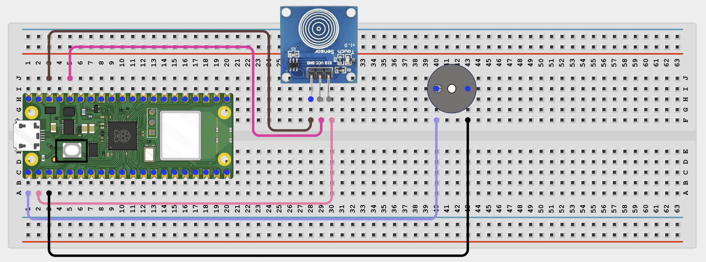

# Project 1.2.7
## Touch Sensor Doorbell
# Overview

Build a touch-activated doorbell with a simple buzzer sound pattern.

This project demonstrates touch input and custom output timing.

The final result is a buzzer that plays a doorbell-like sound when the touch pad is tapped.

# Required Components

|  |  |  |  |
| --- | --- | --- | --- |
|  Raspberry Pi Pico 2 W |  TTP223 touch sensor |  Active buzzer |  Breadboard |
|  Jumper wires |  |  |  |

# Circuit Connections

| Component Pin | Connects To | Pico GPIO / Physical Pin Number | Notes |
| --- | --- | --- | --- |
| Touch sensor VCC | 3.3V | Physical pin 36 |  |
| Touch sensor GND | GND | Physical pin 38 |  |
| Touch sensor SIG | GPIO 1 | GPIO 1 / physical pin 2 |  |
| Buzzer positive (+) | GPIO 0 | GPIO 0 / physical pin 1 |  |
| Buzzer negative (-) | GND | Physical pin 38 |  |

# Step-by-Step Assembly

### Step 1: Place the Raspberry Pi Pico 2W

Place the Raspberry Pi Pico 2W on the breadboard so it sits across the center gap.
Keep the USB port facing outward so you can easily connect it to your computer.

### Step 2: Place the Touch Sensor

Place the TTP223 touch sensor module on the breadboard.

Identify the module pins before wiring: VCC, GND, and SIG.

Check the printed labels before connecting jumper wires.

### Step 3: Connect the Touch Sensor VCC

Connect the touch sensor VCC pin to 3.3V.

### Step 4: Connect the Touch Sensor GND

Connect the touch sensor GND pin to GND.

### Step 5: Connect the Touch Sensor SIG Pin

Connect the touch sensor SIG pin to GPIO 1.

This signal pin changes when the sensor is touched.

### Step 6: Place the Active Buzzer

Place the active buzzer on the breadboard.

Identify the positive (+) and negative (-) pins.

### Step 7: Connect the Buzzer

Connect the buzzer positive (+) pin to GPIO 0.

Connect the buzzer negative (-) pin to GND.

## Wiring Check

✓ Pico 2W is placed correctly across the breadboard center gap

✓ Touch sensor VCC connects to 3.3V

✓ Touch sensor GND connects to GND

✓ Touch sensor SIG connects to GPIO 1

✓ Buzzer positive pin connects to GPIO 0

✓ Buzzer negative pin connects to GND

✓ No loose jumper wires

## Beginner Note

The TTP223 is a capacitive touch sensor. It works best when you touch the marked pad area gently with your finger.

# Testing Individual Components

Before running the full project, test each part separately. This makes it easier to find wiring or code problems.

## Touch sensor test

Check the touch input first.

| from machine import Pin
import time
touch = Pin(1, Pin.IN)
while True:
    print(touch.value())
    time.sleep(0.2) |
| --- |

Expected test result: The printed value changes when you touch the pad.

## Buzzer test

Check the buzzer separately.

| from machine import Pin
import time
buzzer = Pin(0, Pin.OUT)
buzzer.on()
time.sleep(0.2)
buzzer.off()
time.sleep(0.2)
buzzer.on()
time.sleep(0.3)
buzzer.off() |
| --- |

Expected test result: The buzzer plays a short ding-dong style pattern.

# Full Project Code

After completing and checking the circuit connections, open Thonny IDE. Copy and paste the code below into a new file, or upload the project file to the Raspberry Pi Pico 2 W, then run it from Thonny.

| from machine import Pin
import time

touch = Pin(1, Pin.IN)
buzzer = Pin(0, Pin.OUT)
last_touch = 0

def play_doorbell():
    buzzer.on()
    time.sleep(0.15)
    buzzer.off()
    time.sleep(0.1)
    buzzer.on()
    time.sleep(0.25)
    buzzer.off()

print('Touch doorbell ready')

while True:
    current_touch = touch.value()

    if current_touch == 1 and last_touch == 0:
        play_doorbell()
        print('Ding-dong!')
        time.sleep(0.3)

    last_touch = current_touch
    time.sleep(0.02) |
| --- |

# How the Code Works

| Code Section | What It Does | Why It Matters |
| --- | --- | --- |
| play_doorbell() | Creates the sound pattern | Lets the doorbell sound more interesting than one long beep |
| Touch input | Reads whether the pad is touched | This starts the doorbell |
| Edge detection | Checks for a new touch only | Prevents one long touch from repeating too quickly |
| Printed message | Shows when the doorbell runs | Helps with debugging |

# Expected Result

Touching the sensor pad makes the buzzer play a short doorbell pattern and prints Ding-dong! in the Shell.

# Troubleshooting

| Problem | Possible Cause | Solution |
| --- | --- | --- |
| No sound | Buzzer wiring problem | Test the buzzer with the simple buzzer test |
| Touch does nothing | Sensor not powered or wrong pin order | Check the TTP223 labels and power wiring |
| Doorbell repeats too often | Touch held continuously | Use the edge-detection code and release the pad between tests |
