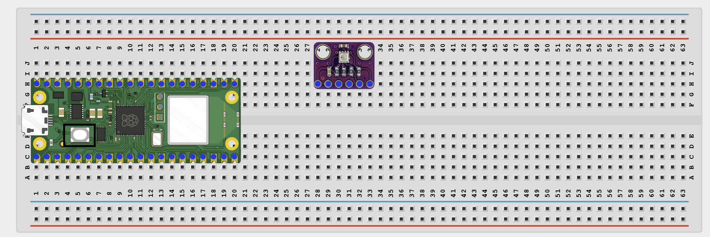
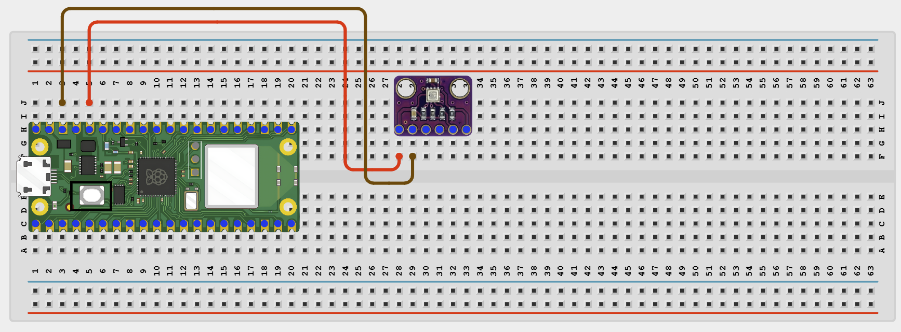
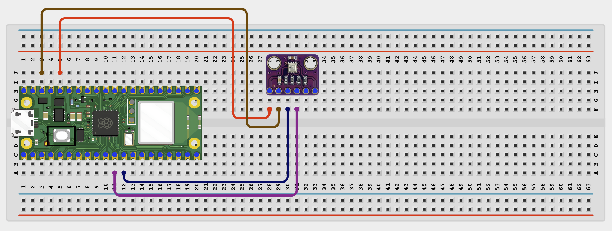
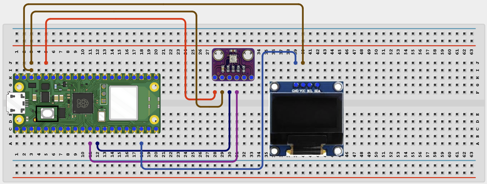
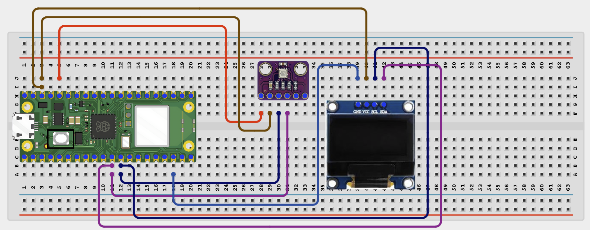

# Project 1.2.8
## Bme280 Temperature Display with Oled
# Overview

Build a small weather monitor that reads the BME280 sensor and shows values on an OLED display.

This project demonstrates I2C communication with two devices on the same bus.

The final result should show temperature, humidity, and pressure on the OLED and in the Thonny Shell.

# Required Components

|  |  |  |  |
| --- | --- | --- | --- |
|  Raspberry Pi Pico 2 W |  BME280 module |  SH1106 OLED display |  Breadboard |
|  Jumper wires |  |  |  |

# Circuit Connections

| Component Pin | Connects To | Pico GPIO / Physical Pin Number | Notes |
| --- | --- | --- | --- |
| BME280 VCC | 3.3V | Physical pin 36 | Check your module label |
| BME280 GND | GND | Physical pin 38 |  |
| BME280 SDA | GPIO 8 | GPIO 8 / physical pin 11 | Shared I2C data line |
| BME280 SCL | GPIO 9 | GPIO 9 / physical pin 12 | Shared I2C clock line |
| OLED VCC | 3.3V | Physical pin 36 | Shared power is fine |
| OLED GND | GND | Physical pin 38 |  |
| OLED SDA | GPIO 8 | GPIO 8 / physical pin 11 | Same SDA line as BME280 |
| OLED SCL | GPIO 9 | GPIO 9 / physical pin 12 | Same SCL line as BME280 |

# Step-by-Step Assembly

### Step 1: Place the Raspberry Pi Pico 2W

Place the Raspberry Pi Pico 2W on the breadboard so it sits across the center gap.
Keep the USB port facing outward so you can easily connect it to your computer.

### Step 2: Place the BME280 Module and OLED Display

Place the BME280 module on the breadboard.

Place the SH1106 OLED display module on the breadboard.

Identify VCC or VIN, GND, SDA, and SCL on the BME280 module.

Identify VCC, GND, SDA, and SCL on the OLED display.

Check the printed labels on both modules before wiring.

### Step 3: Connect BME280 Power

Connect BME280 VCC to 3.3V.

Connect BME280 GND to GND.

### Step 4: Connect BME280 I2C Pins

Connect BME280 SDA to GPIO 8.

Connect BME280 SCL to GPIO 9.

### Step 5: Connect OLED Power

Connect OLED VCC to 3.3V.

Connect OLED GND to GND.

### Step 6: Connect OLED I2C Pins

Connect OLED SDA to GPIO 8.

Connect OLED SCL to GPIO 9.

Both modules now share the same I2C bus.

## Wiring Check

✓ Pico 2W is placed correctly across the breadboard center gap

✓ BME280 VCC connects to 3.3V

✓ BME280 GND connects to GND

✓ BME280 SDA connects to GPIO 8

✓ BME280 SCL connects to GPIO 9

✓ OLED VCC connects to 3.3V

✓ OLED GND connects to GND

✓ OLED SDA connects to GPIO 8

✓ OLED SCL connects to GPIO 9

✓ No loose jumper wires

## Beginner Note

Both I2C devices share the same SDA and SCL wires. Connect them to the same Pico I2C bus.

# Testing Individual Components

Before running the full project, test each part separately. This makes it easier to find wiring or code problems.

## OLED and BME280 I2C scanner test

Check that the Pico can see both I2C devices before running the full program.

| from machine import Pin, I2C
i2c = I2C(0, sda=Pin(8), scl=Pin(9), freq=400000)
print('I2C addresses found:', [hex(addr) for addr in i2c.scan()]) |
| --- |

Expected test result: You should see two I2C addresses. The OLED is often 0x3c and the BME280 is often 0x76 or 0x77.

## BME280 sensor test

Check that the BME280 library works and the sensor returns values.

| from machine import Pin, I2C
import BME280
i2c = I2C(0, sda=Pin(8), scl=Pin(9), freq=400000)
try:
    bme = BME280.BME280(i2c=i2c, address=0x76)
except OSError:
    bme = BME280.BME280(i2c=i2c, address=0x77)
print('Temperature:', bme.temperature)
print('Humidity:', bme.humidity)
print('Pressure:', bme.pressure) |
| --- |

Expected test result: The Shell should print temperature, humidity, and pressure values.

## OLED text test

Check that the OLED can show text.

| from machine import Pin, I2C
import sh1106
i2c = I2C(0, sda=Pin(8), scl=Pin(9), freq=400000)
display = sh1106.SH1106_I2C(128, 64, i2c)
display.fill(0)
display.text('OLED OK', 28, 28, 1)
display.show() |
| --- |

Expected test result: The OLED should show the text OLED OK.

# Full Project Code

After completing and checking the circuit connections, open Thonny IDE. Copy and paste the code below into a new file, or upload the project file to the Raspberry Pi Pico 2 W, then run it from Thonny.

| from machine import Pin, I2C import sh1106 import bme280 import time # I2C (GP16 SDA, GP17 SCL) i2c = I2C(0, sda=Pin(8), scl=Pin(9), freq=400000) # OLED oled = sh1106.SH1106_I2C(128, 64, i2c) # BME280 bme = bme280.BME280(i2c=i2c) while True: # Read values (YOUR DRIVER STYLE) temp = bme.temperature pressure = bme.pressure humidity = bme.humidity oled.fill(0) oled.text("BME280 SENSOR", 0, 0) oled.text("Temp:", 0, 18) oled.text(temp, 50, 18) oled.text("Press:", 0, 34) oled.text(pressure, 50, 34) oled.text("Hum:", 0, 50) oled.text(humidity, 50, 50) oled.show() time.sleep(2) |
| --- |

# How the Code Works

| Code Section | What It Does | Why It Matters |
| --- | --- | --- |
| I2C setup | Creates one I2C bus for both the BME280 and the OLED | I2C lets both devices share the same SDA and SCL wires |
| BME280 address check | Tries 0x76 first and then 0x77 | Different BME280 boards may use different addresses |
| OLED update | Clears the screen and writes fresh values | This makes the display show live sensor readings |
| time.sleep(2) | Waits 2 seconds before the next update | Keeps the readings easy to follow |

# Expected Result

The OLED should show temperature, humidity, and pressure. The Thonny Shell should print the same values every 2 seconds.

# Troubleshooting

| Problem | Possible Cause | Solution |
| --- | --- | --- |
| No I2C devices found | SDA or SCL wiring is wrong | Recheck GPIO 8 and GPIO 9 connections |
| Only one device appears | One module is missing power or ground | Check VCC and GND on the missing device |
| BME280 code fails | Wrong sensor address | Use the I2C scanner result and try 0x76 or 0x77 |
| OLED is blank | Missing sh1106.py or wrong display wiring | Save sh1106.py to the Pico and recheck SDA, SCL, VCC, and GND |
