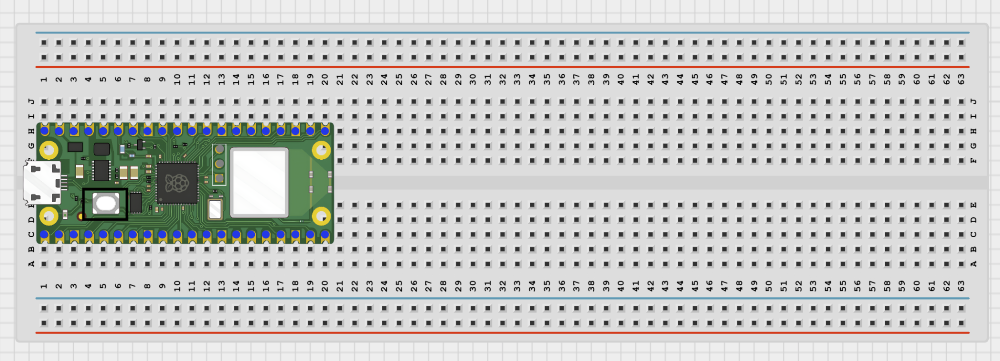
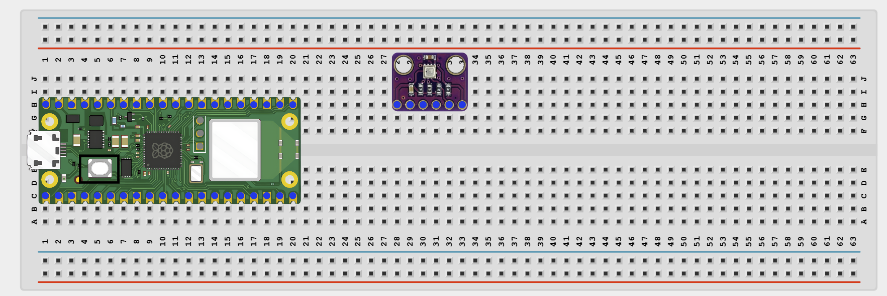
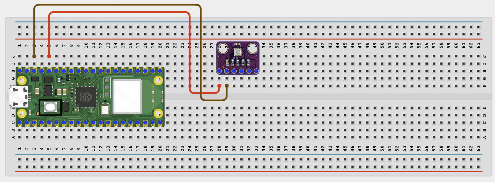
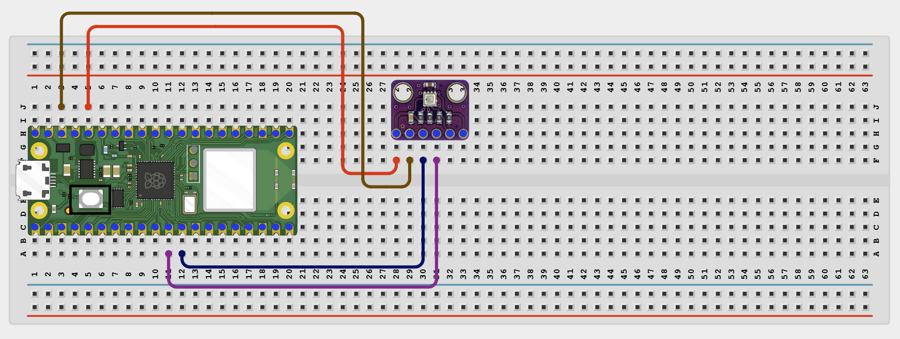
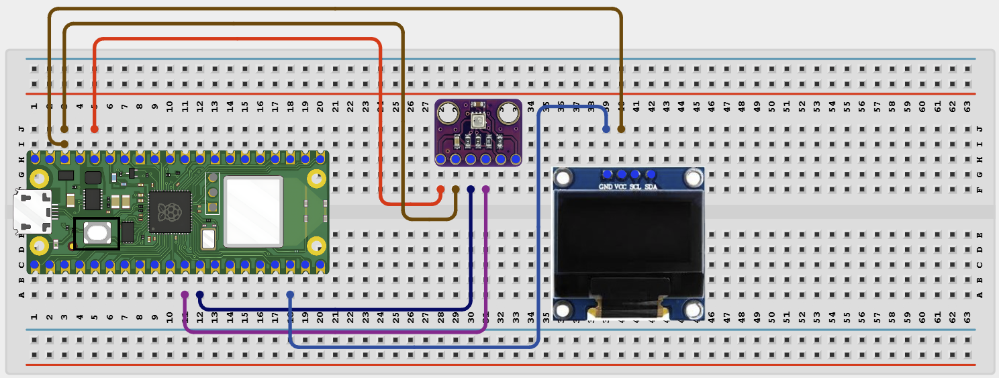
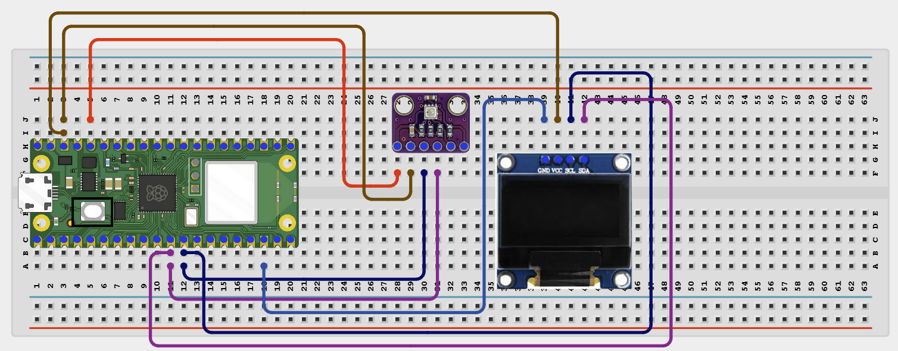

# Project 1.2.9 BME280 Humidity Monitor
# Overview

Build a temperature, humidity, and pressure monitor using a BME280 sensor and an OLED display.

This project demonstrates I2C sensor reading with an OLED display on the same bus.

The final result should show temperature, humidity, and pressure on the OLED and in the Thonny Shell.

# Required Components

|  |  |  |  |
| --- | --- | --- | --- |
| <br>Raspberry Pi Pico 2 W | <br>BME280 sensor module | <br>SH1106 OLED display | <br>Breadboard |
| <br>Jumper wires |  |  |  |


# Circuit Connections

| Component Pin | Connects To | Pico GPIO / Physical Pin Number | Notes |
| --- | --- | --- | --- |
| BME280 VCC | 3.3V | Physical pin 36 | Check your module label |
| BME280 GND | GND | Physical pin 38 |  |
| BME280 SDA | GPIO 8 | GPIO 8 / physical pin 11 | Shared I2C data line |
| BME280 SCL | GPIO 9 | GPIO 9 / physical pin 12 | Shared I2C clock line |
| OLED VCC | 3.3V | Physical pin 36 |  |
| OLED GND | GND | Physical pin 38 |  |
| OLED SDA | GPIO 8 | GPIO 8 / physical pin 11 | Same SDA line as BME280 |
| OLED SCL | GPIO 9 | GPIO 9 / physical pin 12 | Same SCL line as BME280 |

# Step-by-Step Assembly

### Step 1: Place the Raspberry Pi Pico 2W

Place the Raspberry Pi Pico 2W on the breadboard so it sits across the center gap.
Keep the USB port facing outward so you can easily connect it to your computer.



### Step 2: Place the BME280 Sensor and OLED Display

Place the BME280 sensor module on the breadboard.

Place the SH1106 OLED display module on the breadboard.

Identify VCC or VIN, GND, SDA, and SCL on the BME280.

Identify VCC, GND, SDA, and SCL on the OLED display.

Check the printed labels before wiring.



### Step 3: Connect BME280 Power

Connect BME280 VCC to 3.3V.

Connect BME280 GND to GND.



### Step 4: Connect the BME280 I2C Pins

Connect BME280 SDA to GPIO 8.

Connect BME280 SCL to GPIO 9.



### Step 5: Connect OLED Power

Connect OLED VCC to 3.3V.

Connect OLED GND to GND.



### Step 6: Connect OLED I2C Pins

Connect OLED SDA to GPIO 8.

Connect OLED SCL to GPIO 9.

Both modules now share the same I2C bus.

Upload `bme280.py` and `sh1106.py` to the Pico before running the full project.



## Wiring Check

Pico 2W is placed correctly across the breadboard center gap

BME280 VCC connects to 3.3V

BME280 GND connects to GND

BME280 SDA connects to GPIO 8

BME280 SCL connects to GPIO 9

OLED VCC connects to 3.3V

OLED GND connects to GND

OLED SDA connects to GPIO 8

OLED SCL connects to GPIO 9

No loose jumper wires

## Beginner Note

The BME280 and OLED are I2C devices, so both share the SDA and SCL wires. Most BME280 modules include the required I2C pull-up resistors.

# Testing Individual Components

Before running the full project, test each part separately. This makes it easier to find wiring or code problems.

## BME280 sensor test

Check the BME280 readings before adding the OLED display code.

```python
from machine import Pin, I2C
import bme280
i2c = I2C(0, sda=Pin(8), scl=Pin(9), freq=400000)
sensor = bme280.BME280(i2c=i2c)
print('Temperature:', sensor.values[0])
print('Pressure:', sensor.values[1])
print('Humidity:', sensor.values[2])
```

Expected test result: The Shell should print temperature, humidity, and pressure values.

## OLED I2C scanner test

Check that the OLED is visible on the I2C bus.

```python
from machine import Pin, I2C
i2c = I2C(0, sda=Pin(8), scl=Pin(9), freq=400000)
print([hex(addr) for addr in i2c.scan()])
```

Expected test result: You should usually see the OLED address such as 0x3c and the BME280 address, often 0x76 or 0x77.

## OLED text test

Check that the OLED driver works.

```python
from machine import Pin, I2C
import sh1106
i2c = I2C(0, sda=Pin(8), scl=Pin(9), freq=400000)
display = sh1106.SH1106_I2C(128, 64, i2c)
display.fill(0)
display.text('BME280 OLED OK', 6, 28, 1)
display.show()
```

Expected test result: The OLED should show BME280 OLED OK.

# Full Project Code

After completing and checking the circuit connections, open Thonny IDE. Copy and paste the code below into a new file, or upload the project file to the Raspberry Pi Pico 2 W, then run it from Thonny.

```python
from machine import Pin, I2C
import bme280
import sh1106
import time

i2c = I2C(0, sda=Pin(8), scl=Pin(9), freq=400000)
display = sh1106.SH1106_I2C(128, 64, i2c)
sensor = bme280.BME280(i2c=i2c)

print('BME280 monitor ready')

while True:
    try:
        values = sensor.values
        temp = values[0]
        pressure = values[1]
        hum = values[2]

        display.fill(0)
        display.text('BME280 Monitor', 6, 0, 1)
        display.text('Temp: {}'.format(temp), 2, 18, 1)
        display.text('Press:{}'.format(pressure), 2, 34, 1)
        display.text('Hum : {}'.format(hum), 2, 50, 1)
        display.show()

        print('Temperature:', temp)
        print('Pressure:', pressure)
        print('Humidity:', hum)
        print('---')
    except Exception as error:
        print('Sensor read failed:', error)

    time.sleep(2)
```

# How the Code Works

| Code Section | What It Does | Why It Matters |
| --- | --- | --- |
| I2C setup | Creates one I2C bus for the BME280 and OLED | Both devices can share the same SDA and SCL wires |
| BME280 object | Creates a BME280 sensor object on the I2C bus | This lets the Pico read temperature, humidity, and pressure |
| OLED text lines | Shows temperature, humidity, and pressure on the display | The project becomes easy to read without opening the Shell |
| try / except | Catches sensor or I2C read errors | It keeps the monitor running while a wiring issue is investigated |

# Expected Result

The OLED should show the current temperature, humidity, and pressure. The Thonny Shell should print the same values every 2 seconds.

# Troubleshooting

| Problem | Possible Cause | Solution |
| --- | --- | --- |
| BME280 read fails | I2C wiring or sensor address is wrong | Check VCC, GND, SDA, and SCL, then scan for address 0x76 or 0x77 |
| OLED works but values stay the same | Sensor not connected correctly | Recheck the BME280 VCC, GND, SDA, and SCL pins |
| No OLED output | Missing sh1106.py or wrong I2C pins | Save sh1106.py and recheck GPIO 8 and GPIO 9 |
