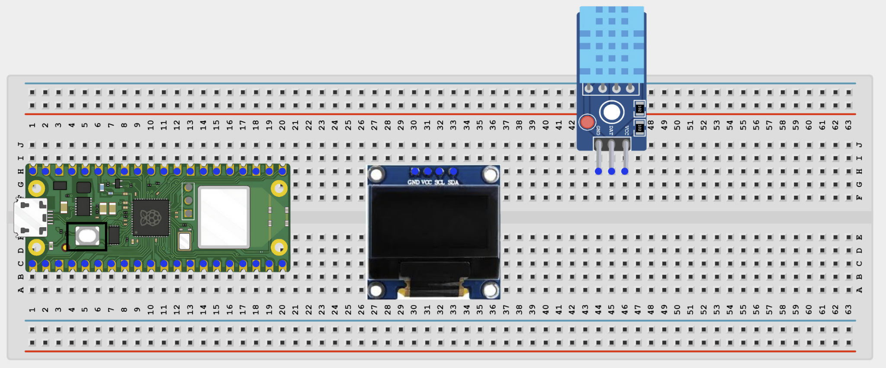
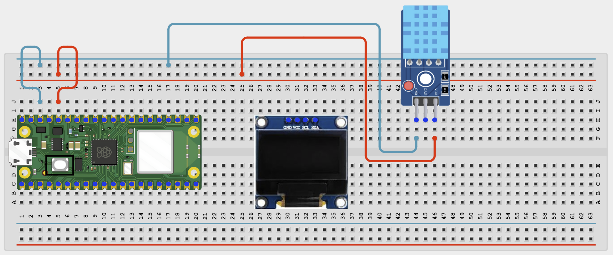
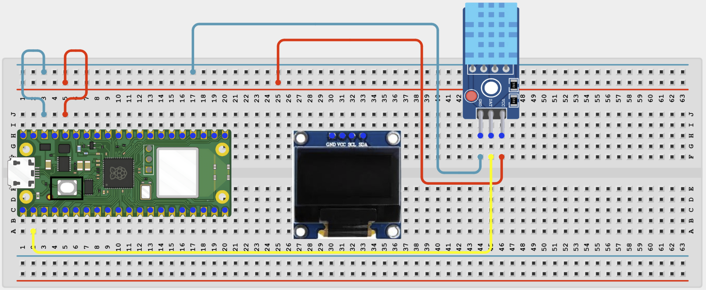
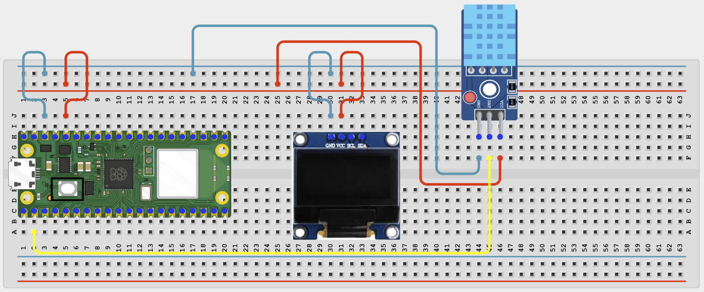
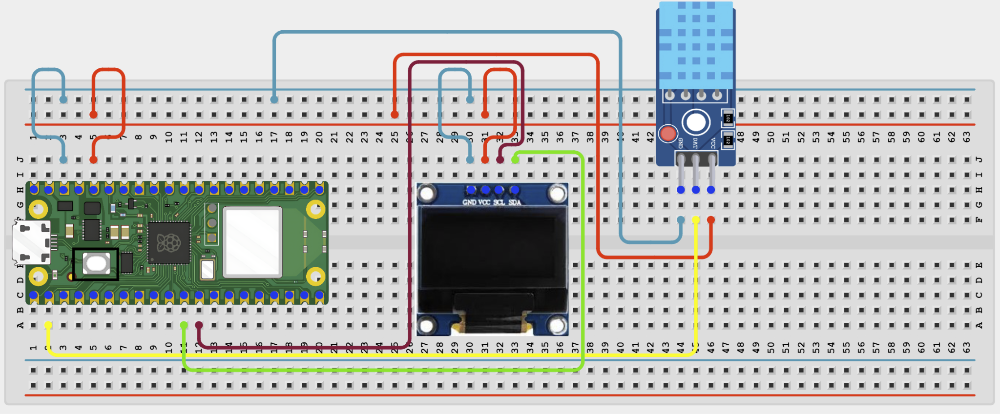

# Project 1.2.9
## Dht11 Humidity Monitor
# Overview

Build a humidity and temperature monitor using a DHT11 sensor and an OLED display.

This project demonstrates one-wire-style sensor reading plus OLED output.

The final result should show temperature and humidity on the OLED and in the Thonny Shell.

# Required Components

|  |  |  |  |
| --- | --- | --- | --- |
|  Raspberry Pi Pico 2 W | DHT11 sensor or DHT11 module |  SH1106 OLED display |  10k pull-up resistor |
|  Breadboard |  Jumper wires |  |  |

# Circuit Connections

| Component Pin | Connects To | Pico GPIO / Physical Pin Number | Notes |
| --- | --- | --- | --- |
| DHT11 VCC | 3.3V | Physical pin 36 |  |
| DHT11 DATA | GPIO 1 | GPIO 1 / physical pin 2 | Add a 10k pull-up to 3.3V if using a bare sensor |
| DHT11 GND | GND | Physical pin 38 |  |
| OLED VCC | 3.3V | Physical pin 36 |  |
| OLED GND | GND | Physical pin 38 |  |
| OLED SDA | GPIO 8 | GPIO 8 / physical pin 11 | I2C data line |
| OLED SCL | GPIO 9 | GPIO 9 / physical pin 12 | I2C clock line |

# Step-by-Step Assembly

### Step 1: Place the Raspberry Pi Pico 2W

Place the Raspberry Pi Pico 2W on the breadboard so it sits across the center gap.
Keep the USB port facing outward so you can easily connect it to your computer.

### Step 2: Place the DHT11 Sensor and OLED Display

Place the DHT11 sensor or DHT11 module on the breadboard.

Place the SH1106 OLED display module on the breadboard.

Identify VCC, DATA, and GND on the DHT11.

Identify VCC, GND, SDA, and SCL on the OLED display.

Check the printed labels before wiring.

### Step 3: Connect DHT11 Power

Connect DHT11 VCC to 3.3V.

Connect DHT11 GND to GND.

### Step 4: Connect the DHT11 DATA Pin

Connect DHT11 DATA to GPIO 1.

If you are using a bare DHT11 sensor, add a 10k pull-up resistor between DATA and 3.3V.

### Step 5: Connect OLED Power

Connect OLED VCC to 3.3V.

Connect OLED GND to GND.

### Step 6: Connect OLED I2C Pins

Connect OLED SDA to GPIO 8.

Connect OLED SCL to GPIO 9.

## Wiring Check

✓ Pico 2W is placed correctly across the breadboard center gap

✓ DHT11 VCC connects to 3.3V

✓ DHT11 GND connects to GND

✓ DHT11 DATA connects to GPIO 1

✓ 10k pull-up resistor is added between DATA and 3.3V if using a bare DHT11 sensor

✓ OLED VCC connects to 3.3V

✓ OLED GND connects to GND

✓ OLED SDA connects to GPIO 8

✓ OLED SCL connects to GPIO 9

✓ No loose jumper wires

## Beginner Note

DHT11 module boards usually include the DATA pull-up resistor. A bare 4-pin DHT11 sensor usually needs you to add it.

# Testing Individual Components

Before running the full project, test each part separately. This makes it easier to find wiring or code problems.

## DHT11 sensor test

Check the DHT11 readings before adding the OLED display code.

| from machine import Pin
import dht
import time
sensor = dht.DHT11(Pin(1))
while True:
    sensor.measure()
    print('Temp:', sensor.temperature(), 'C')
    print('Humidity:', sensor.humidity(), '%')
    print('---')
    time.sleep(2) |
| --- |

Expected test result: The Shell should print changing temperature and humidity readings.

## OLED I2C scanner test

Check that the OLED is visible on the I2C bus.

| from machine import Pin, I2C
i2c = I2C(0, sda=Pin(8), scl=Pin(9), freq=400000)
print([hex(addr) for addr in i2c.scan()]) |
| --- |

Expected test result: You should usually see the OLED address such as 0x3c.

## OLED text test

Check that the OLED driver works.

| from machine import Pin, I2C
import sh1106
i2c = I2C(0, sda=Pin(8), scl=Pin(9), freq=400000)
display = sh1106.SH1106_I2C(128, 64, i2c)
display.fill(0)
display.text('DHT11 OLED OK', 6, 28, 1)
display.show() |
| --- |

Expected test result: The OLED should show DHT11 OLED OK.

# Full Project Code

After completing and checking the circuit connections, open Thonny IDE. Copy and paste the code below into a new file, or upload the project file to the Raspberry Pi Pico 2 W, then run it from Thonny.

| from machine import Pin, I2C
import dht
import sh1106
import time

i2c = I2C(0, sda=Pin(8), scl=Pin(9), freq=400000)
display = sh1106.SH1106_I2C(128, 64, i2c)
sensor = dht.DHT11(Pin(1))

print('DHT11 monitor ready')

while True:
    try:
        sensor.measure()
        temp = sensor.temperature()
        hum = sensor.humidity()

        display.fill(0)
        display.text('DHT11 Monitor', 12, 0, 1)
        display.text('Temp: {} C'.format(temp), 8, 22, 1)
        display.text('Hum : {} %'.format(hum), 8, 42, 1)
        display.show()

        print('Temperature:', temp, 'C')
        print('Humidity:', hum, '%')
        print('---')
    except OSError as error:
        print('Sensor read failed:', error)

    time.sleep(2) |
| --- |

# How the Code Works

| Code Section | What It Does | Why It Matters |
| --- | --- | --- |
| DHT11 object | Creates a sensor object on GPIO 1 | This lets the Pico talk to the DHT11 |
| sensor.measure() | Starts a fresh DHT11 reading | The DHT11 must measure before values can be read |
| OLED text lines | Shows temperature and humidity on the display | The project becomes easy to read without opening the Shell |
| try / except | Catches occasional sensor read errors | DHT sensors sometimes miss a reading and need another try |

# Expected Result

The OLED should show the current temperature and humidity. The Thonny Shell should print the same values every 2 seconds.

# Troubleshooting

| Problem | Possible Cause | Solution |
| --- | --- | --- |
| DHT11 read fails | Sensor timing issue or missing pull-up | Wait 2 seconds between reads and add the pull-up resistor if needed |
| OLED works but values stay the same | Sensor not connected correctly | Recheck the DHT11 DATA, VCC, and GND pins |
| No OLED output | Missing sh1106.py or wrong I2C pins | Save sh1106.py and recheck GPIO 8 and GPIO 9 |
