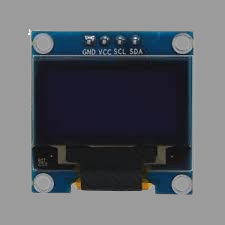
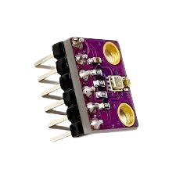
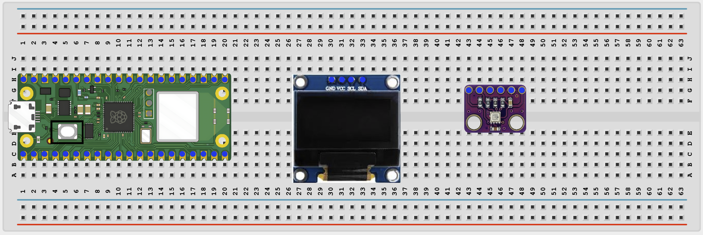
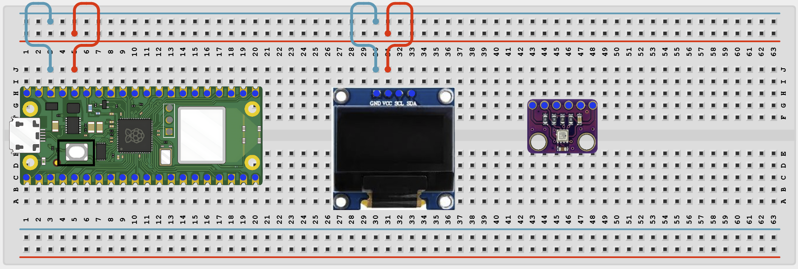
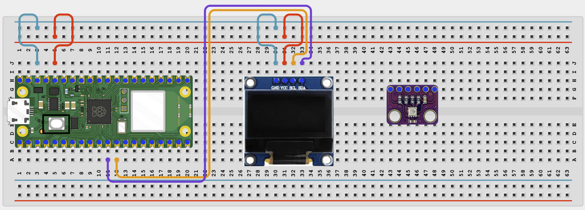
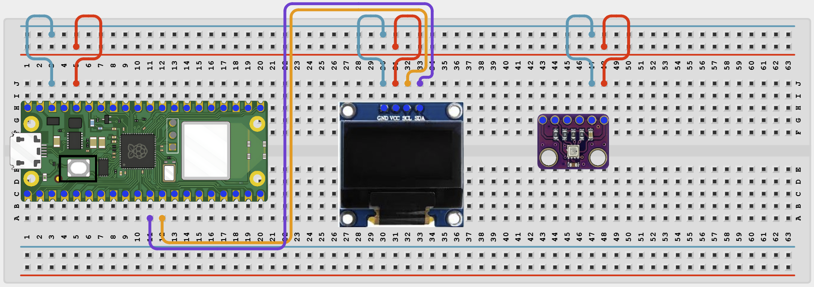
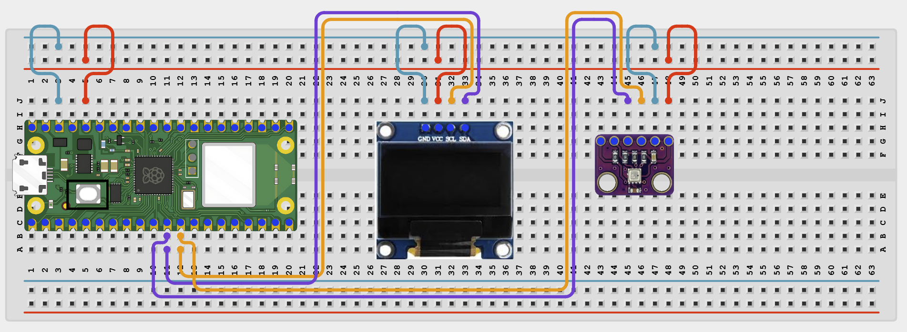

# Oled IOT Dashboard

# Overview

Build a small dashboard on an OLED that shows Wi-Fi status and BME280 environmental readings.

This project demonstrates sharing one I2C bus between an OLED display and a BME280 sensor.

The final result should show Wi-Fi status, IP address, temperature, and humidity on the OLED.

# Required Components

|  |  |  |  |
| --- | --- | --- | --- |
|  Raspberry Pi Pico 2 W |  SH1106 OLED display |  BME280 module |  Breadboard |
|  Jumper wires | 2.4 GHz Wi-Fi network |  |  |

# Circuit Connections

| Component Pin | Connects To | Pico GPIO / Physical Pin Number | Notes |
| --- | --- | --- | --- |
| OLED VCC | 3.3V | Physical pin 36 |  |
| OLED GND | GND | Physical pin 38 |  |
| OLED SDA | GPIO 8 | GPIO 8 / physical pin 11 | Shared I2C data line |
| OLED SCL | GPIO 9 | GPIO 9 / physical pin 12 | Shared I2C clock line |
| BME280 VCC | 3.3V | Physical pin 36 |  |
| BME280 GND | GND | Physical pin 38 |  |
| BME280 SDA | GPIO 8 | GPIO 8 / physical pin 11 | Same SDA line as OLED |
| BME280 SCL | GPIO 9 | GPIO 9 / physical pin 12 | Same SCL line as OLED |

# Step-by-Step Assembly

### Step 1: Place the Raspberry Pi Pico 2W

Place the Raspberry Pi Pico 2W on the breadboard so it sits across the center gap.
Keep the USB port facing outward so you can easily connect it to your computer.

### Step 2: Place the OLED Display and BME280 Module

Place the SH1106 OLED display module on the breadboard.

Place the BME280 module on the breadboard.

Identify VCC, GND, SDA, and SCL on both modules.

Both modules will share the same I2C bus.

### Step 3: Connect OLED Power

Connect OLED VCC to 3.3V.

Connect OLED GND to GND.

### Step 4: Connect OLED I2C Pins

Connect OLED SDA to GPIO 8.

Connect OLED SCL to GPIO 9.

### Step 5: Connect BME280 Power

Connect BME280 VCC to 3.3V.

Connect BME280 GND to GND.

### Step 6: Connect BME280 I2C Pins

Connect BME280 SDA to GPIO 8.

Connect BME280 SCL to GPIO 9.

The OLED and BME280 now share SDA and SCL.

## Wiring Check

✓ Pico 2W is placed correctly across the breadboard center gap

✓ OLED VCC connects to 3.3V

✓ OLED GND connects to GND

✓ OLED SDA connects to GPIO 8

✓ OLED SCL connects to GPIO 9

✓ BME280 VCC connects to 3.3V

✓ BME280 GND connects to GND

✓ BME280 SDA connects to GPIO 8

✓ BME280 SCL connects to GPIO 9

✓ No loose jumper wires

## Beginner Note

I2C devices can share the same SDA and SCL wires as long as each device has a different I2C address.

# Testing Individual Components

Before running the full project, test each part separately. This makes it easier to find wiring or code problems.

## I2C scanner test

Check that the OLED and BME280 both appear on the I2C bus.

| from machine import I2C, Pin
i2c = I2C(0, sda=Pin(8), scl=Pin(9), freq=400000)
print([hex(addr) for addr in i2c.scan()]) |
| --- |

Expected test result: You should usually see the OLED address such as 0x3c and the BME280 address 0x76 or 0x77.

## OLED text test

Check that the OLED driver works.

| from machine import I2C, Pin
import sh1106
i2c = I2C(0, sda=Pin(8), scl=Pin(9), freq=400000)
oled = sh1106.SH1106_I2C(128, 64, i2c)
oled.fill(0)
oled.text('OLED OK', 28, 28, 1)
oled.show() |
| --- |

Expected test result: The OLED should show OLED OK.

## BME280 sensor test

Check that the BME280 returns values before using the full dashboard code.

| from machine import I2C, Pin
import BME280
i2c = I2C(0, sda=Pin(8), scl=Pin(9), freq=400000)
try:
    bme = BME280.BME280(i2c=i2c, address=0x76)
except OSError:
    bme = BME280.BME280(i2c=i2c, address=0x77)
print('Temperature:', bme.temperature)
print('Humidity:', bme.humidity) |
| --- |

Expected test result: The Shell should print temperature and humidity values.

## Wi-Fi connection test

Check that the Pico connects to Wi-Fi and prints its IP address.

| import network
import time
SSID = 'YOUR_WIFI_NAME'
PASSWORD = 'YOUR_WIFI_PASSWORD'
wlan = network.WLAN(network.STA_IF)
wlan.active(True)
wlan.connect(SSID, PASSWORD)
for _ in range(15):
    if wlan.isconnected():
        break
    print('Connecting...')
    time.sleep(1)
print('Connected:', wlan.isconnected())
if wlan.isconnected():
    print('IP address:', wlan.ifconfig()[0]) |
| --- |

Expected test result: The Shell should show Connected: True and print an IP address.

# Full Project Code

Upload and run this code after the individual tests work correctly.

| import network
import time
from machine import I2C, Pin
import sh1106
import BME280

SSID = 'YOUR_WIFI_NAME'
PASSWORD = 'YOUR_WIFI_PASSWORD'

i2c = I2C(0, sda=Pin(8), scl=Pin(9), freq=400000)
oled = sh1106.SH1106_I2C(128, 64, i2c)

try:
    bme = BME280.BME280(i2c=i2c, address=0x76)
except OSError:
    bme = BME280.BME280(i2c=i2c, address=0x77)

wlan = network.WLAN(network.STA_IF)
wlan.active(True)
wlan.connect(SSID, PASSWORD)

print('Connecting to Wi-Fi...')
for _ in range(15):
    if wlan.isconnected():
        break
    time.sleep(1)

if not wlan.isconnected():
    raise RuntimeError('Wi-Fi connection failed')

ip_address = wlan.ifconfig()[0]
print('Connected! IP:', ip_address)

while True:
    temp = str(bme.temperature)
    hum = str(bme.humidity)

    oled.fill(0)
    oled.text('IoT Dashboard', 10, 0, 1)
    oled.text('WiFi: OK', 0, 16, 1)
    oled.text(ip_address, 0, 26, 1)
    oled.text('T:' + temp, 0, 42, 1)
    oled.text('H:' + hum, 64, 42, 1)
    oled.show()

    time.sleep(2) |
| --- |

# How the Code Works

| Code Section | What It Does | Why It Matters |
| --- | --- | --- |
| Shared I2C setup | Connects the Pico to both the OLED and the BME280 on one bus | I2C allows multiple devices on the same SDA and SCL wires |
| BME280 address check | Tries common sensor addresses | Different BME280 boards may use 0x76 or 0x77 |
| Wi-Fi connection | Connects the Pico to the network and gets the IP address | The dashboard shows network status locally on the OLED |
| OLED layout | Writes Wi-Fi and sensor data to the screen | This turns separate readings into one dashboard view |

# Expected Result

After entering your Wi-Fi details and running the code, the OLED should show WiFi: OK, the IP address, the temperature, and the humidity. The Shell should print the connection IP address.

# Troubleshooting

| Problem | Possible Cause | Solution |
| --- | --- | --- |
| OLED stays blank | Wrong display wiring or missing sh1106.py | Recheck SDA/SCL and confirm sh1106.py is on the Pico |
| BME280 data does not appear | Wrong BME280 address or wiring | Run the I2C scanner and test the sensor separately |
| Wi-Fi status never reaches OK | Network details are wrong | Recheck the SSID and password and use a 2.4 GHz network |

# Next Project

Project 43: Online Motor Control
