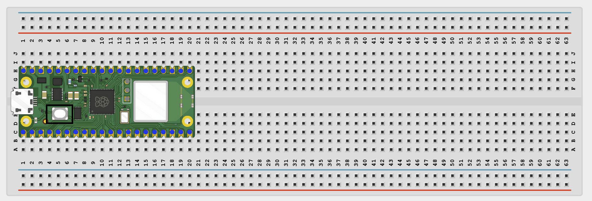
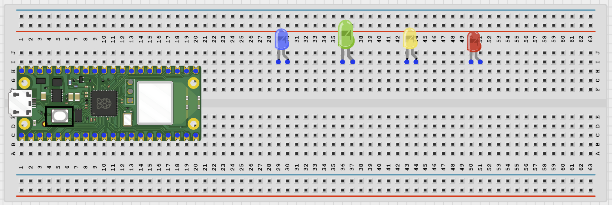
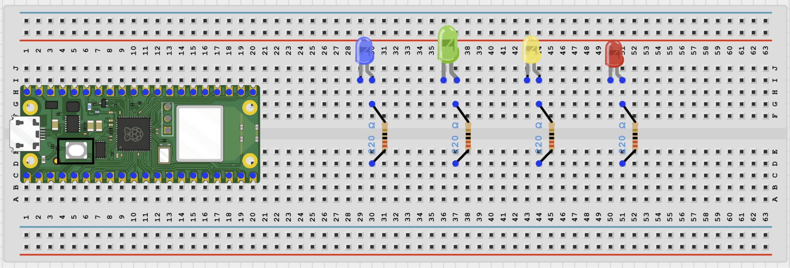
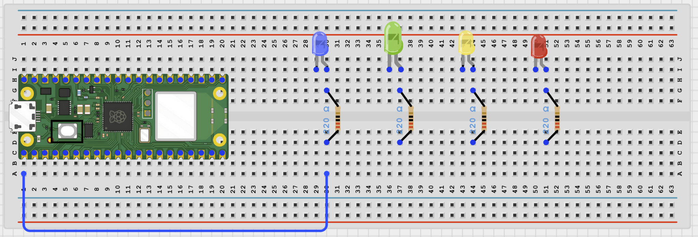
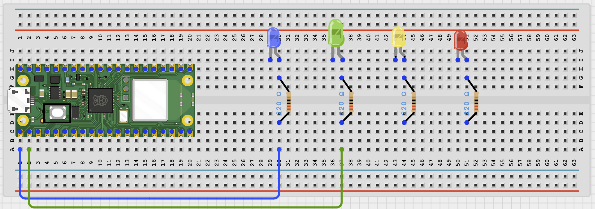
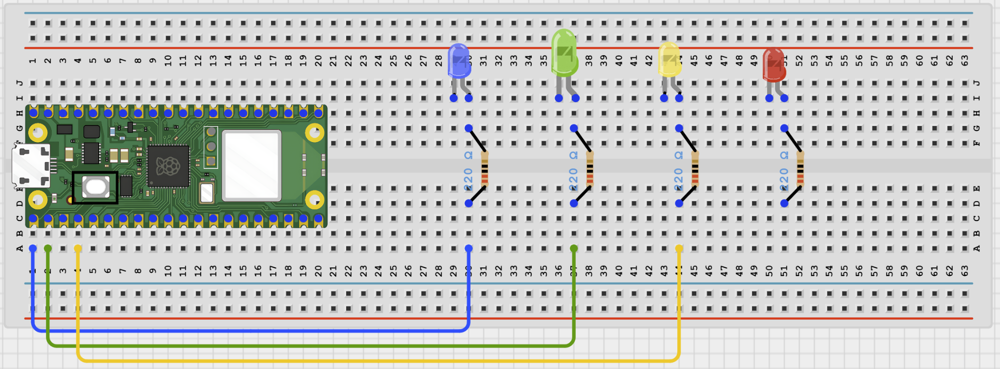
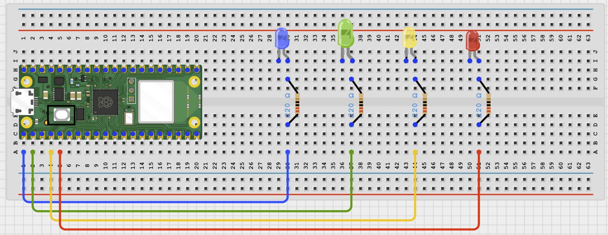
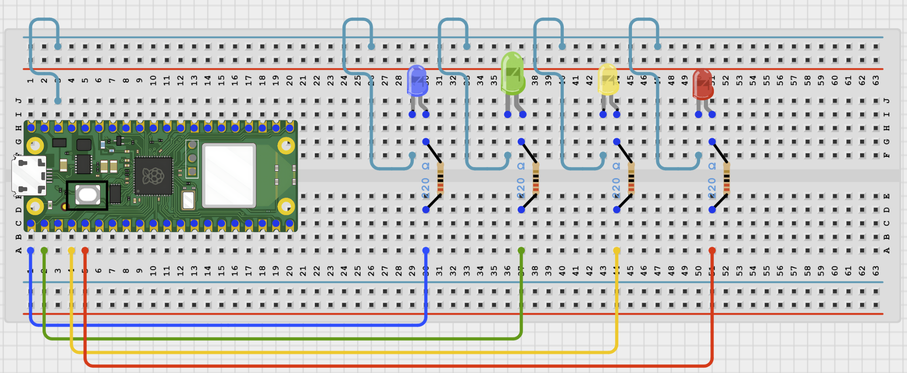

# Cloud Led Pattern Controller

# Overview

Build a browser-controlled LED pattern project with four LEDs and several animation modes.

In this beginner version, the control page runs on your local Wi-Fi network instead of a public cloud service.

The final result should let the user choose OFF, BLINK, CHASE, or RANDOM from the browser while the LEDs keep running their pattern smoothly.

# Required Components

|  |  |  |  |
| --- | --- | --- | --- |
|  Raspberry Pi Pico 2 W |  LEDs |  220Ω resistors |  Breadboard |
|  Jumper wires | 2.4 GHz Wi-Fi network | Phone or computer browser |  |

# Circuit Connections

| Component Pin | Connects To | Pico GPIO / Physical Pin Number | Notes |
| --- | --- | --- | --- |
| LED 1 anode (+) | 220Ω resistor then GPIO 0 | GPIO 0 / physical pin 1 |  |
| LED 2 anode (+) | 220Ω resistor then GPIO 1 | GPIO 1 / physical pin 2 |  |
| LED 3 anode (+) | 220Ω resistor then GPIO 2 | GPIO 2 / physical pin 4 |  |
| LED 4 anode (+) | 220Ω resistor then GPIO 3 | GPIO 3 / physical pin 5 |  |
| All LED cathodes (-) | GND | Physical pin 38 | Shared ground is fine |

# Step-by-Step Assembly

### Step 1: Place the Raspberry Pi Pico 2W

Place the Raspberry Pi Pico 2W on the breadboard so it sits across the center gap.
Keep the USB port facing outward so you can easily connect it to your computer.

### Step 2: Place the Four LEDs

Place four LEDs on the breadboard.

For each LED, the long leg is the anode (+) and the short leg is the cathode (-).

Put the two legs of each LED in different breadboard rows.

### Step 3: Add One 220Ω Resistor to Each LED

Connect one 220Ω resistor to the long leg of each LED.

Each LED must have its own resistor.

### Step 4: Connect LED 1 to GPIO 0

Connect the free end of LED 1's resistor to GPIO 0.

### Step 5: Connect LED 2 to GPIO 1

Connect the free end of LED 2's resistor to GPIO 1.

### Step 6: Connect LED 3 to GPIO 2

Connect the free end of LED 3's resistor to GPIO 2.

### Step 7: Connect LED 4 to GPIO 3

Connect the free end of LED 4's resistor to GPIO 3.

### Step 8: Connect All LED Short Legs to GND

Connect each LED short leg to GND.

## Wiring Check

✓ Pico 2W is placed correctly across the breadboard center gap

✓ LED 1 long leg connects through a 220Ω resistor to GPIO 0

✓ LED 2 long leg connects through a 220Ω resistor to GPIO 1

✓ LED 3 long leg connects through a 220Ω resistor to GPIO 2

✓ LED 4 long leg connects through a 220Ω resistor to GPIO 3

✓ All LED short legs connect to GND

✓ No loose jumper wires

# Testing Individual Components

Before running the full project, test each part separately. This makes it easier to find wiring or code problems.

## Single LED test

Check that each LED works before running the pattern controller.

| from machine import Pin
import time
for pin_number in (0, 1, 2, 3):
    led = Pin(pin_number, Pin.OUT)
    led.on()
    print('Testing GPIO', pin_number)
    time.sleep(0.5)
    led.off() |
| --- |

Expected test result: Each LED should light one at a time.

## Wi-Fi connection test

Check that the Pico connects to Wi-Fi and prints its IP address.

| import network
import time
SSID = 'YOUR_WIFI_NAME'
PASSWORD = 'YOUR_WIFI_PASSWORD'
wlan = network.WLAN(network.STA_IF)
wlan.active(True)
wlan.connect(SSID, PASSWORD)
for _ in range(15):
    if wlan.isconnected():
        break
    print('Connecting...')
    time.sleep(1)
print('Connected:', wlan.isconnected())
if wlan.isconnected():
    print('IP address:', wlan.ifconfig()[0]) |
| --- |

Expected test result: The Shell should show Connected: True and print an IP address.

# Full Project Code

Upload and run this code after the individual tests work correctly.

| import network
import socket
import time
import urandom
from machine import Pin

SSID = 'YOUR_WIFI_NAME'
PASSWORD = 'YOUR_WIFI_PASSWORD'

leds = [Pin(pin_number, Pin.OUT) for pin_number in (0, 1, 2, 3)]
pattern = 'off'
step_index = 0
blink_state = 0
last_step = time.ticks_ms()

def all_off():
    for led in leds:
        led.off()

def update_pattern():
    global step_index, blink_state, last_step
    now = time.ticks_ms()

    if pattern == 'off':
        all_off()
        return

    if pattern == 'blink' and time.ticks_diff(now, last_step) >= 500:
        blink_state = 0 if blink_state else 1
        for led in leds:
            led.value(blink_state)
        last_step = now

    elif pattern == 'chase' and time.ticks_diff(now, last_step) >= 150:
        all_off()
        leds[step_index].on()
        step_index = (step_index + 1) % len(leds)
        last_step = now

    elif pattern == 'random' and time.ticks_diff(now, last_step) >= 300:
        for led in leds:
            led.value(urandom.getrandbits(1))
        last_step = now

def web_page(current_pattern):
    return '''<!DOCTYPE html>
<html>
<head>
    <meta name='viewport' content='width=device-width, initial-scale=1'>
    <meta http-equiv='refresh' content='2'>
    <title>LED Pattern Control</title>
</head>
<body style='font-family:Arial;text-align:center;padding:30px'>
    <h1>LED Pattern Control</h1>
    
Current pattern: {}

    

        <a href='/pattern?mode=off'><button>OFF</button></a>
        <a href='/pattern?mode=blink'><button>BLINK</button></a>
        <a href='/pattern?mode=chase'><button>CHASE</button></a>
        <a href='/pattern?mode=random'><button>RANDOM</button></a>
    

</body>
</html>'''.format(current_pattern.upper())

wlan = network.WLAN(network.STA_IF)
wlan.active(True)
wlan.connect(SSID, PASSWORD)

print('Connecting to Wi-Fi...')
for _ in range(15):
    if wlan.isconnected():
        break
    time.sleep(1)

if not wlan.isconnected():
    raise RuntimeError('Wi-Fi connection failed')

ip_address = wlan.ifconfig()[0]
print('Connected. Open http://{} in your browser'.format(ip_address))

address = socket.getaddrinfo('0.0.0.0', 80)[0][-1]
server = socket.socket()
server.bind(address)
server.listen(1)
server.settimeout(0.05)

while True:
    update_pattern()

    try:
        client, client_address = server.accept()
    except OSError:
        continue

    request = client.recv(1024).decode()
    if 'mode=off' in request:
        pattern = 'off'
        all_off()
    elif 'mode=blink' in request:
        pattern = 'blink'
    elif 'mode=chase' in request:
        pattern = 'chase'
    elif 'mode=random' in request:
        pattern = 'random'

    response = web_page(pattern)
    client.send('HTTP/1.1 200 OK\r\nContent-Type: text/html\r\nConnection: close\r\n\r\n'.encode())
    client.sendall(response.encode())
    client.close() |
| --- |

# How the Code Works

| Code Section | What It Does | Why It Matters |
| --- | --- | --- |
| Pattern state variables | Store which pattern is active and the current animation step | The LEDs need memory to animate smoothly |
| update_pattern() | Changes the LEDs based on time and the selected mode | This keeps the pattern running without freezing the web server |
| server.settimeout() | Lets the program keep animating even when no browser request arrives | The LEDs would otherwise stop while waiting for a connection |
| Browser mode selection | Lets the user switch patterns from the web page | This is the remote control part of the project |

# Expected Result

After entering your Wi-Fi details and running the code, opening the browser page should let you choose OFF, BLINK, CHASE, or RANDOM. The four LEDs should change patterns when you select a different mode.

# Troubleshooting

| Problem | Possible Cause | Solution |
| --- | --- | --- |
| Only some LEDs work | One LED is reversed or missing a resistor | Check the polarity and resistor on each LED |
| Pattern stops unless the browser is open | The loop is blocking while waiting for requests | Keep the server timeout and update the pattern every loop |
| Wrong pattern appears | The mode request is not being parsed as expected | Print the request and recheck the mode names |

# Next Project

Project 64: DC Motor Speed Monitor
