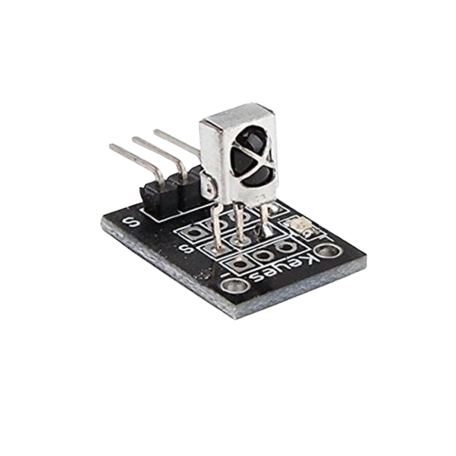

# Project 1.5.2: IR Remote Buzzer Controller

**Beginner Embedded Systems Project Using Raspberry Pi Pico 2 W and MicroPython**

## Pico 2 W Diagram


---

## Overview

Build a buzzer that responds to an infrared remote control.

This project demonstrates using remote commands to trigger sound output.

The final result is a buzzer sound pattern controlled by a remote button.

## Required Components

|  |  |  |  |
| --- | --- | --- | --- |
| <br>Raspberry Pi Pico 2 W | <br>IR receiver module | <br>Active buzzer | <br>Breadboard |
| <br>Jumper wires | <br>IR remote control |   |   |


## Circuit Connections

| Component Pin       | Connects To | Pico GPIO / Physical Pin Number | Notes |
| ------------------- | ----------- | ------------------------------- | ----- |
| IR receiver VCC     | 3.3V        | Physical pin 36                 |       |
| IR receiver GND     | GND         | Physical pin 38                 |       |
| IR receiver OUT     | GPIO 1      | GPIO 1 / physical pin 2         |       |
| Buzzer positive (+) | GPIO 0      | GPIO 0 / physical pin 1         |       |
| Buzzer negative (-) | GND         | Physical pin 38                 |       |

## Step-by-Step Assembly

### Step 1: Place the Raspberry Pi Pico 2 W

Place the Raspberry Pi Pico 2 W on the breadboard so it sits across the center gap.

Keep the USB port facing outward so you can easily connect it to your computer.


---

### Step 2: Place the active buzzer and IR receiver on the breadboard.

Insert the IR receiver module and the buzzer onto the breadboard.

Check the labels on your IR receiver module before wiring, because the pin order may be different depending on the module.


---

### Step 3: Connect the IR Receiver Pin

Connect the VCC pin of the IR receiver module to 3.3V on the Raspberry Pi Pico 2 W.


---

### Step 4: Connect the IR Receiver GND Pin

Connect the GND pin of the IR receiver module to a GND pin on the Raspberry Pi Pico 2 W.


---

### Step 5: Connect the IR Receiver OUT Pin

Connect the OUT or Signal pin of the IR receiver module to GPIO 1 on the Raspberry Pi Pico 2 W.


---

### Step 6: Connect the Buzzer Positive Pin

Connect the buzzer positive pin to GPIO 0.


---

### Step 7: Connect the Buzzer Negative Pin

Connect the buzzer negative pin to GND.


---

## Wiring Check

Before running the code, confirm:

- Pico 2 W is placed correctly across the breadboard center gap.
- IR receiver VCC connects to 3.3V.
- IR receiver GND connects to GND.
- IR receiver OUT / Signal connects to GPIO 1.
- Buzzer positive pin connects to GPIO 0.
- Buzzer negative pin connects to GND.
- No loose jumper wires.

---

## Testing Individual Components

Before running the full project, test each part separately. This makes it easier to find wiring or code problems.

### Buzzer Test

Check the buzzer first.

```python
from machine import Pin
import time

buzzer = Pin(0, Pin.OUT)
buzzer.on()
time.sleep(0.2)
buzzer.off()
time.sleep(0.2)
buzzer.on()
time.sleep(0.2)
buzzer.off()
```

Expected test result: The buzzer plays two short beeps.

### IR Code Reader Test

Find the remote button code to use for the buzzer action.

```python
from machine import Pin
from ir_rx.nec import NEC_8
import time

def callback(data, addr, ctrl):
    if data >= 0:
        print('Code:', hex(data))

ir = NEC_8(Pin(1, Pin.IN), callback)

while True:
    time.sleep(0.2)
```

Expected test result: The Shell prints a code when you press a remote button.

---

## Full Project Code

After completing and checking the circuit connections, open Thonny IDE. Copy and paste the code below into a new file, or upload the project file to the Raspberry Pi Pico 2 W, then run it from Thonny.

```python
from machine import Pin
from ir_rx.nec import NEC_8
import time

buzzer = Pin(0, Pin.OUT)
PLAY_CODE = 0x45

def play_sound():
    for _ in range(2):
        buzzer.on()
        time.sleep(0.15)
        buzzer.off()
        time.sleep(0.15)

def callback(data, addr, ctrl):
    if data < 0:
        return

    print('Received:', hex(data))
    if data == PLAY_CODE:
        play_sound()
        print('Buzzer sound played')

ir = NEC_8(Pin(1, Pin.IN), callback)
print('IR buzzer control ready')

while True:
    time.sleep(0.2)
```

---

## How the Code Works

| Code Section   | What It Does                         | Why It Matters                                     |
| -------------- | ------------------------------------ | -------------------------------------------------- |
| `PLAY_CODE`    | Stores the chosen remote button code | The project needs one button to trigger the buzzer |
| `play_sound()` | Creates the buzzer pattern           | Keeps the callback short and readable              |
| `callback()`   | Checks received IR data              | Runs the buzzer only for the correct code          |
| Main loop      | Keeps the script running             | Allows the IR receiver to continue working         |

---

## Expected Result

When you press the selected remote button, the buzzer plays a short two-beep sound pattern.

---

## Troubleshooting

| Problem                     | Possible Cause                        | Solution                                           |
| --------------------------- | ------------------------------------- | -------------------------------------------------- |
| No sound                    | Buzzer wiring issue or incorrect code | Test the buzzer separately and confirm `PLAY_CODE` |
| Remote does nothing         | IR receiver not wired correctly       | Recheck the receiver pin order and library files   |
| Wrong button triggers sound | Remote codes not mapped as expected   | Read the codes again and update `PLAY_CODE`        |
