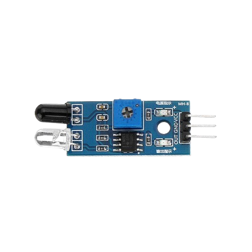
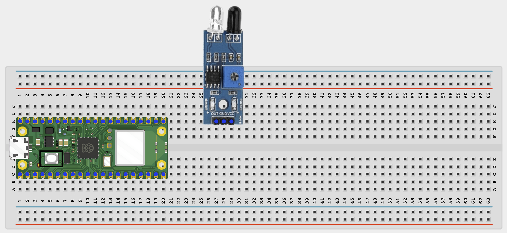
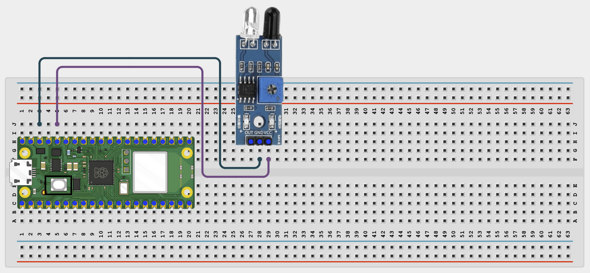
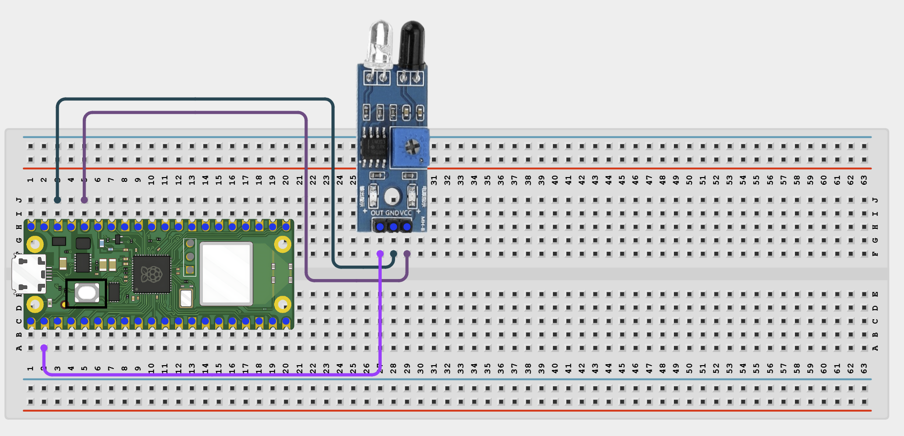
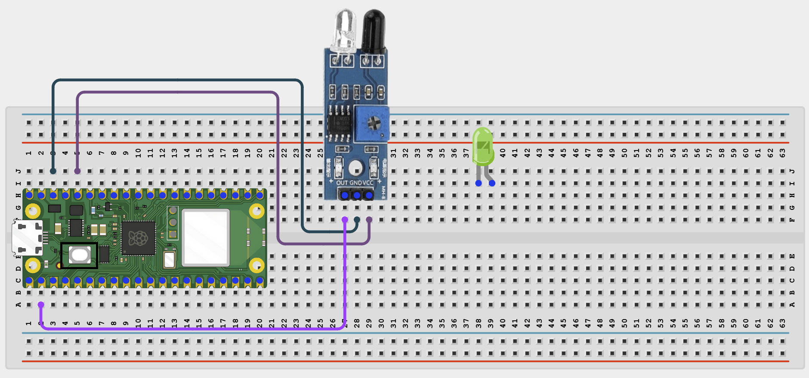
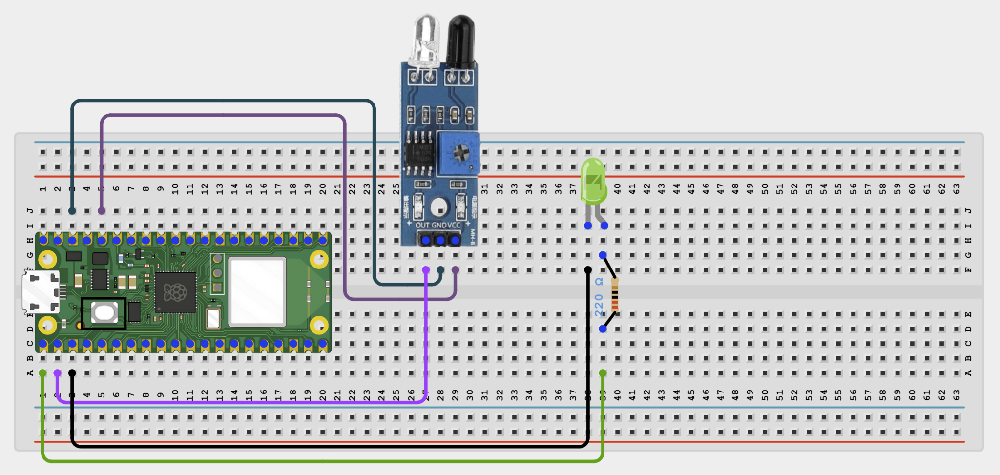

# Project 1.5.3: IR Obstacle Detection System

**Beginner Embedded Systems Project Using Raspberry Pi Pico 2 W and MicroPython**

## Pico 2 W Diagram


---

## Overview

Build an infrared obstacle detector with an LED indicator.

This project demonstrates digital object sensing for simple robot-style behavior.

The final result is an LED that changes when an object comes close to the sensor.

## Required Components

|                                                                                            |                                                                                                      |                                                                  |                                                                                    |
| ------------------------------------------------------------------------------------------ | ---------------------------------------------------------------------------------------------------- | ---------------------------------------------------------------- | ---------------------------------------------------------------------------------- |
| <br>Raspberry Pi Pico 2 W | <br>IR obstacle sensor module  | <br>LED | <br>220 Ohm resistor |
| <br>Breadboard                     | <br>Jumper wires |                                                                  |                                                                                    |

## Circuit Connections

| Component Pin   | Connects To                  | Pico GPIO / Physical Pin Number | Notes                           |
| --------------- | ---------------------------- | ------------------------------- | ------------------------------- |
| IR sensor VCC   | 3.3V                         | Physical pin 36                 | Start with 3.3V for Pico safety |
| IR sensor GND   | GND                          | Physical pin 38                 |                                 |
| IR sensor OUT   | GPIO 1                       | GPIO 1 / physical pin 2         | Digital output                  |
| LED anode (+)   | 220 Ohm resistor then GPIO 0 | GPIO 0 / physical pin 1         |                                 |
| LED cathode (-) | GND                          | Physical pin 38                 |                                 |

## Step-by-Step Assembly

### Step 1: Place the Raspberry Pi Pico 2 W

Place the Raspberry Pi Pico 2 W on the breadboard so it sits across the center gap.

Keep the USB port facing outward so you can easily connect it to your computer.


---

### Step 2: Place the IR Obstacle Sensor

Place the IR obstacle sensor module on the breadboard with the detector facing the area where objects will pass.

Identify the module pins before wiring: VCC, GND, and OUT.

Check the printed pin labels because some modules use a different pin order.



---

### Step 3: Connect the IR Sensor VCC

Connect the IR sensor VCC pin to 3.3V.


---

### Step 4: Connect the IR Sensor GND

Connect the IR sensor GND pin to GND.



---

### Step 5: Connect the IR Sensor OUT Pin

Connect the IR sensor OUT pin to GPIO 1.

This pin tells the Pico when the sensor detects an object.



---

### Step 6: Place the LED

Place the LED on the breadboard with its legs in different rows.

The long leg is the anode (+). The short leg is the cathode (-).



---

### Step 7: Connect the LED Through a Resistor

Connect the LED long leg to one end of a 220 Ohm resistor.

Connect the other end of the resistor to GPIO 0.

Connect the LED short leg to GND.



---

## Wiring Check

Before running the code, confirm:

- Pico 2 W is placed correctly across the breadboard center gap.
- IR sensor VCC connects to 3.3V.
- IR sensor GND connects to GND.
- IR sensor OUT connects to GPIO 1.
- LED long leg connects through a 220 Ohm resistor to GPIO 0.
- LED short leg connects to GND.
- No loose jumper wires.

!!! note "Beginner Note"

    Many IR obstacle modules have a small adjustment screw. If detection seems unreliable, adjust it slowly while testing with an object.

---

## Testing Individual Components

Before running the full project, test each part separately. This makes it easier to find wiring or code problems.

### Obstacle Sensor Test

Check whether the module output changes when an object is nearby.

```python
from machine import Pin
import time

sensor = Pin(1, Pin.IN)

while True:
    print(sensor.value())
    time.sleep(0.2)
```

Expected test result: The printed value changes when an object moves close to the sensor.

### LED Test

Check the LED wiring first.

```python
from machine import Pin
import time

led = Pin(0, Pin.OUT)
led.on()
time.sleep(1)
led.off()
```

Expected test result: The LED turns on, then off.

---

## Full Project Code

After completing and checking the circuit connections, open Thonny IDE. Copy and paste the code below into a new file, or upload the project file to the Raspberry Pi Pico 2 W, then run it from Thonny.

```python
from machine import Pin
import time

sensor = Pin(1, Pin.IN)
led = Pin(0, Pin.OUT)

# Many common IR obstacle modules output 0 when an object is detected.
ACTIVE_LOW = True

while True:
    detected = sensor.value() == 0 if ACTIVE_LOW else sensor.value() == 1

    if detected:
        led.on()
        print("Obstacle detected")
    else:
        led.off()
        print("Clear")

    time.sleep(0.2)
```

---

## How the Code Works

| Code Section      | What It Does                                 | Why It Matters                               |
| ----------------- | -------------------------------------------- | -------------------------------------------- |
| Sensor input      | Reads the obstacle module output             | This tells the Pico when something is nearby |
| LED output        | Turns the LED on or off                      | Shows the detection result clearly           |
| `ACTIVE_LOW` note | Handles modules that pull low when detecting | Some sensors may need reversed logic         |
| Delay             | Slows the print output                       | Makes the Shell easier to read               |

---

## Expected Result

When an object is placed in front of the sensor, the LED turns on and the Shell prints `Obstacle detected`. When the path is clear, the LED turns off.

---

## Troubleshooting

| Problem                    | Possible Cause                                     | Solution                                               |
| -------------------------- | -------------------------------------------------- | ------------------------------------------------------ |
| Sensor never changes       | Wrong power level or bad module alignment          | Check the module power and move an object close to it  |
| LED behavior is reversed   | Module output is active-high instead of active-low | Swap the `ACTIVE_LOW` value in the code                |
| Very short detection range | Trim pot setting or target surface issue           | Adjust the module trim pot and try a reflective object |

## Source Text Preserved From DOCX

The following source text from the original Word document is preserved here because it was not already present verbatim in the cleaned MkDocs version.

- | 220Ω resistor | 1 | LED current limiter | Required |
- | LED anode (+) | 220Ω resistor then GPIO 0 | GPIO 0 / physical pin 1 | |
- Connect the LED long leg to one end of a 220Ω resistor.
- ✓ LED long leg connects through a 220Ω resistor to GPIO 0
- Use 3.3V for the sensor if your module supports it. Do not connect a 5V sensor output directly to a Pico GPIO pin.
- | from machine import Pin import time touch = Pin(1, Pin.IN) buzzer = Pin(0, Pin.OUT) last_touch = 0 def play_doorbell(): buzzer.on() time.sleep(0.15) buzzer.off() time.sleep(0.1) buzzer.on() time.sleep(0.25) buzzer.off() print("Touch doorbell ready") while True: current_touch = touch.value() if current_touch == 1 and last_touch == 0: play_doorbell() print("Ding-dong!") time.sleep(0.3) last_touch = current_touch time.sleep(0.02) |
- | Active-low note | Assumes many common modules pull low when detecting an object | Helps students understand why some sensors may need reversed logic |
- | Sensor never changes | Wrong power level or bad module alignment | Check the module power and move an object close to the sensor |
- | LED behavior is reversed | Module output is active-high instead of active-low | Swap the on/off logic in the code |
