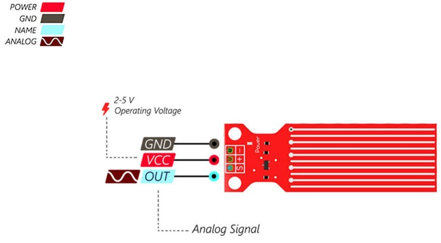
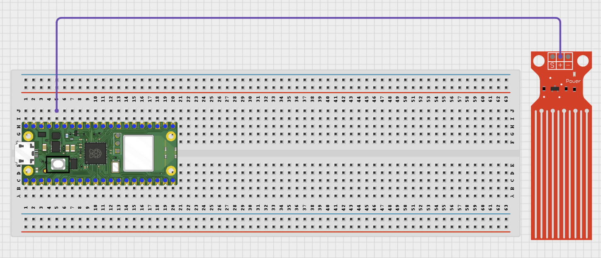

# Project 1.6.1: Water Level LED Indicator

**Beginner Embedded Systems Project Using Raspberry Pi Pico 2 W and MicroPython**

## Pico 2 W Diagram


---

## Overview

Build a simple water level indicator with three LEDs.

This project demonstrates reading an analog sensor and comparing it to thresholds.

The final result is one LED that shows low, medium, or high water level.

## Required Components

|                                                                                            |                                                                                              |                                                                        |                                                                                                      |
| ------------------------------------------------------------------------------------------ | -------------------------------------------------------------------------------------------- | ---------------------------------------------------------------------- | ---------------------------------------------------------------------------------------------------- |
| <br>Raspberry Pi Pico 2 W | <br>Water level sensor | <br>Red LED   | <br>Yellow LED                              |
| <br>Green LED                     | <br>220 Ohm resistors          | <br>Breadboard | <br>Jumper wires |

## Circuit Connections

| Component Pin        | Connects To                  | Pico GPIO / Physical Pin Number | Notes        |
| -------------------- | ---------------------------- | ------------------------------- | ------------ |
| Water sensor VCC     | 3.3V                         | Physical pin 36                 |              |
| Water sensor GND     | GND                          | Physical pin 38                 |              |
| Water sensor AOUT    | GPIO 26                      | GPIO 26 / physical pin 31       | ADC input    |
| Red LED anode (+)    | 220 Ohm resistor then GPIO 0 | GPIO 0 / physical pin 1         | Low level    |
| Yellow LED anode (+) | 220 Ohm resistor then GPIO 1 | GPIO 1 / physical pin 2         | Medium level |
| Green LED anode (+)  | 220 Ohm resistor then GPIO 2 | GPIO 2 / physical pin 4         | High level   |
| All LED cathodes (-) | GND                          | Physical pin 38                 |              |

## Step-by-Step Assembly

### Step 1: Place the Raspberry Pi Pico 2 W

Place the Raspberry Pi Pico 2 W on the breadboard so it sits across the center gap.


---

### Step 2: Place the Water Sensor

Place the water sensor module on the breadboard or position it where it can safely detect water. Identify VCC, GND, and AOUT / S / Signal.



---

### Step 3: Connect the Water Sensor VCC

Connect the water sensor VCC pin to 3.3V on the Raspberry Pi Pico 2 W.



---

### Step 4: Connect the Water Sensor GND

Connect the water sensor GND pin to a GND pin on the Raspberry Pi Pico 2 W.


---

### Step 5: Connect the Water Sensor Signal Pin to GPIO 26

Connect the water sensor AOUT / S / Signal pin to GPIO 26 (ADC0).


---

### Step 6: Place the Three LEDs

Place the red, yellow, and green LEDs on the breadboard. Long leg = anode (+). Short leg = cathode (-).


---

### Step 7: Connect a Resistor to Each LED Long Leg

Connect one 220 Ohm resistor to the long leg of each LED.


---

### Step 8: Connect the Red LED to GPIO 0

Connect the free end of the red LED resistor to GPIO 0.


---

### Step 9: Connect the Yellow LED to GPIO 1

Connect the free end of the yellow LED resistor to GPIO 1.


---

### Step 10: Connect the Green LED to GPIO 2

Connect the free end of the green LED resistor to GPIO 2.


---

### Step 11: Connect All LED Short Legs to GND

Connect the short leg of each LED to GND.


---

## Wiring Check

- Pico 2 W is placed correctly across the breadboard center gap.
- Water sensor VCC connects to 3.3V.
- Water sensor GND connects to GND.
- Water sensor AOUT / Signal connects to GPIO 26.
- Red, yellow, and green LEDs each have a 220 Ohm resistor.
- Red LED connects to GPIO 0, yellow to GPIO 1, and green to GPIO 2.
- All LED short legs connect to GND.
- Water touches only the sensor probe area, not the Pico or breadboard electronics.

---

## Testing Individual Components

### Water Sensor Test

```python
from machine import ADC, Pin
import time

sensor = ADC(Pin(26))

while True:
    value = sensor.read_u16()
    print(value)
    time.sleep(0.5)
```

Expected test result: The printed value changes when the water level on the sensor changes.

### LED Test

```python
from machine import Pin
import time

for pin in (0, 1, 2):
    led = Pin(pin, Pin.OUT)
    led.on()
    time.sleep(1)
    led.off()
```

Expected test result: Each LED lights separately.

---

## Full Project Code

```python
from machine import Pin, ADC
import time

red = Pin(0, Pin.OUT)
yellow = Pin(1, Pin.OUT)
green = Pin(2, Pin.OUT)
sensor = ADC(Pin(26))

print('Water level indicator ready')

while True:
    raw = sensor.read_u16()
    level = int((raw / 65535) * 100)
    print('Level:', level, '%')

    if level < 30:
        red.on()
        yellow.off()
        green.off()
    elif level < 70:
        red.off()
        yellow.on()
        green.off()
    else:
        red.off()
        yellow.off()
        green.on()

    time.sleep(0.5)
```

---

## How the Code Works

| Code Section           | What It Does                       | Why It Matters                      |
| ---------------------- | ---------------------------------- | ----------------------------------- |
| ADC input              | Reads the water sensor value       | Measures the water level signal     |
| Percentage calculation | Converts the raw value             | Makes threshold decisions clearer   |
| `if / elif / else`     | Chooses which LED turns on         | Shows low, medium, or high level    |
| Printed status         | Shows current reading in the Shell | Useful while calibrating the sensor |

---

## Expected Result

As the water level changes, the project lights the red, yellow, or green LED to show low, medium, or high level.

---

## Troubleshooting

| Problem                      | Possible Cause                       | Solution                                |
| ---------------------------- | ------------------------------------ | --------------------------------------- |
| LEDs never change            | Sensor AOUT not connected to GPIO 26 | Reconnect the analog output to GPIO 26  |
| Readings look stuck          | Sensor dry, dirty, or not powered    | Check VCC, GND, and clean the probe     |
| Wrong LED threshold behavior | Different sensor calibration         | Adjust the threshold values in the code |
