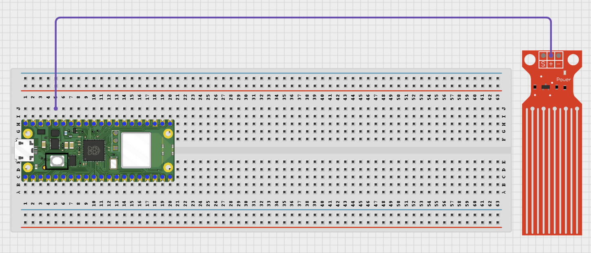

# Project 1.6.2: Water Level Buzzer Alert

**Beginner Embedded Systems Project Using Raspberry Pi Pico 2 W and MicroPython**

## Pico 2 W Diagram


---

## Overview

Build a water level alarm that sounds when the level is too low.

This project demonstrates threshold-based warning output.

The final result is a buzzer and LED warning when the water reading drops below the chosen level.

## Required Components

|  |  |  |  |
| --- | --- | --- | --- |
| <br>Raspberry Pi Pico 2 W | <br>Water level sensor | <br>Active buzzer | <br>LED |
| <br>220 Ohm resistor | <br>Breadboard | <br>Jumper wires |   |


## Circuit Connections

| Component Pin       | Connects To                  | Pico GPIO / Physical Pin Number | Notes       |
| ------------------- | ---------------------------- | ------------------------------- | ----------- |
| Water sensor VCC    | 3.3V                         | Physical pin 36                 |             |
| Water sensor GND    | GND                          | Physical pin 38                 |             |
| Water sensor AOUT   | GPIO 26                      | GPIO 26 / physical pin 31       | ADC input   |
| Buzzer positive (+) | GPIO 0                       | GPIO 0 / physical pin 1         |             |
| Buzzer negative (-) | GND                          | Physical pin 38                 |             |
| LED anode (+)       | 220 Ohm resistor then GPIO 1 | GPIO 1 / physical pin 2         | Warning LED |
| LED cathode (-)     | GND                          | Physical pin 38                 |             |

## Step-by-Step Assembly

### Step 1: Place the Raspberry Pi Pico 2 W

Place the Raspberry Pi Pico 2 W on the breadboard so it sits across the center gap.


---

### Step 2: Place the Water Sensor

Place the water sensor module on the breadboard or position it where it can safely detect water. Identify VCC, GND, and AOUT / S / Signal.


---

### Step 3: Connect the Water Sensor VCC

Connect the water sensor VCC pin to 3.3V.


---

### Step 4: Connect the Water Sensor GND

Connect the water sensor GND pin to GND.


---

### Step 5: Connect the Water Sensor AOUT to GPIO 26

Connect the water sensor AOUT / Signal pin to GPIO 26 (ADC0).


---

### Step 6: Place the Buzzer

Insert the buzzer onto the breadboard with its two pins in different rows.



---

### Step 7: Connect the Buzzer Positive Pin to GPIO 0

Connect the buzzer's positive pin (+) to GPIO 0.


---

### Step 8: Connect the Buzzer Negative Pin to GND

Connect the buzzer's negative pin (-) to GND.


---

### Step 9: Place the LED

Insert the LED onto the breadboard. Long leg = anode (+). Short leg = cathode (-).


---

### Step 10: Connect the LED Long Leg to the Resistor

Connect one end of the 220 Ohm resistor to the LED's long leg.


---

### Step 11: Connect the Resistor to GPIO 1

Connect the other end of the 220 Ohm resistor to GPIO 1.


---

### Step 12: Connect the LED Short Leg to GND

Connect the LED's short leg to GND.


---

## Wiring Check

- Water sensor VCC connects to 3.3V.
- Water sensor GND connects to GND.
- Water sensor AOUT / Signal connects to GPIO 26.
- Buzzer positive pin connects to GPIO 0.
- Buzzer negative pin connects to GND.
- LED long leg connects through a 220 Ohm resistor to GPIO 1.
- LED short leg connects to GND.
- Water touches only the sensing part of the water sensor.
- Pico, breadboard, and USB cable are kept away from water.

---

## Testing Individual Components

### Water Sensor Test

```python
from machine import ADC, Pin
import time

sensor = ADC(Pin(26))

while True:
    print(sensor.read_u16())
    time.sleep(0.5)
```

Expected test result: The raw reading changes when the water level changes.

### Buzzer and LED Test

```python
from machine import Pin
import time

buzzer = Pin(0, Pin.OUT)
led = Pin(1, Pin.OUT)

led.on()
buzzer.on()
time.sleep(1)
led.off()
buzzer.off()
```

Expected test result: The LED lights and the buzzer sounds for 1 second.

---

## Full Project Code

```python
from machine import Pin, ADC
import time

sensor = ADC(Pin(26))
buzzer = Pin(0, Pin.OUT)
led = Pin(1, Pin.OUT)
LOW_THRESHOLD = 25

print('Water level alert ready')

while True:
    raw = sensor.read_u16()
    level = int((raw / 65535) * 100)

    if level < LOW_THRESHOLD:
        buzzer.on()
        led.on()
        print('ALARM - level too low:', level, '%')
    else:
        buzzer.off()
        led.off()
        print('Level OK:', level, '%')

    time.sleep(0.5)
```

---

## How the Code Works

| Code Section           | What It Does                    | Why It Matters                         |
| ---------------------- | ------------------------------- | -------------------------------------- |
| `LOW_THRESHOLD`        | Defines the low-water limit     | Students can tune it to their sensor   |
| ADC reading            | Measures the water sensor value | Determines whether the alert activates |
| Buzzer and LED control | Turns both warning outputs on   | Creates a stronger warning             |
| Printed messages       | Shows the measured level        | Helps during testing and calibration   |

---

## Expected Result

When the water level falls below the threshold, the buzzer sounds and the LED lights. When the level is above the threshold, both turn off.

---

## Troubleshooting

| Problem                       | Possible Cause                            | Solution                                    |
| ----------------------------- | ----------------------------------------- | ------------------------------------------- |
| Warning never activates       | Threshold too low or sensor not connected | Check raw readings and raise the threshold  |
| Warning always on             | Sensor reading too low all the time       | Check the sensor wiring and test with water |
| LED works but buzzer does not | Buzzer wiring or current issue            | Test the buzzer separately and use a driver |
