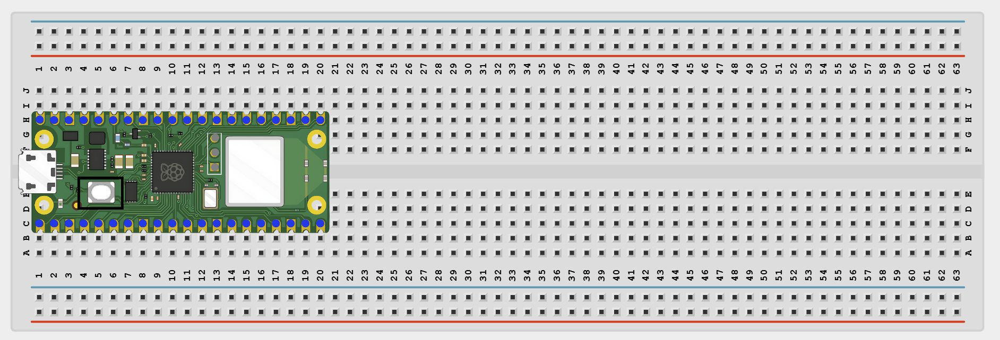
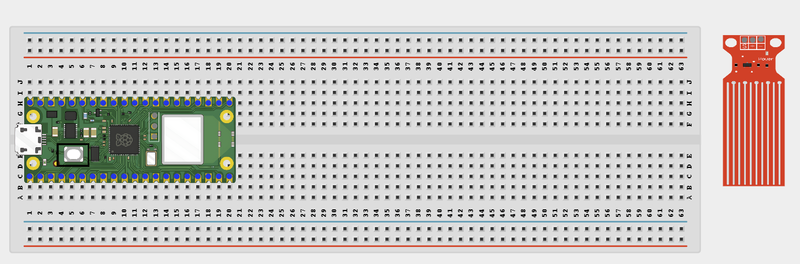
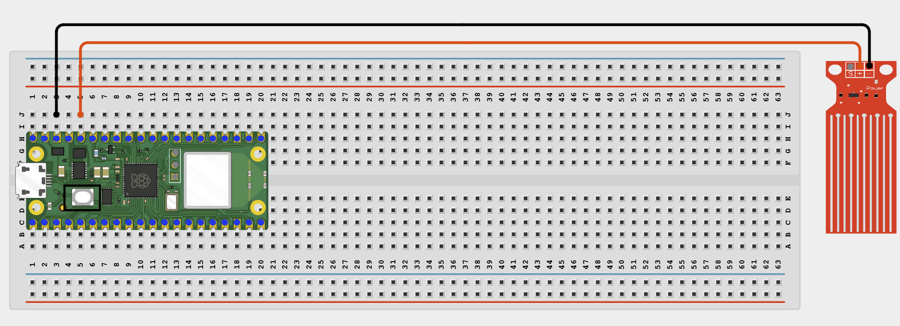
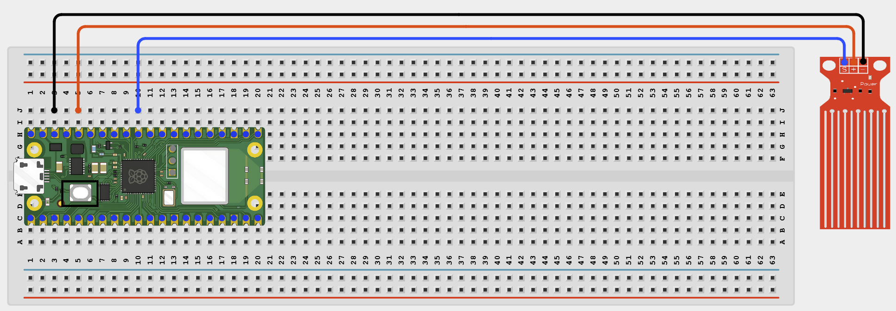

# Project 1.6.3: Water Level Status Webpage

**Beginner Embedded Systems Project Using Raspberry Pi Pico 2 W and MicroPython**

## Pico 2 W Diagram


---

## Overview

Build a water level monitor that shows a percentage and visual tank bar on a web page.

This project demonstrates sensor calibration, ADC percentage conversion, and live browser display.

The final result should show the water level as a percentage and a color-coded status page on your local Wi-Fi network.

## Required Components

|  |  |  |  |
| --- | --- | --- | --- |
| <br>Raspberry Pi Pico 2 W | <br>Water level sensor | <br>Breadboard | <br>Jumper wires |


## Circuit Connections

| Component Pin     | Connects To | Pico GPIO / Physical Pin Number | Notes     |
| ----------------- | ----------- | ------------------------------- | --------- |
| Water sensor VCC  | 3.3V        | Physical pin 36                 |           |
| Water sensor GND  | GND         | Physical pin 38                 |           |
| Water sensor AOUT | GPIO 26     | GPIO 26 / physical pin 31       | ADC input |

## Step-by-Step Assembly

### Step 1: Place the Raspberry Pi Pico 2 W

Place the Raspberry Pi Pico 2 W on the breadboard so it sits across the center gap.



---

### Step 2: Place the Water Level Sensor

Place the water level sensor so only the sensing area can touch water.

Keep the Pico, breadboard, USB cable, and jumper wires away from the water container.

Identify VCC, GND, and AOUT before wiring.



---

### Step 3: Connect the Water Sensor Power

Connect water sensor VCC to 3.3V.

Connect water sensor GND to GND.



---

### Step 4: Connect the Water Sensor Signal Pin

Connect water sensor AOUT to GPIO 26.

GPIO 26 is the ADC input used by this project.



---

## Wiring Check

- Pico 2 W is placed correctly across the breadboard center gap.
- Water sensor VCC connects to 3.3V.
- Water sensor GND connects to GND.
- Water sensor AOUT connects to GPIO 26.
- No loose jumper wires.

!!! warning "Safety Note"

    Water should touch only the sensor probe area. Keep the Pico, breadboard, USB cable, and jumper wires dry.

---

## Testing Individual Components

### Water Sensor ADC Test

```python
from machine import ADC, Pin
import time

adc = ADC(Pin(26))

while True:
    print(adc.read_u16())
    time.sleep(0.5)
```

Expected test result: The raw ADC value should change when the sensor is dry, partly wet, and fully wet.

### Wi-Fi Connection Test

```python
import network
import time

SSID = 'YOUR_WIFI_NAME'
PASSWORD = 'YOUR_WIFI_PASSWORD'

wlan = network.WLAN(network.STA_IF)
wlan.active(True)
wlan.connect(SSID, PASSWORD)

for _ in range(15):
    if wlan.isconnected():
        break
    print('Connecting...')
    time.sleep(1)

print('Connected:', wlan.isconnected())
if wlan.isconnected():
    print('IP address:', wlan.ifconfig()[0])
```

Expected test result: The Shell should show `Connected: True` and print an IP address.

---

## Full Project Code

Upload and run this code after the individual tests work correctly.

```python
import network
import socket
import time
from machine import ADC, Pin

SSID = 'YOUR_WIFI_NAME'
PASSWORD = 'YOUR_WIFI_PASSWORD'

adc = ADC(Pin(26))
DRY_VALUE = 2000
WET_VALUE = 58000

wlan = network.WLAN(network.STA_IF)
wlan.active(True)
wlan.connect(SSID, PASSWORD)

print('Connecting to Wi-Fi...')
for _ in range(15):
    if wlan.isconnected():
        break
    time.sleep(1)

if not wlan.isconnected():
    raise RuntimeError('Wi-Fi connection failed')

ip_address = wlan.ifconfig()[0]
print('Connected. Open http://{} in your browser'.format(ip_address))

def read_percentage():
    raw = adc.read_u16()
    if raw <= DRY_VALUE:
        return raw, 0
    if raw >= WET_VALUE:
        return raw, 100
    percent = int((raw - DRY_VALUE) / (WET_VALUE - DRY_VALUE) * 100)
    return raw, percent

def status_text(percent):
    if percent < 20:
        return 'LOW - Refill Soon', 'red'
    if percent < 50:
        return 'Moderate Level', 'orange'
    return 'Good Level', 'green'

def web_page(raw, percent, status, color):
    return """<!DOCTYPE html>
<html>
<head>
    <meta name='viewport' content='width=device-width, initial-scale=1'>
    <meta http-equiv='refresh' content='3'>
    <title>Water Level Monitor</title>
</head>
<body style='font-family:Arial;text-align:center;padding:30px'>
    <h1>Water Level Monitor</h1>
    <div style='width:160px;height:240px;border:3px solid #333;margin:20px auto;position:relative'>
        <div style='position:absolute;bottom:0;left:0;right:0;height:PERCENT_HEIGHT%;background:#4fc3f7'></div>
    </div>
    <h2>PERCENT_TEXT%</h2>
    <p style='color:STATUS_COLOR'>STATUS_TEXT</p>
    <p>Raw ADC: RAW_TEXT</p>
    <p>Page refreshes every 3 seconds</p>
</body>
</html>""".replace('PERCENT_HEIGHT', str(percent)).replace('PERCENT_TEXT', str(percent)).replace('STATUS_TEXT', status).replace('STATUS_COLOR', color).replace('RAW_TEXT', str(raw))

address = socket.getaddrinfo('0.0.0.0', 80)[0][-1]
server = socket.socket()
server.bind(address)
server.listen(1)

while True:
    client, client_address = server.accept()
    print('Client connected from', client_address)
    client.recv(1024)
    raw, percent = read_percentage()
    status, color = status_text(percent)
    response = web_page(raw, percent, status, color)
    client.send('HTTP/1.1 200 OK\r\nContent-Type: text/html\r\nConnection: close\r\n\r\n'.encode())
    client.sendall(response.encode())
    client.close()
```

---

## How the Code Works

| Code Section        | What It Does                             | Why It Matters                                 |
| ------------------- | ---------------------------------------- | ---------------------------------------------- |
| Calibration values  | Store dry and wet ADC readings           | Turns raw sensor data into a percentage        |
| `read_percentage()` | Maps the sensor value to 0-100%          | Makes the water level easier to understand     |
| `status_text()`     | Assigns a status and color               | Makes the page easier to read at a glance      |
| `web_page()`        | Builds the browser page with a tank view | Turns the number into a clearer visual display |

---

## Expected Result

After entering your Wi-Fi details and running the code, the Shell should print an IP address. Opening that address in a browser should show a water-level percentage and a simple tank display that changes when the sensor gets wetter or drier.

---

## Troubleshooting

| Problem                | Possible Cause                                             | Solution                                       |
| ---------------------- | ---------------------------------------------------------- | ---------------------------------------------- |
| Always shows 0%        | `DRY_VALUE` is too high or sensor is not reading correctly | Print raw ADC values and adjust `DRY_VALUE`    |
| Always shows 100%      | `WET_VALUE` is too low or calibration is wrong             | Print raw ADC values and adjust `WET_VALUE`    |
| No change when testing | Wrong ADC pin or poor sensor contact                       | Check that AOUT goes to GPIO 26 and test again |
