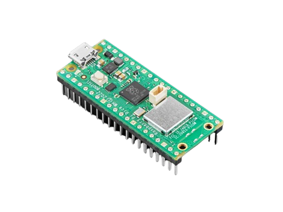
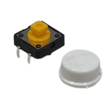
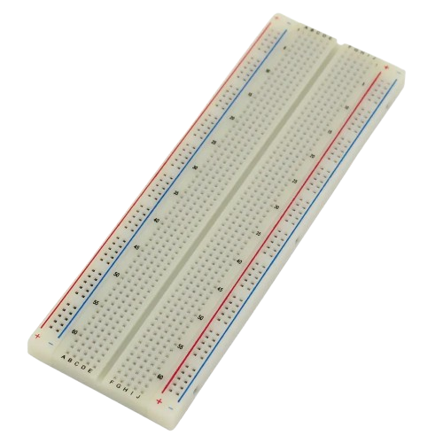
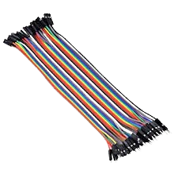

# Project 1.7.1

## OLED Countdown Timer

# Overview

Build a countdown timer shown on an OLED screen.

This project demonstrates I2C display control, button input, and timing logic.

The final result is an OLED that shows a 10-second countdown after you press the button.

# Required Components

|  |  |  |  |
| --- | --- | --- | --- |
|  Raspberry Pi Pico 2 W |  SH1106 OLED display |  Push button |  Breadboard |
|  Jumper wires |  |  |  |

# Circuit Connections

| Component Pin | Connects To | Pico GPIO / Physical Pin Number | Notes |
| --- | --- | --- | --- |
| OLED VCC | 3.3V | Physical pin 36 |  |
| OLED GND | GND | Physical pin 38 |  |
| OLED SDA | GPIO 8 | GPIO 8 / physical pin 11 | I2C0 SDA |
| OLED SCL | GPIO 9 | GPIO 9 / physical pin 12 | I2C0 SCL |
| Button leg 1 | GPIO 1 | GPIO 1 / physical pin 2 | Use internal pull-up |
| Button opposite leg | GND | Physical pin 38 |  |

# Step-by-Step Assembly

### Step 1: Place the Raspberry Pi Pico 2W

Place the Raspberry Pi Pico 2W on the breadboard so it sits across the center gap.
Keep the USB port facing outward so you can easily connect it to your computer.

### Step 2: Place the OLED Display

Place the SH1106 OLED display module on the breadboard.

Identify the OLED pins before wiring: VCC, GND, SDA, and SCL.

Check the printed labels on your OLED module before connecting jumper wires.

### Step 3: Connect OLED Power

Connect OLED VCC to 3.3V.

Connect OLED GND to GND.

### Step 4: Connect the OLED I2C Pins

Connect OLED SDA to GPIO 8.

Connect OLED SCL to GPIO 9.

GPIO 8 and GPIO 9 are the I2C pins used by this project.

### Step 5: Place the Push Button

Place the push button across the breadboard center gap.

This keeps the two sides of the button on separate breadboard rows.

### Step 6: Connect the Button Signal Pin

Connect one button leg to GPIO 1.

The code uses the Pico internal pull-up resistor for this button.

### Step 7: Connect the Button Ground Pin

Connect the opposite button leg to GND.

## Wiring Check

✓ Pico 2W is placed correctly across the breadboard center gap

✓ OLED VCC connects to 3.3V

✓ OLED GND connects to GND

✓ OLED SDA connects to GPIO 8

✓ OLED SCL connects to GPIO 9

✓ Push button sits across the breadboard center gap

✓ Button signal leg connects to GPIO 1

✓ Button opposite leg connects to GND

✓ No loose jumper wires

## Beginner Note

I2C modules use two shared communication wires: SDA for data and SCL for clock. Make sure they are not swapped.

# Testing Individual Components

Before running the full project, test each part separately. This makes it easier to find wiring or code problems.

## OLED I2C scanner test

Check that the Pico can see the display on the I2C bus.

| from machine import Pin, I2C
i2c = I2C(0, sda=Pin(8), scl=Pin(9), freq=400000)
print(i2c.scan()) |
| --- |

Expected test result: The Shell shows an I2C address such as 60 or 61.

## OLED text test

Check that the display library works.

| from machine import Pin, I2C
import sh1106
i2c = I2C(0, sda=Pin(8), scl=Pin(9), freq=400000)
display = sh1106.SH1106_I2C(128, 64, i2c)
display.fill(0)
display.text('OLED OK', 30, 30, 1)
display.show() |
| --- |

Expected test result: The display shows the text OLED OK.

## Button test

Check the start button.

| from machine import Pin
import time
button = Pin(1, Pin.IN, Pin.PULL_UP)
while True:
    print('Pressed' if button.value() == 0 else 'Released')
    time.sleep(0.2) |
| --- |

Expected test result: The Shell changes between Released and Pressed.

# Full Project Code

After completing and checking the circuit connections, open Thonny IDE. Copy and paste the code below into a new file, or upload the project file to the Raspberry Pi Pico 2 W, then run it from Thonny.

| from machine import Pin, I2C import sh1106 import time # OLED using GP0 = SDA and GP1 = SCL i2c = I2C(0, sda=Pin(16), scl=Pin(17), freq=400000) # OLED display display = sh1106.SH1106_I2C(128, 64, i2c) # Pushbutton on GP2 button = Pin(2, Pin.IN, Pin.PULL_UP) def draw_screen(message, seconds=None): display.fill(0) display.text("COUNTDOWN", 20, 10, 1) display.text("TIMER", 38, 22, 1) if seconds is None: display.text(message, 35, 45, 1) else: display.text(str(seconds) + " sec", 30, 45, 1) display.show() # Startup screen draw_screen("READY") print("Countdown timer ready") while True: # Button pressed if button.value() == 0: time.sleep(0.2)  # debounce # Countdown from 10 to 0 for seconds in range(10, -1, -1): draw_screen("RUN", seconds) print("Seconds left:", seconds) time.sleep(1) # Finished draw_screen("DONE") print("Timer complete") time.sleep(2) draw_screen("READY") time.sleep(0.02) |
| --- |

# How the Code Works

| Code Section | What It Does | Why It Matters |
| --- | --- | --- |
| I2C setup | Connects the Pico to the OLED over SDA and SCL | The display needs I2C communication |
| draw_screen() | Updates the OLED text | Keeps display code organized |
| Button check | Starts the countdown when pressed | Acts as the user trigger |
| for range(10, -1, -1) | Counts down from 10 to 0 | Creates the timer behavior |

# Expected Result

When you press the button, the OLED counts down from 10 to 0. After the timer finishes, the display shows DONE and then returns to READY.

# Troubleshooting

| Problem | Possible Cause | Solution |
| --- | --- | --- |
| OLED stays blank | Wrong I2C pins or missing sh1106.py | Check SDA/SCL wiring and confirm sh1106.py is on the Pico |
| I2C scan shows no device | Display not powered or wrong address | Check VCC/GND and verify the OLED module is I2C |
| Button does not start timer | Button wiring incorrect | Reconnect the button between GPIO 1 and GND |

