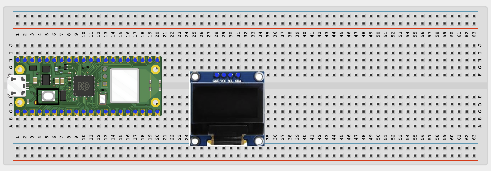
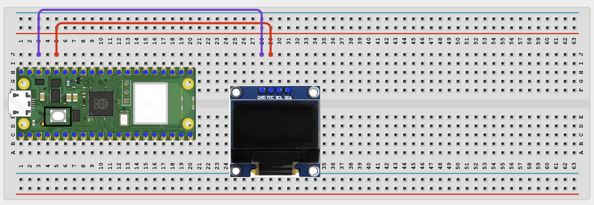
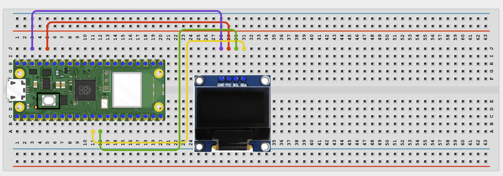
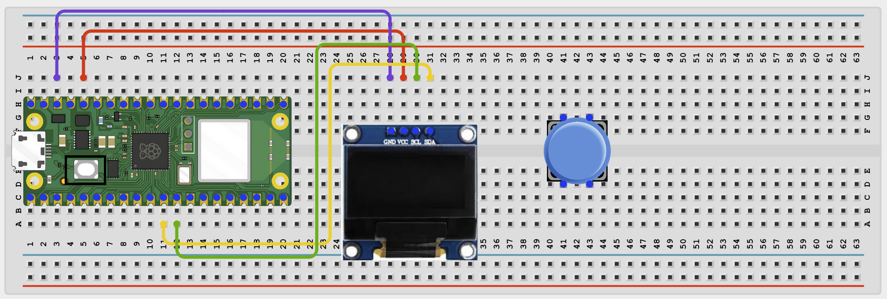
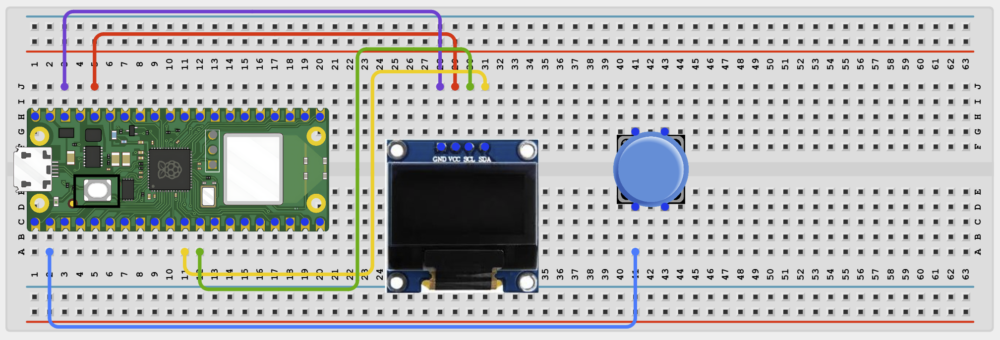
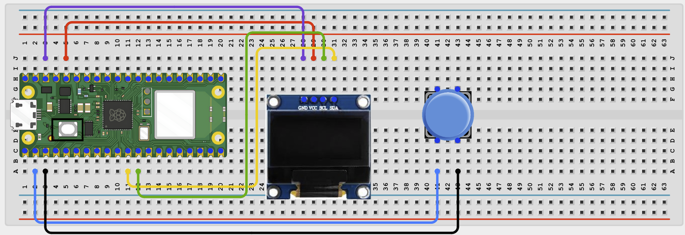

# Project 1.7.2

## OLED Button Press Counter

# Overview

Build a button press counter shown on an OLED screen.

This project demonstrates event counting, button edge detection, and display updates.

The final result is an OLED that shows how many times the button has been pressed.

# Required Components

|  |  |  |  |
| --- | --- | --- | --- |
|  Raspberry Pi Pico 2 W |  SH1106 OLED display |  Push button |  Breadboard |
|  Jumper wires |  |  |  |

# Circuit Connections

| Component Pin | Connects To | Pico GPIO / Physical Pin Number | Notes |
| --- | --- | --- | --- |
| OLED VCC | 3.3V | Physical pin 36 |  |
| OLED GND | GND | Physical pin 38 |  |
| OLED SDA | GPIO 8 | GPIO 8 / physical pin 11 | I2C0 SDA |
| OLED SCL | GPIO 9 | GPIO 9 / physical pin 12 | I2C0 SCL |
| Button leg 1 | GPIO 1 | GPIO 1 / physical pin 2 | Use internal pull-up |
| Button opposite leg | GND | Physical pin 38 |  |

# Step-by-Step Assembly

### Step 1: Place the Raspberry Pi Pico 2W

Place the Raspberry Pi Pico 2W on the breadboard so it sits across the center gap.
Keep the USB port facing outward so you can easily connect it to your computer.

### Step 2: Place the OLED Display

Place the SH1106 OLED display module on the breadboard.

Identify the OLED pins before wiring: VCC, GND, SDA, and SCL.

Check the printed labels on your OLED module before connecting jumper wires.

### Step 3: Connect OLED Power

Connect OLED VCC to 3.3V.

Connect OLED GND to GND.

### Step 4: Connect the OLED I2C Pins

Connect OLED SDA to GPIO 8.

Connect OLED SCL to GPIO 9.

GPIO 8 and GPIO 9 are the I2C pins used by this project.

### Step 5: Place the Push Button

Place the push button across the breadboard center gap.

This keeps the two sides of the button on separate breadboard rows.

### Step 6: Connect the Button Signal Pin

Connect one button leg to GPIO 1.

The code uses the Pico internal pull-up resistor for this button.

### Step 7: Connect the Button Ground Pin

Connect the opposite button leg to GND.

## Wiring Check

✓ Pico 2W is placed correctly across the breadboard center gap

✓ OLED VCC connects to 3.3V

✓ OLED GND connects to GND

✓ OLED SDA connects to GPIO 8

✓ OLED SCL connects to GPIO 9

✓ Push button sits across the breadboard center gap

✓ Button signal leg connects to GPIO 1

✓ Button opposite leg connects to GND

✓ No loose jumper wires

## Beginner Note

If the counter increases more than once for one press, the button may be bouncing. The code handles this by adding a short delay.

# Testing Individual Components

Before running the full project, test each part separately. This makes it easier to find wiring or code problems.

## OLED I2C scanner test

Check OLED communication.

| from machine import Pin, I2C
i2c = I2C(0, sda=Pin(8), scl=Pin(9), freq=400000)
print(i2c.scan()) |
| --- |

Expected test result: The Shell shows the OLED I2C address.

## Button test

Check the button state changes.

| from machine import Pin
import time
button = Pin(1, Pin.IN, Pin.PULL_UP)
while True:
    print('Pressed' if button.value() == 0 else 'Released')
    time.sleep(0.2) |
| --- |

Expected test result: The Shell changes between Released and Pressed.

## OLED text test

Check that the display driver works.

| from machine import Pin, I2C
import sh1106
i2c = I2C(0, sda=Pin(8), scl=Pin(9), freq=400000)
display = sh1106.SH1106_I2C(128, 64, i2c)
display.fill(0)
display.text('Counter OK', 25, 30, 1)
display.show() |
| --- |

Expected test result: The OLED shows Counter OK.

# Full Project Code

After completing and checking the circuit connections, open Thonny IDE. Copy and paste the code below into a new file, or upload the project file to the Raspberry Pi Pico 2 W, then run it from Thonny.

| from machine import Pin, I2C
import sh1106
import time

i2c = I2C(0, sda=Pin(8), scl=Pin(9), freq=400000)
display = sh1106.SH1106_I2C(128, 64, i2c)
button = Pin(1, Pin.IN, Pin.PULL_UP)
count = 0
last_button = 1

def draw_count():
    display.fill(0)
    display.text('BUTTON COUNTER', 8, 10, 1)
    display.text('Count: ' + str(count), 28, 35, 1)
    display.show()

draw_count()
print('Button counter ready')

while True:
    current_button = button.value()

    if current_button == 0 and last_button == 1:
        count += 1
        print('Count:', count)
        draw_count()
        time.sleep(0.2)

    last_button = current_button
    time.sleep(0.02) |
| --- |

# How the Code Works

| Code Section | What It Does | Why It Matters |
| --- | --- | --- |
| I2C and OLED setup | Connects to the display and creates the display object | The OLED is used to show the count |
| count variable | Stores the number of button presses | This is the main project data |
| draw_count() | Refreshes the screen with the current count | Keeps display code clear |
| Button edge detection | Counts one press at a time | Prevents one long press from adding many counts |

# Expected Result

Each time you press the button, the count increases by 1 on the OLED and in the Shell.

# Troubleshooting

| Problem | Possible Cause | Solution |
| --- | --- | --- |
| Count does not change | Button wired incorrectly | Reconnect the button between GPIO 1 and GND |
| OLED blank | Display wiring or missing sh1106.py | Check SDA/SCL pins and confirm the library file is saved |
| Count jumps by more than one | Button bounce | Keep the edge detection and debounce delay in the code |

