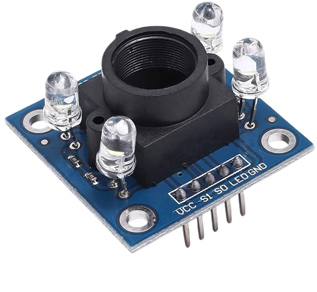

# Wi-Fi Color Sensor Display

**Project 55 • Beginner**

Embedded Systems Project Using Raspberry Pi Pico 2 W and MicroPython

---

| Property             | Value                 |
| -------------------- | --------------------- |
| Manual Section       | Beginner Projects     |
| Project Level        | Beginner              |
| Board                | Raspberry Pi Pico 2 W |
| Programming Language | MicroPython           |
| Version              | 1.0                   |
| Date                 | May 2026              |
| Prepared for         | STEMAIDE Africa       |

---

## Overview

Build a color sensor display that shows detected colors on both an OLED screen and a local web page.

This project demonstrates reading raw red, green, blue, and clear values from a TCS34725 sensor and turning them into a simple color label.

The final result should show a detected color name plus raw sensor values when different colored objects are placed near the sensor.

!!! note "Project Story"
Beginner Extension Project: This project is more advanced than the earlier beginner projects. Complete the basic projects first before attempting this one.

## Required Components

|  |  |  |  |
| --- | --- | --- | --- |
| <br>Raspberry Pi Pico 2 W | <br>TCS34725 color sensor | <br>SH1106 OLED display | <br>Breadboard |
| <br>Jumper wires | Colored paper or objects | 2.4 GHz Wi-Fi network | Phone or computer browser |


## Circuit Connections

| Component Pin | Connects To | Pico GPIO / Physical Pin Number | Notes                   |
| ------------- | ----------- | ------------------------------- | ----------------------- |
| TCS34725 VIN  | 3.3V        | Physical pin 36                 | Check your module label |
| TCS34725 GND  | GND         | Physical pin 38                 | —                       |
| TCS34725 SDA  | GPIO 8      | GPIO 8 / physical pin 11        | Shared I2C data line    |
| TCS34725 SCL  | GPIO 9      | GPIO 9 / physical pin 12        | Shared I2C clock line   |
| OLED VCC      | 3.3V        | Physical pin 36                 | —                       |
| OLED GND      | GND         | Physical pin 38                 | —                       |
| OLED SDA      | GPIO 8      | GPIO 8 / physical pin 11        | Same SDA line as sensor |
| OLED SCL      | GPIO 9      | GPIO 9 / physical pin 12        | Same SCL line as sensor |

## Step-by-Step Assembly

### Step 1: Place the Raspberry Pi Pico 2W

Place the Raspberry Pi Pico 2W on the breadboard so it sits across the center gap. Keep the USB port facing outward so you can easily connect it to your computer.


### Step 2: Place the TCS34725 Module and OLED Display

- Place the TCS34725 module on the breadboard.
- Place the SH1106 OLED display module on the breadboard.
- Identify VIN, GND, SDA, and SCL on the TCS34725 module.
- Identify VCC, GND, SDA, and SCL on the OLED display.
- Both modules will share the same I2C bus.


### Step 3: Connect TCS34725 Power and I2C

- Connect TCS34725 VIN to 3.3V.
- Connect TCS34725 GND to GND.
- Connect TCS34725 SDA to GPIO 8.
- Connect TCS34725 SCL to GPIO 9.


### Step 4: Connect OLED Power and I2C

- Connect OLED VCC to 3.3V.
- Connect OLED GND to GND.
- Connect OLED SDA to GPIO 8.
- Connect OLED SCL to GPIO 9.


---

## Wiring Check

✓ Pico 2W is placed correctly across the breadboard center gap  
✓ TCS34725 VIN connects to 3.3V  
✓ TCS34725 GND connects to GND  
✓ TCS34725 SDA connects to GPIO 8  
✓ TCS34725 SCL connects to GPIO 9  
✓ OLED VCC connects to 3.3V  
✓ OLED GND connects to GND  
✓ OLED SDA connects to GPIO 8  
✓ OLED SCL connects to GPIO 9  
✓ No loose jumper wires

!!! note "Beginner Note"
Hold colored objects close to the sensor and use steady room lighting for more reliable readings.

---

## Testing Individual Components

Before running the full project, test each part separately. This makes it easier to find wiring or code problems.

### I2C Scanner Test

Check that both the TCS34725 and OLED appear on the I2C bus.

```python
from machine import I2C, Pin

i2c = I2C(0, sda=Pin(8), scl=Pin(9), freq=400000)
print([hex(addr) for addr in i2c.scan()])
```

**Expected test result:** You should usually see the TCS34725 address 0x29 and the OLED address 0x3c.

### Color Sensor Raw Test

Check that the sensor returns changing raw values.

```python
from machine import I2C, Pin
import tcs34725
import time

i2c = I2C(0, sda=Pin(8), scl=Pin(9), freq=400000)
sensor = tcs34725.TCS34725(i2c)
sensor.gain(4)

while True:
    r, g, b, c = sensor.read(True)
    print('R:', r, 'G:', g, 'B:', b, 'C:', c)
    time.sleep(0.5)
```

**Expected test result:** The raw values should change when different colors are placed near the sensor.

### OLED Text Test

Check that the OLED driver works.

```python
from machine import I2C, Pin
import sh1106

i2c = I2C(0, sda=Pin(8), scl=Pin(9), freq=400000)
oled = sh1106.SH1106_I2C(128, 64, i2c)
oled.fill(0)
oled.text('Color Sensor', 10, 28, 1)
oled.show()
```

**Expected test result:** The OLED should show Color Sensor.

### Wi-Fi Connection Test

Check that the Pico connects to Wi-Fi and prints its IP address.

```python
import network
import time

SSID = 'YOUR_WIFI_NAME'
PASSWORD = 'YOUR_WIFI_PASSWORD'

wlan = network.WLAN(network.STA_IF)
wlan.active(True)
wlan.connect(SSID, PASSWORD)

for _ in range(15):
    if wlan.isconnected():
        break
    print('Connecting...')
    time.sleep(1)

print('Connected:', wlan.isconnected())
if wlan.isconnected():
    print('IP address:', wlan.ifconfig()[0])
```

**Expected test result:** The Shell should show Connected: True and print an IP address.

---

## Full Project Code

Upload and run this code after the individual tests work correctly.

```python
import network
import socket
import time
from machine import I2C, Pin
import sh1106
import tcs34725

SSID = 'YOUR_WIFI_NAME'
PASSWORD = 'YOUR_WIFI_PASSWORD'

i2c = I2C(0, sda=Pin(8), scl=Pin(9), freq=400000)
oled = sh1106.SH1106_I2C(128, 64, i2c)
sensor = tcs34725.TCS34725(i2c)
sensor.gain(4)


def detect_color(r, g, b, clear):
    if clear < 100:
        return 'Too dark'
    if r > g * 1.2 and r > b * 1.2:
        return 'Red'
    if g > r * 1.2 and g > b * 1.2:
        return 'Green'
    if b > r * 1.2 and b > g * 1.2:
        return 'Blue'
    if r > 200 and g > 200 and b < 150:
        return 'Yellow'
    return 'Mixed'


def update_oled(color_name, r, g, b):
    oled.fill(0)
    oled.text('Color Sensor', 12, 0, 1)
    oled.text(color_name[:12], 10, 18, 1)
    oled.text('R:{} G:{}'.format(r, g), 0, 38, 1)
    oled.text('B:{}'.format(b), 0, 54, 1)
    oled.show()


def web_page(color_name, r, g, b, c):
    return '''<!DOCTYPE html>
<html>
<head>
    <meta name='viewport' content='width=device-width, initial-scale=1'>
    <meta http-equiv='refresh' content='3'>
    <title>Wi-Fi Color Sensor</title>
</head>
<body style='font-family:Arial;text-align:center;padding:30px'>
    <h1>Wi-Fi Color Sensor Display</h1>
    <h2>{}</h2>
    <p>R: {} G: {} B: {} C: {}</p>
    <p>Place a colored object near the sensor.</p>
</body>
</html>'''.format(color_name, r, g, b, c)


wlan = network.WLAN(network.STA_IF)
wlan.active(True)
wlan.connect(SSID, PASSWORD)

print('Connecting to Wi-Fi...')
for _ in range(15):
    if wlan.isconnected():
        break
    time.sleep(1)

if not wlan.isconnected():
    raise RuntimeError('Wi-Fi connection failed')

ip_address = wlan.ifconfig()[0]
print('Connected. Open http://{} in your browser'.format(ip_address))

address = socket.getaddrinfo('0.0.0.0', 80)[0][-1]
server = socket.socket()
server.bind(address)
server.listen(1)
server.settimeout(0.2)

while True:
    r, g, b, c = sensor.read(True)
    color_name = detect_color(r, g, b, c)
    update_oled(color_name, r, g, b)

    try:
        client, client_address = server.accept()
    except OSError:
        continue

    client.recv(1024)
    response = web_page(color_name, r, g, b, c)
    client.send('HTTP/1.1 200 OK\r\nContent-Type: text/html\r\nConnection: close\r\n\r\n'.encode())
    client.sendall(response.encode())
    client.close()
```

---

## How the Code Works

| Code Section        | What It Does                                   | Why It Matters                                               |
| ------------------- | ---------------------------------------------- | ------------------------------------------------------------ |
| Shared I2C setup    | Connects the TCS34725 and OLED on one I2C bus  | Both devices can work together on the same SDA and SCL lines |
| `sensor.read(True)` | Reads raw red, green, blue, and clear values   | These numbers are the basis for color detection              |
| `detect_color()`    | Uses simple rules to label the dominant color  | This turns raw data into a beginner-friendly result          |
| OLED and web page   | Show the current detected color and raw values | Students can compare local and browser display outputs       |

---

## Expected Result

After entering your Wi-Fi details and running the code, the OLED and browser page should show a detected color name and the raw sensor values. Moving different colored objects in front of the sensor should change the displayed result.

---

## Troubleshooting

| Problem                        | Possible Cause                                             | Solution                                                     |
| ------------------------------ | ---------------------------------------------------------- | ------------------------------------------------------------ |
| No color values appear         | Wrong I2C wiring or missing library                        | Check GPIO 8/9 and confirm tcs34725.py is on the Pico        |
| Detected color looks wrong     | Lighting is changing too much or the rules need adjustment | Test under steady light and try objects closer to the sensor |
| OLED works but sensor does not | Only one I2C device is connected correctly                 | Run the I2C scanner and confirm both addresses               |
