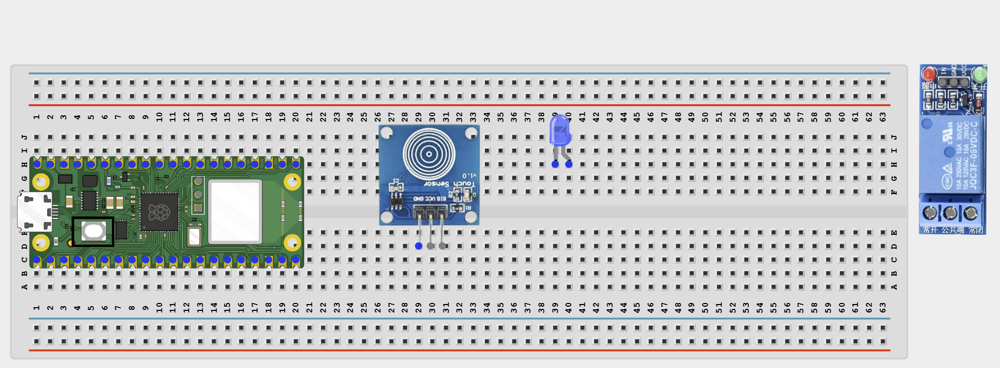
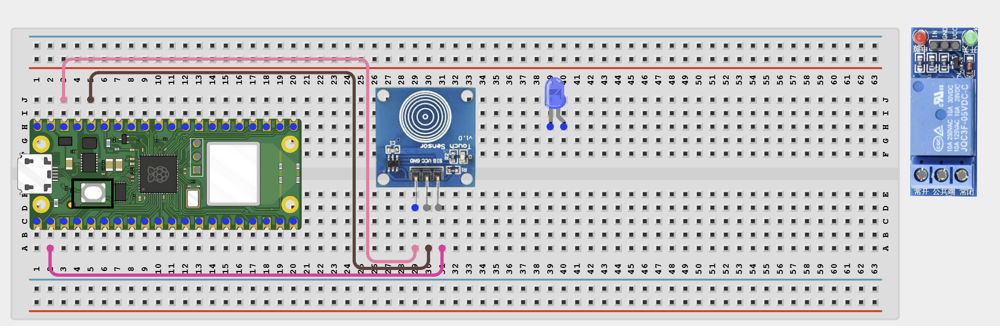
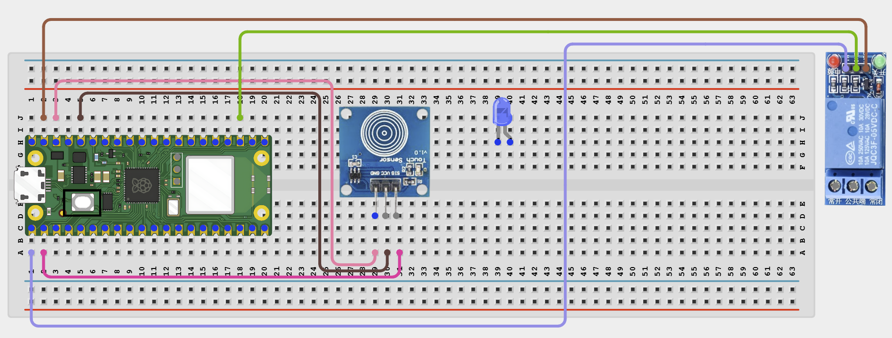
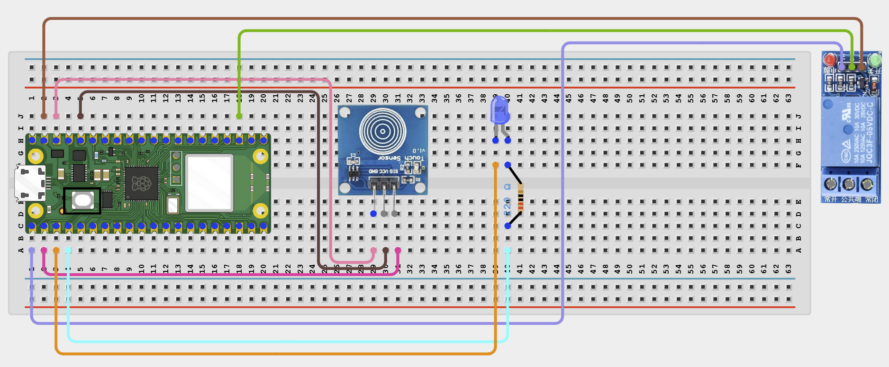

# STEMAIDE AFRICA

# Project 1.8.13: Wi-Fi Touch Switch

**Beginner Embedded Systems Project Using Raspberry Pi Pico 2 W and MicroPython**


# Overview

Build a touch-controlled relay switch that also works from a browser on your local Wi-Fi network.

This project demonstrates using one shared state for physical touch control and remote web control.

The final result should let the touch sensor and the web page both toggle the same relay state while an LED shows the current status.

# Required Components

|  |  |  |  |
| --- | --- | --- | --- |
| <br>Raspberry Pi Pico 2 W | <br>TTP223 Touch Sensor | <br>1-Channel Relay | <br>LED |
| <br>220Ω Resistor | <br>Breadboard | <br>Jumper Wires | 2.4 GHz Wi-Fi Network |
| Phone or Browser |  |  |  |


# Circuit Connections

| Component Pin   | Connects To               | Pico GPIO / Physical Pin Number | Notes                |
| --------------- | ------------------------- | ------------------------------- | -------------------- |
| TTP223 VCC      | 3.3V                      | Physical Pin 36                 | Sensor power         |
| TTP223 GND      | GND                       | Physical Pin 38                 | Common ground        |
| TTP223 SIG      | GPIO 1                    | GPIO 1 / Physical Pin 2         | Digital touch output |
| Relay VCC       | 5V / VSYS                 | Physical Pin 40                 | Module power         |
| Relay GND       | GND                       | Physical Pin 38                 | Common ground        |
| Relay IN        | GPIO 0                    | GPIO 0 / Physical Pin 1         | Usually active-low   |
| LED Anode (+)   | 220Ω resistor then GPIO 2 | GPIO 2 / Physical Pin 4         | Status LED           |
| LED Cathode (-) | GND                       | Physical Pin 38                 | Common ground        |

# Step-by-Step Assembly

## Step 1: Place the Raspberry Pi Pico 2 W

Place the Raspberry Pi Pico 2 W on the breadboard so it sits across the center gap.

Keep the USB port facing outward so you can easily connect it to your computer.


---

## Step 2: Place the Touch Sensor, Relay, and LED

Place the TTP223 touch sensor module on the breadboard.

Place the 1-channel relay module on the breadboard or beside it.

Place the LED with its two legs in different breadboard rows.

Identify touch sensor VCC, GND, and SIG before wiring.



---

## Step 3: Connect the Touch Sensor

Connect:

- TTP223 VCC → 3.3V
- TTP223 GND → GND
- TTP223 SIG → GPIO 1



---

## Step 4: Connect the Relay

Connect:

- Relay VCC → 5V / VSYS
- Relay GND → GND
- Relay IN → GPIO 0



---

## Step 5: Connect the Status LED

Connect the LED long leg to one end of a 220Ω resistor.

Connect the other end of the resistor to GPIO 2.

Connect the LED short leg to GND.



---

# Wiring Check

- ✓ Pico 2 W is placed correctly across the breadboard center gap
- ✓ TTP223 VCC connects to 3.3V
- ✓ TTP223 GND connects to GND
- ✓ TTP223 SIG connects to GPIO 1
- ✓ Relay VCC connects to 5V / VSYS
- ✓ Relay GND connects to GND
- ✓ Relay IN connects to GPIO 0
- ✓ LED long leg connects through a 220Ω resistor to GPIO 2
- ✓ LED short leg connects to GND
- ✓ No loose jumper wires

### Safety Note

> Use only low-voltage loads with the relay. Do not connect mains AC power in this beginner project.

---

# Testing Individual Components

Before running the full project, test each part separately. This makes it easier to find wiring or code problems.

## Touch Sensor Test

```python
from machine import Pin
import time

touch = Pin(1, Pin.IN)

while True:
    print(touch.value())
    time.sleep(0.2)
```

### Expected Test Result

The printed value should change when you touch the sensor.

---

## Relay Click Test

```python
from machine import Pin
import time

relay = Pin(0, Pin.OUT)

relay.value(1)
time.sleep(1)
relay.value(0)
time.sleep(1)
relay.value(1)
```

### Expected Test Result

You should hear the relay click on and off.

---

## LED Test

```python
from machine import Pin
import time

led = Pin(2, Pin.OUT)

led.on()
time.sleep(1)
led.off()
```

### Expected Test Result

The LED should turn on briefly and then turn off.

---

## Wi-Fi Connection Test

```python
import network
import time

SSID = 'YOUR_WIFI_NAME'
PASSWORD = 'YOUR_WIFI_PASSWORD'

wlan = network.WLAN(network.STA_IF)
wlan.active(True)
wlan.connect(SSID, PASSWORD)

for _ in range(15):
    if wlan.isconnected():
        break
    print('Connecting...')
    time.sleep(1)

print('Connected:', wlan.isconnected())

if wlan.isconnected():
    print('IP address:', wlan.ifconfig()[0])
```

### Expected Test Result

The Shell should show:

```text
Connected: True
```

and display an IP address.

---

# Full Project Code

```python
import network
import socket
import time
from machine import Pin

SSID = 'YOUR_WIFI_NAME'
PASSWORD = 'YOUR_WIFI_PASSWORD'

touch = Pin(1, Pin.IN)
relay = Pin(0, Pin.OUT)
led = Pin(2, Pin.OUT)

state = False
last_touch = 0


def apply_state(is_on):
    relay.value(0 if is_on else 1)
    led.value(1 if is_on else 0)


def web_page(is_on):
    status = 'ON' if is_on else 'OFF'
    return '''<!DOCTYPE html>
<html>
<head>
<meta name="viewport" content="width=device-width, initial-scale=1">
<meta http-equiv="refresh" content="2">
<title>Wi-Fi Touch Switch</title>
</head>
<body style="font-family:Arial;text-align:center;padding:30px">
<h1>Wi-Fi Touch Switch</h1>
<h2>State: {}</h2>
<p><a href="/toggle"><button>TOGGLE</button></a></p>
<p>Touch the sensor or use the web button.</p>
</body>
</html>'''.format(status)


wlan = network.WLAN(network.STA_IF)
wlan.active(True)
wlan.connect(SSID, PASSWORD)

print('Connecting to Wi-Fi...')

for _ in range(15):
    if wlan.isconnected():
        break
    time.sleep(1)

if not wlan.isconnected():
    raise RuntimeError('Wi-Fi connection failed')

ip_address = wlan.ifconfig()[0]

print('Connected. Open http://{} in your browser'.format(ip_address))

address = socket.getaddrinfo('0.0.0.0', 80)[0][-1]

server = socket.socket()
server.bind(address)
server.listen(1)
server.settimeout(0.2)

while True:
    current_touch = touch.value()

    if current_touch == 1 and last_touch == 0:
        state = not state
        print('Touch toggle. State:', state)
        time.sleep(0.15)

    last_touch = current_touch

    apply_state(state)

    try:
        client, client_address = server.accept()
    except OSError:
        continue

    request = client.recv(1024).decode()

    if 'GET /toggle' in request:
        state = not state
        apply_state(state)
        print('Web toggle. State:', state)

    response = web_page(state)

    client.send('HTTP/1.1 200 OK\r\nContent-Type: text/html\r\nConnection: close\r\n\r\n'.encode())
    client.sendall(response.encode())
    client.close()
```

---

# How the Code Works

| Code Section          | What It Does                                    | Why It Matters                                          |
| --------------------- | ----------------------------------------------- | ------------------------------------------------------- |
| Touch input           | Reads the TTP223 sensor output                  | This provides physical control of the switch            |
| Shared state variable | Stores whether the switch should be ON or OFF   | Both touch input and browser control use the same state |
| `apply_state()`       | Updates the relay and LED together              | Physical output and status indicator stay synchronized  |
| Web toggle            | Lets the browser change the same state as touch | This keeps both control methods linked                  |

---

# Expected Result

After entering your Wi-Fi details and running the code:

- Touching the sensor should toggle the relay state and the LED.
- Opening the browser page should show the current state.
- Pressing the TOGGLE button should change the same state.

---

# Troubleshooting

| Problem                   | Possible Cause                                  | Solution                                          |
| ------------------------- | ----------------------------------------------- | ------------------------------------------------- |
| Touch does nothing        | Touch sensor not powered correctly or wrong pin | Check 3.3V, GND, and GPIO 1 connections           |
| Relay and LED out of sync | Outputs not updated from one shared state       | Keep using one state variable and `apply_state()` |
| Relay behaves backward    | The module is active-low                        | Remember that `relay.value(0)` usually means ON   |
