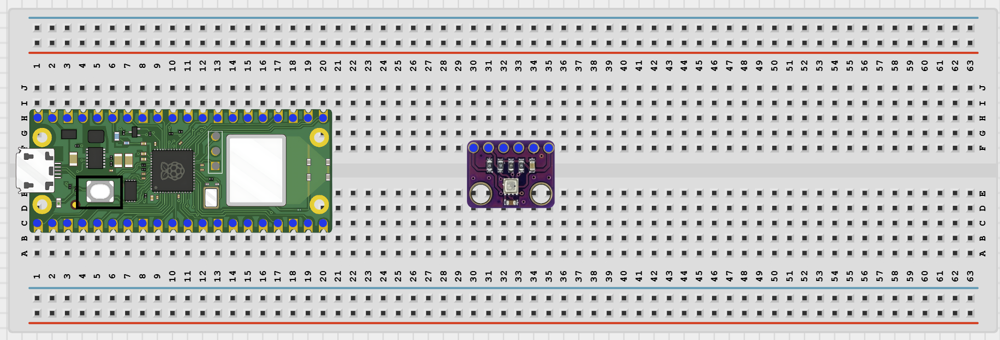
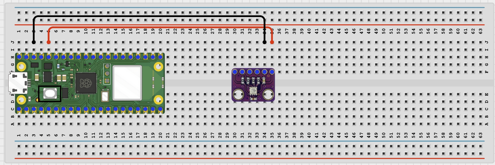
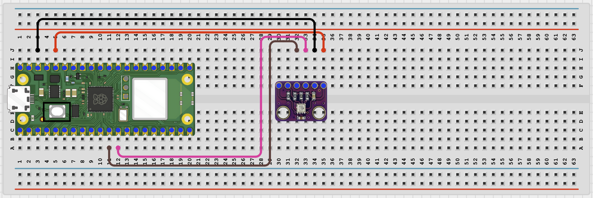

# STEMAIDE AFRICA

# Project 1.8.14: Wi-Fi Weather Station

**Beginner Embedded Systems Project Using Raspberry Pi Pico 2 W and MicroPython**


# Overview

Build a simple weather station that reads a BME280 sensor and shows temperature, humidity, and pressure on a local web page.

This project demonstrates I2C sensing plus browser-based data display.

The final result should show live environmental readings in a browser that refreshes automatically.

# Required Components

|  |  |  |  |
| --- | --- | --- | --- |
| <br>Raspberry Pi Pico 2 W | <br>BME280 Module | <br>Breadboard | <br>Jumper Wires |
| 2.4 GHz Wi-Fi Network | Phone or Computer Browser |  |  |


# Circuit Connections

| Component Pin | Connects To | Pico GPIO / Physical Pin Number | Notes         |
| ------------- | ----------- | ------------------------------- | ------------- |
| BME280 VCC    | 3.3V        | Physical Pin 36                 | Sensor power  |
| BME280 GND    | GND         | Physical Pin 38                 | Common ground |
| BME280 SDA    | GPIO 8      | GPIO 8 / Physical Pin 11        | I2C0 SDA      |
| BME280 SCL    | GPIO 9      | GPIO 9 / Physical Pin 12        | I2C0 SCL      |

# Step-by-Step Assembly

## Step 1: Place the Raspberry Pi Pico 2 W

Place the Raspberry Pi Pico 2 W on the breadboard so it sits across the center gap.

Keep the USB port facing outward so you can easily connect it to your computer.


---

## Step 2: Place the BME280 Module

Place the BME280 module on the breadboard.

Identify:

- VCC
- GND
- SDA
- SCL

before wiring.



---

## Step 3: Connect BME280 Power

Connect:

- BME280 VCC → 3.3V
- BME280 GND → GND



---

## Step 4: Connect BME280 I2C Pins

Connect:

- BME280 SDA → GPIO 8
- BME280 SCL → GPIO 9



---

## Wiring Check

- ✓ Pico 2 W is placed correctly across the breadboard center gap
- ✓ BME280 VCC connects to 3.3V
- ✓ BME280 GND connects to GND
- ✓ BME280 SDA connects to GPIO 8
- ✓ BME280 SCL connects to GPIO 9
- ✓ No loose jumper wires

### Safety Note

> Power the BME280 from 3.3V only. Never connect 5V directly to the sensor communication pins.

---

# Testing Individual Components

Before running the full project, test each part separately.

## I2C Scanner Test

```python
from machine import I2C, Pin

i2c = I2C(0, sda=Pin(8), scl=Pin(9), freq=400000)

print([hex(addr) for addr in i2c.scan()])
```

### Expected Test Result

You should usually see the BME280 address:

- `0x76`
- or `0x77`

---

## BME280 Sensor Test

```python
from machine import I2C, Pin
import BME280

i2c = I2C(0, sda=Pin(8), scl=Pin(9), freq=400000)

try:
    bme = BME280.BME280(i2c=i2c, address=0x76)
except OSError:
    bme = BME280.BME280(i2c=i2c, address=0x77)

print('Temperature:', bme.temperature)
print('Humidity:', bme.humidity)
print('Pressure:', bme.pressure)
```

### Expected Test Result

The Shell should display temperature, humidity, and pressure values.

---

## Wi-Fi Connection Test

```python
import network
import time

SSID = 'YOUR_WIFI_NAME'
PASSWORD = 'YOUR_WIFI_PASSWORD'

wlan = network.WLAN(network.STA_IF)
wlan.active(True)
wlan.connect(SSID, PASSWORD)

for _ in range(15):
    if wlan.isconnected():
        break
    print('Connecting...')
    time.sleep(1)

print('Connected:', wlan.isconnected())

if wlan.isconnected():
    print('IP address:', wlan.ifconfig()[0])
```

### Expected Test Result

The Shell should show:

```text
Connected: True
```

and display an IP address.

---

# Full Project Code

```python
import network
import socket
import time
from machine import I2C, Pin
import BME280

SSID = 'YOUR_WIFI_NAME'
PASSWORD = 'YOUR_WIFI_PASSWORD'

i2c = I2C(0, sda=Pin(8), scl=Pin(9), freq=400000)

try:
    bme = BME280.BME280(i2c=i2c, address=0x76)
except OSError:
    bme = BME280.BME280(i2c=i2c, address=0x77)


def web_page():

    temp = str(bme.temperature)
    hum = str(bme.humidity)
    pres = str(bme.pressure)

    return '''<!DOCTYPE html>
<html>
<head>
<meta name="viewport" content="width=device-width, initial-scale=1">
<meta http-equiv="refresh" content="5">
<title>Wi-Fi Weather Station</title>
</head>
<body style="font-family:Arial;text-align:center;padding:30px">
<h1>Wi-Fi Weather Station</h1>
<p>Temperature: {}</p>
<p>Humidity: {}</p>
<p>Pressure: {}</p>
</body>
</html>'''.format(temp, hum, pres)


wlan = network.WLAN(network.STA_IF)
wlan.active(True)
wlan.connect(SSID, PASSWORD)

print('Connecting to Wi-Fi...')

for _ in range(15):
    if wlan.isconnected():
        break
    time.sleep(1)

if not wlan.isconnected():
    raise RuntimeError('Wi-Fi connection failed')

ip_address = wlan.ifconfig()[0]

print('Connected. Open http://{} in your browser'.format(ip_address))

address = socket.getaddrinfo('0.0.0.0', 80)[0][-1]

server = socket.socket()
server.bind(address)
server.listen(1)

while True:

    client, client_address = server.accept()

    client.recv(1024)

    response = web_page()

    client.send(
        'HTTP/1.1 200 OK\r\n'
        'Content-Type: text/html\r\n'
        'Connection: close\r\n\r\n'.encode()
    )

    client.sendall(response.encode())
    client.close()
```

---

# How the Code Works

| Code Section     | What It Does                                         | Why It Matters                                     |
| ---------------- | ---------------------------------------------------- | -------------------------------------------------- |
| BME280 setup     | Creates the sensor object and tries common addresses | Different BME280 boards may use 0x76 or 0x77       |
| Wi-Fi connection | Connects the Pico 2 W to the local network           | The weather page requires network access           |
| `web_page()`     | Reads live sensor values and builds an HTML page     | Converts sensor data into a dashboard              |
| Auto-refresh     | Reloads the page every 5 seconds                     | Students can observe changing values automatically |

---

# Expected Result

After entering your Wi-Fi details and running the code:

- The Shell should print an IP address.
- Opening the IP address in a browser should display:
  - Temperature
  - Humidity
  - Pressure

The page should refresh automatically every 5 seconds.

---

# Troubleshooting

| Problem                | Possible Cause                         | Solution                                                                      |
| ---------------------- | -------------------------------------- | ----------------------------------------------------------------------------- |
| No BME280 values       | Wrong I2C pins or wrong sensor address | Use GPIO 8 and GPIO 9 and run the I2C scanner                                 |
| Wi-Fi does not connect | Incorrect SSID or password             | Recheck credentials and use a 2.4 GHz network                                 |
| Browser shows no page  | Board not reachable on the network     | Verify the printed IP address and ensure both devices are on the same network |
