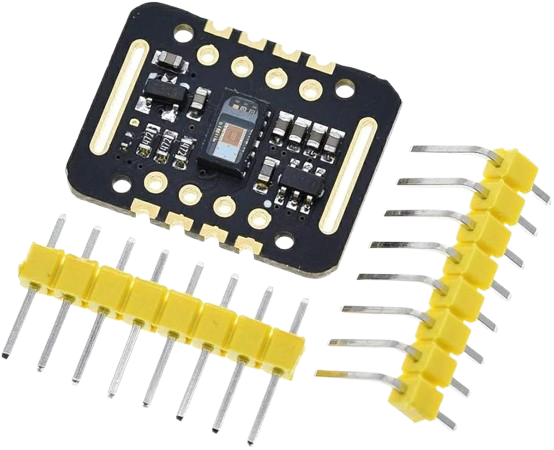
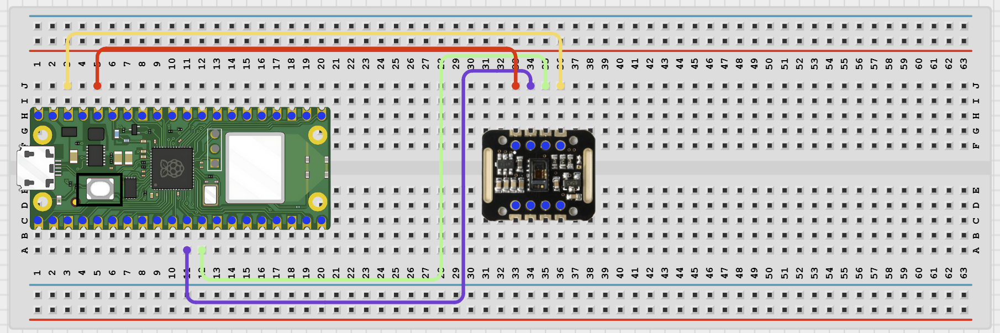

# STEMAIDE AFRICA

# Project 1.8.17: Wi-Fi Heartbeat Logger

**Beginner Embedded Systems Project Using Raspberry Pi Pico 2 W and MicroPython**


# Overview

Build a simple heartbeat logger that stores recent BPM values and shows them on a local web page.

This beginner version uses simulated BPM values so students can focus on logging and history display without a full sensor setup.

The final result should show a current BPM value, a recent history table, and an average BPM on the web page.

# Required Components

|  |  |  |  |
| --- | --- | --- | --- |
| <br>Raspberry Pi Pico 2 W | <br>Optional MAX30102 | <br>Breadboard | <br>Jumper wires |
| 2.4 GHz Wi-Fi network | Phone or browser |  |  |


# Circuit Connections

| Component Pin    | Connects To                                | Pico GPIO / Physical Pin Number | Notes                                             |
| ---------------- | ------------------------------------------ | ------------------------------- | ------------------------------------------------- |
| No sensor wiring | This version runs with simulated data only | Not applicable                  | You can add the real sensor later as an extension |

# Step-by-Step Assembly

## Step 1: Place the Raspberry Pi Pico 2 W

Place the Raspberry Pi Pico 2 W on the breadboard so it sits across the center gap. Keep the USB port facing outward so you can easily connect it to your computer.


---

## Step 2: Check That No Sensor Wiring Is Required

This beginner version uses simulated heartbeat data.

No external sensor wiring is required for the basic project.

Leave the breadboard area clear unless you later add the optional MAX30102 extension.



---

# Wiring Check

- ✓ Pico 2W is placed correctly across the breadboard center gap
- ✓ No external sensor is required for this simulated beginner version
- ✓ Pico 2W can be powered by USB for the Wi-Fi logging demo
- ✓ No loose jumper wires

---

## Safety Note

This project is for learning data logging only. Do not use it for medical diagnosis or health decisions.

---

# Testing Individual Components

Before running the full project, test each part separately. This makes it easier to find wiring or code problems.

## Wi-Fi connection test

Check that the Pico connects to Wi-Fi and prints its IP address.

```python
import network
import time
SSID = 'YOUR_WIFI_NAME'
PASSWORD = 'YOUR_WIFI_PASSWORD'
wlan = network.WLAN(network.STA_IF)
wlan.active(True)
wlan.connect(SSID, PASSWORD)
for _ in range(15):
    if wlan.isconnected():
        break
    print('Connecting...')
    time.sleep(1)
print('Connected:', wlan.isconnected())
if wlan.isconnected():
    print('IP address:', wlan.ifconfig()[0])
```

Expected test result: The Shell should show Connected: True and print an IP address.

---

## BPM history logic test

Check that a small history list can collect and trim values correctly.

```python
history = []
MAX_READINGS = 5
for value in (72, 74, 70, 76, 71, 73, 75):
    history.append(value)
    if len(history) > MAX_READINGS:
        history.pop(0)
    print(history)
```

Expected test result: The printed list should keep only the most recent 5 values.

---

# Full Project Code

Upload and run this code after the individual tests work correctly.

```python
import network
import socket
import time
import urandom

SSID = 'YOUR_WIFI_NAME'
PASSWORD = 'YOUR_WIFI_PASSWORD'

history = []
MAX_READINGS = 20
current_bpm = 72
last_reading_ms = time.ticks_ms()

def add_bpm_reading(value):
    history.append(value)
    if len(history) > MAX_READINGS:
        history.pop(0)


def web_page(current, hist):
    rows = ''
    for index, bpm in enumerate(reversed(hist), 1):
        rows += '<tr><td>{}</td><td>{}</td></tr>'.format(index, bpm)
    average = sum(hist) / len(hist) if hist else current
    return '''<!DOCTYPE html>
<html>
<head>
    <meta name='viewport' content='width=device-width, initial-scale=1'>
    <meta http-equiv='refresh' content='5'>
    <title>Wi-Fi Heartbeat Logger</title>
</head>
<body style='font-family:Arial;text-align:center;padding:30px'>
    <h1>Wi-Fi Heartbeat Logger</h1>
    <h2>{} BPM</h2>
    <p>Average: {:.1f} BPM</p>
    <table border='1' cellpadding='8' cellspacing='0' style='margin:0 auto'>
        <tr><th>#</th><th>BPM</th></tr>
        {}
    </table>
    <p>Simulated educational data for beginner learning.</p>
</body>
</html>'''.format(current, average, rows)


wlan = network.WLAN(network.STA_IF)
wlan.active(True)
wlan.connect(SSID, PASSWORD)

print('Connecting to Wi-Fi...')
for _ in range(15):
    if wlan.isconnected():
        break
    time.sleep(1)

if not wlan.isconnected():
    raise RuntimeError('Wi-Fi connection failed')

ip_address = wlan.ifconfig()[0]
print('Connected. Open http://{} in your browser'.format(ip_address))

address = socket.getaddrinfo('0.0.0.0', 80)[0][-1]
server = socket.socket()
server.bind(address)
server.listen(1)
server.settimeout(0.2)

while True:
    if time.ticks_diff(time.ticks_ms(), last_reading_ms) >= 5000:
        current_bpm = 70 + urandom.getrandbits(4) - 4
        add_bpm_reading(current_bpm)
        last_reading_ms = time.ticks_ms()

    try:
        client, client_address = server.accept()
    except OSError:
        continue

    client.recv(1024)
    response = web_page(current_bpm, history)
    client.send('HTTP/1.1 200 OK\r\nContent-Type: text/html\r\nConnection: close\r\n\r\n'.encode())
    client.sendall(response.encode())
    client.close()
```

---

# How the Code Works

| Code Section        | What It Does                                      | Why It Matters                                                       |
| ------------------- | ------------------------------------------------- | -------------------------------------------------------------------- |
| history list        | Stores recent BPM values                          | This creates the data log part of the project                        |
| add_bpm_reading()   | Adds a new value and removes the oldest if needed | The list stays a fixed useful size                                   |
| Simulated update    | Creates a new BPM value every 5 seconds           | Students can practice logging without needing a complex sensor setup |
| Average calculation | Computes the average of the stored readings       | This gives a simple summary of recent values                         |

---

# Expected Result

After entering your Wi-Fi details and running the code, the browser page should show a current BPM value, a recent history table, and an average BPM. Every few seconds, the BPM value and history should update automatically.

---

# Troubleshooting

| Problem                  | Possible Cause                                              | Solution                                                    |
| ------------------------ | ----------------------------------------------------------- | ----------------------------------------------------------- |
| History never changes    | The timing logic is not being reached                       | Wait at least 5 seconds and recheck last_reading_ms updates |
| Average looks wrong      | The history list may be empty or values are not being added | Print the history list in the Shell and inspect it          |
| Browser page stays blank | The board is not reachable on the network                   | Check the printed IP address and Wi-Fi connection           |
