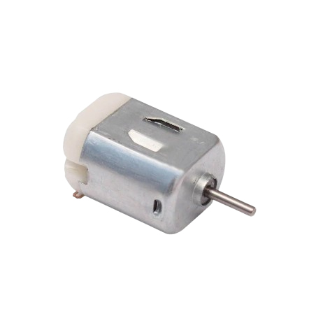

# STEMAIDE AFRICA

# Project 1.8.19: Wi-Fi Power Usage Simulator

**Beginner Embedded Systems Project Using Raspberry Pi Pico 2 W and MicroPython**


# Overview

Build a low-voltage power-usage simulator that estimates energy use based on how long a relay-controlled load stays on.

This project demonstrates the idea of power and energy without using unsafe high-voltage mains equipment.

The final result should show current simulated power, total simulated energy used, and browser controls to turn the load on or off and reset the totals.

# Required Components

|  |  |  |  |
| --- | --- | --- | --- |
| <br>Raspberry Pi Pico 2 W | <br>1-channel relay module or MOSFET stage | <br>Low-voltage load | <br>External DC power supply |
| <br>Breadboard | <br>Jumper wires | 2.4 GHz Wi-Fi network | Phone or computer browser |


# Circuit Connections

| Component Pin           | Connects To               | Pico GPIO / Physical Pin Number | Notes                       |
| ----------------------- | ------------------------- | ------------------------------- | --------------------------- |
| Relay VCC               | 5V / VSYS                 | Physical pin 40                 | If using a relay module     |
| Relay GND               | GND                       | Physical pin 38                 | If using a relay module     |
| Relay IN or MOSFET gate | GPIO 0                    | GPIO 0 / physical pin 1         | Control pin                 |
| External load positive  | Relay/MOSFET load side    | Not a GPIO pin                  | Use a low-voltage load only |
| External load ground    | Shared low-voltage return | Not a GPIO pin                  | Common with the load supply |

# Step-by-Step Assembly

## Step 1: Place the Raspberry Pi Pico 2 W

Place the Raspberry Pi Pico 2 W on the breadboard so it sits across the center gap. Keep the USB port facing outward so you can easily connect it to your computer.


---

## Step 2: Place the Relay Module or MOSFET Stage

Place the relay module or MOSFET stage on the breadboard or beside it where the pins are easy to reach.

Use only a safe low-voltage load for this simulator project.

Identify relay VCC, GND, and IN if you are using a relay module.


---

## Step 3: Connect the Control Input

Connect relay IN or the MOSFET gate to GPIO 0. This is the control signal used by the code.


---

## Step 4: Connect Relay Power If Using a Relay

Connect relay VCC to 5V / VSYS.

Connect relay GND to GND.

If you are using a MOSFET stage instead, follow the MOSFET module labels for its power and ground pins.


---

## Step 5: Connect the Low-Voltage Load Side

Connect the external load positive wire through the relay or MOSFET load side.

Connect the external load ground to the shared low-voltage return for the load supply.

Keep the Pico powered by USB and the load powered by its own safe DC supply.


---

# Wiring Check

- ✓ Pico 2W is placed correctly across the breadboard center gap
- ✓ Relay IN or MOSFET gate connects to GPIO 0
- ✓ Relay VCC connects to 5V / VSYS if using a relay module
- ✓ Relay GND connects to GND if using a relay module
- ✓ External load uses only a safe low-voltage DC supply
- ✓ Load side wiring is separate from Pico GPIO wiring
- ✓ No loose jumper wires

---

## Safety Note

Do not use mains AC in this simulator project.

Keep all loads at safe low voltages only, 12V or lower as stated in the component list.

---

# Testing Individual Components

Before running the full project, test each part separately. This makes it easier to find wiring or code problems.

## Relay or load control test

Check that the Pico can switch the low-voltage load on and off safely.

```python
from machine import Pin
import time
control = Pin(0, Pin.OUT)
control.value(1)
time.sleep(1)
control.value(0)
time.sleep(1)
control.value(1)
```

Expected test result: The relay should click or the low-voltage load should switch state safely.

---

## Energy math test

Check the simulated energy calculation idea before the full web version.

```python
LOAD_POWER_W = 10.0
energy_Wh = 0.0
for seconds_on in (60, 120, 180):
    energy_Wh += LOAD_POWER_W * (seconds_on / 3600)
    print(round(energy_Wh, 3), 'Wh')
```

Expected test result: The printed Wh value should increase each time more ON-time is added.

---

## Wi-Fi connection test

Check that the Pico connects to Wi-Fi and prints its IP address.

```python
import network
import time
SSID = 'YOUR_WIFI_NAME'
PASSWORD = 'YOUR_WIFI_PASSWORD'
wlan = network.WLAN(network.STA_IF)
wlan.active(True)
wlan.connect(SSID, PASSWORD)
for _ in range(15):
    if wlan.isconnected():
        break
    print('Connecting...')
    time.sleep(1)
print('Connected:', wlan.isconnected())
if wlan.isconnected():
    print('IP address:', wlan.ifconfig()[0])
```

Expected test result: The Shell should show Connected: True and print an IP address.

---

# Full Project Code

Upload and run this code after the individual tests work correctly.

```python
import network
import socket
import time
from machine import Pin

SSID = 'YOUR_WIFI_NAME'
PASSWORD = 'YOUR_WIFI_PASSWORD'

control = Pin(0, Pin.OUT)
control.value(1)  # assume active-low relay so 1 = OFF

LOAD_POWER_W = 10.0
energy_Wh = 0.0
load_on = False
last_update_ms = time.ticks_ms()

def update_energy():
    global energy_Wh, last_update_ms
    now = time.ticks_ms()
    elapsed_ms = time.ticks_diff(now, last_update_ms)
    last_update_ms = now
    if load_on:
        energy_Wh += LOAD_POWER_W * (elapsed_ms / 3600000)

def apply_load_state(on_state):
    control.value(0 if on_state else 1)

def web_page():
    current_power = LOAD_POWER_W if load_on else 0.0
    return '''<!DOCTYPE html>
<html>
<head>
    <meta name='viewport' content='width=device-width, initial-scale=1'>
    <meta http-equiv='refresh' content='2'>
    <title>Wi-Fi Power Usage Simulator</title>
</head>
<body style='font-family:Arial;text-align:center;padding:30px'>
    <h1>Wi-Fi Power Usage Simulator</h1>
    <h2>Current Power: {:.1f} W</h2>
    <h2>Total Energy: {:.3f} Wh</h2>
    <p><a href='/?load=on'><button>LOAD ON</button></a> <a href='/?load=off'><button>LOAD OFF</button></a> <a href='/?reset=1'><button>RESET</button></a></p>
    <p>Assumed load: {:.1f} W when ON</p>
    <p>Low-voltage educational simulator only</p>
</body>
</html>'''.format(current_power, energy_Wh, LOAD_POWER_W)


wlan = network.WLAN(network.STA_IF)
wlan.active(True)
wlan.connect(SSID, PASSWORD)

print('Connecting to Wi-Fi...')
for _ in range(15):
    if wlan.isconnected():
        break
    time.sleep(1)

if not wlan.isconnected():
    raise RuntimeError('Wi-Fi connection failed')

ip_address = wlan.ifconfig()[0]
print('Connected. Open http://{} in your browser'.format(ip_address))

address = socket.getaddrinfo('0.0.0.0', 80)[0][-1]
server = socket.socket()
server.bind(address)
server.listen(1)
server.settimeout(0.2)

while True:
    update_energy()

    try:
        client, client_address = server.accept()
    except OSError:
        continue

    request = client.recv(1024).decode()
    if 'load=on' in request:
        load_on = True
        apply_load_state(True)
    elif 'load=off' in request:
        load_on = False
        apply_load_state(False)
    elif 'reset=1' in request:
        energy_Wh = 0.0

    response = web_page()
    client.send('HTTP/1.1 200 OK\r\nContent-Type: text/html\r\nConnection: close\r\n\r\n'.encode())
    client.sendall(response.encode())
    client.close()
```

---

# How the Code Works

| Code Section    | What It Does                                      | Why It Matters                                      |
| --------------- | ------------------------------------------------- | --------------------------------------------------- |
| LOAD_POWER_W    | Stores the assumed load power in watts            | This makes the project a safe simulator             |
| update_energy() | Adds energy based on how long the load is ON      | Energy depends on both power and time               |
| load_on state   | Tracks whether the simulated load is currently on | The page needs this to show current power correctly |
| RESET action    | Clears the accumulated energy total               | Students can restart the simulation                 |

---

# Expected Result

After entering your Wi-Fi details and running the code, the browser page should show current power and total simulated energy. Turning the load on should show 10 W and make the energy value increase over time. Turning it off should make power go back to 0 W and stop the energy increase. RESET should clear the total.

---

# Troubleshooting

| Problem                       | Possible Cause                                                         | Solution                                                                      |
| ----------------------------- | ---------------------------------------------------------------------- | ----------------------------------------------------------------------------- |
| Energy never increases        | update_energy() is not running or load_on is never true                | Watch the load state and check that update_energy() runs in the main loop     |
| Relay or load does not switch | Relay logic or wiring is wrong                                         | Check whether your relay is active-low and recheck the load-side wiring       |
| Page shows the wrong values   | The load state and energy total are not updating in the expected order | Turn the load on, wait a few seconds, then refresh and watch the Shell output |
