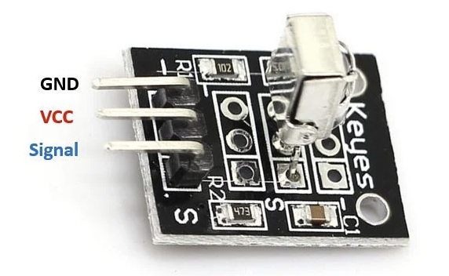
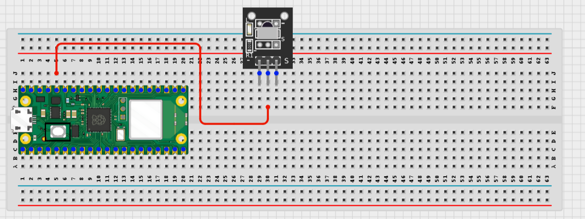
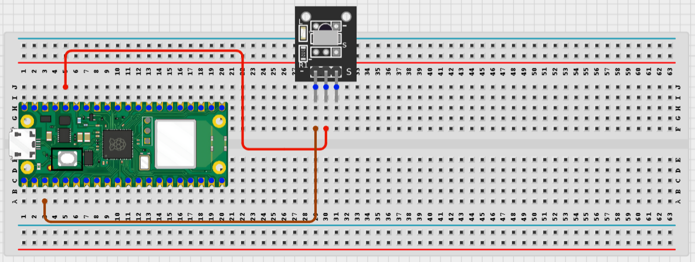
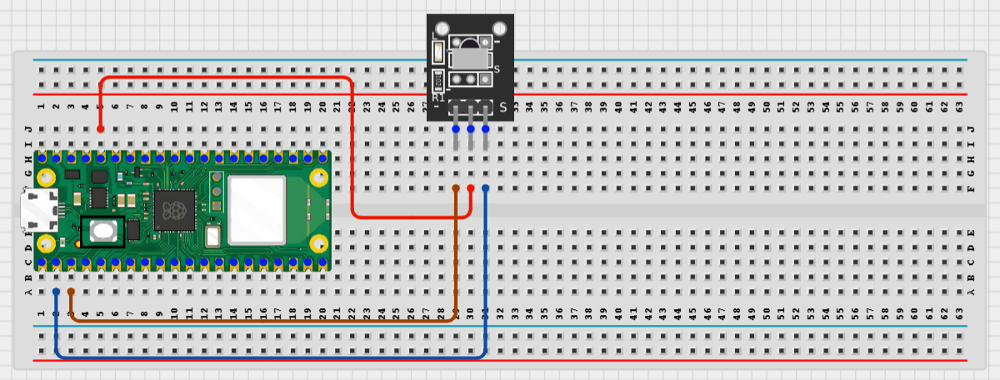
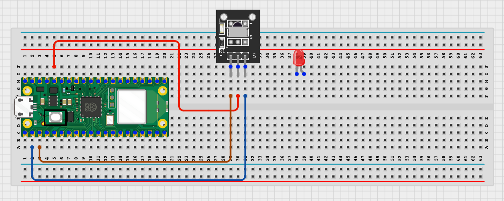
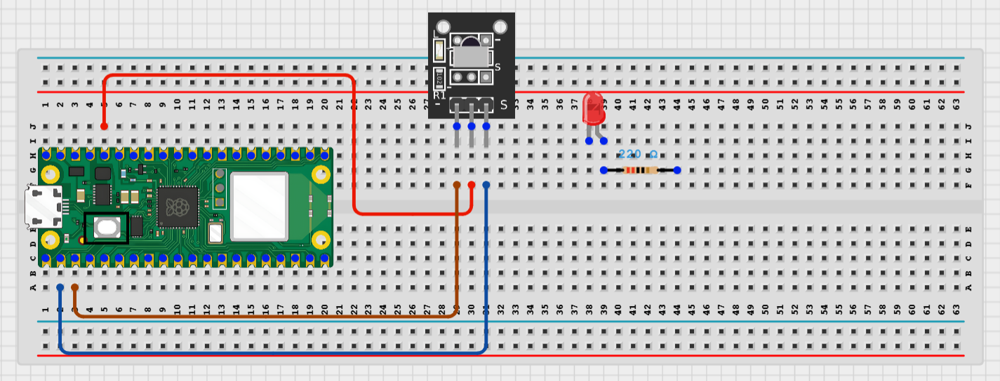
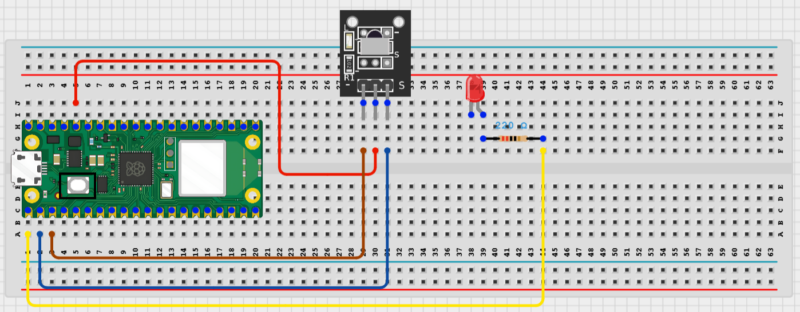
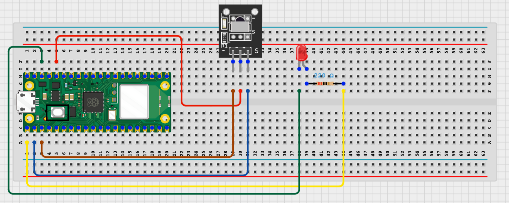

# STEMAIDE AFRICA

# Project 1.8.20: IR Remote LED Controller

**Beginner Embedded Systems Project Using Raspberry Pi Pico 2 W and MicroPython**


# Overview

Build an IR remote LED controller using the Raspberry Pi Pico 2 W.

This project demonstrates how to use an IR receiver to decode signals from a standard TV remote and use those signals to turn a single LED on and off.

The final result should allow one remote button to turn the LED on and another button to turn it off.

# Required Components

|  |  |  |  |
| --- | --- | --- | --- |
| <br>Raspberry Pi Pico 2 W | <br>IR Receiver Module | <br>LED (single color) | <br>220 Ohm Resistor |
| <br>Breadboard | <br>Jumper Wires | IR Remote Control |  |


# Circuit Connections

| Component Pin   | Connects To                   | Pico GPIO / Physical Pin Number | Notes                        |
| --------------- | ----------------------------- | ------------------------------ | ---------------------------- |
| IR Receiver VCC | 3.3V (OUT pin on some modules) | Physical Pin 36                | Check module marking for VCC  |
| IR Receiver GND | GND                           | Physical Pin 38                | Common ground                |
| IR Receiver OUT | GPIO 1                        | GPIO 1 / Physical Pin 2        | IR signal input              |
| LED Anode (+)   | GPIO 0 via 220 Ohm resistor   | GPIO 0 / Physical Pin 1        | Positive LED leg             |
| LED Cathode (-) | GND                           | Physical Pin 38                | Negative LED leg             |

# Step-by-Step Assembly

## Step 1: Place the Raspberry Pi Pico 2 W

Place the Raspberry Pi Pico 2 W on the breadboard so it sits across the center gap.

Keep the USB port facing outward so you can easily connect it to your computer.


---

## Step 2: Place the IR Receiver Module

Place the IR receiver module on the breadboard near the Pico.

Check the module pins. Common pin order is **VCC**, **GND**, **OUT** (check your module labeling).



---

## Step 3: Connect IR Receiver Power

Connect the IR receiver power pins.

- IR VCC → 3.3V (or VCC pin on module if marked)
- IR GND → GND



---

## Step 4: Connect the IR Receiver OUT Pin

Connect the IR receiver signal pin.

- IR OUT → GPIO 1

This sends the decoded remote signal to the Pico.



---

## Step 5: Place the LED

Insert the LED into the breadboard.

Identify the anode (longer leg) and cathode (shorter leg).



---

## Step 6: Add the 220 Ohm Resistor

Insert the 220 Ohm resistor between the LED anode and the connection point for GPIO 0.

This limits current to protect the LED.



---

## Step 7: Connect the LED to GPIO 0

Connect the LED/resistor junction to GPIO 0.

- LED anode (with resistor) → GPIO 0
- LED cathode → GND



---

## Step 8: Verify All Connections

Double-check every wire before powering on.

Look for loose connections or swapped pins.



---

## Step 9: Connect USB and Open Thonny

Connect the Pico to your computer via USB.

Open Thonny IDE and select the Pico as the interpreter.

Verify you can see the MicroPython shell.



---

# Wiring Check

- ✓ Pico 2 W is placed correctly across the breadboard center gap
- ✓ IR receiver VCC connects to 3.3V
- ✓ IR receiver GND connects to GND
- ✓ IR receiver OUT connects to GPIO 1
- ✓ LED anode connects to GPIO 0 via 220 Ohm resistor
- ✓ LED cathode connects to GND
- ✓ No loose jumper wires
- ✓ ir_rx library files are present in the project directory

---

# Testing Individual Components

Before running the full project, test each part separately. This makes it easier to find wiring or code problems.

## LED Test

Check that the LED turns on and off with MicroPython.

```python
from machine import Pin
import time

led = Pin(0, Pin.OUT)

led.value(1)
time.sleep(1)
led.value(0)
time.sleep(1)
```

### Expected Test Result

The LED should light up for one second, then turn off for one second, repeating until stopped.

---

## IR Code Reader Test

Check that the IR receiver can read and print codes from your remote.

```python
from machine import Pin
from ir_rx.nec import IR_ NEC  # Import from the ir_rx library

ir_pin = Pin(1, Pin.IN)

last_code = None

def ir_callback(data, addr, ctrl):
    global last_code
    if data < 0:  # Repeat code
        return
    last_code = data
    print('IR Code:', data, 'Addr:', addr)

ir = IR_ NEC(ir_pin)
ir.callback(ir_callback)

print('Point remote at IR receiver and press a button...')

while True:
    pass
```

> **Note:** The exact class name may vary depending on your `ir_rx` library version. Check the library documentation if import fails.

### Expected Test Result

The Shell should print an IR code number when you press a button on the remote.

---

# Full Project Code

```python
from machine import Pin
import time
from ir_rx.nec import IR_ NEC  # Import from the ir_rx library

LED_PIN = 0
IR_PIN = 1

led = Pin(LED_PIN, Pin.OUT)

last_ir_code = None

def ir_callback(data, addr, ctrl):
    global last_ir_code
    if data < 0:  # Ignore repeat codes
        return
    last_ir_code = data
    print('Received IR Code:', data)

ir = IR_ NEC(Pin(IR_PIN))
ir.callback(ir_callback)

print('IR Remote LED Controller Running...')
print('Press ON button to turn LED ON')
print('Press OFF button to turn LED OFF')

last_code_check = None

while True:
    if last_ir_code is not None and last_ir_code != last_code_check:
        last_code_check = last_ir_code
        print('Action for code:', last_ir_code)

        if last_ir_code == 0x1FE807F:  # Power button - turn LED ON
            led.value(1)
            print('LED ON')
        elif last_ir_code == 0x1FE40BF:  # Mute button - turn LED OFF
            led.value(0)
            print('LED OFF')
        else:
            print('Button not assigned. Use code reader to identify buttons.')
    time.sleep(0.1)
```

> **Note:** IR code values (like `0x1FE807F`) vary by remote brand and model. Use the IR Code Reader Test to discover your remote's button codes before setting assignments. Update the code with your remote's actual button codes.

---

# How the Code Works

| Code Section               | What It Does                                                       | Why It Matters                                                  |
| -------------------------- | ------------------------------------------------------------------ | --------------------------------------------------------------- |
| `ir_rx.nec` Import         | Loads the NEC decoder module from the ir_rx library                | Enables IR signal decoding without writing low-level protocol code |
| IR Callback Function       | Runs automatically when an IR code is received                     | Captures remote button presses in real time                     |
| LED GPIO 0                 | Controls the LED output pin                                        | Provides visual feedback for remote commands                    |
| Button Code Comparison     | Matches specific button codes to LED ON/OFF actions                | Maps remote buttons to desired behavior                         |

---

# Expected Result

After loading the code and pointing a compatible IR remote at the receiver:

1. The Shell should print "IR Remote LED Controller Running..." when the program starts.
2. Pressing the ON button should turn the LED on and print "LED ON".
3. Pressing the OFF button should turn the LED off and print "LED OFF".
4. Pressing unassigned buttons should print the button code for identification.

---

# Troubleshooting

| Problem                          | Possible Cause                                                    | Solution                                                      |
| -------------------------------- | ----------------------------------------------------------------- | ------------------------------------------------------------- |
| No IR codes are printed          | IR receiver not wired correctly or remote not pointing at module  | Recheck OUT pin on GPIO 1 and aim remote directly at receiver |
| LED does not turn on/off        | Wrong IR code in the comparison or LED wired incorrectly          | Use IR reader test to verify button codes, recheck LED wiring |
| Import error for ir_rx           | ir_rx library folder not in project directory or not on Pico      | Copy the full ir_rx folder to your project or Pico lib folder |
| IR receiver not responding       | Module may need 5V VCC instead of 3.3V, or damaged               | Try 5V VCC if module requires it; check module datasheet       |
