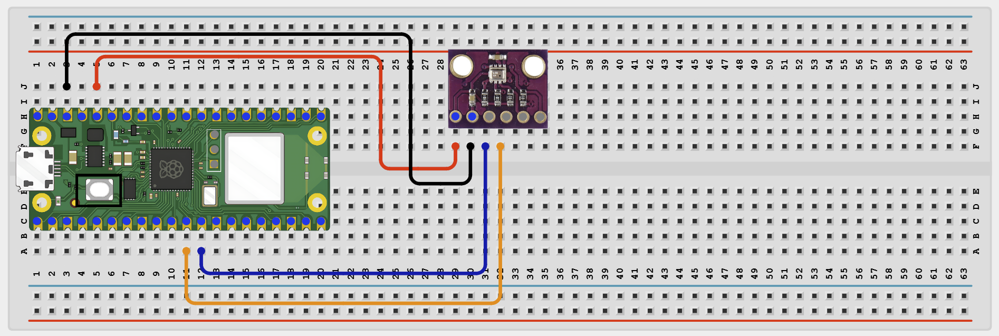

# Project 1.8.4: Online Temperature Monitor

**Beginner Embedded Systems Project Using Raspberry Pi Pico 2 W and MicroPython**

## Pico 2 W Diagram


---

## Overview

Build a temperature monitor that serves live BME280 data on a web page over Wi-Fi.

This project demonstrates combining Wi-Fi networking with an I2C sensor.

The final result should open a browser page that shows the current temperature and refreshes automatically.

## Required Components

|  |  |  |  |
| --- | --- | --- | --- |
| <br>Raspberry Pi Pico 2 W | <br>BME280 module | <br>Breadboard | <br>Jumper wires |
| 2.4 GHz Wi-Fi network | Phone or computer browser |  |  |


## Circuit Connections

| Component Pin | Connects To | Pico GPIO / Physical Pin Number | Notes    |
| ------------- | ----------- | ------------------------------- | -------- |
| BME280 VCC    | 3.3V        | Physical pin 36                 |          |
| BME280 GND    | GND         | Physical pin 38                 |          |
| BME280 SDA    | GPIO 8      | GPIO 8 / physical pin 11        | I2C0 SDA |
| BME280 SCL    | GPIO 9      | GPIO 9 / physical pin 12        | I2C0 SCL |

## Step-by-Step Assembly

### Step 1: Place the Raspberry Pi Pico 2 W

Place the Pico 2 W on the breadboard so it sits across the center gap.


### Step 2: Place the BME280 Module

Place the BME280 module on the breadboard and identify VCC, GND, SDA, and SCL.



### Step 3: Connect BME280 Power

Connect BME280 VCC to 3.3V and BME280 GND to GND.


### Step 4: Connect BME280 I2C Pins

Connect BME280 SDA to GPIO 8 and BME280 SCL to GPIO 9.


---

## Testing Individual Components

### I2C Scanner Test

```python
from machine import Pin, I2C

i2c = I2C(0, sda=Pin(8), scl=Pin(9), freq=400000)
print([hex(addr) for addr in i2c.scan()])
```

### BME280 Temperature Test

```python
from machine import Pin, I2C
import BME280

i2c = I2C(0, sda=Pin(8), scl=Pin(9), freq=400000)
try:
    bme = BME280.BME280(i2c=i2c, address=0x76)
except OSError:
    bme = BME280.BME280(i2c=i2c, address=0x77)

print('Temperature:', bme.temperature)
```

### Wi-Fi Connection Test

```python
import network
import time

SSID = 'YOUR_WIFI_NAME'
PASSWORD = 'YOUR_WIFI_PASSWORD'

wlan = network.WLAN(network.STA_IF)
wlan.active(True)
wlan.connect(SSID, PASSWORD)

for _ in range(15):
    if wlan.isconnected():
        break
    print('Connecting...')
    time.sleep(1)

print('Connected:', wlan.isconnected())
if wlan.isconnected():
    print('IP address:', wlan.ifconfig()[0])
```

---

## Full Project Code

```python
import network
import socket
import time
from machine import Pin, I2C
import BME280

SSID = 'YOUR_WIFI_NAME'
PASSWORD = 'YOUR_WIFI_PASSWORD'

i2c = I2C(0, sda=Pin(8), scl=Pin(9), freq=400000)
try:
    bme = BME280.BME280(i2c=i2c, address=0x76)
except OSError:
    bme = BME280.BME280(i2c=i2c, address=0x77)

wlan = network.WLAN(network.STA_IF)
wlan.active(True)
wlan.connect(SSID, PASSWORD)

print('Connecting to Wi-Fi...')
for _ in range(15):
    if wlan.isconnected():
        break
    time.sleep(1)

if not wlan.isconnected():
    raise RuntimeError('Wi-Fi connection failed')

ip_address = wlan.ifconfig()[0]
print('Connected. Open http://{} in your browser'.format(ip_address))

def web_page():
    temperature_text = str(bme.temperature)
    html = """<!DOCTYPE html>
<html>
<head>
    <meta name='viewport' content='width=device-width, initial-scale=1'>
    <meta http-equiv='refresh' content='5'>
    <title>Online Temperature Monitor</title>
</head>
<body style='font-family:Arial;text-align:center;padding:40px'>
    <h1>Online Temperature Monitor</h1>
    <h2>TEMP_TEXT</h2>
    <p>Page refreshes every 5 seconds</p>
</body>
</html>"""
    return html.replace('TEMP_TEXT', temperature_text)

address = socket.getaddrinfo('0.0.0.0', 80)[0][-1]
server = socket.socket()
server.bind(address)
server.listen(1)

while True:
    client, client_address = server.accept()
    print('Client connected from', client_address)
    response = web_page()
    client.recv(1024)
    client.send('HTTP/1.1 200 OK\r\nContent-Type: text/html\r\nConnection: close\r\n\r\n'.encode())
    client.sendall(response.encode())
    client.close()
```

---

## How the Code Works

| Code Section | What It Does | Why It Matters |
| --- | --- | --- |
| BME280 setup | Creates the sensor object and tries common addresses | Different boards may use `0x76` or `0x77` |
| Wi-Fi setup | Connects the Pico to the local network | The browser page needs a network connection |
| `web_page()` | Builds an HTML page with current temperature | Turns sensor data into a browser view |
| Auto-refresh | Refreshes every 5 seconds | Shows changing values without manual reload |

---

## Expected Result

After entering your Wi-Fi details, the Shell prints an IP address. Opening that address in a browser shows the current BME280 temperature and refreshes every 5 seconds.

---

## Troubleshooting

| Problem | Possible Cause | Solution |
| --- | --- | --- |
| No temperature reading | BME280 not detected or wrong address | Run the I2C scanner and try `0x76` or `0x77` |
| Wi-Fi does not connect | Wrong network details | Recheck SSID/password and use 2.4 GHz Wi-Fi |
| Browser shows no useful data | Library or wiring issue | Run the BME280 temperature test first |

## Source Text Preserved From DOCX

The following source text from the original Word document is preserved here because it was not already present verbatim in the cleaned MkDocs version.

- Before starting this project, make sure you have completed the foundational sections at the beginning of the manual:
- - Software Installation and Setup.
- - Safety Guidelines.
- - Breadboard Basics.
- - Reading Circuit Diagrams.
- ## Project-Specific Setup Notes
- - Use a 2.4 GHz Wi-Fi network because Pico W / Pico 2 W projects usually do not connect to 5 GHz-only networks
- - Replace the SSID and PASSWORD placeholders in the code with your own Wi-Fi details before running
- - Do not save real Wi-Fi passwords in shared class files or screenshots
- - In Thonny Shell, run import os; print(os.listdir()) and confirm BME280.py is visible on the Pico
- | Project-Specific Safety Note Power the BME280 from 3.3V. Do not connect 5V signals to the BME280 SDA or SCL pins. This web page is intended for local network learning, not public internet use. |
- Place the Raspberry Pi Pico 2W on the breadboard so it sits across the center gap.
- Keep the USB port facing outward so you can easily connect it to your computer.
- Identify VCC, GND, SDA, and SCL before wiring.
- Check the printed pin labels on your module because pin order can vary.
- Connect BME280 GND to GND.
- Connect BME280 SCL to GPIO 9.
- These are the I2C pins used by the code.
- ## Wiring Check
- ✓ Pico 2W is placed correctly across the breadboard center gap
- ✓ BME280 VCC connects to 3.3V
- ✓ BME280 GND connects to GND
- ✓ BME280 SDA connects to GPIO 8
- ✓ BME280 SCL connects to GPIO 9
- ✓ No loose jumper wires
- ## Beginner Note
- This project uses Wi-Fi for the webpage, but the hardware sensor still uses I2C wiring.
- Before running the full project, test each part separately. This makes it easier to find wiring or code problems.
- Check that the Pico can see the BME280 on the I2C bus.
- Expected test result: You should usually see 0x76 or 0x77 for the BME280.
- Check that the BME280 library works and returns readings.
- Expected test result: The Shell should print a temperature reading such as 25.3C.
- Check that the Pico connects to Wi-Fi and prints its IP address.
- Expected test result: The Shell should show Connected: True and print an IP address.
- Upload and run this code after the individual tests work correctly.
- | BME280 setup | Creates the sensor object and tries common sensor addresses | Different BME280 boards may use 0x76 or 0x77 |
- | Wi-Fi setup | Connects the Pico to the local network | The web page needs a network connection before it can be opened |
- | web_page() | Builds an HTML page with the current temperature | This turns the sensor reading into a browser view |
- | Auto-refresh | Refreshes the page every 5 seconds | Students can see changing values without pressing reload manually |
- After entering your Wi-Fi details and running the code, the Shell should print an IP address. Opening that address in a browser should show the current BME280 temperature and refresh every 5 seconds.
- | Wi-Fi does not connect | Wrong network details or unsupported network | Recheck the SSID and password and use a 2.4 GHz network |
- | Browser opens but shows no useful data | BME280 library issue or sensor not responding | Run the BME280 temperature test before the full project |
- Save the file to your computer as:
- If you want the program to run automatically when the Pico powers on, save the final version to the Pico as: