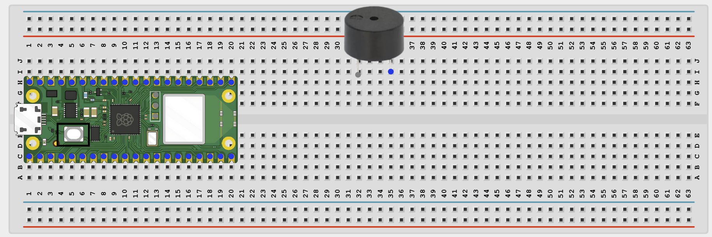
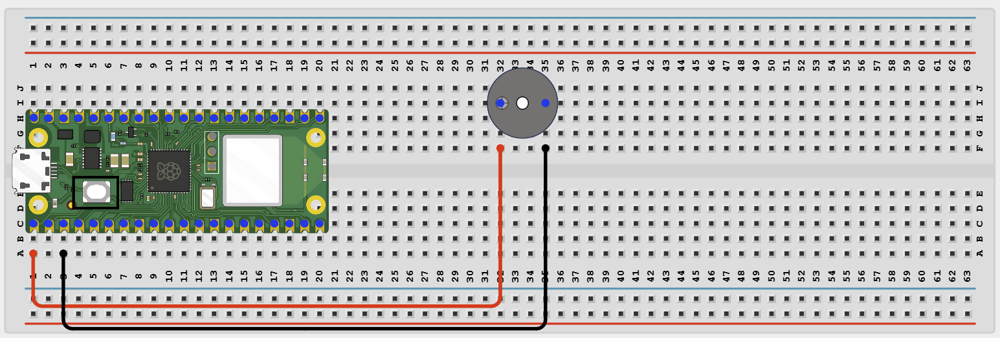

# STEMAIDE AFRICA

# Project 1.8.7: Wi-Fi Doorbell

**Beginner Embedded Systems Project Using Raspberry Pi Pico 2 W and MicroPython**


# Overview

Build a web-controlled doorbell that sounds a buzzer when a browser button is pressed.

This project demonstrates a simple web-to-hardware interaction over your local Wi-Fi network.

The final result should open a web page with a **RING** button that sounds the buzzer and updates a ring counter.

# Required Components

|  |  |  |  |
| --- | --- | --- | --- |
| <br>Raspberry Pi Pico 2 W | <br>Active Buzzer | <br>Breadboard | <br>Jumper Wires |
| 2.4 GHz Wi-Fi Network | Phone or Computer Browser |  |  |


# Circuit Connections

| Component Pin       | Connects To | Pico GPIO / Physical Pin Number | Notes                 |
| ------------------- | ----------- | ------------------------------- | --------------------- |
| Buzzer Positive (+) | GPIO 0      | GPIO 0 / Physical Pin 1         | Active buzzer control |
| Buzzer Negative (-) | GND         | Physical Pin 38                 | Common ground         |

# Step-by-Step Assembly

## Step 1: Place the Raspberry Pi Pico 2 W

Place the Raspberry Pi Pico 2 W on the breadboard so it sits across the center gap.

Keep the USB port facing outward so you can easily connect it to your computer.


---

## Step 2: Place the Active Buzzer

Place the active buzzer on the breadboard.

Identify the positive (+) and negative (-) pins before wiring.

Use a small 3.3V-safe buzzer, or use a transistor driver if your buzzer requires additional current.



---

## Step 3: Connect the Buzzer

Connect:

- Buzzer positive (+) → GPIO 0
- Buzzer negative (-) → GND



---

## Wiring Check

- ✓ Pico 2 W is placed correctly across the breadboard center gap
- ✓ Buzzer positive pin connects to GPIO 0
- ✓ Buzzer negative pin connects to GND
- ✓ No loose jumper wires

### Beginner Note

> An active buzzer makes sound when power is applied. Keep test sounds short during classroom activities.

---

# Testing Individual Components

Before running the full project, test each part separately.

## Buzzer Test

Check that the buzzer sounds before adding Wi-Fi code.

```python
from machine import Pin
import time

buzzer = Pin(0, Pin.OUT)

for _ in range(2):
    buzzer.on()
    time.sleep(0.15)
    buzzer.off()
    time.sleep(0.15)
```

### Expected Test Result

The buzzer should produce two short beeps.

---

## Wi-Fi Connection Test

Check that the Pico connects to Wi-Fi and prints its IP address.

```python
import network
import time

SSID = 'YOUR_WIFI_NAME'
PASSWORD = 'YOUR_WIFI_PASSWORD'

wlan = network.WLAN(network.STA_IF)

wlan.active(True)
wlan.connect(SSID, PASSWORD)

for _ in range(15):
    if wlan.isconnected():
        break

    print('Connecting...')
    time.sleep(1)

print('Connected:', wlan.isconnected())

if wlan.isconnected():
    print('IP address:', wlan.ifconfig()[0])
```

### Expected Test Result

The Shell should display:

```text
Connected: True
```

and print an IP address.

---

# Full Project Code

```python
import network
import socket
import time
from machine import Pin

SSID = 'YOUR_WIFI_NAME'
PASSWORD = 'YOUR_WIFI_PASSWORD'

buzzer = Pin(0, Pin.OUT)

ring_count = 0


def play_doorbell():

    for _ in range(3):
        buzzer.on()
        time.sleep(0.12)
        buzzer.off()
        time.sleep(0.12)

    buzzer.on()
    time.sleep(0.25)
    buzzer.off()


wlan = network.WLAN(network.STA_IF)
wlan.active(True)
wlan.connect(SSID, PASSWORD)

print('Connecting to Wi-Fi...')

for _ in range(15):
    if wlan.isconnected():
        break

    time.sleep(1)

if not wlan.isconnected():
    raise RuntimeError('Wi-Fi connection failed')

ip_address = wlan.ifconfig()[0]

print('Connected. Open http://{} in your browser'.format(ip_address))


def web_page(count):

    return '''<!DOCTYPE html>
<html>
<head>
<meta name='viewport' content='width=device-width, initial-scale=1'>
<title>Wi-Fi Doorbell</title>
</head>
<body style='font-family:Arial;text-align:center;padding:40px'>
<h1>Wi-Fi Doorbell</h1>
<a href='/ring'>
<button style='padding:20px 36px;font-size:24px'>RING</button>
</a>
<p>Total rings: COUNT_TEXT</p>
</body>
</html>'''.replace('COUNT_TEXT', str(count))


address = socket.getaddrinfo('0.0.0.0', 80)[0][-1]

server = socket.socket()
server.bind(address)
server.listen(1)

while True:

    client, client_address = server.accept()

    print('Client connected from', client_address)

    request = client.recv(1024).decode()

    if 'GET /ring' in request:

        ring_count += 1

        print('Doorbell rung! Count:', ring_count)

        play_doorbell()

    response = web_page(ring_count)

    client.send(
        'HTTP/1.1 200 OK\r\n'
        'Content-Type: text/html\r\n'
        'Connection: close\r\n\r\n'.encode()
    )

    client.sendall(response.encode())

    client.close()
```

---

# How the Code Works

| Code Section      | What It Does                                      | Why It Matters                           |
| ----------------- | ------------------------------------------------- | ---------------------------------------- |
| `play_doorbell()` | Creates the buzzer sound pattern                  | Makes the doorbell more noticeable       |
| Wi-Fi setup       | Connects the Pico 2 W to the local network        | The web page requires network access     |
| `ring_count`      | Stores how many times the button has been pressed | Adds simple event tracking               |
| Request check     | Looks for `/ring` in the browser request          | Allows the browser to trigger the buzzer |

---

# Expected Result

After entering your Wi-Fi details and running the code:

- The Shell should print an IP address.
- Opening that address in a browser should show a **RING** button.
- Pressing the button should:
  - Sound the buzzer
  - Increase the ring counter
  - Update the displayed count on the page

---

# Troubleshooting

| Problem                                | Possible Cause                                     | Solution                                                           |
| -------------------------------------- | -------------------------------------------------- | ------------------------------------------------------------------ |
| No sound                               | Wrong buzzer type or wiring                        | Check polarity and verify you are using an active buzzer           |
| Web page opens but button does nothing | Browser request not matching or buzzer test failed | Run the buzzer test first and recheck the `/ring` request handling |
| Counter never changes                  | Browser request is not reaching the Pico           | Watch the Shell output for client connections and requests         |
